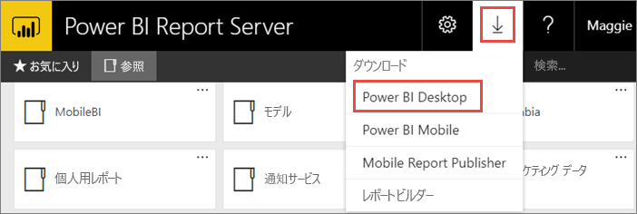
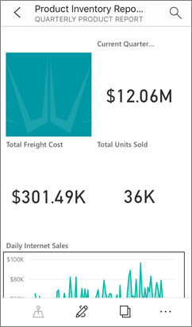

# Power BI レポート サーバー向けに最適化された Power BI Desktop のインストール

Power BI Report Server の Power BI レポートを作成するには、Power BI Report Server 向けに最適化された Power BI Desktop をダウンロードしてインストールする必要があります。 このリリースは、Power BI サービスで使用される Power BI Desktop とは別のものです。 たとえば、Power BI サービス向けの Power BI Desktop 版にはプレビュー機能が含まれていていますが、これらのプレビュー機能は Power BI Report Server 版にはなく、それらがリリースされて初めて含められます。 このリリースを使用すると、レポート サーバーが、既知のバージョンのレポートおよびモデルと対話できることを確認できます。 

Power BI Desktop と、Power BI Report Server 向けに最適化された Power BI Desktop は、同じコンピューターにサイド バイ サイドでインストールできます。

## Power BI Desktop のダウンロードおよびインストール

Power BI Report Server 向けに最適化された Power BI Desktop のバージョンが最新のものであることを確認するための最も簡単な方法は、レポート サーバーの Web ポータルから起動することです。

1. レポート サーバーの Web ポータルで、**ダウンロード**の矢印、 **[Power BI Desktop]** の順に選択します。

    

    直接移動または[Microsoft Power BI Desktop](https://www.microsoft.com/download/details.aspx?id=56723) (最適化の Power BI Report Server - 月 2019年)、Microsoft ダウンロード センター。

2. ダウンロード センター ページで、 **[ダウンロード]** を選択します。

3. 使用しているコンピューターに適したものを以下から選択します。 

    - **PBIDesktopRS.msi** (32 ビット バージョン)

    - **PBIDesktopRS_x64.msi** (64 ビット バージョン)

1. インストーラーをダウンロードした後は、Power BI Desktop (月 2019) セットアップ ウィザードを実行します。

2. インストールの最後に、次のように選択します。 **Power BI Desktop を起動**します。

    Power BI Desktop が自動的に起動し、すぐに使えます。

## 正しいバージョンを使用していることを確認する
正しい Power BI Desktop を使用しているかどうかは、Power BI Desktop の起動画面またはタイトル バーを見れば容易に確認できます。 タイトル バーには、リリースの月と年が示されます。 また、Power BI のロゴの色の表示も反転し、黄色の背景に黒の前景ではなく、黒の背景に黄色の前景となります。

Power BI サービスの Power BI Desktop バージョンの場合、タイトル バーに月と年は示されません。

## ファイル拡張子の関連付け
Power BI Desktop と Power BI Report Server 向けに最適化された Power BI Desktop を同じコンピューターにインストールした場合、最後にインストールした Power BI Desktop が .pbix ファイルと関連付けられます。 したがって、.pbix ファイルをダブルクリックすると、最後にインストールした Power BI Desktop が起動されます。

Power BI Desktop をインストールし、次に Power BI Report Server 向けに最適化された Power BI Desktop をインストールした場合、既定ではすべての pbix ファイルが Power BI Report Server 向けに最適化された Power BI Desktop で開かれます。 pbix ファイルを開く際に既定で Power BI Desktop が起動されるようにする場合は、[Microsoft Store から Power BI Desktop を](http://aka.ms/pbidesktopstore)再インストールします。

最初に使用したい Power BI Desktop のバージョンを常に開くことができます。 その後、Power BI Desktop からファイルを開きます。

Power BI レポートを Power BI Report Server 内から編集または、web ポータルから新しい Power BI レポートの作成は、常に正しいバージョンの Power BI Desktop を開きます。

## 考慮事項と制限事項

Power BI Report Server、Power BI サービス (http://app.powerbi.com))、Power BI モバイル アプリの Power BI レポートは、ほぼ同じように機能しますが、いくつかの機能は異なります。

### ブラウザー

Power BI レポート サーバーのレポートは、カスタム ビジュアルを含むほぼすべての視覚エフェクトをサポートします。 Power BI レポート サーバーのレポートは、次をサポートしません。

* R ビジュアル
* ArcGIS マップ
* 階層リンク
* Power BI Desktop のプレビュー機能

### Power BI モバイル アプリ

Power BI レポート サーバーのレポートは、次を含む [Power BI モバイル アプリ](../consumer/mobile/mobile-apps-for-mobile-devices.md)のすべての基本機能をサポートします。

* [電話のレポート レイアウト](../desktop-create-phone-report.md):Power BI モバイル アプリのレポートを最適化することができます。 携帯電話では、最適化されたレポートに特別なアイコン 、およびレイアウトが提供されます。
  
    

Power BI レポート サーバーのレポートは、Power BI モバイル アプリの次の機能をサポートしません。

* R ビジュアル
* ArcGIS マップ
* カスタム ビジュアル
* 階層リンク
* Geo フィルタ リングまたはバー コード

## 以前のバージョンの Power BI Report Server の Power BI Desktop

ご利用のレポート サーバーが以前のバージョンである場合、対応するバージョンの Power BI Desktop が必要です。 以前のバージョンをダウンロードするリンクを次に示します。

- Microsoft Power BI Desktop ([最適化の Power BI Report Server - 2019 年 1 月](https://go.microsoft.com/fwlink/?linkid=2055039))

## 次の手順

Power BI Desktop をインストールしたので、Power BI レポートの作成を開始できます。

[Power BI Report Server の Power BI レポートの作成](quickstart-create-powerbi-report.md)  
[Power BI Report Server とは](get-started.md)

他にわからないことがある場合は、 [Power BI コミュニティで質問してみてください](https://community.powerbi.com/)。
