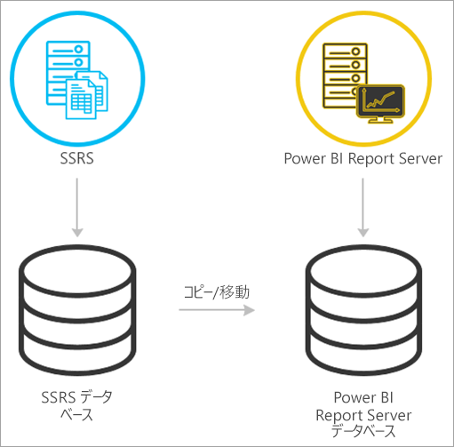
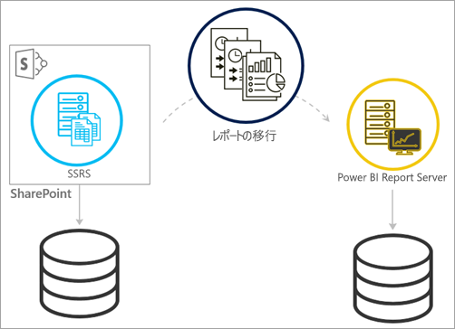
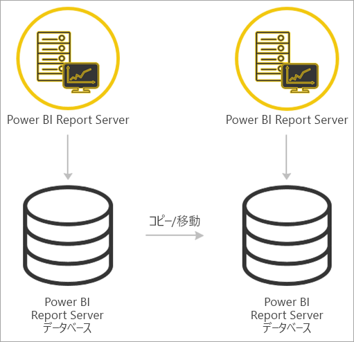

# <a name="migrate-a-report-server-installation"></a>レポート サーバー インストールの移行
既存の SQL Server Reporting Services (SSRS) インスタンスを Power BI レポート サーバーのインスタンスに移行する方法について説明します。

移行は、新しい Power BI レポート サーバー インスタンスへのアプリケーション データ ファイルの移動として定義されます。 インストールを移行する一般的な理由を次に示します。

* SQL Server Reporting Services から Power BI レポート サーバーに移行したい
  
  > [!NOTE]
  > SQL Server Reporting Services から Power BI レポート サーバーへの一括アップグレードはありません。 移行の必要があります。
  > 
  > 
* 大規模な展開または更新の要件がある
* ハードウェアやインストールのトポロジを変更する
* アップグレードを妨げる問題が発生している

## <a name="migrating-to-power-bi-report-server-from-ssrs-native-mode"></a>SSRS (ネイティブ モード) から Power BI レポート サーバーへの移行
SSRS (ネイティブ モード) インスタンスから Power BI レポート サーバーへの移行には、複数の手順があります。



> [!NOTE]
> 移行では SQL Server 2008 Reporting Services 以降がサポートされています。
> 
> 

* データベース、アプリケーションと構成ファイルをバックアップします。
* 暗号化キーをバックアップします。
* レポートをホストしているレポート サーバー データベースを複製します。
* Power BI レポート サーバーをインストールします。 同じハードウェアを使用している場合は、SSRS インスタンスと同じサーバーに Power BI レポート サーバーをインストールできます。 Power BI レポート サーバーのインストールの詳細については、「[Install Power BI Report Server](install-report-server.md)」 (Power BI レポート サーバーをインストールする) を参照してください。

> [!NOTE]
> Power BI レポート サーバーのインスタンス名が *PBIRS* になります。
> 
> 

* レポート サーバーの構成マネージャーを使用してレポート サーバーを構成し、複製されたデータベースに接続します。
* SSRS (ネイティブ モード) インスタンスに必要なクリーンアップを行います。

## <a name="migration-to-power-bi-report-server-from-ssrs-sharepoint-integrated-mode"></a>SSRS (SharePoint 統合モード) から Power BI レポート サーバーへの移行
SSRS (SharePoint 統合モード) から Power BI レポート サーバーへの移行は、ネイティブ モードほど簡単ではありません。 これらの手順ではガイダンスが提供されますが、SharePoint 内には、これらの手順以外で管理する必要があるファイルやアセットがある場合があります。



特定のレポート サーバーのコンテンツを SharePoint から Power BI レポート サーバーに移行する必要があります。 これは、環境内に Power BI レポート サーバーが既にインストールされていることを前提にしています。 Power BI レポート サーバーのインストールの詳細については、「[Install Power BI Report Server](install-report-server.md)」 (Power BI レポート サーバーをインストールする) を参照してください。

レポート サーバーのコンテンツを SharePoint 環境内から Power BI レポート サーバーにコピーする場合は、**rs.exe** などのツールを使用してコンテンツをコピーする必要があります。 SharePoint から Power BI レポート サーバーにレポート サーバーのコンテンツをコピーするためのサンプル スクリプトを次に示します。

> [!NOTE]
> サンプル スクリプトは、SharePoint 2010 以降と SQL Server 2008 Reporting Services 以降で機能します。
> 
> 

### <a name="sample-script"></a>サンプル スクリプト
```
Sample Script
rs.exe
-i ssrs_migration.rss -e Mgmt2010
-s http://SourceServer/_vti_bin/reportserver
-v st="sites/bi" -v f="Shared Documents“
-u Domain\User1 -p Password
-v ts=http://TargetServer/reportserver
-v tu="Domain\User" -v tp="Password"
```

## <a name="migrateing-from-one-power-bi-report-server-to-another"></a>Power BI レポート サーバー間の移行
Power BI レポート サーバー間の移行は、SSRS (ネイティブ モード) からの移行と同じプロセスです。



* データベース、アプリケーションと構成ファイルをバックアップします。
* 暗号化キーをバックアップします。
* レポートをホストしているレポート サーバー データベースを複製します。
* Power BI レポート サーバーをインストールします。 Power BI レポート サーバーを移行元と同じサーバーにインストールすることは*できません*。 Power BI レポート サーバーのインストールの詳細については、「[Install Power BI Report Server](install-report-server.md)」 (Power BI レポート サーバーをインストールする) を参照してください。

> [!NOTE]
> Power BI レポート サーバーのインスタンス名が *PBIRS* になります。
> 
> 

* レポート サーバーの構成マネージャーを使用してレポート サーバーを構成し、複製されたデータベースに接続します。
* 以前の Power BI レポート サーバーのインストールに必要なクリーンアップを実行します。

## <a name="next-steps"></a>次の手順
[管理者向けハンドブック](admin-handbook-overview.md)  
[クイックスタート: Power BI レポート サーバーをインストールする](quickstart-install-report-server.md)  
[rs.exe ユーティリティと Web サービスを使用したスクリプト](https://docs.microsoft.com/sql/reporting-services/tools/script-with-the-rs-exe-utility-and-the-web-service)

他にわからないことがある場合は、 [Power BI コミュニティで質問してみてください](https://community.powerbi.com/)。

