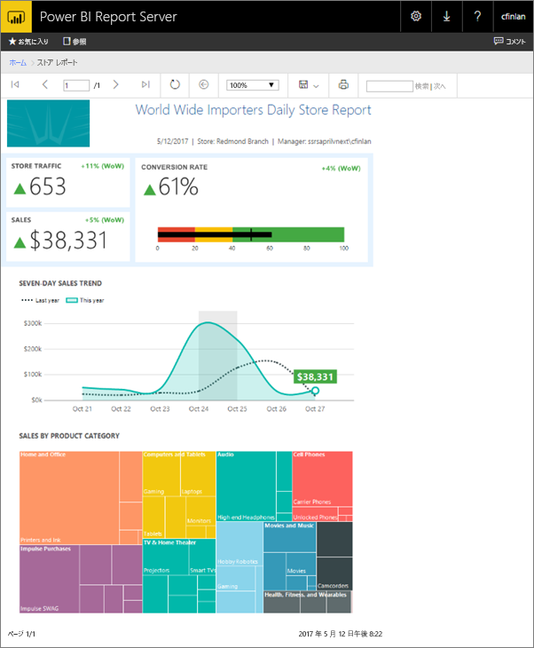
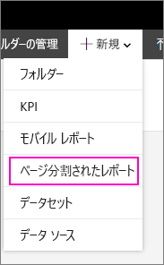
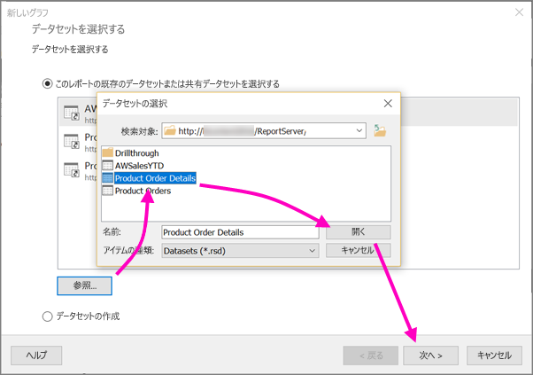
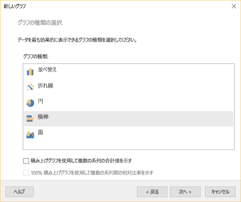
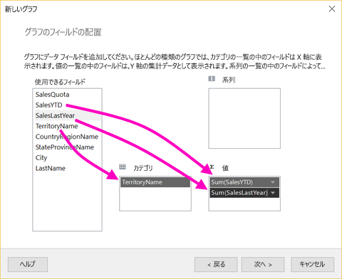
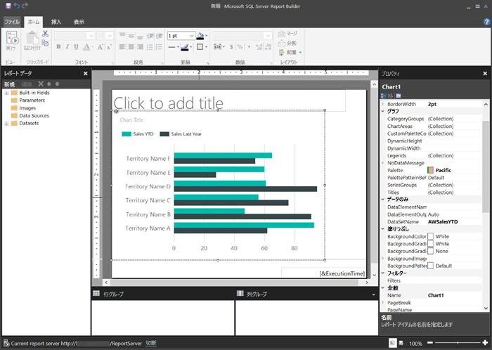
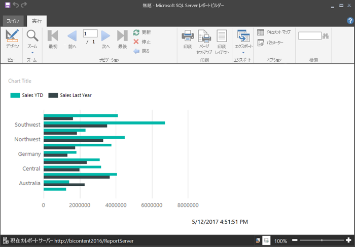
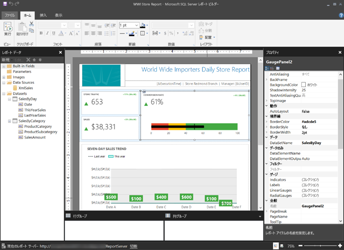

# Power BI Report Server のページ分割されたレポートを作成する
名前からわかるように、ページ分割されたレポートは多数のページに対して実行できます。 固定形式でレイアウトされた、正確なカスタマイズを提供します。 ページ分割されたレポートは .rdl ファイルです。

SQL Server Reporting Services (SSRS) の Web ポータルと同様に、Power BI レポート サーバーの Web ポータルでは、ページ分割されたレポートの保存と管理ができます。 レポート ビルダーまたは SQL Server Data Tools (SSDT) のレポート デザイナーでレポートを作成および編集して、いずれかの Web ポータルに公開します。 その後、組織内のレポート閲覧者が、ブラウザーや、自身のモバイル デバイスの Power BI モバイル アプリでレポートを表示できるようになります。

レポート ビルダーまたはレポート デザイナーでページ分割されたレポートを既に作成している場合は、Power BI Report Server のページ分割されたレポートを作成する準備ができています。 そうでない場合は、始めるために次の簡単な手順を実行します。

## 手順 1: レポート ビルダーをインストールして起動する
SSRS サーバーのレポートを作成するためにレポート ビルダーを既にインストールしている可能性があります。 レポート ビルダーの同じバージョンを使用して、Power BI レポート サーバーのレポートを作成できます。 レポート ビルダーをまだインストールしていない場合は、プロセスは簡単です。

1. Power BI Report Server の Web ポータルで **[新規]** > **[ページ分割されたレポート]** の順に選択します。
   
    
   
    レポート ビルダーをまだインストールしていない場合は、インストール プロセスに案内されます。
2. インストールが終了したら、**[新しいレポートまたはデータセット]** の画面にレポート ビルダーが開きます。
   
    ![[新しいレポートまたはデータセット] の画面](media/quickstart-create-paginated-report/reportserver-paginated-new-report-screen.png)
3. 作成するレポートの種類のウィザードを選択します。
   
   * テーブルまたはマトリックス
   * グラフ
   * マップ
   * 空のレポート
4. グラフ ウィザードから始めましょう。
   
    グラフ ウィザードでは、レポートで基本的なグラフを作成する手順を説明します。 ここから、ほぼ無制限にレポートをカスタマイズできます。

## 手順 2: グラフ ウィザードを完了する
グラフ ウィザードでは、レポートに視覚エフェクトを作成する基本的な手順について説明します。

ページ分割されたレポートは、Microsoft SQL Server、Microsoft Azure SQL Database の他にも Oracle、Hyperion など、さまざまなデータ ソースに接続できます。 ページ分割されたレポートでサポートされるデータ ソースについては、[こちら](connect-data-sources.md)をご覧ください。

グラフ ウィザードの最初のページ **[データセットの選択]** では、データセットを作成したり、サーバー上の共有データセットを選択できます。 *データセット*は外部データ ソースでのクエリからレポート データを返します。

1. **[参照]** > サーバー上の共有データセットを選択 > **[開く]** > **[次へ]** の順に選択します。
   
    
   
     データセットを作成する必要がある場合は、 「[Create a shared or embedded dataset](https://docs.microsoft.com/sql/reporting-services/report-data/create-a-shared-dataset-or-embedded-dataset-report-builder-and-ssrs)」 (共有または埋め込みデータセットの作成) を参照してください。
2. グラフの種類、この場合は横棒グラフを選択します。
   
    
3. フィールドを **[カテゴリ]**、**[系列]**、および **[値]** ボックスにドラッグして配置します。
   
    
4. **[次へ]** > **[完了]** の順に選択します。

## 手順 3: レポートをデザインする
現在、レポート デザイン ビューが表示されています。 データがユーザーのデータではなく、プレースホルダーのデータになっていることに注目してください。

* ユーザーのデータを表示するには、**[実行]** を選択します。
  
     
* デザイン ビューに戻るには、**[デザイン]** を選択します。

作成したばかりのグラフを変更することができます。レイアウト、値、凡例など、何でも変更できます。

また、ゲージ、テーブル、マトリックス、テーブル、マップなど、他のあらゆる種類の視覚エフェクトを追加できます。 複数のページにヘッダーとフッターを追加できます。 「[Report Builder tutorials](https://docs.microsoft.com/sql/reporting-services/report-builder-tutorials)」 (レポート ビルダー チュートリアル) を参照して、試してみましょう。

## 手順 4: レポート サーバーにレポートを保存する
レポートの準備ができたら、Power BI Report Server に保存します。

1. **[ファイル]** メニューで、**[名前を付けて保存]** を選択し、レポート サーバーに保存します。 
2. これでこのレポートをブラウザーで表示できます。
   
    

## 次の手順
SQL Server Data Tools のレポート ビルダーとレポート デザイナーでレポートをデザインするために役立つ多くの優れたリソースがあります。 レポート ビルダー チュートリアルから開始するとよいでしょう。

* [レポート ビルダー チュートリアル](https://docs.microsoft.com/sql/reporting-services/report-builder-tutorials)
* [Power BI Report Server とは](get-started.md)  

他にわからないことがある場合は、 [Power BI コミュニティで質問してみてください](https://community.powerbi.com/)。

