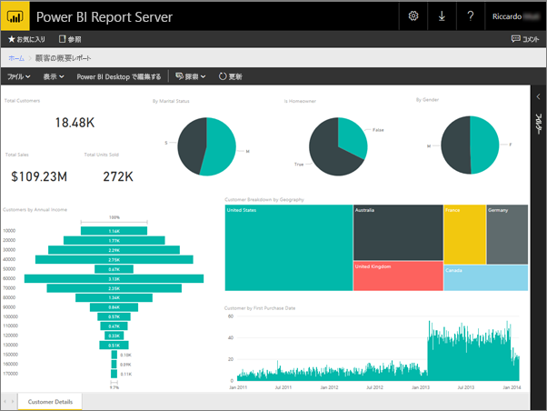
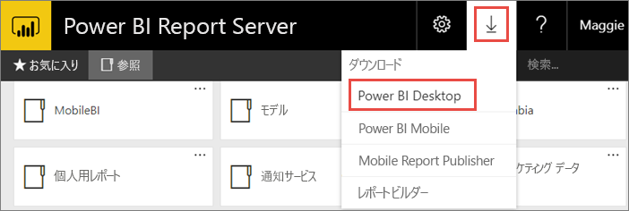
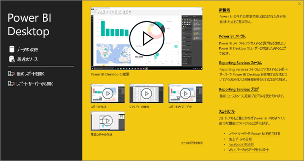
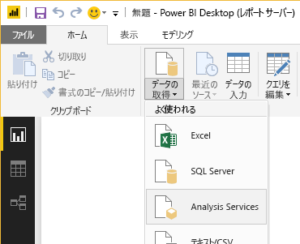
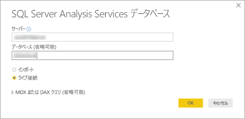
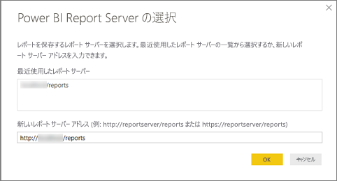
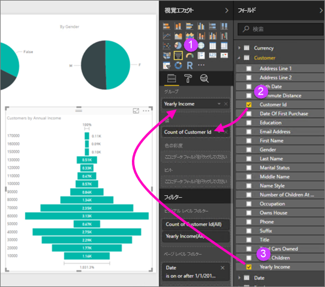
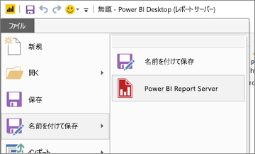

# Power BI Report Server の Power BI レポートの作成
Power BI サービス (https://powerbi.com)) のクラウドで Power BI レポートを格納する場合と同じように、Power BI Report Server の Web ポータルでも Power BI レポートをオンプレミスで格納して管理することができます。 Power BI Desktop でレポートを作成および編集することができ、レポートを Web ポータルに公開することもできます。 その後、組織内のレポート閲覧者が、ブラウザーや、モバイル デバイスの Power BI モバイル アプリでレポートを表示できるようになります。

作業を開始するには、次の 4 つの簡単な手順を実行します。

## 手順 1: Power BI Report Server 向けに最適化された Power BI Desktop のインストール

Power BI Desktop で Power BI レポートを既に作成している場合は、Power BI Report Server の Power BI レポートを作成する準備がほぼできています。 サーバーとアプリを常に同期させるため、Power BI レポート サーバー向けに最適化された Power BI Desktop のバージョンをインストールすることをお勧めします。同じコンピューターに Power BI Desktop の両方のバージョンを共存させることができます。

1. レポート サーバーの Web ポータルで、**ダウンロード**の矢印、**[Power BI Desktop]** の順に選択します。

    

    または、Microsoft ダウンロード センターの (Power BI Report Server (2018 年 3 月) 向けに最適化された) [Microsoft Power BI Desktop](https://www.microsoft.com/download/details.aspx?id=56723) に直接移動します。

2. ダウンロード センター ページで、**[ダウンロード]** を選択します。

3. 使用しているコンピューターに適したものを以下から選択します。

    - **PBIDesktopRS.msi** (32 ビット バージョン)

    - **PBIDesktopRS_x64.msi** (64 ビット バージョン)

4. インストーラーをダウンロードしたら、Power BI Desktop (2018 年 3 月) のセットアップ ウィザードを実行します。

2. インストールの最後に、**[Start Power BI Desktop now]** \(今すぐ Power BI Desktop を起動する\) をオンにします。
   
    Power BI Desktop が自動的に起動し、すぐに使えます。 適切なバージョンでは、タイトル バーに "Power BI Desktop (2018 年 3 月)" と表示されます。

    

3. Power BI Desktop に慣れていない場合は、[ようこそ] 画面のビデオをご覧になることをお勧めします。
   
    

## 手順 2: データ ソースを選択する
広範なデータ ソースに接続することができます。 データ ソースへの接続の詳細については、[こちら](connect-data-sources.md)をご覧ください。

1. [ようこそ] 画面で、**[データの取得]** を選択します。
   
    または **[ホーム]** タブで **[データの取得]** を選択します。
2. データ ソースを選びます (この例では **Analysis Services**)。
   
    
3. **[サーバー]** を入力し、必要に応じて **[データベース]** も入力します。 **[ライブ接続]** が選択されていることを確認し、**[OK]** をクリックします。
   
    
4. レポートを保存するレポート サーバーを選択します。
   
    

## 手順 3: レポートをデザインする
これは楽しい作業です。データを表示するビジュアルを作成します。

たとえば、年収による顧客とグループの値のじょうごグラフを作成できます。

1. **[視覚エフェクト]** で **[じょうごグラフ]** を選択します。
2. カウントするフィールドを **[値]** にドラッグします。 それが数値フィールドでない場合、Power BI Desktop はそれを自動的に値の*カウント*にします。
3. フィールドを **[グループ]** のグループにドラッグします。

詳細については、[Power BI レポートのデザイン](../desktop-report-view.md)に関する記事を参照してください。

## 手順 4: レポート サーバーにレポートを保存する
レポートの準備ができたら、それを手順 2 で選択した Power BI Report Server に保存します。

1. **[ファイル]** メニューで、**[名前を付けて保存]** > **[Power BI レポート サーバー]** を選択します。
   
    
2. これで、レポートを Web ポータルで表示できます。
   
    

## 考慮事項と制限事項
Power BI Report Server と Power BI サービス (http://powerbi.com)) のレポートは、ほぼ同じように機能しますが、いくつかの機能は異なります。

### ブラウザー
Power BI レポート サーバーのレポートは、次を含むすべての視覚エフェクトをサポートします。

* カスタム ビジュアル

Power BI レポート サーバーのレポートは、次をサポートしません。

* R ビジュアル
* ArcGIS マップ
* 階層リンク
* Power BI Desktop のプレビュー機能

### Power BI モバイル アプリ
Power BI レポート サーバーのレポートは、次を含む [Power BI モバイル アプリ](../consumer/mobile/mobile-apps-for-mobile-devices.md)のすべての基本機能をサポートします。

* [電話のレポート レイアウト](../desktop-create-phone-report.md): Power BI モバイル アプリのレポートを最適化することができます。 携帯電話では、最適化されたレポートに特別なアイコン、およびレイアウトが提供されます。
  
    

Power BI レポート サーバーのレポートは、Power BI モバイル アプリの次の機能をサポートしません。

* R ビジュアル
* ArcGIS マップ
* カスタム ビジュアル
* 階層リンク
* 場所フィルターまたはバー コード

## 次の手順
### Power BI Desktop
Power BI Desktop でのレポートを作成するために役立つ多くの優れたリソースがあります。 このリンクを出発点にすることをお勧めします。

* [Power BI Desktop の概要](../desktop-getting-started.md)
* ガイド付き学習: [Power BI Desktop の概要](../guided-learning/gettingdata.yml?tutorial-step=2)

### Power BI Report Server
* [Power BI レポート サーバー向けに最適化された Power BI Desktop のインストール](install-powerbi-desktop.md)  
* [Power BI Report Server とは](get-started.md)  

他にわからないことがある場合は、 [Power BI コミュニティで質問してみてください](https://community.powerbi.com/)。
