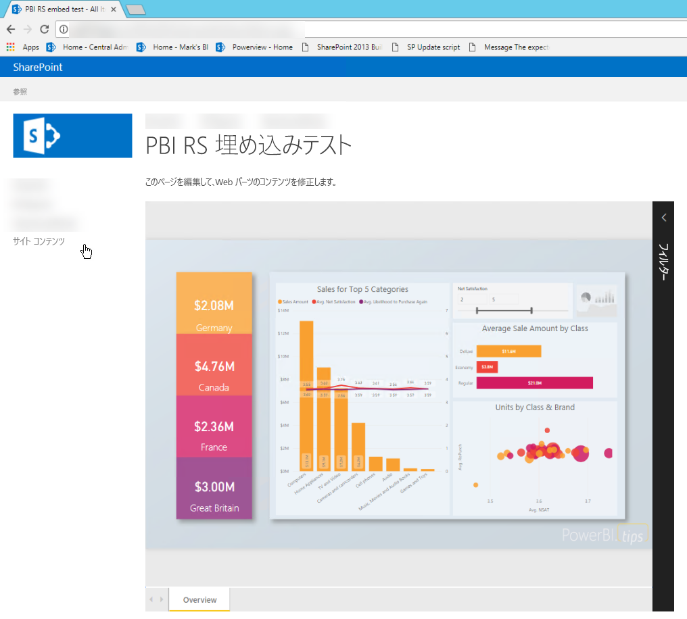
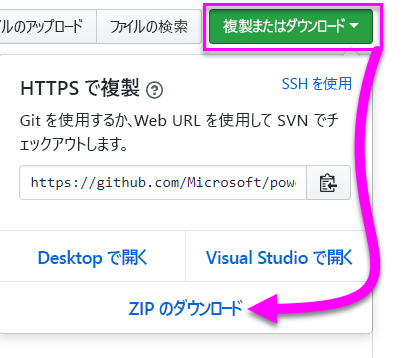
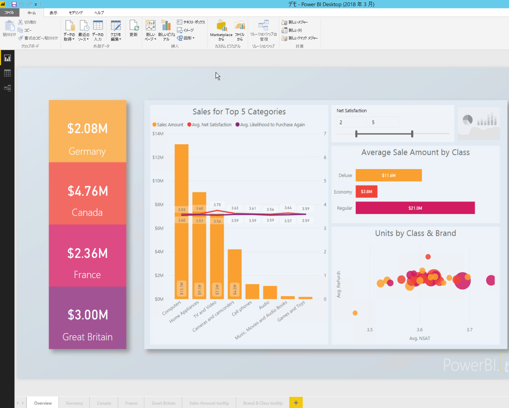
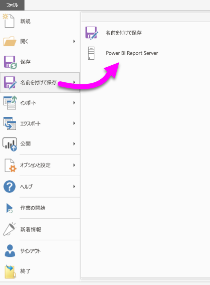
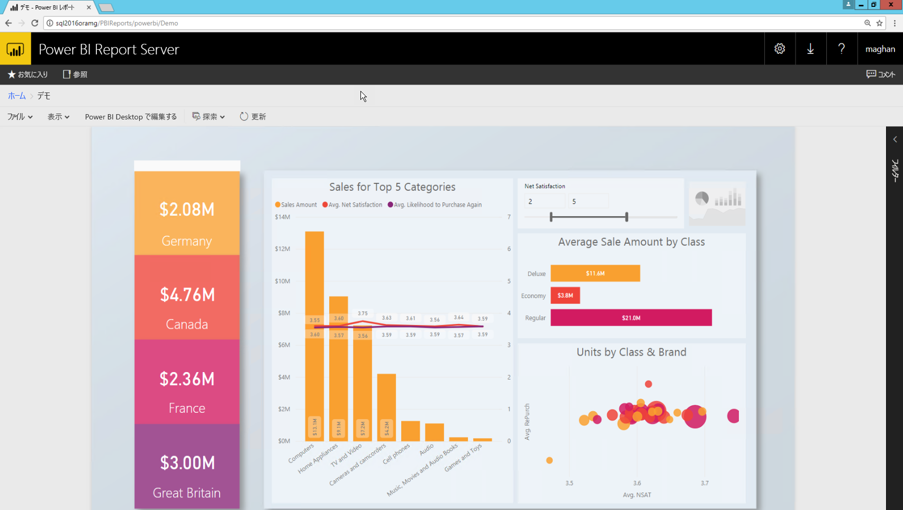
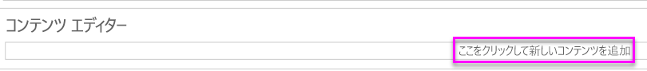
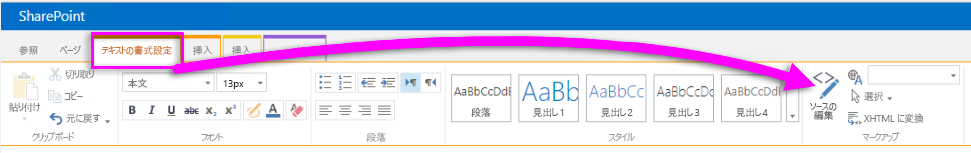
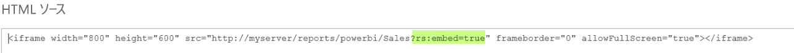
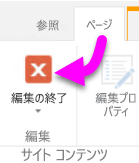

# <a name="quickstart-embed-a-power-bi-report-server-report-using-an-iframe-in-sharepoint-server"></a>クイック スタート: SharePoint Server の iFrame を使用して Power BI Report Server レポートを埋め込む

このクイック スタートでは、SharePoint ページの iFrame を使用して Power BI Report Server レポートを埋め込む方法について説明します。 SharePoint Online を使用している場合は、Power BI Report Server にパブリックにアクセスできる必要があります。 SharePoint Online では、Power BI サービスで動作する Power BI Web パーツは、Power BI Report Server で動作しません。 


## <a name="prerequisites"></a>前提条件
* [Power BI Report Server](https://powerbi.microsoft.com/en-us/report-server/) をインストールする必要があります。
* [Power BI Report Server 向けに最適化された Power BI Desktop](install-powerbi-desktop.md) をインストールする必要があります。
* [SharePoint](https://docs.microsoft.com/sharepoint/install/install) 環境をインストールし、構成する必要があります。

## <a name="creating-the-power-bi-report-server-report-url"></a>Power BI Report Server のレポート URL の作成

1. GitHub からサンプル [Blog Demo](https://github.com/Microsoft/powerbi-desktop-samples) をダウンロードします。

    

2. **Power BI Desktop 向けに最適化された Power BI Desktop** で GitHub のサンプル PBIX ファイルを開きます。

    

3. レポートを **Power BI Report Server** に保存します。 

    

4. **Web ポータル**でレポートを表示します。

    

### <a name="capturing-the-url-parameter"></a>URL パラメーターの取得

URL を用意したら、レポートをホストする iFrame を SharePoint ページ内に作成できます。 Power BI Report Server のレポートの URL には、querystring パラメーター `?rs:embed=true` を追加してレポートを iFrame に埋め込むことができます。 

   例:
    ``` 
    http://myserver/reports/powerbi/Sales?rs:embed=true
    ```
## <a name="embedding-a-power-bi-report-server-report-in-a-sharepoint-iframe"></a>PowerBI Report Server レポートを SharePoint の iFrame に埋め込む

1. SharePoint の **[サイト コンテンツ]** ページに移動します。

    ![[サイト コンテンツ] ページ](media/quickstart-embed/quickstart_embed_05.png)

2. レポートを追加するページを選択します。

    ![[サイト コンテンツ] ページのアプリ](media/quickstart-embed/quickstart_embed_06.png)

3. 右上の歯車アイコンを選択し、**[ページの編集]** を選択します。

    ![[ページの編集] オプション](media/quickstart-embed/quickstart_embed_07.png)

4. **[Web パーツの追加]** を選択します。

    

5. **[カテゴリ]** で **[メディアとコンテンツ]** を選択し、**[パーツ]** で **[コンテンツ エディター]** を選択して **[追加]** を選択します。

    ![[コンテンツ エディター] Web パーツを選択し](media/quickstart-embed/quickstart_embed_09.png)、![[追加] を選択する](media/quickstart-embed/quickstart_embed_091.png)

6. **[ここをクリックして新しいコンテンツを追加]** を選択します。

    

7. リボンの **[テキストの書式設定]** タブを選択し、**[ソースの編集]** を選択します。

     

8. [ソースの編集] ウィンドウに iFrame コードを貼り付け、[OK] を選択します。

    

     例:
     ```
     <iframe width="800" height="600" src="http://myserver/reports/powerbi/Sales?rs:embed=true" frameborder="0" allowFullScreen="true"></iframe>
     ```

9. リボンの **[テキストの書式設定]** タブを選択し、**[編集の終了]** を選択します。

    

10. これでページにレポートが表示されます。

    

## <a name="next-steps"></a>次の手順

[クイックスタート: Power BI レポート サーバーの Power BI レポートの作成](quickstart-create-powerbi-report.md)  
[クイックスタート: Power BI Report Server のページ分割されたレポートの作成](quickstart-create-paginated-report.md)  

他にわからないことがある場合は、 [Power BI コミュニティで質問してみてください](https://community.powerbi.com/)。 