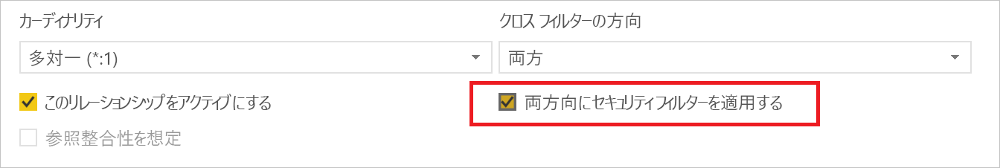
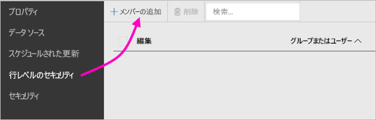
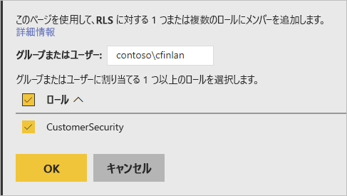
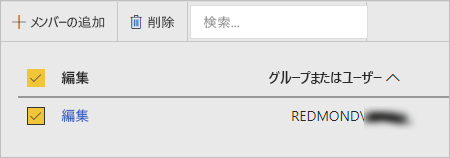

# Power BI Report Server での行レベルのセキュリティ (RLS)

Power BI Report Server を使用して行レベルのセキュリティ (RLS) を設定すると、特定のユーザーについてデータ アクセスを制限することができます。 フィルターでは行レベルでデータ アクセスが制限され、ロール内でフィルターを定義することができます。  Power BI Report Server 内で既定のアクセス許可が使用されている場合、Power BI レポートに対してパブリッシャーまたはコンテンツ マネージャーのアクセス許可を所持するユーザーはいずれも、そのレポートのロールにメンバーを割り当てることができます。    

Power BI Desktop を使用して Power BI にインポートされるレポートの RLS を構成できます。 SQL Server などの DirectQuery を使用するレポートに対して RLS を構成することもできます。  ご利用の DirectQuery 接続で、レポート閲覧者に対して統合認証が使用されている場合は、RLS が適切に扱われないことに注意してください。 Analysis Services のライブ接続では、オンプレミスのモデルに行レベルのセキュリティを構成します。 このセキュリティ オプションは、ライブ接続データセットには表示されません。 

[!INCLUDE [rls-desktop-define-roles](../includes/rls-desktop-define-roles.md)]

## 双方向のクロス フィルタリング

既定では、リレーションシップが一方向または双方向のいずれに設定されているかに関係なく、行レベルのセキュリティのフィルタリングでは一方向のフィルターが使用されます。 行レベルのセキュリティに対する双方向のクロス フィルターは、手動で有効にすることができます。

- リレーションシップを選択し、 **[両方向にセキュリティ フィルターを適用する]**  チェック ボックスをオンにします。 

    

ユーザー名またはログイン ID に基づく [動的な行レベルのセキュリティ](https://docs.microsoft.com/sql/analysis-services/supplemental-lesson-implement-dynamic-security-by-using-row-filters)を実装する場合は、このチェック ボックスをオンにします。 

詳細については、「[Power BI Desktop での DirectQuery を使用する双方向のクロス フィルタリング](../desktop-bidirectional-filtering.md)」と「[表形式の BI セマンティック モデルの保護](http://download.microsoft.com/download/D/2/0/D20E1C5F-72EA-4505-9F26-FEF9550EFD44/Securing%20the%20Tabular%20BI%20Semantic%20Model.docx)」の技術的なホワイトペーパーを参照してください。

[!INCLUDE [rls-desktop-view-as-roles](../includes/rls-desktop-view-as-roles.md)]

## メンバーをロールに追加する 

Power BI Report Server にご自分のレポートを保存したら、サーバー上でセキュリティの管理やメンバーの追加または削除を行います。 そのレポートに対してパブリッシャーまたはコンテンツ マネージャーのいずれかのアクセス許可を所持するユーザーのみが行レベルのセキュリティ オプション利用することができ、当該オプションは淡色表示となりません。

 レポートにそれが必要とするロールが割り当てられていない場合は、Power BI Desktop でそのレポートを開き、ロールを追加または変更してから、Power BI Report Server に再び保存する必要があります。 

1. Power BI Desktop で、Power BI Report Server にレポートを保存します。 Power BI Report Server 向けに最適化された Power BI Desktop のバージョンを使用する必要があります。
2. Power BI Report Service で、レポートの横に表示されている省略記号 (**…**) を選択します。 

3. **[管理]** > **[行レベルのセキュリティ]** を選択します。 

     

    **[行レベルのセキュリティ]** ページ上で、Power BI Desktop で作成したロールにメンバーを追加します。

5. メンバーを追加するには、**[メンバーの追加]** を選択します。

1. テキスト ボックスにユーザー名の形式 (DOMAIN\user) でユーザーまたはグループを入力し、それらに割り当てるロールを選択します。 このメンバーは、組織内に属している必要があります。   

    

    Active Directory が構成されている方法によっては、ここにユーザー プリンシパル名を入力することも可能です。 その場合は、Report Server によって、対応するユーザー名が一覧に表示されます。

1. **[OK]** をクリックして適用します。   

8. メンバーを削除するには、その名前の横にあるチェック ボックスをオンにし、**[削除]** を選択します。  一度に複数のメンバーを削除できます。 

    

## username() と userprincipalname()

ご自分のデータセット内で DAX 関数である username() または userprincipalname() を利用できます。 Power BI Desktop の式の中で使用することができます。 ご自分のモデルを発行すると、それらが Power BI Report Server によって使用されます。

Power BI Desktop 内で、username() ではユーザーが DOMAIN\User の形式で返され、userprincipalname() ではユーザーが user@contoso.com の形式で返されます。

Power BI Report Server 内では、username() と userprincipalname() の両方からユーザーのユーザー プリンシパル名 (UPN) が返されます。これは電子メール アドレスに似ています。

Power BI Report Server 内でカスタム認証を使用している場合は、ユーザーに対して設定したユーザー名の形式が返されます。  

## 制限事項 

Power BI モデルの行レベルのセキュリティにおける現在の制限事項を次に示します。 

DAX 関数である username() を使用してレポートを保持していたユーザーの場合は、関数の動作が変わりユーザー プリンシパル名 (UPN) が返されるようになります。ただし、DirectQuery を統合セキュリティで使用する場合は例外です。  そのシナリオでは RLS が適切に扱われないので、動作は変更されないためです。

RLS は、Power BI Desktop を使用して作成されたデータセットにのみ定義できます。 Excel を使用して作成されたデータセットに対して RLS を有効にするには、最初にご利用のファイルを Power BI Desktop (PBIX) ファイルに変換する必要があります。 詳細については、[Excel ファイルの変換](../desktop-import-excel-workbooks.md)に関するページを参照してください。

変換、読み込み (ETL)、DirectQuery の接続については、保存された資格情報を使用する場合のみがサポートされています。 Analysis Services へのライブ接続および統合認証を使用した DirectQuery 接続は、基になるデータ ソース内でのみ処理されます。 

DirectQuery に対して統合セキュリティを使用している場合、ユーザー側では次のようになります。
- RLS は無効にされ、すべてのデータが返されます。
- ユーザーは自分のロールの割り当てを更新することはできず、RLS の [管理] ページにエラーが表示されます。
- DAX username 関数の場合は、ユーザー名は引き続き DOMAIN\USER として返されます。 

レポート作成者が Power BI Report Server 内でレポート データを表示するためのアクセス権を取得するには、レポートをアップロードした後、自分自身に適切なロールを割り当てる必要があります。 

 

## よく寄せられる質問 

### Analysis Services データ ソースにこれらのロールを作成できますか。 

Power BI Desktop にデータをインポートした場合は作成できます。 ライブ接続を使用している場合、Power BI サービス内で RLS を構成することはできません。 RLS は Analysis Services モデルのオンプレミス内で定義されます。 

### RLS を使って、ユーザーがアクセスできる列またはメジャーを制限できますか。 

いいえ。 ユーザーは、特定のデータ行にアクセスできる場合は、その行のすべてのデータ列を見ることができます。 

### RLS を使って、詳細なデータは表示されないようにしながら、ビジュアルの集計データにはアクセスできるようにすることができますか。 

いいえ、個々のデータ行は保護されますが、ユーザーは常に詳細データまたは集計データを見ることができます。 

### 既存のロールを持っていて、メンバーが割り当て済みである場合、Power BI Desktop で新しいロールを追加できますか。 

はい。Power BI Report Server 内で既存のロールが定義され、メンバーが割り当てられている場合でも、追加のロールを作成し、現在の割り当てに影響を与えることなくレポートを再発行することができます。 
 

## 次の手順

[Power BI Report Server とは](get-started.md) 
[管理者向けハンドブック](admin-handbook-overview.md)  

他にわからないことがある場合は、 [Power BI コミュニティで質問してみてください](https://community.powerbi.com/)。
