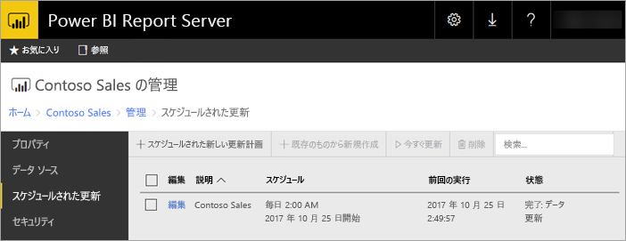

# Power BI Report Server での Power BI のスケジュールされた更新
Power BI レポートのスケジュールされた更新は、レポートのデータを最新の状態に保つことができます。

スケジュールされた更新は、埋め込みモデルの Power BI レポートに固有です。 ライブ接続または DirectQuery を使うのではなく、レポートにデータをインポートした場合です。 インポートしたデータは、元のデータ ソースから切断されており、データを最新の状態に保つには更新する必要があります。 スケジュールされた更新は、データを最新の状態に維持する手段です。

スケジュールされた更新は、レポートの管理セクションで構成します。 スケジュールされた更新を構成する方法については、「[Power BI レポートのスケジュールされた更新を構成する方法](configure-scheduled-refresh.md)」をご覧ください。

## 動作のしくみ
Power BI レポートのスケジュールされた更新を使うときは、複数のコンポーネントが関係します。

* スケジュールされたイベントを生成するタイマーとしての SQL Server エージェント。
* スケジュールされたジョブは、レポート サーバー データベースのイベントと通知のキューに追加されます。 スケールアウト配置では、キューはデプロイ内のすべてのレポート サーバー間で共有されます。
* スケジュール イベントの結果として発生するすべてのレポート処理は、バックグラウンド プロセスとして実行されます。
* データ モデルは、Analysis Services インスタンス内に読み込まれます。
* 一部のデータ ソースでは、データ ソースに接続してデータを変換するために、Power Query マッシュアップ エンジンが使われます。 他のデータ ソースは、Power BI Report Server のデータ モデルをホストする Analysis Services サービスから直接接続できます。
* 新しいデータは、Analysis Services 内のデータ モデルに読み込まれます。
* スケール アウト構成では、データ モデルをノード間でレプリケートできます。
* Analysis Services がデータを処理し、必要な計算をすべて実行します。

Power BI Report Server は、すべてのスケジュールされた操作のイベント キューを保持します。 定期的にキューをポーリングして、新しいイベントを確認します。 既定では、キューは 10 秒ごとにスキャンされます。 RSReportServer.config ファイルの構成設定 **PollingInterval**、**IsNotificationService**、**IsEventService** を変更することで、間隔を変えることができます。 **IsDataModelRefreshService** を使うと、レポート サーバーがスケジュールされたイベントを処理するかどうかも設定できます。

### Analysis Services
Power BI レポートのレンダリングと、スケジュールされた更新の実行には、Power BI レポートのデータ モデルを Analysis Services に読み込む必要があります。 Analysis Services プロセスは、Power BI Report Server で実行されます。

## 考慮事項と制限事項
### スケジュールされた更新を使用できない場合
Power BI レポートによっては、スケジュールされた更新計画を作成できない場合があります。 スケジュールされた更新計画を作成できない Power BI レポートの一覧を次に示します。

* レポートにライブ接続を使う Analysis Services データ ソースが含まれている。
* レポートに DirectQuery を使うデータ ソースが含まれている。
* レポートにデータ ソースが含まれていない。 たとえば、データが *[データの入力]* を使って手動で入力されている場合や、レポートに画像やテキストなどの静的コンテンツのみが含まれている場合。

上記の一覧だけでなく、*インポート* モードのデータ ソースに関する特定のシナリオでも、更新計画を作成できません。

* *ファイル* または *フォルダー* データ ソースが使われていて、ファイルのパスがローカル パス (例: C:\Users\user\Documents) である場合、更新計画を作成することはできません。 パスは、ネットワーク共有のようにレポート サーバーが接続できるパスである必要があります。 たとえば、 *\\myshare\Documents* などです。
* OAuth (Facebook、Google Analytics、Salesforce など) を使うことによってのみ接続できるデータ ソースの場合、キャッシュ更新計画を作成することはできません。 現時点では、ページ分割されたレポート、モバイル レポート、または Power BI レポートのいずれでも、RS はすべてのデータ ソースについて OAuth 認証をサポートしません。

### メモリの制限
レポート サーバーの従来のワークロードは、Web アプリケーションに似ています。 インポートされたデータまたは DirectQuery を含むレポートを読み込む機能、およびスケジュールされた更新を実行する機能は、レポート サーバーと共にホストされている Analysis Services インスタンスに依存します。 その結果、サーバーで予期しないメモリ不足が発生する場合があります。 レポート サーバーと共に Analysis Services がメモリを消費する可能性があることを考慮して、適切にサーバーのデプロイを計画してください。

Analysis Services インスタンスを監視する方法については、「[Monitor an Analysis Services Instance](https://docs.microsoft.com/sql/analysis-services/instances/monitor-an-analysis-services-instance)」(Analysis Services インスタンスを監視する) をご覧ください。

Analysis Services 内のメモリ設定については、「[Memory Properties](https://docs.microsoft.com/sql/analysis-services/server-properties/memory-properties)」(メモリのプロパティ) をご覧ください。

## 次の手順
Power BI レポートに[スケジュールされた更新](configure-scheduled-refresh.md)を構成します。

他にわからないことがある場合は、 [Power BI コミュニティで質問してみてください](https://community.powerbi.com/)。

