# チュートリアル: VM で Power BI Report Server Web ポータルを探索する
このチュートリアルでは、Power BI Report Server が既にインストールされている Azure 仮想マシンを作成するので、サンプルの Power BI とページ分割されたレポートの表示、編集、および管理と、KPI を体験できます。

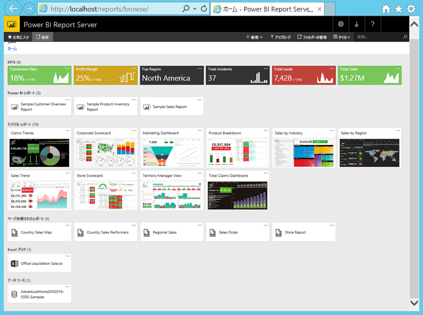

このチュートリアルでは、次のタスクを実行します。

> [!div class="checklist"]
> * VM を作成して接続する
> * VM で Power BI Report Server Web ポータルを起動して探索する
> * お気に入りの項目にタグを付ける
> * Power BI レポートを表示して編集する
> * ページ分割されたレポートを表示、管理、編集する
> * Excel Online で Excel ブックを表示する

このチュートリアルには、Azure サブスクリプションが必要です。 お持ちでない場合は、始める前に[無料アカウント](https://azure.microsoft.com/free/?WT.mc_id=A261C142F)を作成してください。

## Power BI Report Server VM を作成する

Power BI チームが作成した、Power BI Report Server が既にインストールされている VM を利用できます。

1. Azure Marketplace で、[Power BI Report Server](https://azuremarketplace.microsoft.com/marketplace/apps/reportingservices.technical-preview?tab=Overview) を開きます。  

2. **[今すぐ入手する]** を選択します。
3. プロバイダーの使用条件とプライバシー ポリシーに同意するには、**[続行]** を選択します。

    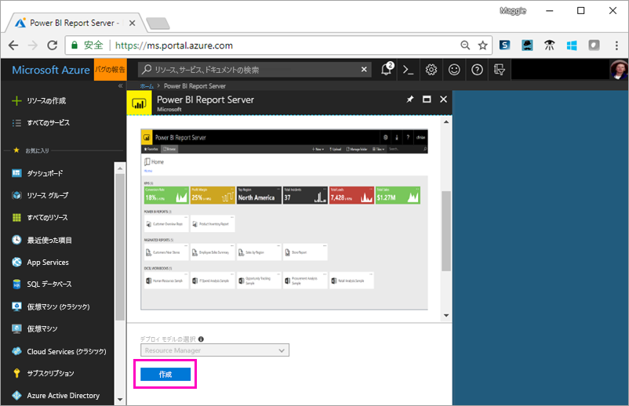

4. **手順 1 の [基本]** で **[VM 名]** に「**reportservervm**」と入力します。

5. 新しいユーザー名とパスワードを作成します。

6. **[リソース グループ]** は **[新規作成]** のままにして「**reportserverresourcegroup**」と入力します。

    チュートリアルを複数回繰り返す場合、2 回目以降はリソース グループに別の名前を付ける必要があります。 1 つのサブスクリプションで 2 回、同じリソース グループ名を使用することはできません。 

7. その他の項目は既定値のままにして **[OK]** を選択します。

    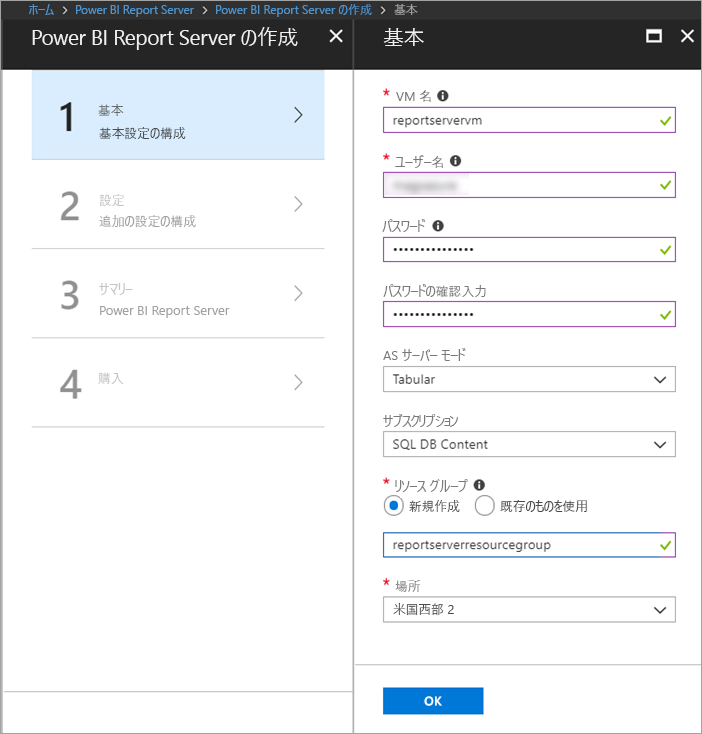

8. **手順 2 の [設定]** では既定値のままにして **[OK]** を選択します。

9. **手順 3 の [概要]** > **[OK]** を選択します。

10. **[手順 4]** では使用条件とプライバシー ポリシーを確認し、**[作成]** を選択します。

    "**Power BI Report Server のデプロイを送信しています**" のプロセスには数分かかります。

## 仮想マシンに接続する

1. Azure の左側のナビゲーション ウィンドウで、**[仮想マシン]** を選択します。 

2. **[名前でフィルター]** ボックスに、「report」と入力します。 

3. **REPORTSERVERVM** という名前の VM を選択します。

    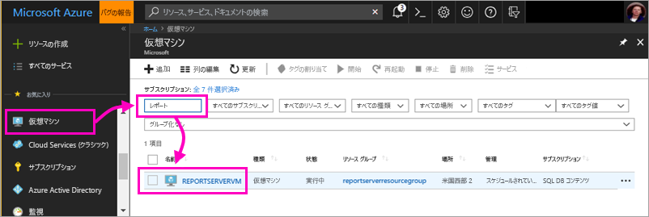

4. REPORTSERVERVM 仮想マシンで、**[接続]** を選択します。

    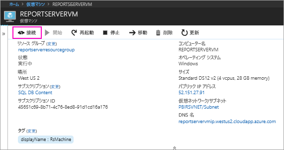

5. [リモート デスクトップ接続] ダイアログ ボックスで、**[接続]** を選択します。

6. VM 用に作成した名前とパスワードを入力し、**[OK]** を選択します。

7. 次のダイアログ ボックスに、リモート コンピューターの ID を特定できないというメッセージが表示されます。 **[はい]** を選択します。

   すると、新しい VM が開きます。

## VM 上の Power BI Report Server

VM が開いたら、デスクトップには次の項目が表示されます。

|数値  |説明  |
|---------|---------|
| | ページ分割された (.RDL) レポートを作成するために SQL Server Data Tools を起動します |
| | サンプル Power BI (.PBIX) レポート  |
| | Power BI Report Server ドキュメントへのリンク   |
| | Power BI Report Server (2018 年 3 月) 向けに最適化された Power BI Desktop を起動します  |
| | ブラウザーで Power BI Report Server の Web ポータルを開きます   |

**[Report Server Web ポータル]** アイコンをダブルクリックします。 ブラウザーで `http://localhost/reports/browse` が開きます。 Web ポータルには、種類ごとにグループ化されたさまざまなファイルが表示されます。 

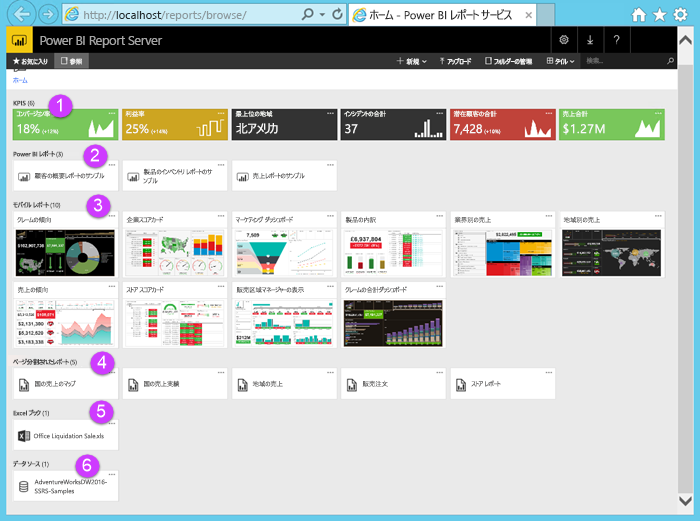

|数値  |説明  |
|---------|---------|
| | Web ポータルで作成された KPI |
| |  Power BI (.PBIX) レポート  |
| | SQL Server Mobile Report Publisher で作成されたモバイル レポート  |
| |  レポート ビルダーまたは SQL Server Data Tools で作成されたページ分割されたレポート  |
| | Excel ブック   | 
| | ページ分割されたレポートのデータ ソース | 

## お気に入りにタグを追加する
お気に入りに登録するレポートおよび KPI をタグ付けすることができます。 それらはすべて 1 つの [お気に入り] フォルダーに集められるので、Web ポータルと Power BI モバイル アプリの両方で簡単に見つけることができます。 

1. **利益率** KPI の右上にある省略記号 (**...**) を選択し、**[お気に入りに追加]** を選択します。
   
    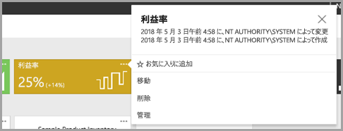
2. お気に入りにした KPI やモバイル レポートまたは他のお気に入りを Web ポータルの [お気に入り] ページで表示するには、Web ポータルの **[お気に入り]** を選択します。
   
    ![[お気に入り] を表示](media/tutorial-explore-report-server-web-portal/power-bi-report-server-favorites.png)

3. **[参照]** を選択して Web ポータルに戻ります。
   
## リスト ビューで項目を表示する
規定では、Web ポータルのコンテンツはタイル ビューで表示されます。

リスト ビューに切り替えると、複数の項目を同時に簡単に移動または削除できます。 

1. **[タイル]** > **[リスト]** を選択します。
   
    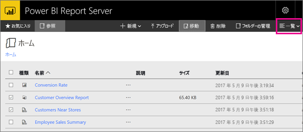

2. タイル ビューに戻ります (**[リスト]** > **[タイル]** の順に選択します)。

## Power BI レポート

Web ポータルで Power BI レポートを表示して操作し、Web ポータルから Power BI Desktop を起動することができます。

### Power BI レポートを表示する

1. Web ポータルの **[Power BI レポート]** で、**[Sample Customer Overview Report]** を選択します。 ブラウザーにレポートが表示されます。

1. ツリー マップの [United States] ブロックを選択し、他の視覚化の関連する値がどのように強調表示されるかを確認します。

    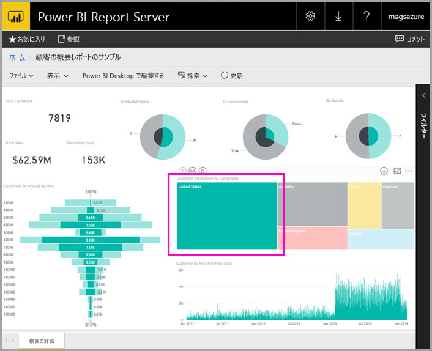

### Power BI Desktop で編集する

1. **[Power BI Desktop で編集]** を選択します。

1. **[許可]** を選択すると、この Web サイトで、このコンピューター上のプログラムを開くことができるようになります。 

     Power BI Desktop でレポートが開きます。 上部のバーに "Power BI Desktop (2018 年 3 月)" と表示されます。 これは Power BI Report Server 向けに最適化されたバージョンです。

    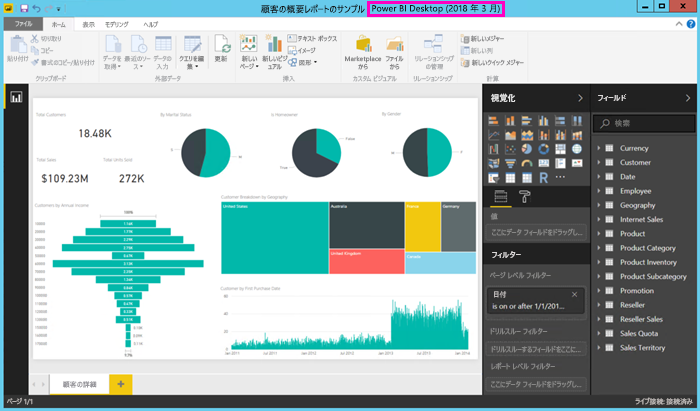

     VM にインストールされているバージョンの Power BI Desktop を使用します。 レポートのアップロードのためにドメイン間を移動することはできません。

3. [フィールド] ウィンドウで Customers テーブルを展開し、Occupation フィールドをレポート レベル フィルターにドラッグします。

    ![フィールドを [フィルター] ウィンドウにドラッグする](media/tutorial-explore-report-server-web-portal/power-bi-report-server-desktop-filter.png)

1. レポートを保存します。

1. ブラウザーのレポートに戻り、ブラウザーの **[更新]** アイコンを選択します。

    ![ブラウザーの [更新] アイコン](media/tutorial-explore-report-server-web-portal/power-bi-report-server-browser-refresh.png)

8. 右側にある **[フィルター]** ウィンドウを展開し、追加した **Occupation** フィルターを表示します。 **Professional** を選択します。

    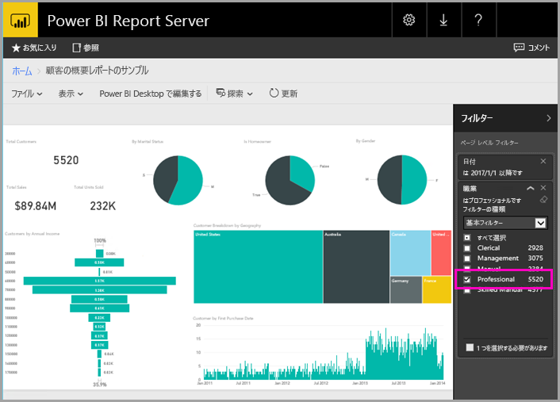

3. **[参照]** を選択して Web ポータルに戻ります。

## ページ分割された (RDL) レポート

ページ分割されたレポートの表示と管理、レポート ビルダーの起動は、Web ポータルから実行できます。

### ページ分割されたレポートを管理する

1. Web ポータルの **[ページ分割されたレポート]** で、**[Sales Order]** の横の省略記号 (...) > **[管理]** の順に選択します。

1. **[パラメーター]** を選択し、**SalesOrderNumber** の既定値を「**SO50689**」に変更し > **[適用]** を選択します。

   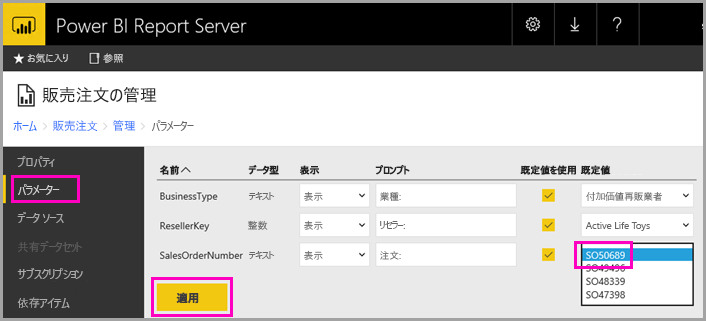

3. **[参照]** を選択して Web ポータルに戻ります。

### ページ分割されたレポートを表示する

1. Web ポータルで **[Sales Order]** を選択します。
 
3.  設定した **Order** パラメーターには **SO50689** が表示されていることがわかります。 

    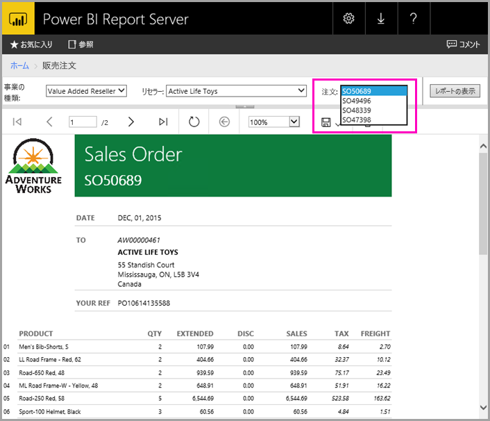

    既定値を変更せずに、このパラメーターを他のパラメーターと共に変更することができます。

1. **Order** **SO48339** を選択し > **[レポート]** を選択します。

4. 2 ページ中 1 ページ目にあることがわかります。 右矢印を選択すると、2 ページ目が表示されます。 テーブルは 2 ページ目に続いています。

    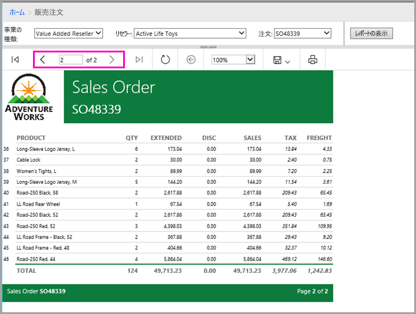

5. **[参照]** を選択して Web ポータルに戻ります。

### ページ分割されたレポートを編集する

レポート ビルダーでページ分割されたレポートを編集できます。また、レポート ビルダーはブラウザーから直接起動することができます。

1. Web ポータルで、**Sales Order** の横にある省略記号 (...) を選択し > **[レポート ビルダーで編集]** を選択します。

1. **[許可]** を選択すると、この Web サイトで、このコンピューター上のプログラムを開くことができるようになります。

1. レポート ビルダーにデザイン ビューで Sales Order レポートが表示されます。

    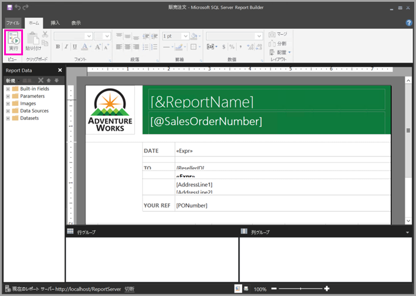

1. **[実行]** を選択してレポートをプレビューします。

    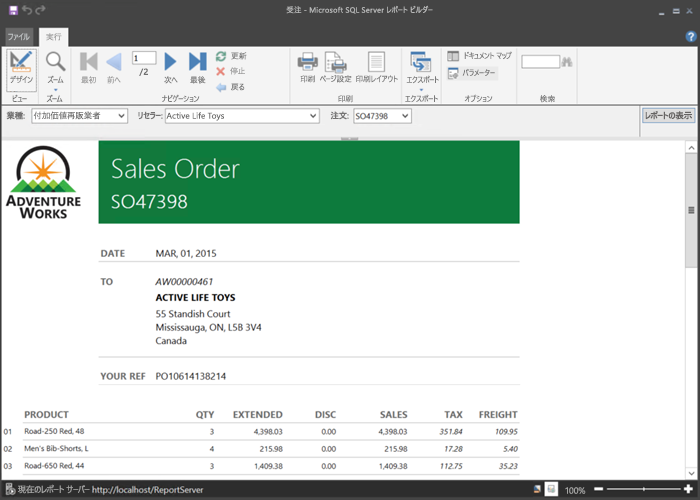

5. レポート ビルダーを閉じてブラウザーに戻ります。

## Excel ブックを表示する

Power BI Report Server で、Excel Online の Excel ブックを表示し、操作することができます。 

1. Excel ブック **Office Liquidation Sale.xlsx** を選択します。 資格情報の入力が求められることがあります。 **[キャンセル]** を選択します。 
    Web ポータルで開かれます。
1. スライサーで **[アプライアンス]** を選択します。

    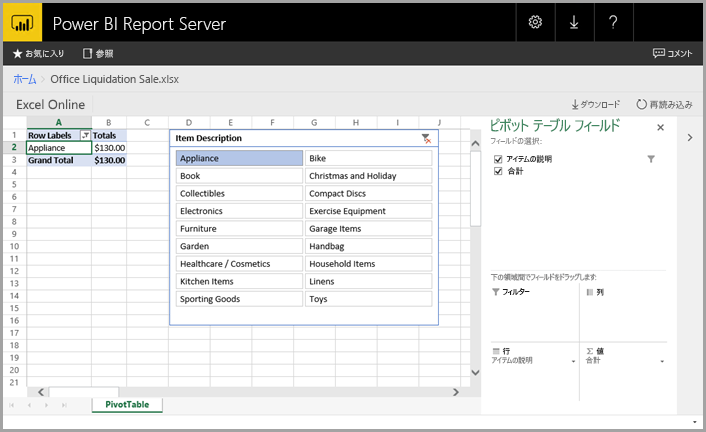

1. **[参照]** を選択して Web ポータルに戻ります。

## リソースをクリーンアップする

このチュートリアルを完了したら、リソース グループ、仮想マシン、およびすべての関連リソースを削除します。 

- 削除するには、VM のリソース グループを選択し、**[削除]** を選択します。

## 次の手順

このチュートリアルでは、Power BI Report Server を使用して VM を作成しました。 Web ポータルの機能の一部を試し、各エディターで Power BI レポートとページ分割されたレポートを開きました。 この VM には、SQL Server Analysis Services データ ソースがインストールされているため、それと同じデータ ソースを使用して自身の Power BI とページ分割されたレポートの作成を試すことができます。 

Power BI Report Server のレポート作成についてさらに学習するには、次の記事に進んでください。

> [!div class="nextstepaction"]
> [Power BI Report Server の Power BI レポートの作成](./quickstart-create-powerbi-report.md)

