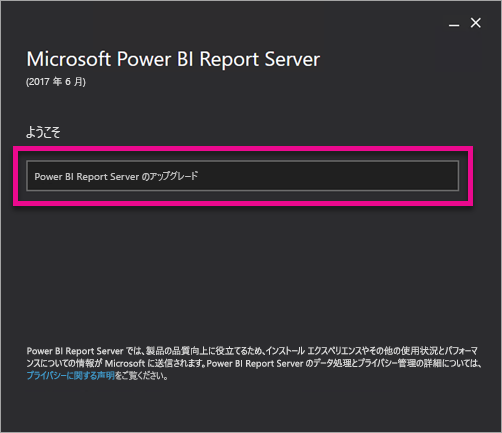
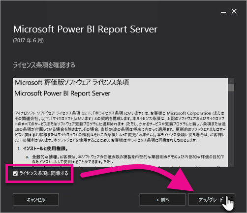
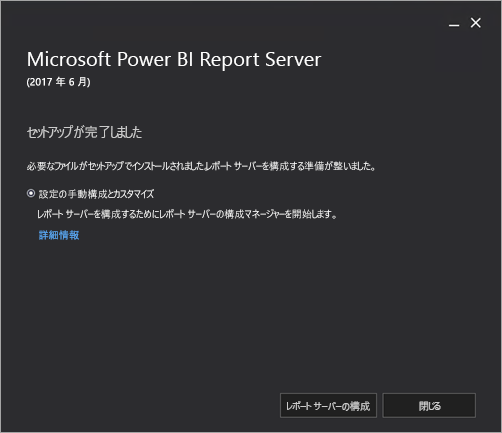

# Power BI Report Server のアップグレード
Power BI Report Server のアップグレード方法について説明します。

 **ダウンロード** 

Power BI Report Server および Power BI Report Server 向けに最適化された Power BI Desktop をダウンロードするには、「[Power BI Report Server によるオンプレミスでのレポート作成](https://powerbi.microsoft.com/report-server/)」を参照してください。

## 始める前に
レポート サーバーをアップグレードする前に、レポート サーバーをバックアップする次の手順を実行することをお勧めします。

### 暗号化キーのバックアップ
暗号化キーは、レポート サーバーのインストールの初回構成時に、バックアップする必要があります。 また、サービス アカウントの ID を変更したり、コンピューター名を変更したりするたびに、キーはバックアップする必要があります。 詳細については、「[Reporting Services の暗号化キーのバックアップと復元](https://docs.microsoft.com/sql/reporting-services/install-windows/ssrs-encryption-keys-back-up-and-restore-encryption-keys)」を参照してください。

### レポート サーバー データベースのバックアップ
レポート サーバーはステートレス サーバーであるため、すべてのアプリケーション データは、SQL Server データベース エンジンのインスタンスで実行される **reportserver** と **reportservertempdb** データベースに格納されます。 **reportserver** と **reportservertempdb** データベースは、SQL Server データベースをバックアップするサポート対象のいずれかの方法を使用して、バックアップすることができます。 レポート サーバー データベース固有の推奨事項を以下に示します。

* **reportserver** データベースのバックアップには完全復旧モデルを使用します。
* **reportservertempdb** データベースのバックアップには単純復旧モデルを使用します。
* 各データベースには別のバックアップ スケジュールを使用することができます。 **reportservertempdb** は、ハードウェア障害が発生した場合にそれを再作成することを防ぐためのみ、バックアップします。 ハードウェア障害が発生した場合、**reportservertempdb** 内のデータを復元する必要はありませんが、テーブル構造は必要です。 **reportservertempdb** を失った場合、レポート サーバー データベースを再作成してのみそれを復元できます。 **reportservertempdb** を再作成する場合、プライマリ レポート サーバー データベースと同じ名前にすることが重要です。

SQL Server リレーショナル データベースのバックアップと復旧の詳細については、「[SQL Server データベースのバックアップと復元](https://docs.microsoft.com/sql/relational-databases/backup-restore/back-up-and-restore-of-sql-server-databases)」を参照してください。

### 構成ファイルのバックアップ
Power BI Report Server は、アプリケーション設定の格納に構成ファイルを使用します。 これらのファイルは、サーバーの初回構成時、および任意のカスタム拡張機能を配置した後にバックアップする必要があります。 バックアップするファイルは次のとおりです。

* config.json
* RSHostingService.exe.config
* Rsreportserver.config
* Rssvrpolicy.config
* Reportingservicesservice.exe.config
* レポート サーバーの ASP.NET アプリケーション用の Web.config
* ASP.NET 用の Machine.config

## レポート サーバーのアップグレード
Power BI Report Server のアップグレードは簡単です。 ファイルのインストールはわずかな手順だけです。

1. PowerBIReportServer.exe の場所を検索し、インストーラーを起動します。
2. **[Power BI Report Server をアップグレードする]** を選択します。
   
    
3. ライセンス条件を読んで同意し、**[アップグレード]** を選択します。
   
    
4. 正常にアップグレードした後で、**[レポート サーバーの構成]** を選択し、Reporting Services 構成マネージャーを起動するか、**[閉じる]** を選択してインストーラーを終了します。
   
    

## Power BI Desktop のアップグレード
レポート サーバーをアップグレードしたら、そのサーバーに一致する、Power BI Power BI Report Server に最適化された Power BI Desktop のバージョンに、すべての Power BI のレポート作成者がアップグレードしたかどうかを確認する必要があります。

## 次の手順
[管理者の概要](admin-handbook-overview.md)  
[Power BI レポート サーバー向けに最適化された Power BI Desktop のインストール](install-powerbi-desktop.md)  
[レポート サービスのインストールを確認する](https://docs.microsoft.com/sql/reporting-services/install-windows/verify-a-reporting-services-installation)  
[レポート サーバー サービス アカウントを構成する](https://docs.microsoft.com/sql/reporting-services/install-windows/configure-the-report-server-service-account-ssrs-configuration-manager)  
[レポート サーバーの URL を構成する](https://docs.microsoft.com/sql/reporting-services/install-windows/configure-report-server-urls-ssrs-configuration-manager)  
[レポート サーバー データベース接続を構成する](https://docs.microsoft.com/sql/reporting-services/install-windows/configure-a-report-server-database-connection-ssrs-configuration-manager)  
[レポート サーバーを初期化する](https://docs.microsoft.com/sql/reporting-services/install-windows/ssrs-encryption-keys-initialize-a-report-server)  
[レポート サーバーで SSL 接続を構成する](https://docs.microsoft.com/sql/reporting-services/security/configure-ssl-connections-on-a-native-mode-report-server)  
[Windows サービス アカウントとアクセス許可を構成する](https://docs.microsoft.com/sql/database-engine/configure-windows/configure-windows-service-accounts-and-permissions)  
[Power BI レポート サーバーのブラウザーのサポート](browser-support.md)

他にわからないことがある場合は、 [Power BI コミュニティで質問してみてください](https://community.powerbi.com/)。

