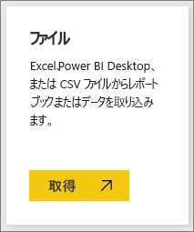
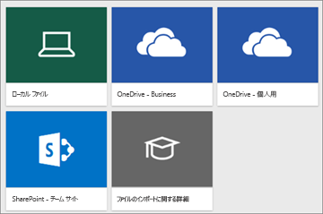
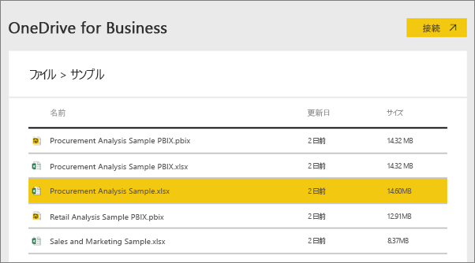
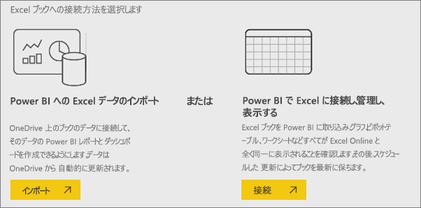
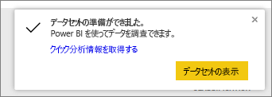
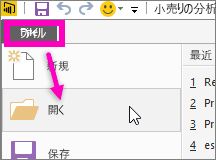

# Power BI で使用できるサンプル データ
Power BI を初めて試してみたくてもデータがない場合や、  データセットはあっても Power BI の動作が (まだ) よくわからないためデータセットが壊れるのではないかと心配になる場合があります。

でも大丈夫です。 obviEnce ([www.obvience.com](http://www.obvience.com/)) と Microsoft から、Power BI を使い慣れていないユーザーのためのサンプルが提供されています。  データは匿名化されており、金融、人材、販売など、さまざまな業種のものがあります。 また、Power BI のオンライン ドキュメントを読むと、チュートリアルや例でこれらのサンプルが使われているのがわかります。これは実際に試してみることができます。      

   

これらのサンプルはいずれも、コンテンツ パック、個別の Excel ブック、.pbix ファイルなどの複数の形式で利用できます。 内容や入手方法がわからなくても心配することはありません。 この記事ではそれについて説明します。 各サンプルについて、サンプルのストーリーとさまざまなシナリオについて説明する *ツアー* が用意されています。 マネージャーの質問に答える、競争力について詳しく調べる、レポートやダッシュボードを作成して共有する、ビジネスのシフトを説明するなど、さまざまなシナリオがあります。   

ただし、始める前に、サンプルの使用に関する法的なガイドラインをお読みください。 それが終わったら、サンプルを紹介し、使い方について説明します。   

## Power BI サンプル Excel ブックの使用ガイドライン
Power BI サンプルを使う前に、この情報をお読みください。

©2015 Microsoft Corporation. All rights reserved. 文書やブックは「現状有姿のまま」提供されます。 このブックに記載されている情報や見解 (URL 等のインターネット Web サイトに関する情報を含む) は、将来予告なしに変更されることがあります。 お客様は、その使用に関するリスクを負うものとします。 いくつかの例は架空のものであり、説明のためだけに使用されます。 実在するものとは一切関係ありません。 Microsoft は、ここに記載されている情報について、明示または黙示を問わず、一切保証しません。

このブックは、Microsoft 製品の知的財産権に関する法的な権利をお客さまに許諾するものではありません。 内部的な参照目的に限り、このブックを複製して使用することができます。

ブックおよび関連するデータは obviEnce によって提供されます。 [www.obvience.com](http://www.obvience.com)

ObviEnce は、Microsoft Business Intelligence に重点を置いた ISV および知的財産 (IP) インキュベータです。 ObviEnce は Microsoft と密接に連携して、Microsoft ビジネス インテリジェンス ソリューションを活性化して配置するためのベスト プラクティスとソート リーダーシップを開発しています。

ブックとデータは obviEnce, LLC の財産であり、Power BI の機能を業界のサンプル データを使用して例示するためだけに共有されています。

ブックやデータを使用する場合には、上記の帰属が含まれている必要があります (これは各ブックの [Info] ワークシートにも記載されています)。 ブックおよびすべての視覚エフェクトには、obviEnce © という著作権表示を付ける必要があります。

以下のいずれかのリンクをクリックして Excel ブック ファイルまたは .pbix ファイルをダウンロードすると、上記の条項に同意したことになります。

## 入手可能なサンプル
8 つのサンプルを使用できます。  それぞれが異なる業種を表します。

### お客様の収益性のサンプル  
[お客様の収益性のサンプルを使ってみる](sample-customer-profitability.md)

この業界サンプルは、経営陣、製品、および顧客に関する CFO の主要な指標を分析します。 会社の収益性に影響を与える要因を調査することができます。

### 人事のサンプル  
[人事のサンプルを使ってみる](sample-human-resources.md)

この業界サンプルは、新規採用者、アクティブな従業員、および退職した従業員を分析することにより、会社の採用戦略に焦点を合わせています。  データを探索することにより、自主退職の傾向と採用戦略の偏りを調べることができます。

### IT 支出分析のサンプル 
[IT 支出分析のサンプルを使ってみる](sample-it-spend.md)

この業界サンプルは、会社の IT 部門の予定コストと実績コストを比較分析します。 比較することで当年度における予算が適切に組まれたかどうかを把握し、当初の計画から大きく乖離している分野を調べることができます。 この例の会社では年間予算が組まれ、四半期ごとに最新予測 (LE) が出されて当該会計年度における IT 支出の変化を分析しています。

### 営業案件の分析のサンプル  
[営業案件の分析のサンプルを使ってみる](sample-opportunity-analysis.md)

この業界サンプルは、ソフトウェア会社の販売チャネルを調べます。 セールス マネージャーは直販と代理店の販売チャネルをモニターするため、地域、商談の規模、チャネルごとの営業案件と売上を追跡します。

### 調達の分析のサンプル  
[調達の分析のサンプルを使ってみる](sample-procurement.md)

この業界サンプルは、経営陣、製品、および顧客に関する CFO の主要な指標を分析します。 会社の収益性に影響を与える要因を調査することができます。

### 小売の分析のサンプル  
[小売りの分析のサンプルを使ってみる](sample-retail-analysis.md)

この業界サンプルは、複数の店舗や地域で販売されたアイテムの小売店の売上データを分析したものです。 メトリックは、売上、出荷単位、粗利、差異、および新店舗の分析に関して、本年度と昨年度の業績を比較します。

### 売上およびマーケティングのサンプル  
[売上およびマーケティングのサンプルを使ってみる](sample-sales-and-marketing.md)

この業界サンプルは、製造会社 VanArsdel Ltd を分析します。これにより、最高マーケティング責任者は業界動向と VanArsdel の市場シェアを監視できます。  このサンプルを調査することにより、会社の市場シェア、製品の数量、売り上げ、およびセンチメントを見つけることができます。

### サプライヤー クオリティ分析のサンプル  
[サプライヤー品質のサンプルを使ってみる](sample-supplier-quality.md)

この業界サンプルは、典型的なサプライ チェーンの課題の 1 つである、サプライヤー クオリティ分析に焦点を合わせています。 この分析では、欠陥の総数と、欠陥が引き起こす総ダウンタイムという 2 つの主要な指標を確認できます。 このサンプルには、2 つの主要な目的があります。1 つは品質の点で最良と最悪のサプライヤーを把握すること、2 つ目はどのプラントがより的確に欠陥を検出して排除し、ダウンタイムを最小化しているかを特定することです。

使用できるサンプルは以上です。 次に、これらのサンプルを入手する方法について説明します。  

## サンプルを入手する方法
前述のように、サンプルはコンテンツ パック、Excel ブック、.pbix ファイルなどの複数の形式で提供されます。 次に、それぞれの使い方を説明します。最初はコンテンツ パックです。

## コンテンツ パックの Power BI サンプル
コンテンツ パックは、Power BI 内から使用できる唯一のサンプル形式です。Power BI から出なくても、コンテンツ パックを探すことができます。 コンテンツ パックは基本的に、他のユーザーが作成したものを Power BI サービスで使用できる、1 つ以上のダッシュボード、データセット、レポートのバンドルです。 ユーザーは、コンテンツ パックを作成して同僚と共有します。 各 Power BI サンプルのコンテンツ パックには、データセット、レポート、およびダッシュボードが含まれます。  コンテンツ パックは Power BI Desktop では使うことができません。 コンテンツ パックについて詳しくは、「[Intro to content packs in Power BI](service-organizational-content-pack-introduction.md)」 (Power BI でのコンテンツ パックの概要) をご覧ください。

### Power BI サービスでサンプルのコンテンツ パックを取得して開く
1. Power BI サービス (app.powerbi.com) を開いてログインします。
2. 左下隅にある **[データの取得]** を選びます。

    
3. 表示される [データの取得] ページで、**[サンプル]** アイコンを選びます。

   
4. サンプルの 1 つを選び、そのサンプルの説明を開きます。 次に、**[接続]** を選びます。  

   
5. Power BI がコンテンツ パックをインポートし、新しいダッシュボード、レポート、データセットを現在のワークスペースに追加します。 新しいコンテンツは黄色のアスタリスクで示されます。 サンプルを使って Power BI を試してみます。  

   

データが用意できたので、それを使ってみてください。  サンプルのコンテンツ パックを使ってチュートリアルを試したり、単に Power BI サービスを開いて調べたりできます。

## Excel ファイルの Power BI サンプル
各サンプル コンテンツ パックは、Excel ブックでも入手できます。 Excel ブックは、Power BI サービスで使うように設計されています。  

1. 以下のリンクを使ってファイルを個別にダウンロードするか、[すべてのサンプル ファイルを 1 つにまとめた zip ファイルをダウンロードしてください](http://go.microsoft.com/fwlink/?LinkId=535020)。 経験のあるユーザーは、Excel ブックをダウンロードしてデータ モデルを自由に調査したり編集したりしてかまいません。

   * [小売の分析のサンプル](http://go.microsoft.com/fwlink/?LinkId=529778)
   * [サプライヤー クオリティ分析サンプル](http://go.microsoft.com/fwlink/?LinkId=529779)
   * [人事のサンプル](http://go.microsoft.com/fwlink/?LinkId=529780)
   * [お客様の収益性のサンプル](http://go.microsoft.com/fwlink/?LinkId=529781)
   * [営業案件の追跡のサンプル](http://go.microsoft.com/fwlink/?LinkId=529782)
   * [IT 支払い分析のサンプル](http://go.microsoft.com/fwlink/?LinkId=529783)
   * [調達の分析のサンプル](http://go.microsoft.com/fwlink/?LinkId=529784)
   * [売上およびマーケティングのサンプル](http://go.microsoft.com/fwlink/?LinkId=529785)
2. ダウンロードしたファイルを保存します。 どこにファイルを保存するかによって違いがあります。

   *   **ローカル** - コンピューターのローカル ドライブまたは組織内の別の場所にファイルを保存した場合、ファイルを Power BI にインポートできます。 実際はファイルがローカル ドライブに残ったままになるため、本当にファイル全体が Power BI にインポートされるわけではありません。 実際には、Power BI サイトに新しいデータセットが作成され、データ (場合によってはデータ モデル) がデータセットに読み込まれるという処理が発生しています。 ファイルにレポートが含まれている場合、これらのレポートは Power BI サイトの [レポート] に表示されます。
   *  **OneDrive - ビジネス用** - OneDrive for Business を利用していて、Power BI にサインインするときと同じアカウントを使ってサインインした場合、Excel、Power BI、または .CSV ファイル内の作業内容と Power BI のデータセット、レポート、およびダッシュボードとを最も効果的に同期できます。 Power BI と OneDrive はどちらもクラウドにあるため、Power BI は約 1 時間ごとに OneDrive 上のファイルに接続します。 なんらかの変更が見つかった場合には、データセット、レポート、およびダッシュボードが Power BI で自動的に更新されます。
   *  **OneDrive - 個人用** – OneDrive アカウントにファイルを保存すると、OneDrive for Business の場合と同じメリットが多数得られます。 最も大きな違いは、([データの取得]、[ファイル]、[OneDrive - 個人用] の順に選択して) ファイルに初めて接続するときに、Microsoft アカウントを使って OneDrive にサインインする必要があるという点です (このアカウントは通常、Power BI へのサインインに使うものとは異なります)。 Microsoft アカウントを使って OneDrive にサインインするときは、[サインインしたままにする] オプションを必ず選択してください。 これにより、Power BI は、約 1 時間ごとにファイルに接続して、Power BI のデータセットの同期を保つことができます。
   *  **SharePoint チーム サイト** – Power BI のファイルを SharePoint – チーム サイトに保存することは、OneDrive for Business に保存することとほぼ同じです。 最も大きな違いは、Power BI からファイルに接続する方法にあります。 URL を指定したり、ルート フォルダーに接続したりできます。
3. Power BI サービス (app.powerbi.com) を開いてログインします。

   > [!TIP]
   > この時点で、新しいダッシュボードを作成し、インポートするファイルにちなんだ名前を付けることができます。  そうしないで Excel データセットをインポートすると、Power BI はサンプルにちなんだ名前の新しいダッシュボードを作成するのではなく、現在開いているダッシュボードにタイルを追加します。 そのタイルを選ぶと、データセットのレポートが表示されます。 後でいつでも新しいダッシュボードを作成できるのでこれは大きな問題ではありませんが、新しいダッシュボードで始めれば手間が少し減ります。
   >
   >
4. 左下隅にある **[データの取得]** を選びます。

    
5. 表示される [データの取得] ページで、**[ファイル] > [取得]** を選びます。

     
6. サンプルをダウンロードして保存した場所に移動します。

   
7. ファイルを選び (この例では、OneDrive for Business に保存した **Procurement Analysis Sample.xlsx**)、**[接続]** を選びます。

   
8. データをインポートするか、またはブックを Power BI に取り込んで Excel Online とまったく同じように表示するかを選びます。

    
9. **[インポート]** を選んだ場合、Power BI はサンプル ブックをインポートし、"**調達の分析のサンプル**" という名前の新しいデータセットとして追加します。  ブックに Power View のシート、テーブル、または範囲や、データ モデルがある場合、Power BI でも (同じ名前の) レポートが作成されます。 そして、ダッシュボードをまだ開いていない場合は、新しいダッシュボードが自動的に作成されます  (**[データの取得]** をクリックするときにダッシュボードを開いてあった場合は、ダッシュボードに新しい空のタイルが表示されて、  そのタイルをクリックすると、追加したデータセットのレポートに移動します)。 新しいコンテンツにはサンプルにちなんだ名前が付けられ、黄色いアスタリスクで示されます。
10. **[データセットの準備ができました]**  画面が表示されたら、**[データセットの表示]** または **[クイック分析情報を入手する]** を選ぶか、単に Power BI の左側のナビゲーション バーを使って関連するレポートまたはダッシュボードを探して開きます。  

     

### (省略可能) Excel 自体で Excel のサンプルを表示する
Excel ブックのデータが Power BI のデータセットやレポートにどのように変換されるのかを確認したい場合は、 Excel のサンプルを ***Excel で***開いてワークシートを調べると、理解する役に立ちます。

* 最初にサンプル Excel ブックを開くと、2 つの警告が表示されることがあります。 1 つ目は、ブックが保護ビューになっていることを示します。 **[編集を有効にする]** を選択してください。 2 つ目は、ブックに外部データ接続があることを示します。 **[コンテンツの有効化]** を選択してください。
* 各ブックには、複数のシートが含まれています。 すべての Excel サンプルには視覚化を含む Power View シートが少なくとも 1 つはあるので、Power BI に Excel ファイルをインポートすると、データセット**と**レポートが作成されます。

   [Power View アドインを有効にする](https://support.office.com/article/Create-a-Power-View-sheet-in-Excel-2013-B23D768D-7586-47FE-97BD-89B80967A405#__toc328591957)ことが必要な場合があります。
* 実際のデータは、 Power Pivot データ モデルに存在しています。 データを表示するには、 **[PowerPivot]** タブで **[データ モデルの管理]** を選びます。

    [PowerPivot] タブが表示されない場合は、以下を行います。 [Power Pivot のアドインを有効にします](https://support.office.com/article/Start-Power-Pivot-in-Microsoft-Excel-2013-add-in-A891A66D-36E3-43FC-81E8-FC4798F39EA8)。
* [Info] タブには obviEnce (サンプルを作成した会社) に関する情報が示されています。

## .pbix ファイルの Power BI サンプル
各サンプル コンテンツ パックは、Power BI .pbix ファイルでも入手できます。 .pbix ファイルは、Power BI Desktop で使うように設計されています。  

1. 下のリンクを使って、ファイルを個別にダウンロードします。

   * [小売の分析のサンプル](http://download.microsoft.com/download/9/6/D/96DDC2FF-2568-491D-AAFA-AFDD6F763AE3/Retail-Analysis-Sample-PBIX.pbix)
   * [サプライヤー クオリティ分析サンプル](http://download.microsoft.com/download/8/C/6/8C661638-C102-4C04-992E-9EA56A5D319B/Supplier-Quality-Analysis-Sample-PBIX.pbix)
   * [人事のサンプル](http://download.microsoft.com/download/6/9/5/69503155-05A5-483E-829A-F7B5F3DD5D27/Human-Resources-Sample-PBIX.pbix)
   * [お客様の収益性のサンプル](http://download.microsoft.com/download/6/A/9/6A93FD6E-CBA5-40BD-B42E-4DCAE8CDD059/Customer-Profitability-Sample-PBIX.pbix)
   * [営業案件の追跡のサンプル](http://download.microsoft.com/download/9/1/5/915ABCFA-7125-4D85-A7BD-05645BD95BD8/Opportunity-Analysis-Sample-PBIX.pbix)
   * [IT 支払い分析のサンプル](http://download.microsoft.com/download/E/9/8/E98CEB6D-CEBB-41CF-BA2B-1A1D61B27D87/IT-Spend-Analysis-Sample-PBIX.pbix)
   * [調達の分析のサンプル](http://download.microsoft.com/download/D/5/3/D5390069-F723-413B-8D27-5888500516EB/Procurement-Analysis-Sample-PBIX.pbix)
   * [売上およびマーケティングのサンプル](http://download.microsoft.com/download/9/7/6/9767913A-29DB-40CF-8944-9AC2BC940C53/Sales-and-Marketing-Sample-PBIX.pbix)
2. ダウンロードしたファイルを保存します。
3. Desktop で **[ファイル] > [開く]** を選び、サンプル .pbix を保存した場所に移動します。

   
4. .pbix ファイルを選び、Desktop で開きます。

## 次の手順
[Power BI - 基本的な概念](service-basic-concepts.md)

[チュートリアル: Power BI のサンプルに接続する](sample-tutorial-connect-to-the-samples.md)

[Power BI のデータ ソース](service-get-data.md)

他にわからないことがある場合は、 [Power BI コミュニティを利用してください](http://community.powerbi.com/)。
