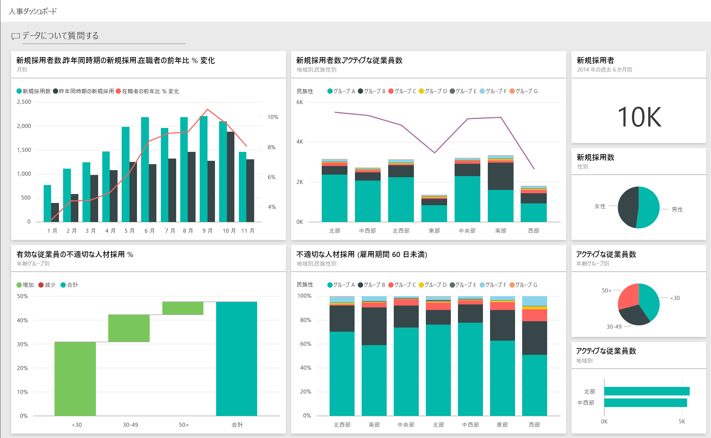
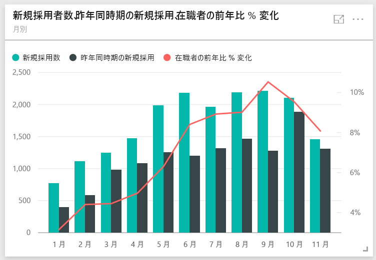
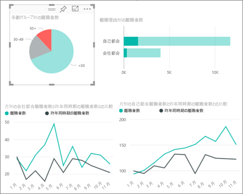
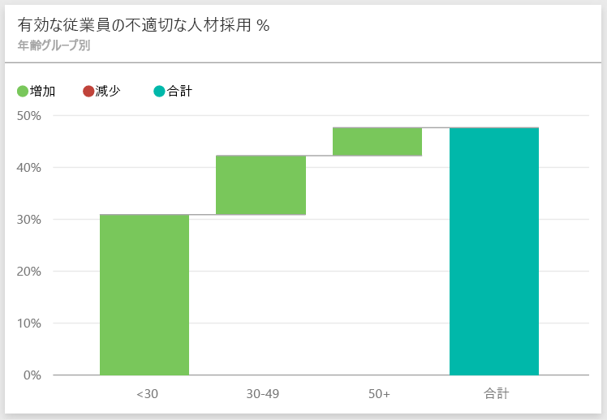
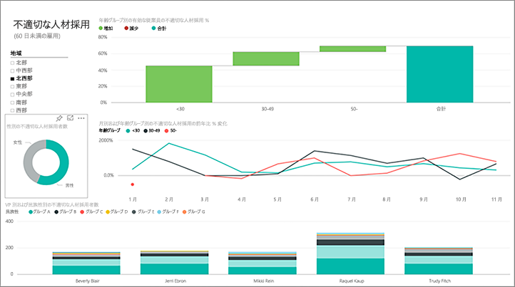
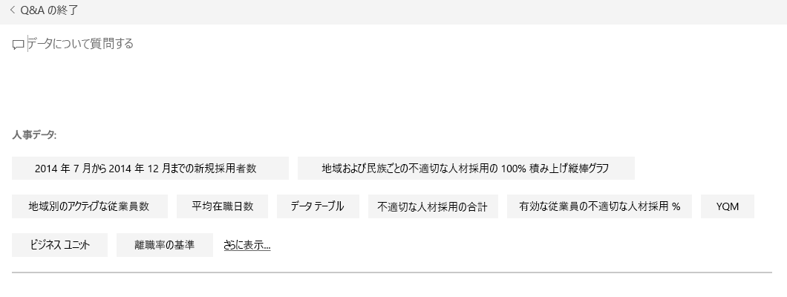
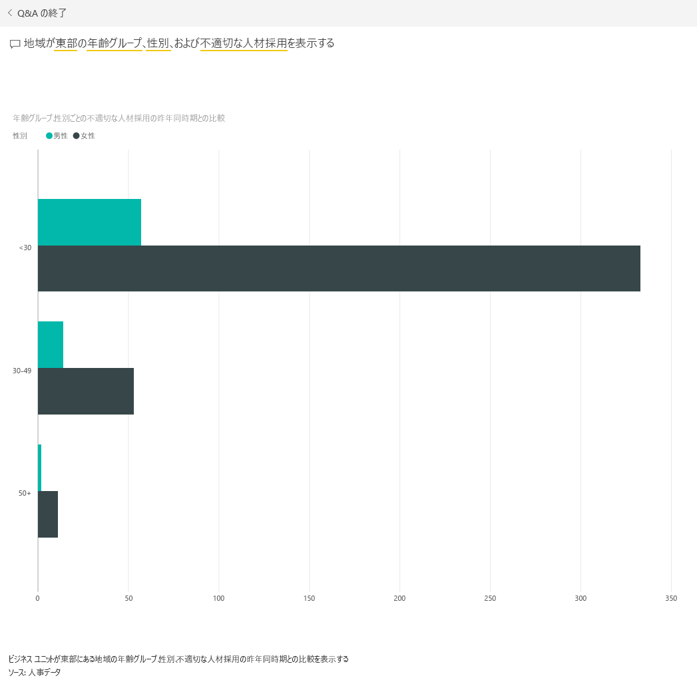

# Power BI の人事のサンプル: 使ってみる

## 人事のサンプルの概要
業界や規模が違っても、人事部が使用するレポート モデルはどの企業でも変わりがありません。 このサンプルでは、新規採用者、在職者、退職者を調査して、採用戦略の傾向を明らかにすることを試みます。 主な目的は次を理解することです。

* 雇用した人材
* 雇用戦略のバイアス
* 自主的な退職の傾向

このサンプルは、ビジネス用のデータ、レポート、ダッシュボードを用いて Power BI を使う方法について説明するシリーズの一部です。 これは、obviEnce ([www.obvience.com](http://www.obvience.com/)) が収集している匿名化された実データです。 データは次の複数の形式で使用できます: コンテンツ パック/コンテンツ アプリ、Excel ブック、.pbix Power BI Desktop ファイル。 詳細については、[サンプル データセット](sample-datasets.md)をご覧ください。

## 前提条件

 このサンプルを使用するには、事前にサンプルを[コンテンツ パック](https://docs.microsoft.com/en-us/power-bi/sample-human-resources#get-the-content-pack-for-this-sample)、[pbix ファイル](http://download.microsoft.com/download/6/9/5/69503155-05A5-483E-829A-F7B5F3DD5D27/Human-Resources-Sample-PBIX.pbix)、または [Excel ブック](http://go.microsoft.com/fwlink/?LinkId=529780)としてダウンロードしておく必要があります。

### このサンプルのコンテンツ パックを入手する

1. Power BI サービス (app.powerbi.com) を開いてログインします。
2. 左下隅にある **[データの取得]** を選びます。
   
    
3. 表示される [データの取得] ページで、**[サンプル]** アイコンを選びます。
   
   
4. **[人事のサンプル]** を選択し、**[接続]** を選択します。  
   
   
5. Power BI がコンテンツ パックをインポートし、新しいダッシュボード、レポート、データセットを現在のワークスペースに追加します。 新しいコンテンツは黄色のアスタリスクで示されます。 
   
   
  
### このサンプルの .pbix ファイルを取得する

あるいは、Power BI Desktop で使用するために設計された .pbix ファイルとして、サンプルをダウンロードすることもできます。 

 * [人事のサンプル](http://download.microsoft.com/download/6/9/5/69503155-05A5-483E-829A-F7B5F3DD5D27/Human Resources Sample PBIX.pbix)

### このサンプルの Excel ブックを取得する
[このサンプルのデータセット (Excel ブック) だけをダウンロード](http://go.microsoft.com/fwlink/?LinkId=529780)することもできます。 ブックには、表示および変更可能な Power View シートが含まれています。 生データを表示するには、**[Power Pivot] > [管理]** を選択します。

## 新規採用者
まず、新規採用者を調べてみましょう。

1. ワークスペースで、**[ダッシュボード]** タブを選択し、人事のダッシュボードを開きます。
2. ダッシュボードで、**[月別の****新規採用者数、昨年同時期の新規採用、在職者の前年比 % 変化]** タイルを選びます。  
     

   [人事のサンプル] レポートで、 **[新規採用者]** ページが開きます。  

   

次のことを確認します。

* **[月別の新規採用者数、昨年同時期の新規採用、在職者の前年比 % 変化]** 複合グラフには、昨年に比べて毎月新規採用者数が増加したことが示されています (いくつかの月では著しく増加)。
* 複合グラフ **[地域および民族性別の新規採用者数と在職者数]** には、 **[東]** 地域で新規採用者数が減少していることが示されています。
* **[年齢グループ別の新規採用者の前年比]** ウォーターフォール グラフには、主に若い人を採用していることが示されています。 これは、仕事が主にパートタイム的な性質のものであることに起因する可能性があります。
* **[性別の新規採用者数]** 円グラフには、かなり均等な分割が示されています。

たとえば、性別の分割が均等でない地域など、より多くの洞察が得られるでしょうか。 グラフ内のさまざまな年齢グループと性別を選んで、年齢、性別、地域、民族性グループ間の関連性を探ります。

上部のナビゲーション バーからダッシュボードの名前を選択して、ダッシュボードに戻ります。

## 現在の在職者と退職者の比較
現在の在職者と既に退職した従業員のデータについて調べましょう。

ダッシュボードで、 **[年齢別の在職者数]** タイルを選びます。  

[人事のサンプル] レポートで、**[Active Employees vs.Separations]** (在職者対離職者) ページが開きます。  

**目的の項目**:

* 左側の複合グラフには、在職者と離職の前年比変化が示されます。 急速な採用のために今年はより多くの従業員が在籍していますが、離職者も昨年より多くなっています。
* 8 月は、他の月と比較してより多くの離職者がいました。 異なる年齢グループ、性別、地域を選んで、他にも異常値があるかどうかを調べます。
* 円グラフを見ると、性別と年齢グループ別の在職者でもかなり均等な分割があることがわかります。 異なる年齢グループを選んで、年齢別の性別分割を表示します。 性別による均等な分割があらゆる年齢グループで見られますか。

## 離職の理由
編集ビューでレポートを見てみましょう。 左上隅の **[レポートの編集]** を選びます。

在職者の代わりに離職者のデータを表示するように円グラフを変更します。

1. **[年齢別の在職者数]** 円グラフを選びます。
2. **[フィールド]** で **[従業員]** の横にある矢印を選んで従業員テーブルを展開します。 **[在籍者数]** の横にあるチェック ボックスをオフにして、そのフィールドを削除します。
3. 従業員テーブル内で、 **[離職者数]** の横にあるチェック ボックスをチェックして、フィールドの **[値]** ボックスに追加します。
4. レポート キャンバスに戻り、**[離職理由別の離職者数]** 横棒グラフの **[自主]** バーを選びます。 そうすると、レポートの他のビジュアルで自主的に離職した従業員が強調表示されます。
5. [年齢グループ別の離職者数] 円グラフの 50+ スライスをクリックします。

   右下隅にある折れ線グラフの理由別の離職をご覧ください。 このグラフはフィルター処理され、自主的な離職が表示されます。  
   

   50 歳以上の年齢グループの傾向がわかりますか。 年の後半には、50 歳以上の従業員で自主的に離職する人が増えています。 これは、より多くのデータにより、さらに調査すべき領域である可能性があります。
6. **[性別の在職者数]** 円グラフについても同じ手順に従い、在職者の代わりに離職者に変更できます。 性別ごとに自主的な退職のデータを見て、他の洞察が得られるかどうかご確認ください。
7. 上部のナビゲーション バーで **[Power BI]** をクリックして、ダッシュボードに戻ります。 レポートに行った変更は保存してもしなくてもかまいません。

## 不適切な人材採用
調査する最後の領域は、不適切な人材採用です。 不適切な人材採用は、雇用期間が 60 日以下の従業員として定義されます。 急速な採用を実施していますが、 適切な候補を採用しているでしょうか。

1. **[年齢グループ別の在職者の不適切な人材採用 %]** ダッシュボード タイルを選びます。 レポートのページ 3「不適切な人材採用」が開きます。

     
2. 左側にある [地域] スライサーの **[北西]** チェック ボックスと [性別の不適切な人材採用数] ドーナツ グラフの **[男性]** スライスをチェックします。  「不適切な人材採用」ページのその他のグラフを確認します。 不適切な人材採用は女性より男性の方が多く、グループ A の不適切な人材採用が多いことがわかります。
     
3. **[性別による不適切な人材採用]** ドーナツ グラフを見て、 **[地域]** 部分をクリックすると、女性の不適切な人材採用が男性よりも多い地域は [東部] のみであることがわかります。  
4. 上部のナビゲーション バーからダッシュボードの名前を選択して、ダッシュボードに戻ります。

## Q&A ボックスの質問
[Q&A 質問ボックス](power-bi-tutorial-q-and-a.md)では、自然言語を使用して質問を入力します。 Q&A は、入力した用語を認識して、回答を探す場所 (データセット) を見つけ出します。

1. Q&A 質問ボックスをクリックします。 入力を開始する前に、Q&A ボックスに候補が表示されます。

   
2. これらの候補から 1 つ選ぶか、「**show age group, gender and bad hires SPLY where region is east**」と入力します。  

   

   女性の不適切な人材採用のほとんどは 30 歳未満であることにご注意ください。

これは、試してみるのに安全な環境です。 変更内容を保存しないようにいつでも選択できます。 保存すると、いつでもこのサンプルの新しいコピーの **[データの取得]** に進むことができます。

## 次の手順: データへの接続
この記事から、Power BI ダッシュボード、Q&A、レポートから人事データへの洞察をどのように得られるかがご理解いただけたでしょうか。 次はあなたの番です。ご自分のデータを接続してみてください。 Power BI を使用すると、広範なデータ ソースに接続することができます。 詳細については、「[Power BI の概要](service-get-started.md)」をご覧ください。  
