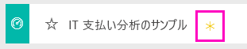
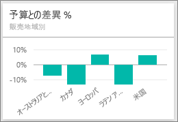
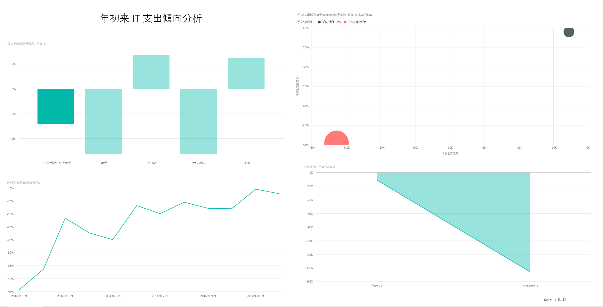
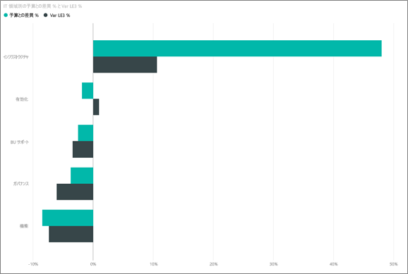
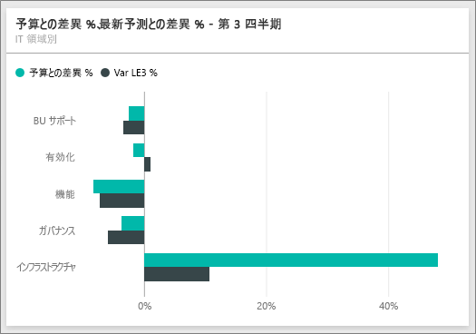
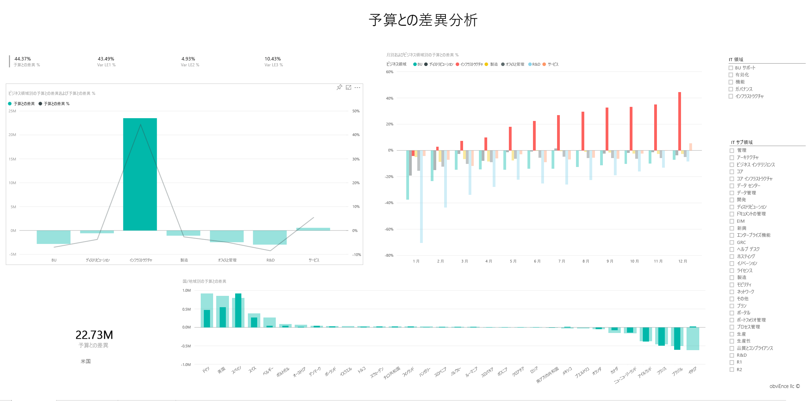

# Power BI の IT 支出分析のサンプル: 使ってみる

## IT 支出分析のサンプルの概要
IT 支出分析[コンテンツ パック](service-organizational-content-pack-introduction.md) (ダッシュボード、レポート、データセット) は、IT 部門の予定コストと実績コストを比較分析します。 比較することで当年度における予算が適切に組まれたかどうかを把握し、当初の計画から大きく乖離している分野を調べることができます。 この例の会社では年間予算が組まれ、四半期ごとに最新予測 (LE) が出されて当該会計年度における IT 支出の変化を分析しています。

このサンプルは、ビジネス用のデータ、レポート、ダッシュボードを用いて Power BI を使う方法について説明するシリーズの一部です。 これは、匿名化された obviEnce (<http://obvience.com/>) の実データです。

## 前提条件

 このサンプルを使用するには、事前にサンプルを[コンテンツ パック](https://docs.microsoft.com/en-us/power-bi/sample-it-spend#get-the-content-pack-for-this-sample)、[.pbix ファイル](http://download.microsoft.com/download/E/9/8/E98CEB6D-CEBB-41CF-BA2B-1A1D61B27D87/IT Spend Analysis Sample PBIX.pbix)、または [Excel ブック](http://go.microsoft.com/fwlink/?LinkId=529783)としてダウンロードしておく必要があります。

### このサンプルのコンテンツ パックを入手する

1. Power BI サービス (app.powerbi.com) を開いてログインします。
2. 左下隅にある **[データの取得]** を選びます。
   
    
3. 表示される [データの取得] ページで、**[サンプル]** アイコンを選びます。
   
   
4. **[IT 支出分析のサンプル]** を選び、**[接続]** を選びます。  
  
   
   
5. Power BI がコンテンツ パックをインポートし、新しいダッシュボード、レポート、データセットを現在のワークスペースに追加します。 新しいコンテンツは黄色のアスタリスクで示されます。 
   
   
  
### このサンプルの .pbix ファイルを取得する

あるいは、Power BI Desktop で使用するために設計された .pbix ファイルとして、サンプルをダウンロードすることもできます。 

 * [IT 支払い分析のサンプル](http://download.microsoft.com/download/E/9/8/E98CEB6D-CEBB-41CF-BA2B-1A1D61B27D87/IT%20Spend%20Analysis%20Sample%20PBIX.pbix)

### このサンプルの Excel ブックを取得する
[このサンプルのデータセット (Excel ブック) だけをダウンロード](http://go.microsoft.com/fwlink/?LinkId=529783)することもできます。 ブックには、表示および変更可能な Power View シートが含まれています。 生データを表示するには、**[Power Pivot] > [管理]** を選択します。

## IT 支出分析のサンプル ダッシュボード
ダッシュボードの 2 つの数値タイル、\[ **Var Plan %**  \(予算との差異 %)] と \[ **Variance Latest Estimate % Quarter 3** \(最新予測値との差異 % 第 3 四半期)] から、予算および最新四半期予測値 \(LE3 = 最新予測第 3 四半期) に対する達成度の概要が得られます。 全体的に見て、予算を約 6% 下回っています。 この差異が生じる原因について、時、場所、カテゴリを調べましょう。

## \[YTD IT Spend Trend Analysis \(年初来 IT 支出傾向分析)] ページ
\[ **Var Plan % by Sales Region**  \(販売地域ごとの予算との差異 %)] ダッシュボード タイルを選択すると、IT 支出分析サンプル レポートの \[IT Spend Trend Analysis \(IT 支出傾向分析)] ページが表示されます。 米国とヨーロッパでは正の差異があり、カナダ、ラテン アメリカ、オーストラリアでは負の差異があることが一目見ただけでわかります。 米国では LE 差異が約 +6% あり、オーストラリアでは LE 差異が約 -7% あります。

ただし、このグラフだけを見て結論を導き出すと判断を誤る可能性があります。 大局的に見るため、実際の金額の確認が必要です。

1. [Var Plan % by Sales Region (販売地域ごとの予算との差異 %)] グラフで [**Aus and NZ** (オーストラリアとニュージーランド)] を選択して、[Var Plan by IT Area (IT エリアごとの予算との差異)] グラフに注目します。

   
2. ここで \**[USA]** \(米国) を選択します。 オーストラリアが総支出に占める割合は米国と比べて非常に小さいことがこれでわかります。

    それでは米国に絞り込むと何がわかるでしょうか。 米国内で差異の原因となっているのは、どのカテゴリかを見てみましょう。

## データに関する質問
1. 上部のナビゲーション バーで **[IT Spend Analysis Sample]\(IT 支出分析のサンプル\)** を選んでダッシュボードに戻ります。
2. 質問ボックスに「show IT areas, var plan % and var le3 % bar chart」と入力します。

   

   最初の IT エリア \**[Infrastructure]** \(インフラストラクチャ) で、初期予算との差異と、最新予測値との差異で割合が大幅に変化しました。

## [YTD Spend by Cost Elements] \(コスト要素ごとの年初来支出) ページ
ダッシュボードに戻り、\**[Var Plan %, Var LE3%]** \(予算との差異 %、LE3 との差異 %) ダッシュボード タイルに目を向けます。

インフラストラクチャでは、予算から大きく正方向への差異があります。

1. このタイルをクリックして、IT 支出分析サンプル レポートの \[YTD Spend by Cost Elements] \(コスト要素ごとの年初来支出) ページに移動します。
2. 左下の \[Var Plan % and Var LE3 % by IT Area] \(IT エリアごとの予算との差異 % と LE3 との差異 %) グラフの \**[Infrastructure]** \(インフラストラクチャ) バーをクリックし、左の \[Var Plan % by Sales Region] \(販売地域ごとの予算との差異 %) で予算との差異に注目します。

    
3. スライサーにある各コスト要素グループの名前をクリックして、大きな差異があったコスト要素を見つけます。
4. \**[Other]** \(その他) を選択して \[IT Area] \(IT エリア) の \**[Infrastructure]** \(インフラストラクチャ) をクリックし、\[IT Sub Area] \(IT サブエリア) 内のサブエリアをクリックし、差異がいちばん大きいサブエリアを見つけます。  

   \**[Networking]** \(ネットワーキング) に大きな差異があることがわかります。

   見たところ、会社では従業員の便宜のため電話サービスを提供することにしましたが、そのような取り組みは予算に入れられていなかったようです。

## \[Plan Variance Analysis] \(予算との差異分析) ページ
レポートの操作を続けます。レポートの下部にある [Plan Variance Analysis] \(予算との差異分析) タブをクリックして、レポートのページ 3 に移動します。

左側にある [Var Plan, and Var Plan % by Business Area] \(ビジネス エリアごとの予算との差異と予算との差異 %) 複合グラフで [Infrastructure] \(インフラストラクチャ) 列をクリックすると、ページの残りの部分のインフラストラクチャの値が強調表示されます。

\[Var plan% by Month and Business Area] \(月とビジネス エリアごとの予算との差異 %) グラフに注目すると、インフラストラクチャは 2 月付近で正の差異が始まり、そこから増加し続けています。 また、インフラストラクチャの国ごとの予算値との差異を、すべてのビジネス エリアの値と比較して注目してみます。 右側のスライサー \[IT Area] \(IT エリア) と \[IT Sub Areas] \(IT サブエリア) を使用して、ページの残りの部分で値を強調表示ではなくフィルター処理します。 右にあるさまざまな IT エリアをクリックして、別の方法でデータを調べます。 また、IT サブエリアもクリックして、そのレベルでの差異を参照してください。

## レポートの編集
左上隅の \**[Edit Report]** \(レポートの編集) をクリックして、編集ビューを調べます。

* ページの作りを見てください。各グラフのフィールド、ページ上のフィルターなどがあります。
* ページを追加し、同じデータに基づくグラフを追加します。
* 各グラフの視覚エフェクトの種類を変更します。
* それらをダッシュボードにピン留めします。

これは、試してみるのに安全な環境です。 変更内容を保存しないようにいつでも選択できます。 一方、保存すると、常にこのサンプルの新しいコピーに対するデータの取り込みに進むことができます。

## 次の手順: データへの接続
この記事から、Power BI ダッシュボード、Q & A、レポートから IT 支出データへの洞察をどのように得られるかがご理解いただけたでしょうか。 次はあなたの番です。ご自分のデータを接続してみてください。 Power BI を使用すると、広範なデータ ソースに接続することができます。 詳細については、「[Power BI の概要](service-get-started.md)」をご覧ください。
