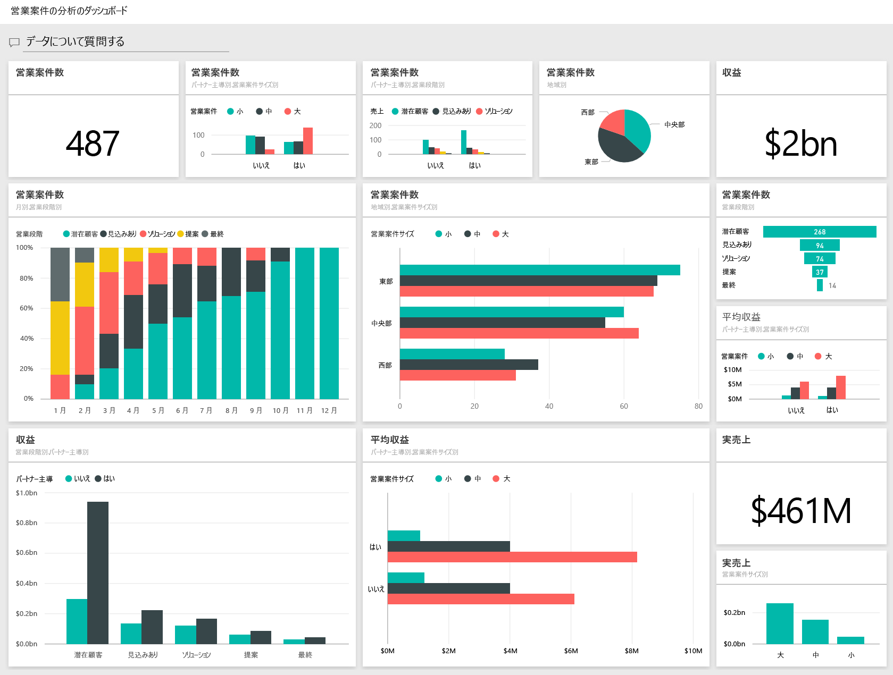
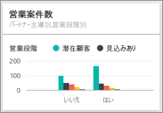

# Power BI の営業案件の分析のサンプル: 使ってみる

## 営業案件の分析のサンプルの概要
**営業案件の分析のサンプル** には、"*直接*" と "*パートナー*" という 2 つの販売チャネルを持つソフトウェア企業向けのダッシュボード (および関連するレポート) が含まれています。 地域、案件のサイズ、チャネル別に営業案件と売上を追跡するために、セールス マネージャーがこのダッシュボードを作成しました。

セールス マネージャーは、次の 2 つの売上メジャーを利用します。

* **売上** - 売上高に関する営業員の予測です。
* **実売上** - 売上と見込み % で算出され、実際の営業売上のより正確な予測値として使用されます。 見込みは現在の商談の***営業段階***によって率が決まります。
  * 潜在顧客 – 10%  
  * 見込みあり – 20%  
  * 解決 – 40%  
  * 提案 – 60%  
  * 最終 – 80%

  

このサンプルは、ビジネス用のデータ、レポート、ダッシュボードを用いて Power BI を使う方法について説明するシリーズの一部です。 これは、obviEnce ([www.obvience.com](http://www.obvience.com/)) が収集している匿名化された実データです。

## 前提条件

 このサンプルを使用するには、事前にサンプルを[コンテンツ パック](https://docs.microsoft.com/power-bi/sample-opportunity-analysis#get-the-content-pack-for-this-sample)、[.pbix ファイル](http://download.microsoft.com/download/9/1/5/915ABCFA-7125-4D85-A7BD-05645BD95BD8/Opportunity-Analysis-Sample-PBIX.pbix)、または [Excel ブック](http://go.microsoft.com/fwlink/?LinkId=529782)としてダウンロードしておく必要があります。

### このサンプルのコンテンツ パックを入手する

1. Power BI サービス (app.powerbi.com) を開いてログインします。
2. 左下隅にある **[データの取得]** を選びます。
   
    
3. 表示される [データの取得] ページで、**[サンプル]** アイコンを選びます。
   
   
4. **[営業案件の分析のサンプル]** を選択し、**[接続]** を選択します。  
  
   
   
5. Power BI がコンテンツ パックをインポートし、新しいダッシュボード、レポート、データセットを現在のワークスペースに追加します。 新しいコンテンツは黄色のアスタリスクで示されます。 
   
   
  
### このサンプルの .pbix ファイルを取得する

あるいは、Power BI Desktop で使用するために設計された .pbix ファイルとして、サンプルをダウンロードすることもできます。 

 * [営業案件の分析のサンプル](http://download.microsoft.com/download/9/1/5/915ABCFA-7125-4D85-A7BD-05645BD95BD8/Opportunity%20Analysis%20Sample%20PBIX.pbix)

### このサンプルの Excel ブックを取得する
[このサンプルのデータセット (Excel ブック) だけをダウンロード](http://go.microsoft.com/fwlink/?LinkId=529782)することもできます。 ブックには、表示および変更可能な Power View シートが含まれています。 生データを表示するには、**[Power Pivot] > [管理]** を選択します。

## ダッシュボードからわかること
セールス マネージャーは、自分にとって最も重要なメトリックを追跡するためにダッシュボードを作成しました。 何か興味深いものがある場合は、タイルを選んで詳しいデータを確認できます。

1. 企業収益は 20 億ドルで、要因を考慮した収益は 4 億 6,100 万ドルです。
2. 営業案件数と売上はなじみ深いじょうごパターンに従います。合計は各段階で減少します。
3. 営業案件のほとんどは東部地域で発生しています。
4. 大規模な営業案件は中小規模の営業案件にくらべてより多額の売上をもたらします。
5. パートナーの大規模案件はより多くの収益を生み出し、直接販売が 600 万ドルに対して平均で 800 万ドルです。

契約を獲得するための労力は取引が大、中、小のいずれに分類されたかにかかわらず同じです。大型の営業案件をより詳しく調べるためにデータを深く掘り下げる必要があります。

**[Opportunity Count by Partner Driven and Sales Stage]** (パートナー主導の営業案件数と営業段階) タイルを選んで、レポートのページ 1 を開きます。  

## レポート内のページの調査
### レポートのページ 1 のタイトルは "Opportunity Count Overview" (営業案件数の概要) です。

* 営業案件数の観点では、東部が最大の地域です。  
* 円グラフで、一度に 1 つずつ各地域を選んでページをフィルターします。 各地域で、パートナーはより多くの大規模案件を追求しています。   
* パートナー主導別の営業案件と営業案件サイズの縦棒グラフから、大規模案件のほとんどがパートナー主導であり、中小規模案件の多くがパートナー主導でないことが明らかです。
* 横棒グラフの左下隅にある各 [営業段階] を選んで地域別数の相違を確認すると、数の上で大きな地域は東部ですが、解決、提案、最終の段階では、3 つの地域すべてで同等の数を示しています。 つまり、中部と西部ではより高い割合で契約を獲得しています。

### レポートのページ 2 のタイトルは「収益の概要」です。
このページでも同様にデータを観察しますが、数ではなく収益を対象にします。  

* 東部は営業案件数だけでなく、収益の面でも最大の地域です。  
* パートナー主導によってフィルター処理をすると (右上の凡例で **[はい]** を選ぶ)、15 億ドルおよび 2 億 9,400 万ドルという収益が明らかになります。 これを、パートナー主導でない収益である 6,440 億ドルおよび 1 億 6,600 万ドルと比較します。  
* 案件がパートナー主導の場合の大規模取引の平均収益 (800 万) は、パートナー主導でないビジネスの 600 万よりも高額です。  
* パートナー主導ビジネスの場合、大規模な営業案件の平均収益は中小規模の平均収益 (400 万) のほぼ 2 倍です。  
* 中小企業の平均売上は、パートナー主導と非パートナー主導の両方のビジネスで同等です。   

明らかにパートナーは、より高い割合で顧客への販売を成功させています。  より多くの取引をパートナー経由にすることは合理的であると考えられます。

### レポートのページ 3 のタイトルは「地域段階数」です。
このページでは、同様のデータを考察しますが、地域と段階によって分割します。  

* 東部でフィルター処理すると (円グラフで **[East]** (東部) を選ぶ)、東部での営業案件はパートナー主導と非パートナー主導にほぼ均等に分割されることがわかります。
* 中部で最も一般的なのは大規模案件、東部で最も一般的なのは小規模案件、西部で一般的なのは中規模案件です。

### レポートのページ 4 のタイトルは「予定されている営業案件」です。
ここでも同様の要因を考察しますが、今回は日付と時刻の観点からです。  

CFO はこのページを使用して、ワークロードを管理します。 収益案件を営業段階と月別に見ることにより、適切な計画が可能になります。

* 最終段階の平均売上は最高です。 これらの契約を獲得することは最重要課題です。
* 月によってフィルター処理すると (左側のスライサーで月の名前を選ぶ)、最終段階の大規模取引の割合が高いのは 1 月であることがわかります (要因を考慮した収益は 7 億 5,000 万ドル)。 その一方で、2 月は、解決と提案の段階でほとんどが中規模取引になっています。
* 一般に、要因を考慮した売上の値は、営業段階、営業案件の数、取引サイズによって変化します。 これらの要因のフィルターを追加して (右側のフィルター ウィンドウを使用)、さらに洞察を深めます。

これは、試してみるのに安全な環境です。 変更内容を保存しないようにいつでも選択できます。 一方、保存すると、常にこのサンプルの新しいコピーに対する **データの取り込み** に進むことができます。

## 次の手順: データへの接続
この記事から、Power BI ダッシュボード、Q&A、レポートから営業案件の追跡データへの洞察をどのように得られるかがご理解いただけたでしょうか。 次はあなたの番です。ご自分のデータを接続してみてください。 Power BI を使用すると、広範なデータ ソースに接続することができます。 詳細については、「[Power BI の概要](service-get-started.md)」をご覧ください。

[サンプルをダウンロードする](sample-datasets.md)  
