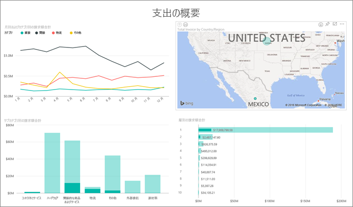
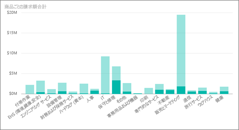
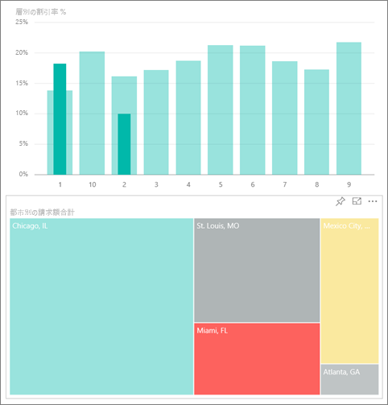
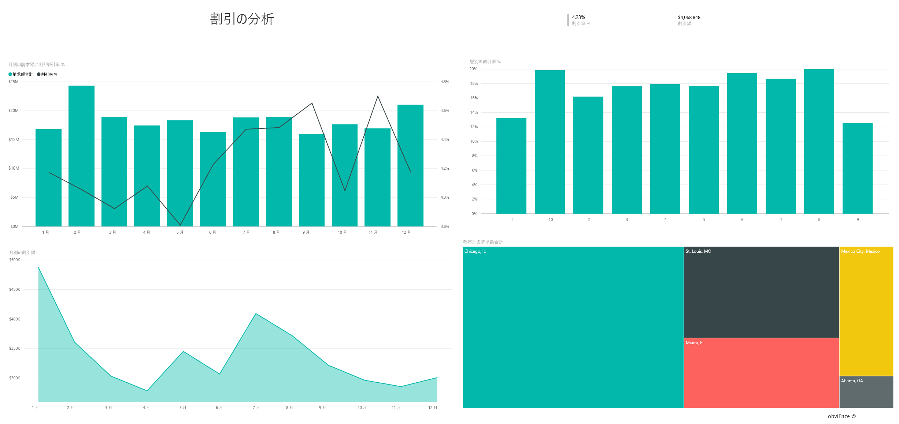
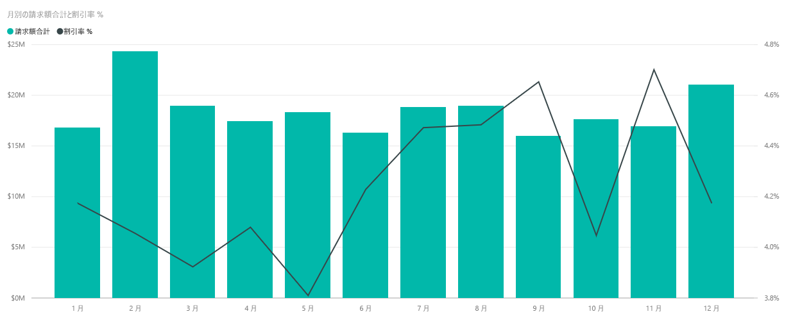
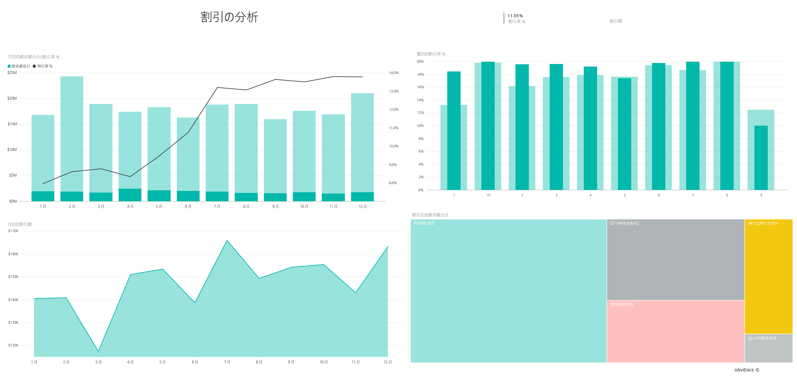

# Power BI の調達の分析のサンプル: 使ってみる
この業界サンプル ダッシュボードと基になるレポートは、製造会社のカテゴリと場所ごとのベンダー支出を分析します。 このサンプルでは、次の領域を調べます。

* 売上が最も高いベンダー
* 最も支出の多いカテゴリ
* 最も割引率が高かったベンダーとその時期

このサンプルは、ビジネス用のデータ、レポート、ダッシュボードを用いて Power BI を使う方法について説明するシリーズの一部です。 これは、obviEnce ([www.obvience.com](http://www.obvience.com/)) が収集している匿名化された実データです。

どうしたらよいでしょうか? [Power BI サービス](https://powerbi.com)で、**[データの取得] > [サンプル] > [調達の分析のサンプル] > [接続]** に移動し、自分用のサンプル コピーを取得します。

[このサンプルのデータセット (Excel ブック) だけをダウンロード](http://go.microsoft.com/fwlink/?LinkId=529784)することもできます。

## 支出傾向
まず、カテゴリと場所ごとの支出の傾向を見てみましょう。  

1. ワークスペースから **[ダッシュボード]** タブを開き、調達の分析ダッシュボードを選択します。
2. ダッシュボード タイル **[Total Invoice by Country/Region]**(国または地域別の合計請求) を選びます。 「調達の分析のサンプル」レポートの「支出概要」ページが開きます。
   
    

以下の点にご注意ください。

* **[Total Invoice by Month and Category]** (月およびカテゴリ別の合計請求) 折れ線グラフ: **[Direct]** (直接) カテゴリにはほぼ安定した支出、 **[Logistics]** (物流) には 12 月のピーク時の支出、 **[Other]** (その他) には 2 月のスパイクが含まれます。
* **[Total Invoice by Country/Region]** (国または地域ごとの合計請求) マップ: 支出のほとんどは米国内です。
* **\[Total Invoice by Sub Category]** \(サブ カテゴリ別の合計請求) 縦棒グラフ: **\[Hardware]** \(ハードウェア) および **\[Indirect Goods & Services]** \(間接的な商品およびサービス) は最も大きな支出カテゴリです。
* \[Total Invoice by Tier] \(層別の合計請求) 横棒グラフ: 当社のビジネスのほとんどは、第 1 層 (上位 10 社) のベンダーと行われています。 これはベンダーとの関係の管理向上に役立ちます。

## メキシコでの支出
メキシコでの支出分野を見てみましょう。

1. グラフで、マップ内の **[Mexico]** (メキシコ) バブルを選びます。 \[Total Invoice by Sub Category] \(サブ カテゴリ別の合計請求) 縦棒グラフで、ほとんどは **\[Indirect Goods & Services]** \(間接的な商品およびサービス) サブ カテゴリに含まれることにご注意ください。
   
   
2. **[Indirect Goods & Services]** (間接的な商品およびサービス) 列にドリルダウンします。
   
   * グラフの右上隅にあるドリルダウン矢印  を選びます。
   * **[Indirect Goods & Services]** (間接的な商品およびサービス) 列を選びます。
     
      このカテゴリ全体で最も大きな支出は \[Sales & Marketing] \(営業およびマーケティング) です。
   * マップで **[Mexico]** (メキシコ) をもう一度選びます。
     
      メキシコのこのカテゴリで最も大きな支出は、\[Maintenance & Repair] \(保守および修復) です。
     
      
3. グラフの左上隅にある上向きの矢印を選んで、ドリルダウン前の状態に戻ります。
4. もう一度矢印を選んで、ドリルダウンをオフにします。  
5. 上部のナビゲーション バーで **[Power BI]** を選択して、ワークスペースに戻ります。

## 異なる複数の市区町村の評価
強調表示を使用して、異なる複数の市区町村を評価することができます。

1. ダッシュボード タイル **[Total Invoice, Discount % By Month]**(月別の合計請求、割引率) を選びます。 レポートが開き、「割引分析」ページが表示されます。
2. **[Total Invoice by City]** (市区町村ごとの合計請求) ツリーマップで異なる複数の市区町村を選んで比較します。 マイアミのほとんどすべての請求は、第 1 層のベンダーからです。
   
   

## ベンダーの割引
ベンダーから利用可能な割引と、最大の割引を得られる期間も見てみましょう。 

具体的に以下の質問について考えてみましょう。

* 割引は月ごとに異なるか、または毎月同じか。
* ある市区町村では、他の市区町村よりも大きく割引するか。

### 月ごとの割引
**[Total Invoice and Discount % by Month]** (月別の合計請求と割引率) 複合グラフを見ると、 **2 月** が最も繁忙な月で、 **9 月** が最も閑散な月であることがわかります。 では、これらの月の割引率を見てみましょう。
量が増えると割引が低くなり、量が減ると割引が高くなる点にご注意ください。 割引を必要とすればするほど、取引内容が悪化します。

### 市区町村ごとの割引
探索するもう 1 つの領域は、市区町村ごとの割引です。 ツリーマップ内の各市区町村を選び、他のグラフがどのように変化するかをご確認ください。 

* ミズーリ州セントルイスは、2 月に合計請求の大きなスパイクがあり、4 月に割引額で大きな落ち込みがあります。
* メキシコのメキシコシティの割引率が最高で (11.05%)、ジョージア州アトランタの割引率 (0.08%) が最低です。

### レポートの編集
左上隅の **[Edit Report]** (レポートの編集) を選んで、編集ビューを調べます。

* ページの構成をご確認ください。
* ページを追加し、同じデータに基づくグラフを追加します。
* グラフの視覚化の種類を変更します。たとえば、ツリーマップをドーナツ グラフに変更します。
* それらをダッシュボードにピン留めします。

これは、試してみるのに安全な環境です。 変更内容を保存しないようにいつでも選択できます。 保存すると、いつでもこのサンプルの新しいコピーの **[データの取得]** に進むことができます。

## 次の手順: データへの接続
この記事から、Power BI ダッシュボードおよびレポートから調達データへの洞察をどのように得られるかがご理解いただけたでしょうか。 次はあなたの番です。ご自分のデータに接続してください。 Power BI を使用すると、広範なデータ ソースに接続することができます。 詳細については、「[Power BI の概要](service-get-started.md)」をご覧ください。

