# Power BI の小売りの分析のサンプル: 使ってみる

この業界サンプル ダッシュボードと基になるレポートは、複数の店舗や地域で販売されたアイテムの小売店の売上データを分析したものです。 メトリックは、売上、出荷単位、粗利、差異、新店舗の分析に関して、本年度と昨年度の業績を比較します。 これは、obviEnce ([www.obvience.com](http://www.obvience.com)) が収集している匿名化された実データです。

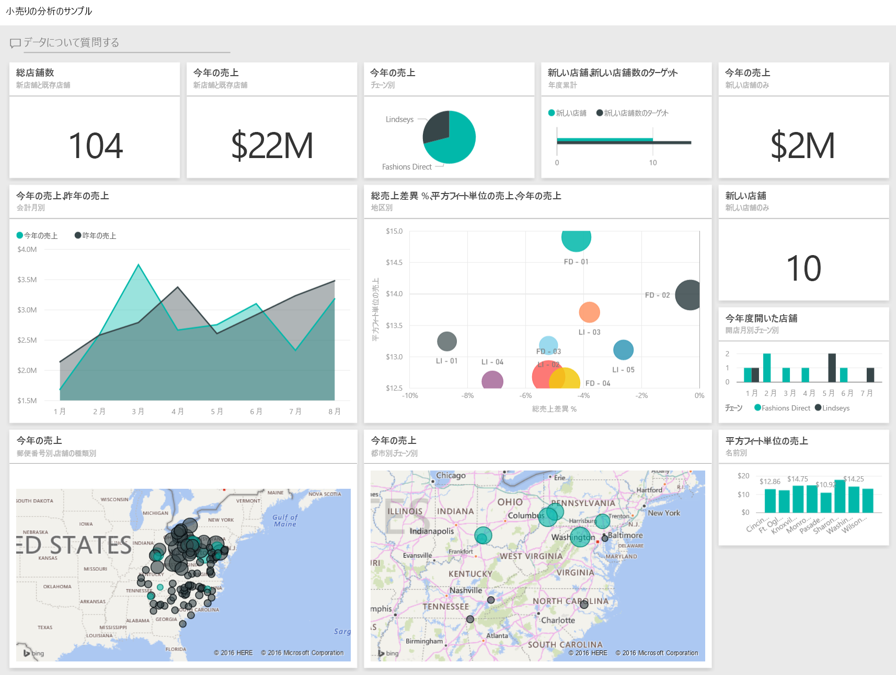

## 前提条件

 このサンプルを使用するには、事前にサンプルを[コンテンツ パック](https://docs.microsoft.com/en-us/power-bi/sample-datasets#get-and-open-a-sample-content-pack-in-power-bi-service)、[.pbix ファイル](http://download.microsoft.com/download/9/6/D/96DDC2FF-2568-491D-AAFA-AFDD6F763AE3/Retail-Analysis-Sample-PBIX.pbix)、または [Excel ブック](http://go.microsoft.com/fwlink/?LinkId=529778)としてダウンロードしておく必要があります。

### このサンプルのコンテンツ パックを入手する

1. Power BI サービス (app.powerbi.com) を開いてログインします。
2. 左下隅にある **[データの取得]** を選びます。
   
    
3. 表示される [データの取得] ページで、**[サンプル]** アイコンを選びます。
   
   
4. **[小売の分析のサンプル]** を選び、**[接続]** を選びます。  
  
   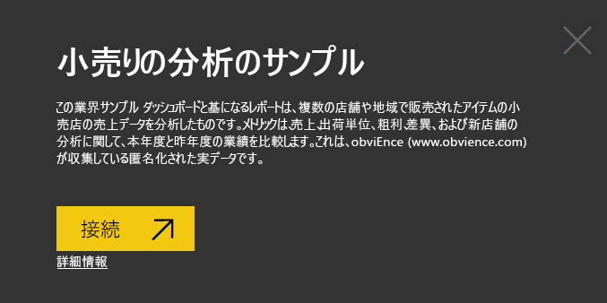
   
5. Power BI がコンテンツ パックをインポートし、新しいダッシュボード、レポート、データセットを現在のワークスペースに追加します。 新しいコンテンツは黄色のアスタリスクで示されます。 
   
   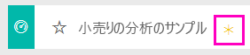
  
### このサンプルの .pbix ファイルを取得する

あるいは、Power BI Desktop で使用するために設計された .pbix ファイルとして、サンプルをダウンロードすることもできます。 

 * [小売の分析のサンプル](http://download.microsoft.com/download/9/6/D/96DDC2FF-2568-491D-AAFA-AFDD6F763AE3/Retail%20Analysis%20Sample%20PBIX.pbix)

### このサンプルの Excel ブックを取得する
[このサンプルのデータセット (Excel ブック) だけをダウンロード](http://go.microsoft.com/fwlink/?LinkId=529778)することもできます。 ブックには、表示および変更可能な Power View シートが含まれています。 生データを表示するには、**[Power Pivot] > [管理]** を選択します。

## ダッシュボードを起動し、レポートを開く
1. ダッシュボードで、\[Total Stores] \(総店舗数) タイルを選択します。

   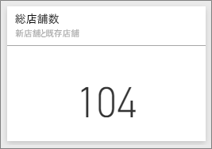  

   そうすると、レポート内の \[Store Sales Overview] \(店舗売上の概要) ページに移動します。 合計で 104 店舗あり、そのうち 10 店は新しい店舗であることが表示されます。 2 つの店舗チェーン、Fashions Direct と Lindseys があります。 Fashions Direct 店舗は、平均的により大規模です。
2. 円グラフで、**[Fashions Direct]** を選択します。

   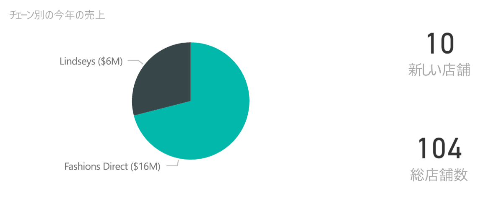  

   バブル チャートの結果を確認してください。

   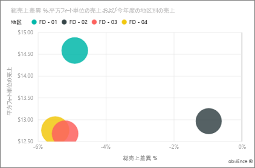  

   FD-01 地域は 1 平方フィート当たりの平均売上が最も高く、FD-02 は昨年に比べて売上の差異が最も小さく、FD-03 と FD-04 は全体で業績が最も低いです。
3. 個々のバブルまたは他のグラフをクリックすると、クロス強調表示が表示され、選択箇所による影響が明らかになります。
4. ダッシュボードに戻るには、上部のナビゲーション バー (階層リンク) からダッシュボード名を選択します。

   
5. ダッシュボードで \[This Year’s Sales]\(今年度の売上) と示されたタイルを選択します。

   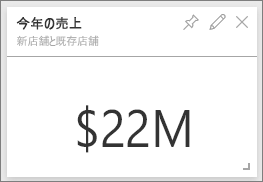

   これは、質問ボックスに「This year sales」と入力するのと同じです。

   次の画面が表示されます。

   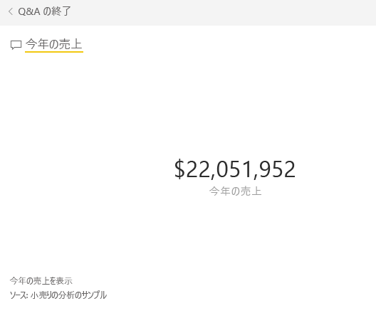

## Power BI の Q&A で作成されたタイルを確認する
さらに詳細を取得しましょう。

1. 質問ボックスに「this year sales **by district**」と追加します。 結果を確認します。自動的に横棒グラフに結果が表示され、他の語句が提案されます。

   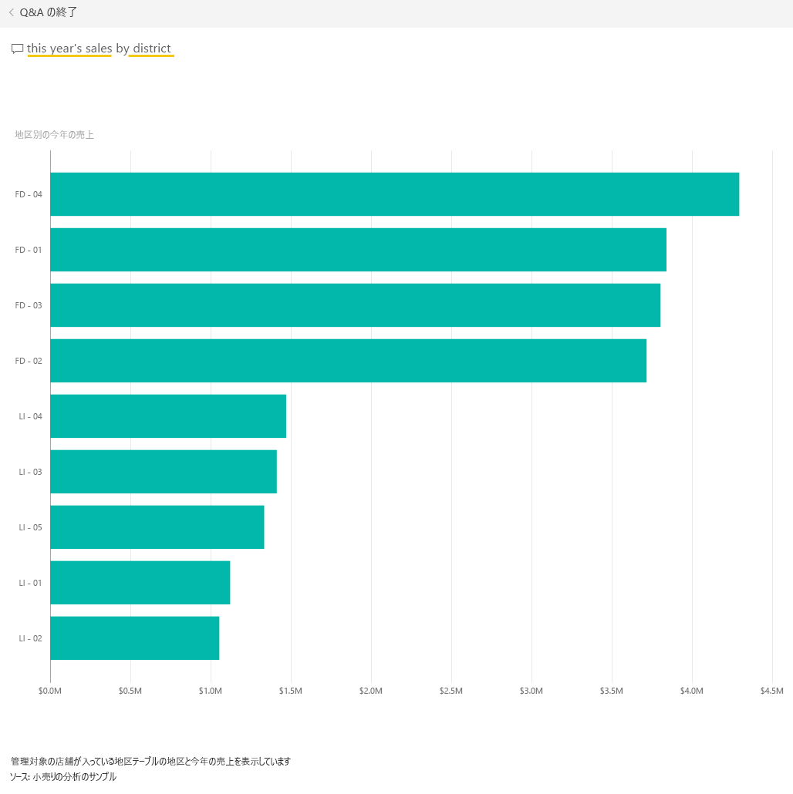
2. ここで、質問を「this year sales **by zip and chain**」に変更します。

   入力した質問に対する応答が、該当するグラフで得られることに注目してください。
3. その他の質問を入力して、どのような結果が得られるかをご覧ください。
4. 次に進む準備ができたら、ダッシュボードに戻ります。

## データをさらに深く分析する
ここで、より詳細なレベルで地域の業績を見てみましょう。

1. ダッシュボードで今年の売上と昨年の売上を比較するタイルを選択します。

   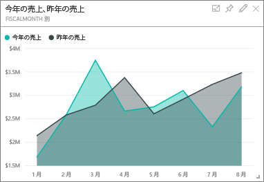

   昨年との差異 % で、1 月、4 月、7 月に特に実績が大きく下がっていることに注目してください。

   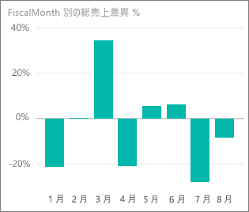

   絞り込んで、どこに問題があるかを特定できるかどうかを見てみましょう。
2. バブル チャートを選択し、 **[020-Mens]**(020-男性用) を選択します。

   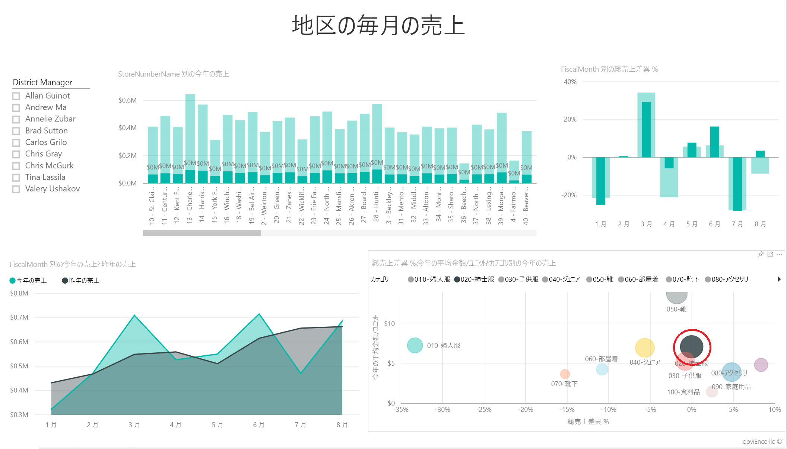  

   ビジネス全体と比べて、男性用のカテゴリの 4 月には深刻な影響がないことに注目してください。ただし、1 月と 7 月は問題のある月でした。
3. 次は **[010-Womens]**(010-女性用) バブルを選択します。

   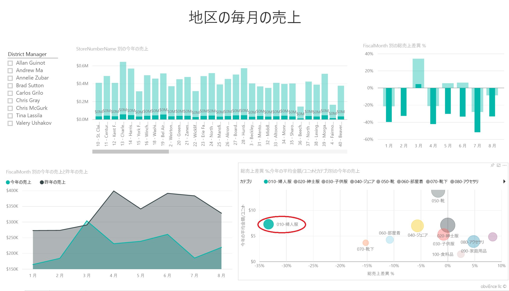

   ビジネス全体と比べて、女性用のカテゴリにおける業績はすべての月で非常に低く、ほとんどすべての月において、前年より明らかに悪くなっていることを確認してください。
4. フィルターをクリアするには、もう一度バブルを選択します。

## スライサーを試す
特定の地域の実績を見てみましょう。

1. 左上のスライサーで [Allan Guinot] を選択します。

   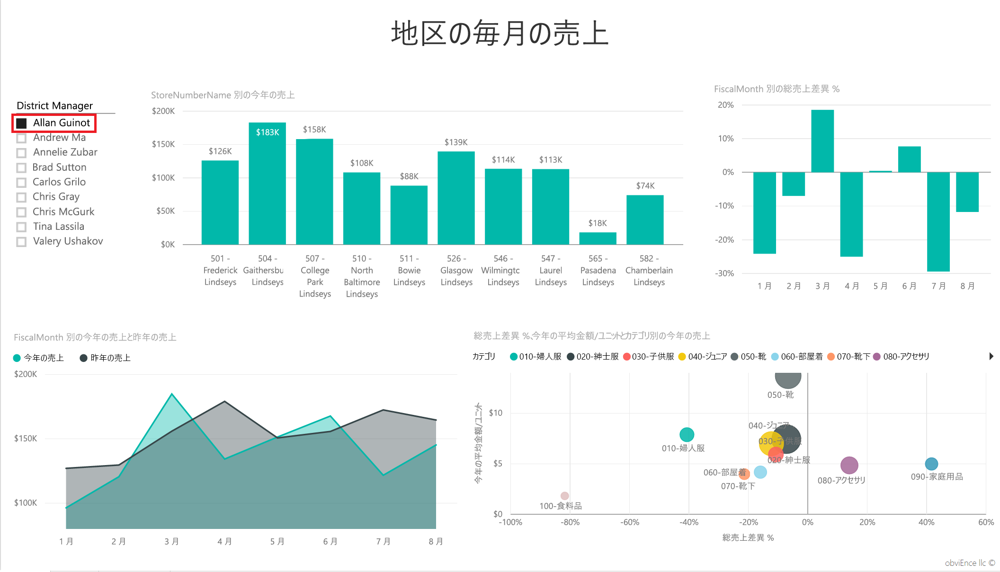

   Allan の地域が昨年 3 月と 6 月で優れた業績を示していることに注目してください。
2. ここで、Allan が選択されているときに、女性用のバブルを選択します。

   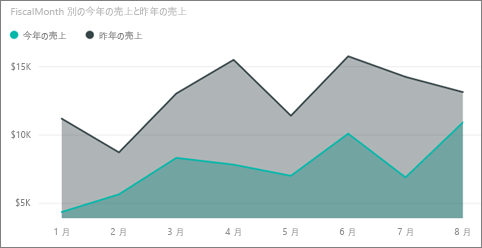

   女性用のカテゴリでは、Allan の地域は昨年度のボリュームに一度も到達していないことを確認してください。
3. その他の地域のマネージャーとカテゴリを調べてください。どのような洞察が見つかりますか。
4. 次に進む準備ができたら、ダッシュボードに戻ります。

## これらのデータから今年度の売上成長についてわかること
調べる最後のエリアは成長、つまり今年度開いた新店舗です。

1. [Stores Opened This Year (今年度開いた店舗)] タイルをクリックします。

   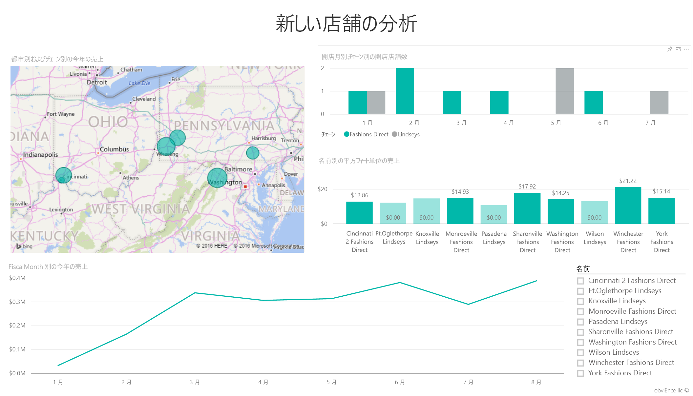

   タイルから明らかなとおり、今年度、Lindseys 店舗よりも Fashions Direct 店舗のほうが多く開店しました。
2. [Sales Per Sq Ft by Name] (店舗名別平方フィート単位の売上) グラフに注目してください。

   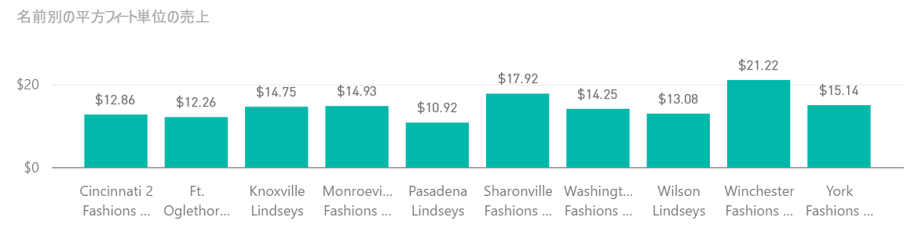

    平方フィートあたりの平均売上は、各新店舗によってかなり多くの差異があります。
3. 右上のグラフで Fashions Direct の凡例項目をクリックします。 同じチェーン店でも、最も業績の高い店舗 (Winchester Fashions Direct) と最も業績の低い店舗 (Cincinnati 2 Fashions Direct) では、それぞれ 21.22 ドルと 12.86 ドルと、大きな違いがあります。

   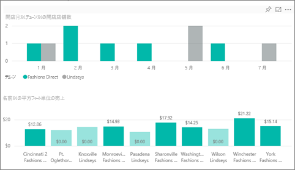
4. スライサーで [Winchester Fashions Direct] をクリックし、折れ線グラフに注目します。 最初の販売数は 2 月に報告されました。
5. スライサーで [Cincinnati 2 Fashions Direct] をクリックします。折れ線グラフから、開店したのは 6 月で、業績は最も低いようだとわかります。
6. 前述の場合と同様に、各グラフのその他の棒、折れ線、バブルをクリックして調べ、どのような洞察が見つかるか参照してみてください。

これは、試してみるのに安全な環境です。 変更内容を保存しないようにいつでも選択できます。 一方、保存すると、常にこのサンプルの新しいコピーに対するデータの取り込みに進むことができます。

## データへの接続
この記事から、Power BI ダッシュボード、Q & A、レポートから小売店のデータへの洞察をどのように得られるかがご理解いただけたでしょうか。 次はあなたの番です。ご自分のデータを接続してみてください。 Power BI を使用すると、広範なデータ ソースに接続することができます。 詳細については、「[Power BI の概要](service-get-started.md)」をご覧ください。

## 次の手順
* [小売りの分析のサンプル コンテンツ パックのダウンロード](sample-tutorial-connect-to-the-samples.md)
* [すべてのサンプル ファイルを 1 つにまとめた zip ファイルをダウンロードする](http://go.microsoft.com/fwlink/?LinkId=535020)    
* [この Power BI サンプル Excel ブックのダウンロード](http://go.microsoft.com/fwlink/?LinkId=529778)    
* [Power BI のデータの取得](service-get-data.md)    
* [Power BI - 基本的な概念](service-basic-concepts.md)    
* 他にわからないことがある場合は、 [Power BI コミュニティを利用してください](http://community.powerbi.com/)。
