# Power BI のサプライヤー クオリティ分析のサンプル: 使ってみる

## サプライヤー クオリティ分析サンプルの概要
この業界サンプル ダッシュボードおよび基になるレポートは、典型的なサプライ チェーンの課題の 1 つである、サプライヤー クオリティ分析に焦点を合わせています。
この分析では、欠陥の総数と、欠陥が引き起こす総ダウンタイムという 2 つの主要な指標を確認できます。 このサンプルには、2 つの主要な目的が組み込まれています。

* 最も優れたサプライヤーおよび最も改善が必要なサプライヤーをクオリティの面から示すという目的です。
* どのプラントがより的確に問題を検出して受領を拒否し、ダウンタイムを最小化しているかを特定します。

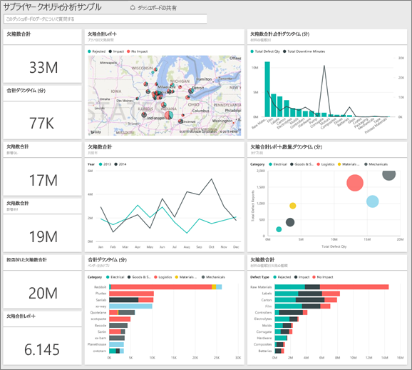

このサンプルは、ビジネス用のデータ、レポート、ダッシュボードを用いて Power BI を使う方法について説明するシリーズの一部です。
これは、obviEnce ([www.obvience.com](http://www.obvience.com/)) が収集している匿名化された実データです。

## 前提条件

 このサンプルを使用するには、事前にサンプルを[コンテンツ パック](https://docs.microsoft.com/en-us/power-bi/sample-supplier-quality#get-the-content-pack-for-this-sample)、[.pbix ファイル](http://download.microsoft.com/download/8/C/6/8C661638-C102-4C04-992E-9EA56A5D319B/Supplier-Quality-Analysis-Sample-PBIX.pbix)、または [Excel ブック](http://go.microsoft.com/fwlink/?LinkId=529779)としてダウンロードしておく必要があります。

### このサンプルのコンテンツ パックを入手する

1. Power BI サービス (app.powerbi.com) を開いてログインします。
2. 左下隅にある **[データの取得]** を選びます。
   
    
3. 表示される [データの取得] ページで、**[サンプル]** アイコンを選びます。
   
   
4. **[サプライヤー クオリティ分析サンプル]** を選び、**[接続]** を選びます。  
  
   
   
5. Power BI がコンテンツ パックをインポートし、新しいダッシュボード、レポート、データセットを現在のワークスペースに追加します。 新しいコンテンツは黄色のアスタリスクで示されます。 
   
   
  
### このサンプルの .pbix ファイルを取得する

あるいは、Power BI Desktop で使用するために設計された .pbix ファイルとして、サンプルをダウンロードすることもできます。 

 * [サプライヤー クオリティ分析サンプル](http://download.microsoft.com/download/8/C/6/8C661638-C102-4C04-992E-9EA56A5D319B/Supplier-Quality-Analysis-Sample-PBIX.pbix)

### このサンプルの Excel ブックを取得する
[このサンプルのデータセット (Excel ブック) だけをダウンロード](http://go.microsoft.com/fwlink/?LinkId=529779)することもできます。 ブックには、表示および変更可能な Power View シートが含まれています。 生データを表示するには、**[Power Pivot] > [管理]** を選択します。

## 欠陥のある素材によって発生するダウンタイム
欠陥のある素材に伴うダウンタイムを分析し、責任のあるベンダーを確認してみましょう。  

1. ダッシュボードで **[Total Defect Quantity]** (欠陥数量合計) タイルまたは **[Total Downtime Minutes]** (ダウンタイム合計 (分)) タイルを選びます。  

   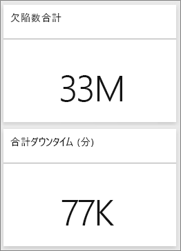  

   [サプライヤー クオリティ分析サンプル] レポートの \[Downtime Analysis] \(ダウンタイムの分析) ページが表示されます。 合計で 33M 個の欠陥部分があり、これらの欠陥部分に起因するダウンタイムの合計は 77K 分であることにご注目ください。 素材によっては欠陥部分が少ない場合もありますが、大幅な遅延を招き、長時間のダウンタイムが発生することがあります。 レポート ページで詳しく見てみましょう。  
2. **[Defects and Downtime (min) by Material Type]** (素材の種類別欠陥とダウンタイム (分)) 複合グラフの **[Total Downtime Minutes]** (ダウンタイム合計 (分)) の線を見ると、波形素材が最大のダウンタイムを発生させていることがわかります。  
3. 同じ複合グラフで **[Corrugate]** (波形素材) の縦棒を選ぶと、この欠陥の影響を最も強く受けているプラント、および責任のあるベンダーを確認できます。  

     
4. マップでプラントを個別に選ぶと、そのプラントにおけるダウンタイムに責任のあるベンダーまたは素材を確認できます。

### 最も改善が必要なサプライヤー
 最も改善が必要なサプライヤーを 8 社特定し、各社が発生させているダウンタイムの割合を確認します。 そのために、 **[Downtime (min) by Vendor]** (ベンダー別ダウンタイム (分)) 面グラフをツリーマップに変更します。  

1. レポートの 3 ページ目 \[Downtime Analysis] \(ダウンタイムの分析) で、左上隅にある **[レポートの編集]** を選びます。  
2. **[Downtime (min) by Vendor]** (ベンダー別ダウンタイム (分)) 面グラフを選び、[視覚化] ウィンドウでツリーマップを選びます。  

   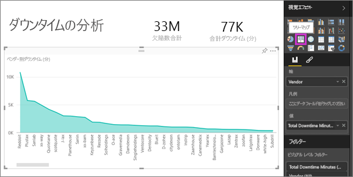  

    ツリーマップでは自動的に、 **[Vendor]** (ベンダー) フィールドが **[グループ]** として書き出されます。  

    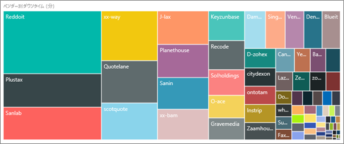  

   このツリーマップでは、最上位の 8 つのベンダーが、ツリーマップの左側にある 8 つのブロックで表されています。 また、これらの 8 社がダウンタイム (分) 全体の約 50% を占めていることがわかります。  
3. 上部のナビゲーション バーで **[Supplier Quality Analysis Sample]** を選んでダッシュボードに戻ります。

### プラントの比較
次に、欠陥のある素材の管理体制に優れ、結果的にダウンタイムを削減できたプラントを確認してみましょう。  

1. **[Total Defect Reports by Plant, Defect Type]** (プラント別および欠陥種類別の合計欠陥数レポート) マップ タイルを選びます。  

    レポートの [Supplier Quality] ページが開きます。  

   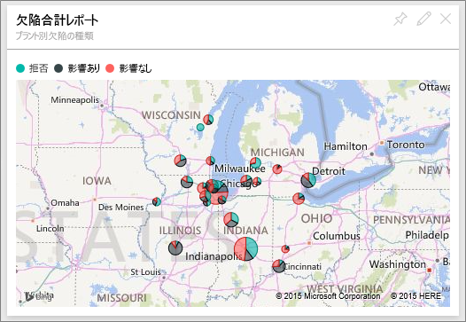  
2. マップの凡例で **[Impact]** (影響) 円を選びます。  

    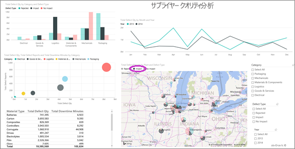  

    バブル チャートから、**\[Logistics]** \(物流) が最もトラブルの多いカテゴリであることがわかります。欠陥合計数量、合計欠陥数レポート、ダウンタイム合計 (分) のすべてで最大の値を示しています。 このカテゴリをさらに詳しく見てみましょう。  
3. バブル チャートで \[Logistics] \(物流) バブルを選び、\[Springfield, IL] \(スプリングフィールド、IL) と \[Naperville, IL] \(ネーパービル、IL) のプラントを確認します。 Naperville は受領拒否の件数が多く、Springfield (影響の件数が多い) と比べて影響の件数も少ないことから、欠陥品の管理に大変優れていることが伺えます。  

   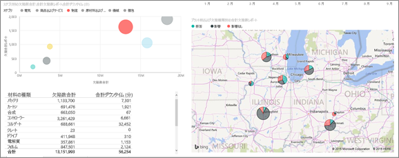  
4. 上部のナビゲーション バーで **[Supplier Quality Analysis Sample]** を選んで、アクティブなワークスペースに戻ります。

## 最も管理の行き届いている素材の種類
最も管理が行き届いている素材の種類は、欠陥数量に関係なく、ダウンタイムが最短であるか、ダウンタイムにまったく影響のない種類です。

* ダッシュボードで **[Total Defect Quantity by Material Type, Defect Type]** (素材種類別、欠陥種類別の欠陥数量合計) タイルを確認してみてください。

  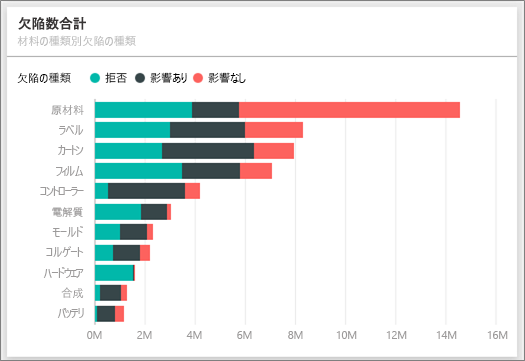

**[Raw Materials]** (原材料) は、合計欠陥数は多いものの、そのほとんどが受領拒否されたか、影響を及ぼしていません。

原材料は、欠陥数量が多くても、ダウンタイムの発生原因にはなっていないことを確認してみましょう。

* ダッシュボードで **[Total Defect Qty, Total Downtime Minutes by Material Type]** (素材種類別欠陥数量合計、ダウンタイム合計 (分)) タイルを確認してみてください。

  

原材料の管理が行き届いていることは明白です。欠陥数は増えているのに、ダウンタイムの合計時間 (分) は短縮されています。

### 欠陥とダウンタイムの年別比較
1. **[Total Defect Reports by Plant, Defect Type]** マップ タイルを選んで、最初のレポート ページ [Supplier Quality] を開きます。
2. **[Defect Qty]** (欠陥数量) の値が 2013 年より 2014 年の方が多いことにご注目ください。  

    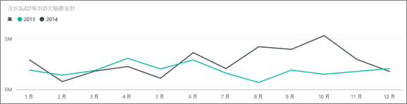  
3. 欠陥が増えるとダウンタイムも増えるのでしょうか? この質問を [Q&A] ボックスに入力し、答えを見つけ出しましょう。  
4. 上部のナビゲーション バーで **[Supplier Quality Analysis Sample]** を選んでダッシュボードに戻ります。  
5. \[Raw Materials] \(原材料) の欠陥数が最も多いため、質問ボックスに「show material types, year and total defect qty」\(素材の種類、年、欠陥数量合計を表示) と入力します。  

    原材料欠陥数は 2013 年より 2014 年の方が増えています。  

    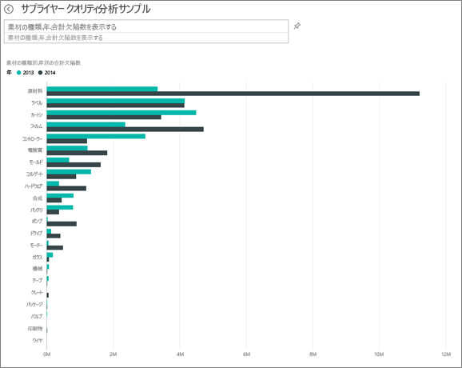  
6. 次に、質問を「show material types, year and total downtime minutes」(素材の種類、年、ダウンタイム合計 (分) を表示) に変更します。  

   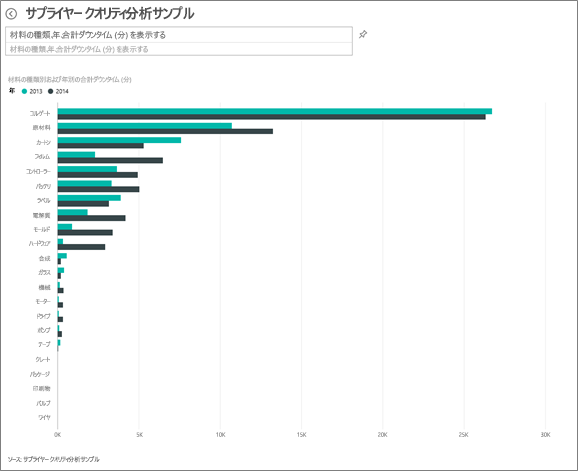

2014 年の方が原材料欠陥が多かったにもかかわらず、原材料のダウンタイムは 2013 年と 2014 年でほぼ同等でした。

つまり、2014 年に原材料欠陥は増加しましたが、それに起因する原材料ダウンタイム増加は 2014 年には起きませんでした。

### 欠陥とダウンタイムの月別比較
欠陥数量合計に関連するダッシュボード タイルをもう 1 つ見てみましょう。  

1. 質問ボックスの左上隅にある戻る矢印  を選んで、ダッシュボードに戻ります。  

    **[Total Defect Quantity by Month, Year]** (月別、年別欠陥数量合計) タイルをさらに詳しく見ると、2014 年前半の欠陥数が 2013 年と同等であるのに対し、2014 年後半には欠陥数が大幅に増加していることがわかります。  

    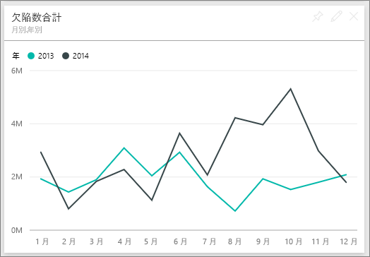  

    欠陥数量のこの増加が起因して、ダウンタイム (分) も同様に増加しているかどうかを確認してみましょう。  
2. 質問ボックスに「total downtime minutes by month and year as a line chart」(月別および年別ダウンタイム合計 (分) を折れ線グラフで表示) と入力します。  

   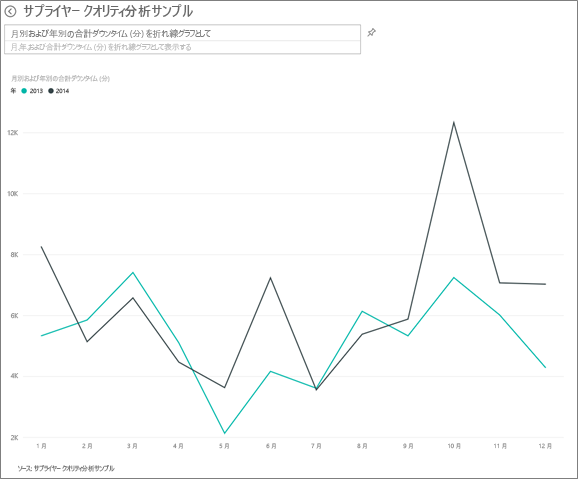

   6 月と 10 月にダウンタイム (分) が急増していますが、それ以外の月に関しては、欠陥数の急増に起因するダウンタイムの大幅増加はありません。 これは、欠陥の管理が行き届いていることを示します。  
3. このグラフをダッシュボードにピン留めするには、質問ボックスの右側にあるピン アイコン  を選びます。  
4. 外れ値のある月について調査するため、「total downtime minutes in October by plant」(10 月のプラント別ダウンタイム合計 (分)) などの質問を入力して、10 月のダウンタイム (分) を素材の種類、プラントの場所、カテゴリ別に調べます。    
5. 質問ボックスの左上隅にある戻る矢印  を選んで、ダッシュボードに戻ります。

これは、試してみるのに安全な環境です。 変更内容を保存しないようにいつでも選択できます。 一方、保存すると、常にこのサンプルの新しいコピーに対する **データの取り込み** に進むことができます。

## 次の手順: データへの接続
この記事を通じて、Power BI ダッシュボード、Q&A、レポートからサプライヤーの品質データへの洞察をどのように得られるかをご理解いただけたでしょうか。 次はあなたの番です。ご自分のデータを接続してみてください。 Power BI を使用すると、広範なデータ ソースに接続することができます。 詳細については、「[Power BI の概要](service-get-started.md)」をご覧ください。
