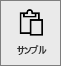
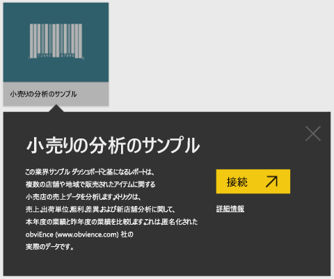
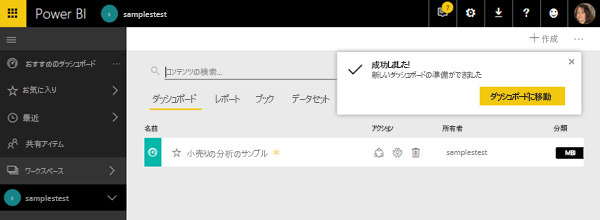
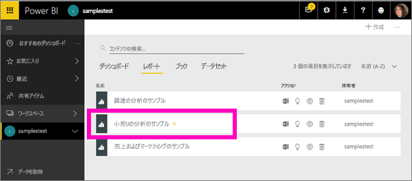
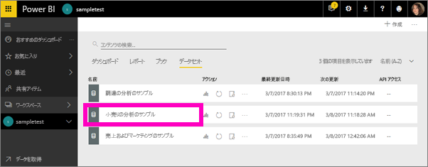
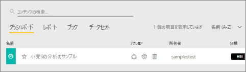
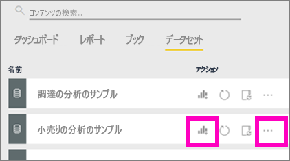
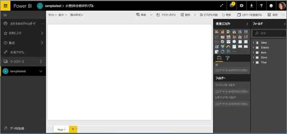

# Power BI サンプルのチュートリアル
<!-- Shared newnav Include -->
[!INCLUDE [newnavbydefault](./includes/newnavbydefault.md)]

最初に「[Power BI で使用できるサンプル データ](sample-datasets.md)」を読むことをお勧めします。 入手方法、保存場所、使用方法、各サンプルのストーリーなどがわかります。 基本的なことがわかったら、このチュートリアルに戻ってください。   

## このチュートリアルについて
このチュートリアルでは、サンプルのコンテンツ パックをインポートし、Power BI サービスに追加して、コンテンツを開く方法を説明します。 *コンテンツ パック*は、データセットにダッシュボードやレポートがバンドルされているタイプのサンプルです。 サンプル コンテンツ パックは、Power BI 内から **[データの取得]**を使って入手します。

> [!NOTE]
> このチュートリアルは Power BI サービスに適用され、Power BI Desktop には適用されません。
> 
> 

このチュートリアルで使う *小売の分析* のサンプル コンテンツ パックは、ダッシュボード、レポート、データセットで構成されています。
特定のコンテンツ パックとそのシナリオに慣れるには、始める前に、「[take a tour of the Retail Analysis sample](sample-retail-analysis.md)」 (Power BI の小売りの分析のサンプル: 使ってみる) を読んでください。

## データを取得する (この場合は、サンプル コンテンツ パックの取得)
1. Power BI サービス (app.powerbi.com) を開き、サインインします。
2. ワークスペースを選び、新しいダッシュボードを作成します。  
   
    
3. 名前は "**小売の分析のサンプル**" にします。
   
   
4. 左側のナビゲーション ウィンドウの下部にある **[データの取得]** を選択します。 **[データの取得]** が表示されていない場合は、 を選んでナビゲーション ウィンドウを展開してください。
   
   
5. **[サンプル]**を選択します。  
   
   
6. *[小売の分析のサンプル]* を選び、**[接続]** を選びます。   
   
   

## 実際にインポートされたもの
サンプル コンテンツ パックの場合、**[接続]** を選ぶと、Power BI はそのコンテンツ パックのコピーを実際に取り込んで、クラウドに格納します。 コンテンツ パックにはデータセット、レポート、ダッシュボードが含まれるので、**[接続]** をクリックするとそれらが取得されます。

1. Power BI は新しいダッシュボードを作成し、**[ダッシュボード]** タブの一覧に表示します。黄色のアスタリスクは、レポートが新しいことを示します。
   
   
2. **[レポート]** タブを開きます。"*小売りの分析のサンプル*" という名前の新しいレポートが表示されます。
   
   
   
   **[データセット]** タブをクリックします。新しいデータセットが表示されます。
   
   

## 新しいコンテンツを調べる
ダッシュボード、データセット、レポートを自分で調べてみてください。 ダッシュボード、レポート、データセット内の移動にはさまざまな方法があり、以下で説明するのはそのうちの 1 つだけです。  

> [!TIP]
> 最初に少し手助けが必要な場合は、  「[Power BI の小売りの分析のサンプル: 使ってみる](sample-retail-analysis.md)」でこのサンプルの詳細なチュートリアルをご覧ください。
> 
> 

1. **[ダッシュボード]** タブに戻り、"*小売りの分析のサンプル*" ダッシュボードを選んで開きます。    
   
   
2. ダッシュボードが開きます。  さまざまな視覚化タイルがあります。
   
   
3. タイルの 1 つを選び、基になるレポートを開きます。  この例では面グラフを選びます (前の図のピンクで囲まれた部分)。 その面グラフを含むページが開きます。
   
    
   
   > [!NOTE]
   > タイルが [Power BI Q&A](power-bi-q-and-a.md) を使って作成されている場合は、代わりに Q&A ページが開きます。
   > 
   > 
4. **[データセット]** タブに戻ると、データセットを調べるためのいくつかのオプションがあります。  それを開いてすべての行と列を表示することはできません (Power BI Desktop または Excel ではできます)。  同僚とコンテンツ パックを共有する作成者は、通常、分析情報の結果だけを共有し、同僚がデータに直接アクセスできるようにはしません。 ただし、これは同僚がデータセットを調べることができないという意味ではありません。  
   
   
   
   * データセットを調べる 1 つの方法は、独自の視覚化とレポートを一から作成することです。  グラフ アイコン  を選び、レポート編集モードでデータセットを開きます。
     
       
   * データセットを調べるもう 1 つの方法は、[クイック分析情報](service-insights.md)を実行することです。 省略記号 [...] を選び、**[詳細情報の取得]** を選びます。 詳細情報の準備ができたら、**[詳細情報を表示]** を選びます。
     
       

## 次の手順
[Power BI - 基本的な概念](service-basic-concepts.md)

[Power BI サービスのサンプル](sample-datasets.md)

[Power BI のデータ ソース](service-get-data.md)

他にわからないことがある場合は、 [Power BI コミュニティを利用してください](http://community.powerbi.com/)。

