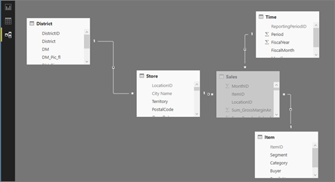

# Power BI のサンプル

最初に「[Power BI で使用できるサンプル データ](sample-datasets.md)」を読むことをお勧めします。 入手方法、保存場所、使用方法、各サンプルのストーリーなどがわかります。 基本的なことがわかったら、このチュートリアルに戻ってください。   

### 前提条件
このサンプルは、Power BI サービスでも Power BI Desktop でも利用できます。 作業を進めるには、小売りの分析のサンプルを開きます。

このチュートリアルで使う *小売の分析* のサンプル コンテンツ パックは、ダッシュボード、レポート、データセットで構成されています。
特定のコンテンツ パックとそのシナリオに慣れるには、始める前に、「[take a tour of the Retail Analysis sample](sample-retail-analysis.md)」 (Power BI の小売りの分析のサンプル: 使ってみる) を読んでください。

## このチュートリアルについて
このチュートリアルでは、 
- サンプル コンテンツ パックのインポートおよび Power BI サービスへの追加方法と、コンテンツの開き方について説明します。 *コンテンツ パック*は、データセットにダッシュボードやレポートがバンドルされているタイプのサンプルです。 
-  Power BI Desktop でのサンプル .pbix ファイルの開き方

## サンプルと Power BI サービス

1. Power BI サービス (app.powerbi.com) を開き、サインインします。
2. 左側のナビゲーション ウィンドウの下部にある **[データの取得]** を選択します。 **[データの取得]** が表示されていない場合は、を選んでナビゲーション ウィンドウを展開してください。
   
   ![[データの取得] アイコン](media/sample-tutorial-connect-to-the-samples/pbi_getdata.png)
5. **[サンプル]** を選択します。  
   
   ![[サンプル] ボタン](media/sample-tutorial-connect-to-the-samples/pbi_samplesdownload.png)
6. *[小売の分析のサンプル]* を選び、**[接続]** を選びます。   
   
   ![黄色の [接続] ボタン](media/sample-tutorial-connect-to-the-samples/pbi_retailanalysissampleconnect.png)

## 実際にインポートされたもの
サンプル コンテンツ パックの場合、**[接続]** を選ぶと、Power BI はそのコンテンツ パックのコピーを実際に取り込んで、クラウドに格納します。 コンテンツ パックにはデータセット、レポート、ダッシュボードが含まれるので、**[接続]** をクリックするとそれらが取得されます。 

1. Power BI は新しいダッシュボードを作成し、**[ダッシュボード]** タブの一覧に表示します。黄色のアスタリスクは、レポートが新しいことを示します。
   
   
2. **[レポート]** タブを開きます。"*小売りの分析のサンプル*" という名前の新しいレポートが表示されます。
   
   ![赤いボックスに囲まれた [小売りの分析のサンプル] と黄色のアスタリスク](media/sample-tutorial-connect-to-the-samples/power-bi-new-report.png)
   
   **[データセット]** タブをクリックします。新しいデータセットが表示されます。
   
   ![赤いボックスに囲まれた [小売りの分析のサンプル]](media/sample-tutorial-connect-to-the-samples/power-bi-new-dataset.png)

## 新しいコンテンツを調べる
ダッシュボード、データセット、レポートを自分で調べてみてください。 ダッシュボード、レポート、データセット内の移動にはさまざまな方法があり、以下で説明するのはそのうちの 1 つだけです。  

> [!TIP]
> 最初に少し手助けが必要な場合は、  「[Power BI の小売りの分析のサンプル: 使ってみる](sample-retail-analysis.md)」でこのサンプルの詳細なチュートリアルをご覧ください。
> 
> 

1. **[ダッシュボード]** タブに戻り、"*小売りの分析のサンプル*" ダッシュボードを選んで開きます。    
   
   ![[ダッシュボード] タブが選択されています](media/sample-tutorial-connect-to-the-samples/power-bi-dashboards.png)
2. ダッシュボードが開きます。  さまざまな視覚化タイルがあります。
   
   
3. タイルの 1 つを選び、基になるレポートを開きます。  この例では面グラフを選びます (前の図のピンクで囲まれた部分)。 その面グラフを含むページが開きます。
   
    
   
   > [!NOTE]
   > タイルが [Power BI Q&A](power-bi-q-and-a.md) を使って作成されている場合は、代わりに Q&A ページが開きます。 タイルを [Excel からピン留め](service-dashboard-pin-tile-from-excel.md)した場合は、Power BI 内で Excel Online が開きます。
   > 
   > 
1. **[データセット]** タブに戻ると、データセットを調べるためのいくつかのオプションがあります。  それを開いてすべての行と列を表示することはできません (Power BI Desktop または Excel ではできます)。  同僚とコンテンツ パックを共有する作成者は、通常、分析情報の結果だけを共有し、同僚がデータに直接アクセスできるようにはしません。 ただし、これは同僚がデータセットを調べることができないという意味ではありません。  
   
   
   
   * データセットを調べる 1 つの方法は、独自の視覚化とレポートを一から作成することです。  [グラフ] アイコンを選び、 ![[レポート] アイコン](media/sample-tutorial-connect-to-the-samples/power-bi-chart-icon4.png) レポート編集モードでデータセットを開きます。
     
       
   * データセットを調べるもう 1 つの方法は、[クイック分析情報](service-insights.md)を実行することです。 省略記号 [...] を選び、**[詳細情報の取得]** を選びます。 詳細情報の準備ができたら、**[詳細情報を表示]** を選びます。
     
       

## サンプルと Power BI Desktop 
サンプルの PBIX ファイルを初めて開くと、ファイルがレポート ビューで表示され、レポートの任意のページを視覚エフェクトを利用して検索、作成および変更できます。 [レポート] ビューには、Power BI サービスのレポートの編集ビューとほとんど同じデザイン機能が用意されています。 視覚化の移動、コピーと貼り付け、マージなどを行えます。

これらの相違点は、Power BI Desktop を使用すると、データのクエリとモデルを操作して、レポートでの最適な分析を支えるデータが確実に得られるようになることです。 その後、Power BI Desktop のファイルは、ローカルのドライブまたはクラウドに関係なく、お好みの場所に保存することができます。

1. [小売りの分析のサンプルの .pbix ファイル](http://download.microsoft.com/download/9/6/D/96DDC2FF-2568-491D-AAFA-AFDD6F763AE3/Retail%20Analysis%20Sample%20PBIX.pbix)を Power BI Desktop で開きます。 

    

1. ファイルがレポート ビューで開きます。 レポート エディターの下部に、タブが 4 つあることにお気付きですか。 このレポートには 4 ページあり、今は [New Stores]\(新しい店舗\) ページが選択されている状態です。 

    ![下部のタブと強調表示されている [New Stores] のクローズアップ](media/sample-tutorial-connect-to-the-samples/power-bi-sample-tabs.png).

3. レポート エディターの詳細については、[レポート エディターの紹介](service-the-report-editor-take-a-tour.md)に関するページをご覧ください。

## 実際にインポートされたもの
サンプルの PBIX ファイルを Desktop で開くと、Power BI は実際にそのデータのコピーを作成し、クラウドに保存します。 Desktop からはレポートおよび***基になるデータセット***にアクセスすることができます。 データが読み込まれるときに、Power BI Desktop はリレーションシップの検索および作成を試みます。  

1. テーブル アイコン を選択して[データ ビュー](desktop-data-view.md)に切り替えます。
 
    

    データ ビューは、Power BI Desktop モデル内のデータを検査、調査、理解するのに役立ちます。 これは、クエリ エディター内のテーブル、列、データの表示方法とは異なります。 データ ビューには、モデルに読み込まれた後のデータが表示されます。

    データをモデル化しているときに、レポート キャンバスにビジュアルを作成することなく、実際のテーブルまたは列の内容を行レベルまで確認したい場合があります。 これは、メジャーと計算列を作成している場合や、データ型またはデータのカテゴリを識別する必要に特に当てはまります。

1. アイコン  を選択して[リレーションシップ ビュー](desktop-relationship-view.md)に切り替えます。
 
    

    リレーションシップ ビューには、モデル内のすべてのテーブル、列、リレーションシップが表示されます。 ここからリレーションシップの表示、変更、および作成を行えます。

## 新しいコンテンツを調べる
データセット、リレーションシップ、レポートをご自身で調べてみてください。 概要については、[Desktop の概要ガイド](desktop-getting-started.md)に関するページをご覧ください。    

## 次の手順
[Power BI - 基本的な概念](service-basic-concepts.md)

[Power BI サービスのサンプル](sample-datasets.md)

[Power BI のデータ ソース](service-get-data.md)

他にわからないことがある場合は、 [Power BI コミュニティを利用してください](http://community.powerbi.com/)。

