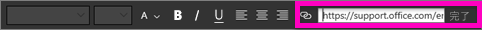
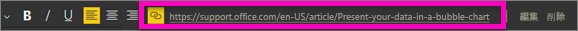

# レポートのテキスト ボックスへのハイパーリンクの追加
テキスト ボックスは、レポートに追加したり、レポートからダッシュボードにピン留めしたり、ダッシュボードに直接追加したりできます。 テキスト ボックスが存在する場所に関係なく、テキスト ボックスにハイパーリンクを追加することができます。  

> **注**: Power BI のテーブル内およびマトリックス内のハイパーリンクについては、「[テーブル内のハイパーリンク](power-bi-hyperlinks-in-tables.md)」をご覧ください。 **ダッシュボード**にテキスト ボックスを追加する方法ついては、「[ダッシュボードからタイルを直接追加する](service-dashboard-add-widget.md)」をご覧ください。 
> 
> 

<iframe width="560" height="315" src="https://www.youtube.com/embed/_3q6VEBhGew#t=0m55s" frameborder="0" allowfullscreen></iframe>

## レポートのテキスト ボックスにハイパーリンクを追加するには
1. [テキスト ボックスを作成し、テキストを追加します](power-bi-reports-add-text-and-shapes.md)。 
2. 既存のテキストを強調表示するか、ハイパーリンクとして使用する新しいテキストを追加します。
   
   
3. ハイパーリンク アイコン  を選びます。
4. ハイパーリンク フィールドに URL を入力するか貼り付け、 **[完了]** を選びます。
   
   
5. リンクをテストします。  
   
   
   
   * 強調表示されたテキストのどこかをカーソルでポイントして、URL を表示します。  
     
      
   * URL を選択して、新しいブラウザー ウィンドウでページを開きます。

## テキストは残してハイパーリンクのみを削除するには
1. テキスト ボックスでハイパーリンクを選択し、
   
     
2. **[削除]** を選択します。 

## 次の手順
[Power BI レポート内のテキスト ボックス](power-bi-reports-add-text-and-shapes.md)

他にわからないことがある場合は、 [Power BI コミュニティを利用してください](http://community.powerbi.com/)。

