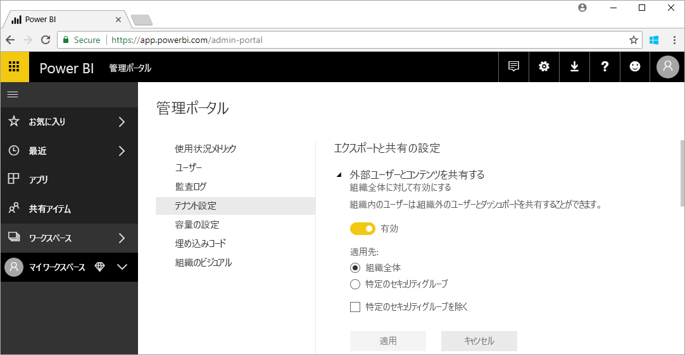

# Power BI 管理とは

Power BI 管理は、Power BI テナントの管理であり、ガバナンス ポリシー、利用状況の監視、およびライセンス、容量、組織のリソースのプロビジョニングを構成することが含まれます。 この記事では、管理ロール、タスク、およびツールの概要と、詳細を説明するリンクを示します。

Power BI は、セルフサービス ビジネス インテリジェンス用に設計されており、管理者は Power BI テナントのデータ、プロセス、およびポリシーの保護者になります。 Power BI 管理者は、BI 開発者、アナリスト、およびその他のロールのユーザーを含むチームのキー メンバーです。 管理者は、組織が重要な目標を確実に満たすためのサポートを支援できます。

- ユーザーが "_実際に_" 必要としている KPI とメトリックを理解する
- IT 主導の企業報告の配信時間を短縮する
- Power BI の採用とデプロイの投資収益率を上げる

管理者の仕事は、ビジネス ユーザーの生産性を向上させることと、セキュリティと法令への遵守を保証することです。 責任にはヘルプとサポートが含まれることがあり、多くの場合、ビジネス ユーザーが適切な行動をするための手助けをします。

## Power BI に関連する管理者ロール

Power BI 管理に関連するいくつかのロールがあります。それらを次の表に示します。

| **管理者の種類** | **管理者のスコープ** | **Power BI のスコープ** |
| --- | --- | --- |
| Office 365 全体管理者 | Office 365 | Power BI テナントとその他のサービスのすべての側面を管理できます。 |
| Office 365 課金管理者 | Office 365 | Office 365 サブスクリプションを通して Power BI ライセンスを取得できます。 |
| Power BI サービス管理者 | Power BI テナント | Power BI テナントとその管理機能を完全に制御できます (ライセンス以外)。 |
| Power BI Premium 容量管理者 | 単一の Premium 容量 | Premium 容量とその管理機能を完全に制御できます。 |
| Power BI Embedded 容量管理者 | 単一の Embedded 容量 | Embedded 容量とその管理機能を完全に制御できます。 |

Office 365 または Azure Active Directory の全体管理者は、Power BI の管理者権限を持っています。 Office 365 の全体管理者は、他のユーザーを Power BI サービス管理者ロールに割り当てることができます。この割り当てでは、Power BI の機能に対する管理権限のみが付与されます。

Power BI サービス管理者は、機能、セキュリティ、および監視に関するさまざまなテナント レベルの設定を含む Power BI 管理ポータルにアクセスできます。 サービス管理者は、Power BI テナントのすべてのリソースにフル アクセスできます。 ほとんどの場合、サービス管理者は、問題を識別した後、リソースの所有者とともにフォローアップを行って是正措置を取ります。

Power BI サービス管理者ロールは、Office 365 でのユーザーへのライセンスの割り当てや監査ログの表示機能は付与しません。 そのため、Power BI 管理タスクは、現時点では、Power BI サービス管理者ロールのメンバーのみであるユーザーは実行できません。

## 管理タスク

管理者は、組織の Power BI テナントをサポートするために多くのタスクを実行します。これらを次の表に示します。

| **タスク領域** | **一般的なタスク** |
| --- | --- |
| Power BI テナントを管理する |<ul><li>主要な Power BI 機能を有効または無効にする <li>使用状況とパフォーマンスに関してレポートする <li>イベントの監査をレビューして管理する</ul>|
| Power BI ライセンスを取得して割り当てる |<ul><li>ユーザーのサインアップを管理する <li>Pro のライセンスを購入して割り当てる <li>ユーザーによる Power BI へのアクセスをブロックする</ul>|
| Premium 容量を管理する |<ul><li>Premium 容量を取得して操作する <li>サービスの品質を確保する|
| Embedded 容量を管理する |<ul><li>Embedded 容量を取得して ISV と開発者が Power BI の機能を簡単に使用できるようにする</ul>|
| 内部ポリシー、法律、および規制に対するコンプライアンスを保証する | <ul><li>ビジネス データの分類を管理する <li>コンテンツの発行と共有ポリシーの適用を支援する</ul>|
| Power BI Premium を管理する |<ul><li>ワークスペースを管理する <li>カスタム ビジュアルを発行する <li>Power BI を他のアプリケーションに埋め込むために使用されるコードを検証する|
| テナントのユーザーにヘルプとサポートを提供する |<ul><li>データ アクセスとその他の問題をトラブルシューティングする</ul>|
| その他のタスク |<ul><li>Power BI Desktop をデプロイする (例: System Center Configuration Manager を使用する) <li>Intune で Power BI モバイル アプリのデプロイを管理する <li>ソース データのセキュリティなどのデータのプライバシーとセキュリティを管理する</ul>|

## 管理ツール

Power BI 管理に関連するいくつかのツールがあります。それらを次の表に示します。 通常、管理者は、ほとんどの時間を Power BI 管理ポータルで費やし、必要に応じて他のツールを使用します。

| **ツール** | **一般的なタスク** |
| --- | --- |
| Power BI 管理ポータル |<ul><li>ユーザーによる Power BI へのアクセスをブロックする <li>Premium 容量を取得して操作する <li>サービスの品質を確保する <li>ビジネス データの分類を管理する <li>コンテンツの発行と共有ポリシーの適用を支援する <li>ワークスペースを管理する <li>カスタム ビジュアルを発行する <li>Power BI を他のアプリケーションに埋め込むために使用されるコードを検証する <li>データ アクセスとその他の問題をトラブルシューティングする</ul>|
| Office 365 管理センター |<ul><li>ユーザーのサインアップを管理する <li>Pro のライセンスを購入して割り当てる</ul>|
| Office 365 セキュリティ/コンプアライアンス センター |<ul><li>イベントの監査をレビューして管理する</ul>|
| Azure Portal の Azure Active Directory (AAD) |<ul><li>AAD 経由の Power BI リソースへの条件付きアクセスを構成する <li>Power BI Embedded 容量をプロビジョニングする</ul>|
| PowerShell コマンドレット |<ul><li>スクリプトによってワークスペースと Power BI のその他の側面を管理する</ul>|
| 管理 API |<ul><li>Power BI 管理者の作業を容易にするカスタム管理ツールをビルドする。たとえば、Power BI Desktop はこれらの API を使用して、管理に関連するデータに基づくレポートを作成できる</ul>|

## 次の手順

この記事では、Power BI 管理者の仕事と、関連する特定のロール、タスク、およびツールの概要を説明しました。 次の 2 つのトピックを参照して、理解を深めることをお勧めします。

[Power BI 管理ポータルを使用する](service-admin-portal.md)

[Power BI 管理のよく寄せられる質問](service-admin-faq.md)

他にわからないことがある場合は、 [Power BI コミュニティで質問してみてください](http://community.powerbi.com/)。

