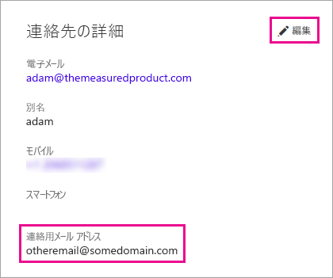

# <a name="using-an-alternate-email-address"></a>代替メール アドレスの使用
既定では、Power BI へのサインアップに使用するメール アドレスを使用して、Power BI のアクティビティに関する更新情報をユーザーに送信します。  たとえば、他のユーザーから送信される共有の招待は、このアドレスに配信されます。

最初に Power BI にサインアップしたときに使用したメール アドレスとは別の代替メール アドレスに、これらのメールを配信させることができます。

## <a name="updating-through-office-365-personal-info-page"></a>Office 365 の個人情報ページからの更新
1. [Office 365 の個人情報ページ](https://portal.office.com/account/#personalinfo)に移動します。  プロンプトが表示されたら、Power BI で使用しているメール アドレスとパスワードを使ってサインインします。
2. [連絡先の詳細] セクションにある [編集] リンクをクリックします。  
   
   > [!NOTE]
   > [編集] リンクが表示されない場合、お使いのメール アドレスは Office 365 管理者によって管理されているため、管理者に連絡を取ってメール アドレスを更新する必要があります。
   > 
   > 
   
   
3. [代替メール] フィールドに、Power BI の更新情報の宛先メール アドレスを入力します。

> [!NOTE]
> この設定を変更しても、サービスの更新情報、ニュースレター、およびその他のプロモーション用通信の送信に使用されるメール アドレスは変わりません。  これらのメールは常に、最初に Power BI に登録したときに使用したメール アドレスに送信されます。
> 
> 

## <a name="updating-through-azure-active-directory"></a>Azure Active Directory からの更新
Power BI の Azure Active Directory (AAD) 埋め込みトークンをキャプチャするときは、3 種類のメールを使うことができます。 次の 3 種類です。

* ユーザーの AAD アカウントに関連付けられている主なメール アドレス
* UserPrincipalName (UPN) メール アドレス
* "その他" のメール アドレス配列属性

Power BI は、次の条件に基づいて、使うメール アドレスを選びます。
1.  AAD テナントのユーザー オブジェクトにメール属性が存在する場合、Power BI はそのメール属性をメール アドレスに使います
2.  UPN メールが **\*.onmicrosoft.com** ドメイン メール アドレス ("\@" 記号の後の情報) では "*ない*" 場合、Power BI はそのメール属性をメール アドレスに使います
3.  AAD ユーザー オブジェクトに "他の" メール配列属性が存在する場合、そのリストの最初のメール (この属性にはメールのリストが存在する可能性があるため) が使われます
4. 上記のどの条件も存在しない場合は、UPN アドレスが使われます

## <a name="updating-with-powershell"></a>PowerShell での更新
もう 1 つの方法として、Azure Active Directory の PowerShell を使って代替メール アドレスを更新することもできます。 それには [Set-AzureADUser](https://docs.microsoft.com/powershell/module/azuread/set-azureaduser) コマンドを使います。

```
Set-AzureADUser -ObjectId john@contoso.com -OtherMails "otheremail@somedomain.com"
```

詳しくは、「[Azure Active Directory PowerShell Version 2](https://docs.microsoft.com/powershell/azure/active-directory/install-adv2)」(Azure Active Directory PowerShell バージョン 2) をご覧ください。

他にわからないことがある場合は、 [Power BI コミュニティを利用してください](http://community.powerbi.com/)。

