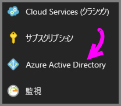
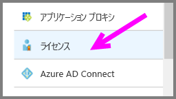
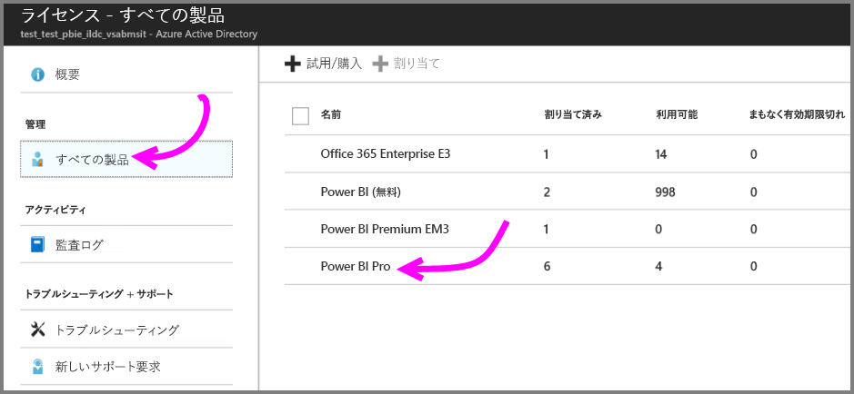
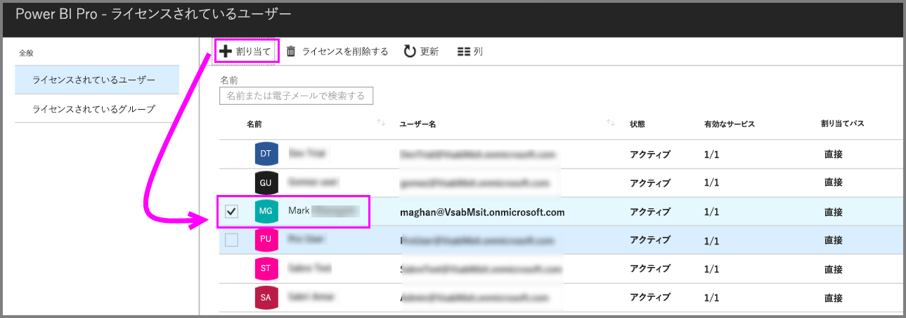

# クイック スタート: Azure でPower BI Pro ライセンスを割り当てる

Power BI Pro は、Power BI サービスのすべてのコンテンツと機能へのアクセスを許可する個別のライセンスであり、他の Pro ユーザーとコンテンツを共有して共同で作業するための機能が含まれています。 Pro ユーザーだけが、アプリ ワークスペースに対するコンテンツの発行と使用、ダッシュボードの共有、ダッシュボードとレポートのサブスクライブを行うことができます。 この記事では、Azure で Power BI Pro ライセンスを割り当てる方法について説明します。 [Office 365 でライセンスを割り当てる](service-admin-assigning-power-bi-pro-licenses.md)こともできます。

## 前提条件

Power BI が Active Directory 参照で使用する Azure サブスクリプションの所有者である必要があります。

開始する前に、[少なくとも 1 つのライセンスを購入する](service-admin-purchasing-power-bi-pro.md)必要があります。

## 個々のユーザー アカウントにライセンスを割り当てる

次の手順に従って、個々のユーザー アカウントに Power BI Pro ライセンスを割り当てます。

1. [Azure Portal](https://ms.portal.azure.com/#@microsoft.onmicrosoft.com/dashboard/private/39bc3cf7-31a4-43f6-954c-f2d69ca2f0) を開きます。 

2. 左側のナビゲーション バーで、**[Azure Active Directory]** を選択します。

    

3. **[Azure Active Directory]** で、**[ライセンス]** を選択します。

    

4. **[ライセンス]** で、**[すべての製品]** を選択します。次に **[Power BI Pro]** を選択して、ライセンス ユーザーの一覧を表示します。

    

5. **[割り当て]** を選択して、Power BI Pro ライセンスをユーザー アカウントに追加します。

    

## 次の手順

ライセンスの割り当てが終わりました。Power BI Pro の詳細を確認してください。

[組織内の Power BI Pro](service-admin-power-bi-pro-in-your-organization.md)

[サインインした Power BI ユーザーを見つける](service-admin-access-usage.md)

他にわからないことがある場合は、 [Power BI コミュニティで質問してみてください](https://community.powerbi.com/)。