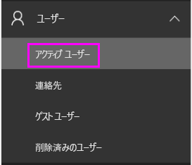
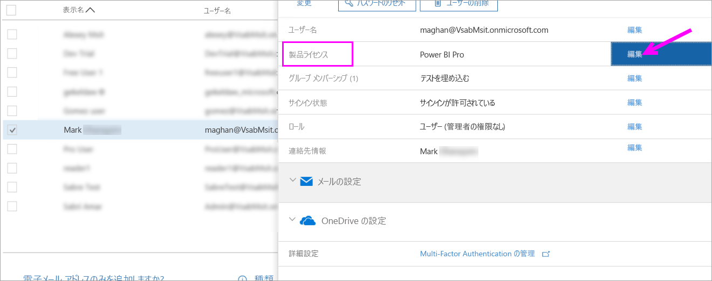
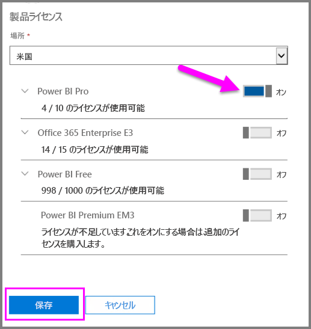
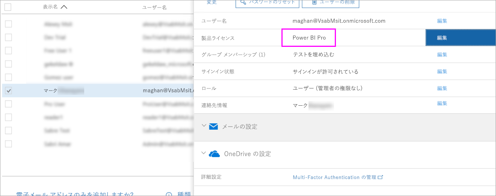

# クイックスタート: Office 365 でPower BI Pro ライセンスを割り当てる

Power BI Pro は、Power BI サービスのすべてのコンテンツと機能へのアクセスを許可する個別のライセンスであり、他の Pro ユーザーとコンテンツを共有して共同で作業するための機能が含まれています。 Pro ユーザーだけが、アプリ ワークスペースに対するコンテンツの発行と使用、ダッシュボードの共有、ダッシュボードとレポートのサブスクライブを行うことができます。 この記事では、Office 365 で Power BI Pro ライセンスを割り当てる方法について説明します。 [Azure でライセンスを割り当てる](service-admin-assigning-power-bi-pro-licenses-azure.md)こともできます。

## 前提条件

Office 365 で[**全体管理者**ロールまたは**ユーザー アカウント管理者**](https://support.office.com/article/about-office-365-admin-roles-da585eea-f576-4f55-a1e0-87090b6aaa9d?ui=en-US&rs=en-US&ad=US) ロールのメンバーである必要があります。

開始する前に、[少なくとも 1 つのライセンスを購入する](service-admin-purchasing-power-bi-pro.md)必要があります。

## 個々のユーザー アカウントにライセンスを割り当てる

次の手順に従って、個々のユーザー アカウントに Power BI Pro ライセンスを割り当てます。

1. [Office 365 管理センター](https://portal.office.com/adminportal/home#/homepage)を開きます。

2. 左側のナビゲーション ウィンドウで、**[ユーザー]** を展開し、**[アクティブ ユーザー]** を選択します。

    

3. ユーザーを選択し、**[製品ライセンス]** で **[編集]** を選択します。

    

4. **[Power BI Pro]** で、設定を **[オン]** に切り替え、**[保存]** を選択します。

    

5. 選択したアカウントの **[状態]** で、Power BI Pro ライセンスが正常に割り当てられていることを確認します。

    

## 次の手順

ライセンスの割り当てが終わりました。Power BI Pro の詳細を確認してください。

[組織内の Power BI Pro](service-admin-power-bi-pro-in-your-organization.md)

[サインインした Power BI ユーザーを見つける](service-admin-access-usage.md)

他にわからないことがある場合は、 [Power BI コミュニティで質問してみてください](https://community.powerbi.com/)。