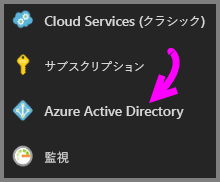
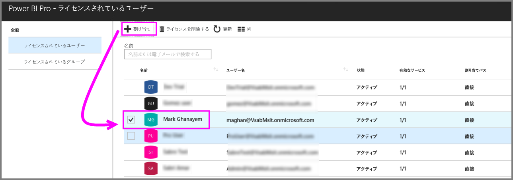
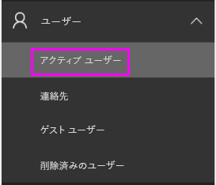
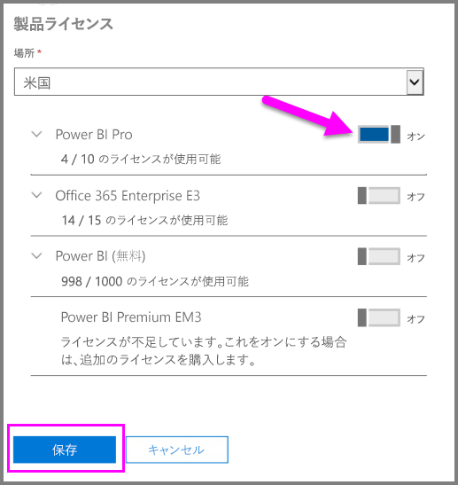
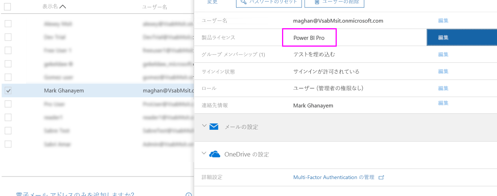

# Power BI Pro ライセンスの割り当て

管理者は、ユーザーに Power BI Pro ライセンスを割り当てる際に、さまざまな管理ポータルと PowerShell コマンドレットから選択することができます。 Power BI ライセンスの管理は、Azure Active Directory (Azure AD) でバックアップされています。

* Azure サブスクリプションの所有者は、[Azure Portal](https://ms.portal.azure.com/#@microsoft.onmicrosoft.com/dashboard/private/39bc3cf7-31a4-43f6-954c-f2d69ca2f0) で Azure Active Directory ブレードを使用することができます。 

* グローバル管理者とユーザー アカウント管理者は、[Office 365 管理センター](https://portal.office.com/AdminPortal/Home#/homepage)を使用できます。

## Azure Portal での Power BI Pro ライセンスの管理

Power BI では、基本サービスとして Azure AD を使用します。 Azure AD には、ユーザーのアカウントとグループが格納され、購入済みの製品に関する情報など、他の設定も格納されます。

### 個々のユーザー アカウントへのライセンスの割り当て

Azure サブスクリプションの所有者である場合は、以下の手順に従って、個々のユーザー アカウントに Pro ライセンスを割り当てます。

1. [Azure Portal](https://ms.portal.azure.com/#@microsoft.onmicrosoft.com/dashboard/private/39bc3cf7-31a4-43f6-954c-f2d69ca2f0) に移動します。 

2. 左側のナビゲーション バーで、Azure Active Directory をクリックします。

    

3. Azure Active Directory ブレードで、[ライセンス] をクリックします。

    

4. [ライセンス] ブレードで、[すべての製品] をクリックしてから、[Power BI Pro] をクリックしてライセンス ユーザーのリストを表示します。

    

5. [割り当て] をクリックして、Power BI Pro ライセンスを追加のユーザー アカウントに追加します。

    

> [!NOTE]
> ライセンスのほとんどの側面を管理できますが、Azure Portal で Power BI Pro ライセンスを購入することはできません。 Power BI Pro サブスクリプションを購入するには、Office 365 管理センターを使用します。 詳しくは、「[Power BI Pro を購入する](https://docs.microsoft.com/en-us/power-bi/service-admin-purchasing-power-bi-pro)」をご覧ください。
>

## Office 365 管理センターでの Power BI Pro ライセンスの管理

グローバル管理者である場合は、Office 365 管理センターで、Power BI Pro サブスクリプションを購入し、組織用の関連するライセンスを管理します。

Office 365 管理者である場合は、以下の手順に従って、個々のユーザー アカウントに Pro ライセンスを割り当てます。

1. Office 365 管理センターに移動します。

2. 左側のナビゲーション ウィンドウで、[ユーザー] を展開し、[アクティブ ユーザー] をクリックします。

    

3. 1 つまたは複数のユーザーを選択してから、製品ライセンスの [編集] をクリックします。

    

4. Power BI Pro で、設定をオンに切り替えてから [保存] をクリックします。

    

5. 選択したアカウントの [状態] で、Power BI Pro ライセンスが正常に割り当てられていることを確認します。

    

> [!NOTE]
> サブスクリプションのライセンスがない場合は、左側のナビゲーション ウィンドウで [課金] を展開し、[サブスクリプション] をクリックして追加します。 [サブスクリプション] ページで、Power BI Pro のサブスクリプションを選択してから [ライセンスの追加/削除] をクリックします。
>

## 次の手順
[組織内の Power BI Pro](service-admin-power-bi-pro-in-your-organization.md)
 
[Extended Pro Trial のアクティブ化](service-extended-pro-trial.md)
 
[個々のユーザーに対する Power BI サービス契約](https://powerbi.microsoft.com/terms-of-service/)
 
[Power BI Premium に関するお知らせ](https://aka.ms/pbipremium-announcement)
 
[サインインした Power BI ユーザーを見つける](service-admin-access-usage.md)

他にわからないことがある場合は、 [Power BI コミュニティで質問してみてください](https://community.powerbi.com/)。