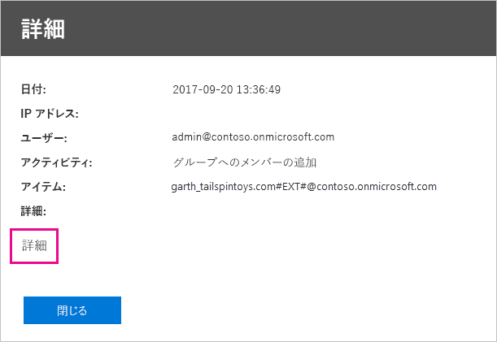

# <a name="using-auditing-within-your-organization"></a>組織内での監査の使用

Power BI テナント内で、だれがどの項目にどのようなアクションを実行しているかを把握することは、組織が法令順守やレコード管理などの要件を満たすうえで非常に重要です。 Power BI の監査を使用して、"レポートの表示" や "ダッシュボードの表示" など、ユーザーによって実行されるアクションを監査します。 監査を使用してアクセス許可を監査することはできません。

Office 365 セキュリティ/コンプアライアンス センターで監査を使用するか、PowerShell を使用します。 この記事では両方について説明します。 監査データは、日付範囲、ユーザー、ダッシュボード、レポート、データセット、アクティビティの種類によってフィルター処理できます。 アクティビティを csv (コンマ区切り値) ファイルとしてダウンロードし、オフラインで分析することもできます。

## <a name="requirements"></a>要件

監査ログにアクセスするには、次の要件を満たしている必要があります。

- Office 365 セキュリティ/コンプライアンス センターの監査セクションにアクセスするには、Exchange Online のライセンスが必要です (Office 365 Enterprise E3 および E5 サブスクリプションに含まれます)。

- グローバル管理者であるか、監査ログへのアクセス権を持つ Exchange 管理ロールを持っている必要があります。 Exchange 管理ロールは、Exchange 管理センターによって制御されます。 詳細については、「[Exchange Online のアクセス許可](/exchange/permissions-exo/permissions-exo/)」をご覧ください。

- 監査ログへのアクセス権はあっても、グローバル管理者または Power BI サービスの管理者ではない場合は、Power BI 管理ポータルにアクセスできません。 この場合、[Office 365 セキュリティ/コンプライアンス センター](https://sip.protection.office.com/#/unifiedauditlog)への直接リンクが必要です。

- テナント内で Power BI の監査ログを表示するには、テナント内に少なくとも 1 つの Exchange メールボックス ライセンスが必要です。

## <a name="accessing-your-audit-logs"></a>監査ログへのアクセス

ログにアクセスするには、まず Power BI でログ記録が有効になっていることを確認します。 詳細については、管理ポータルに関するドキュメント内の「[監査ログ](service-admin-portal.md#audit-logs)」をご覧ください。 監査を有効にしてから監査データを表示できるようになるまで、最大で 48 時間の遅延が発生する場合があります。 データがすぐに表示されない場合は、後で、監査ログを確認してください。 監査ログの表示アクセス許可を取得してからログにアクセスできるようになるまでにも、同様の遅延が発生する場合があります。

Power BI 監査ログは、[Office 365 セキュリティ/コンプアライアンス センター](https://sip.protection.office.com/#/unifiedauditlog)を通して直接利用できます。 また、Power BI 管理ポータルからのリンクもあります。

1. Power BI で、右上にある**歯車アイコン**を選択してから、**[管理ポータル]** を選択します。

   

1. **[監査ログ]** を選びます。

1. **[O365 管理センターに移動]** を選択します。

   

管理者以外のアカウントに監査ログへのアクセス許可を与えるには、Exchange Online 管理センター内でアクセス許可を割り当てる必要があります。 たとえば、Organization Management などの既存の役割グループにユーザーを割り当てたり、監査ログの役割を持つ新しい役割グループを作成したりできます。 詳細については、「[Exchange Online のアクセス許可](/exchange/permissions-exo/permissions-exo/)」をご覧ください。

## <a name="search-only-power-bi-activities"></a>Power BI のアクティビティのみを検索する

次の手順に従って、検索結果を Power BI のアクティビティのみに制限します。 アクティビティの一覧については、この記事の後半にある「[Power BI の監査対象アクティビティの一覧](#list-of-activities-audited-by-power-bi)」をご覧ください。

1. **[監査ログの検索]** ページで、**[検索]** の下にある **[アクティビティ]** のドロップ ダウンを選択します。

2. **[Power BI アクティビティ]** を選択します。

   

3. 選択ボックスの外側の任意の場所を選択して、ボックスを閉じます。

これで、Power BI 以外のアクティビティは検索結果からフィルターで除外されます。

## <a name="search-the-audit-logs-by-date"></a>監査ログを日付で検索する

**[開始日]** フィールドと **[終了日]** フィールドを使用して、指定した日付範囲のログを検索することができます。 既定では過去 7 日間が選択されています。 日付と時刻は世界協定時刻 (UTC) 形式で表示されます。 指定できる日付範囲は最大 90 日です。 

選択した日付範囲が 90 日間よりも大きい場合は、エラーが表示されます。 最大の日付範囲である 90 日を使用する場合は、**[開始日]** として現在の時刻を選択してください。 そうしないと、開始日が終了日より前であるというエラーが表示されます。 過去 90 日間に監査を有効にしている場合、監査を有効にした日付より前から日付範囲を開始することはできません。


## <a name="search-the-audit-logs-by-users"></a>監査ログをユーザーで検索する

特定のユーザーが実行したアクティビティの監査ログ エントリを検索できます。 これを行うには、**[ユーザー]** フィールドに 1 つまたは複数のユーザー名を入力します。 ユーザー名は電子メール アドレスに似ています。これはユーザーが Power BI にログインするために使用したアカウントです。 このボックスを空白のままにすると、組織のすべてのユーザー (およびサービス アカウント) のエントリが返されます。


## <a name="view-search-results"></a>検索結果を表示する

**[検索]** を選択すると、検索結果が読み込まれ、しばらくしてから **[結果]** の下に表示されます。 検索の完了後、見つかった検索結果の件数が表示されます。 最大 1,000 件のイベントが表示されます。条件を満たすイベントが 1,000 件を超える場合は、新しい方から 1,000 件のイベントが表示されます。

### <a name="view-the-main-results"></a>主要な結果を表示する

**[結果]** 領域には、検索で取得されたイベントごとの次の情報が含まれます。 検索結果を並べ替えるには、**[結果]** の下の列ヘッダーを選択します。

| **列** | **定義** |
| --- | --- |
| 日付 |イベント発生時の日付と時刻 (UTC 形式)。 |
| IP アドレス |アクティビティが記録されたときに使用されていたデバイスの IP アドレス。 IP アドレスは IPv4 または IPv6 のアドレス形式で表示されます。 |
| ユーザー |イベント発生のトリガーとなったアクションを実行したユーザー (またはサービス アカウント)。 |
| アクティビティ |ユーザーが実行したアクティビティ。 この値は、**[アクティビティ]** ドロップ ダウン リストから選択したアクティビティに対応します。 Exchange 管理の監査ログに記録されるイベントの場合、この列の値は Exchange コマンドレットです。 |
| 項目 |対応するアクティビティの結果として作成または変更されたオブジェクト。 たとえば、表示または変更されたファイルや、更新されたユーザー アカウントなどです。 すべてのアクティビティにこの列の値があるとは限りません。 |
| 詳細 |アクティビティに関する追加情報。 この列の値も、すべてのアクティビティにあるとは限りません。 |

### <a name="view-the-details-for-an-event"></a>イベントの詳細を表示する

検索結果の一覧でイベント レコードをクリックすると、イベントの詳細を表示できます。 イベント レコードの詳しいプロパティを示す **[詳細]** ページが表示されます。 表示されるプロパティは、イベントが発生した Office 365 サービスによって異なります。 

これらの詳細を表示するには、**[詳細情報]** を選択します。 Power BI エントリの RecordType プロパティの値は、すべて 20 です。 その他のプロパティについて詳しくは、[監査ログのプロパティの詳細](/office365/securitycompliance/detailed-properties-in-the-office-365-audit-log/)に関する記事をご覧ください。

   

## <a name="export-search-results"></a>検索結果をエクスポートする

Power BI 監査ログを csv ファイルにエクスポートするには、次の手順に従います。

1. **[結果のエクスポート]** を選択します。

1. **[Save loaded results]** (読み込み済み結果を保存) または **[Download all results]** (すべての結果をダウンロード) のいずれかを選択します。

    

## <a name="use-powershell-to-search-audit-logs"></a>PowerShell を使用して監査ログを検索する

PowerShell を使用し、自分のログインに基づいて監査ログにアクセスすることもできます。 次の例は、[Search-UnifiedAuditLog](/powershell/module/exchange/policy-and-compliance-audit/search-unifiedauditlog?view=exchange-ps/) コマンドを使用して Power BI 監査ログのエントリを取得する方法を示しています。

[New-PSSession](/powershell/module/microsoft.powershell.core/new-pssession/) コマンドを使うには、アカウントに Exchange Online ライセンスが割り当てられていて、テナントの監査ログにアクセスできる必要があります。 Exchange Online に接続する方法の詳細については、「[リモート PowerShell による Exchange への接続](/powershell/exchange/exchange-online/connect-to-exchange-online-powershell/connect-to-exchange-online-powershell/)」をご覧ください。

```powershell
Set-ExecutionPolicy RemoteSigned

$UserCredential = Get-Credential

$Session = New-PSSession -ConfigurationName Microsoft.Exchange -ConnectionUri https://outlook.office365.com/powershell-liveid/ -Credential $UserCredential -Authentication Basic -AllowRedirection

Import-PSSession $Session
Search-UnifiedAuditLog -StartDate 9/11/2018 -EndDate 9/15/2018 -RecordType PowerBI -ResultSize 1000 | Format-Table | More
```

監査ログと共に PowerShell を使用する別の例としては、「[Using Power BI audit log and PowerShell to assign Power BI Pro licenses](https://powerbi.microsoft.com/blog/using-power-bi-audit-log-and-powershell-to-assign-power-bi-pro-licenses/)」(Power BI 監査ログと PowerShell を使って Power BI Pro のライセンスを割り当てる) をご覧ください。

## <a name="activities-audited-by-power-bi"></a>Power BI の監査対象アクティビティ

次のアクティビティは Power BI によって監査されます。

* AddDatasourceToGateway
* AddGroupMembers
* AnalyzedByExternalApplication
* AnalyzeInExcel
* AttachDataflowStorageAccount
* BindToGateway
* ChangeCapacityState
* ChangeGatewayAdministrators
* ChangeGatewayDatasourceUsers
* CreateApp
* CreateDashboard
* CreateDataflow
* CreateDataset
* CreateEmailSubscription
* CreateFolder
* CreateGateway
* CreateGroup
* CreateOrgApp
* CreateReport
* DeleteComment
* DeleteDashboard
* DeleteDataflow
* DeleteDataset
* DeleteEmailSubscription
* DeleteFolder
* DeleteGateway
* DeleteGroup
* DeleteGroupMembers
* DeleteOrgApp
* DeleteReport
* DownloadReport
* EditDataset
* EditReport
* ExportDataflow
* ExportReport
* ExportTile
* GenerateDataflowSasToken
* GenerateEmbedToken
* GetDatasources
* インポート
* InstallApp
* MigrateWorkspaceIntoCapacity
* OptInForProTrial
* PostComment
* PrintDashboard
* PrintReport
* PublishToWebReport
* RefreshDataset
* RemoveDatasourceFromGateway
* RemoveWorkspacesFromCapacity
* RenameDashboard
* SetAllConnections
* SetScheduledRefresh
* SetScheduledRefreshOnDataflow
* ShareDashboard
* ShareReport
* TakeOverDataset
* TakeOverDatasource
* UnpublishApp
* UpdateApp
* UpdateCapacityAdmins
* UpdateCapacityDisplayName
* UpdateCapacityResourceGovernanceSettings
* UpdateCapacityUsersAssignment
* UpdatedAdminFeatureSwitch
* UpdateDataflow
* UpdateDatasetParameters
* UpdateDatasourceCredentials
* UpdateDatasources
* UpdateEmailSubscription
* UpdateFolder
* UpdateFolderAccess
* ViewDashboard
* ViewDataflow
* ViewReport
* ViewTile
* ViewUsageMetrics

## <a name="next-steps"></a>次の手順

[Power BI 管理とは](service-admin-administering-power-bi-in-your-organization.md)  

[Power BI 管理ポータル](service-admin-portal.md)  

他にわからないことがある場合は、 [Power BI コミュニティで質問してみてください](http://community.powerbi.com/)。
