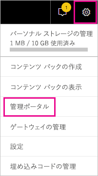
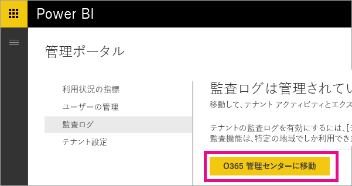
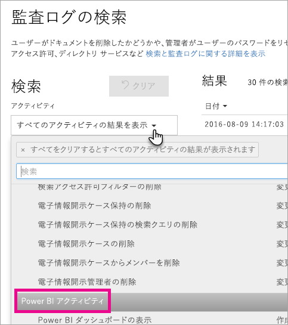
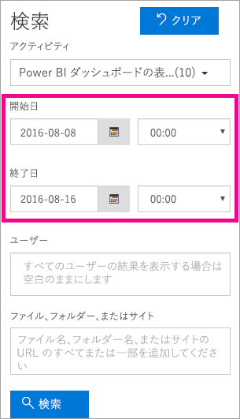
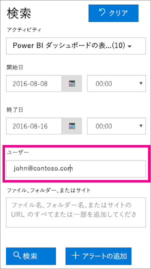
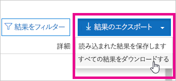

# <a name="using-auditing-within-your-organization"></a>組織内での監査の使用

Power BI で監査を使用して実行されたアクションを監視および調査する方法を説明します。 セキュリティ/コンプライアンス センターまたは PowerShell を使用できます。

Power BI テナント内で、だれがどの項目にどのようなアクションを実行しているかを把握することは、組織が法令順守やレコード管理などの要件を満たすうえで非常に重要です。 Power BI の監査を使用すると、"レポートの表示" や "ダッシュボードの表示" など、ユーザーによって実行されたアクションを監査することができます。 監査を使用してアクセス許可を監査することはできません。 

監査データは、日付範囲、ユーザー、ダッシュボード、レポート、データセット、アクティビティの種類によってフィルター処理できます。 アクティビティを csv (コンマ区切り値) ファイルとしてダウンロードし、オフラインで分析することもできます。

## <a name="requirements"></a>要件
監査ログにアクセスするには、次の要件を満たしている必要があります。

- Office 365 セキュリティ/コンプライアンス センターの監査セクションにアクセスするには、Exchange Online のライセンスが必要です (Office 365 Enterprise E3 および E5 サブスクリプションに含まれます)。

- グローバル管理者であるか、監査ログへのアクセス権を持つ Exchange 管理ロールを持っている必要があります。 Exchange 管理ロールは、Exchange 管理センターによって制御されます。 詳細については、「[Exchange Online のアクセス許可](https://technet.microsoft.com/library/jj200692(v=exchg.150).aspx)」をご覧ください。

- 監査ログへのアクセス権はあっても、グローバル管理者または Power BI サービスの管理者ではない場合は、Power BI 管理ポータルにアクセスできません。 この場合、Office 365 セキュリティ/コンプライアンス センターへの直接リンクが必要です。

- テナント内で Power BI の監査ログを表示するには、テナント内に少なくとも 1 つの Exchange メールボックス ライセンスが必要です。

## <a name="accessing-your-audit-logs"></a>監査ログへのアクセス

Power BI のログを監査するには、O365 セキュリティ/コンプライアンス センターにアクセスします。

監査を有効にしてから監査データを表示できるようになるまで、最大で 48 時間の遅延が発生する場合があります。 データがすぐに表示されない場合は、後で、監査ログを確認してください。 監査ログの表示アクセス許可を取得してからログにアクセスできるようになるまでにも、同様の遅延が発生する場合があります。

1. 右上の**歯車アイコン**を選択します。

2. **[管理ポータル]** を選択します。
   
   

3. **[監査ログ]** を選びます。
 
4. **[O365 管理センターに移動]** を選択します。
   
   

または、[Office 365 | セキュリティ/コンプライアンス](https://protection.office.com/#/unifiedauditlog)に移動します。

監査ログへのアクセス権を持つ管理者以外のアカウントを提供するには、Exchange Online 管理センター内でアクセス許可を割り当てる必要があります。 たとえば、Organization Management などの既存の役割グループにユーザーを割り当てたり、監査ログの役割を持つ新しい役割グループを作成したりできます。 詳細については、「[Exchange Online のアクセス許可](https://technet.microsoft.com/library/jj200692\(v=exchg.150\).aspx)」をご覧ください。

## <a name="search-only-power-bi-activities"></a>Power BI のアクティビティのみを検索する

次の手順に従って、検索結果を Power BI のアクティビティのみに制限できます。

1. **[監査ログの検索]** ページで、**[検索]** の下にある **[アクティビティ]** を選択します。

2. **[PowerBI activities]** (Power BI のアクティビティ) を選択します。
   
   

3. 選択ボックスの外側の任意の場所を選択して、ボックスを閉じます。

これで、Power BI 以外のアクティビティは検索結果からフィルターで除外されます。

## <a name="search-the-audit-logs-by-date"></a>監査ログを日付で検索する

[開始日] フィールドと [終了日] フィールドを使用して、指定した日付範囲のログを検索することができます。 既定では過去 7 日間が選択されています。 日付と時刻は世界協定時刻 (UTC) 形式で表示されます。 指定できる日付範囲は最大 90 日です。 選択した日付範囲が 90 日間よりも大きい場合は、エラーが表示されます。

> [!NOTE]
> 最大の日付範囲である 90 日を使用する場合は、開始日として現在の時刻を選択してください。 そうしないと、開始日が終了日より前であるというエラーが表示されます。 過去 90 日間に監査を有効にしている場合、最大の日付範囲は、監査を有効にした日付より前に開始することはできません。



## <a name="search-the-audit-logs-by-users"></a>監査ログをユーザーで検索する

特定のユーザーが実行したアクティビティの監査ログ エントリを検索できます。 これを行うには、[ユーザー] フィールドに 1 つまたは複数のユーザー名を入力します。  これは、Power BI へのサインインに使用するユーザー名になります。 電子メール アドレスのような形式です。
このボックスを空白のままにすると、組織のすべてのユーザー (およびサービス アカウント) のエントリが返されます。



## <a name="viewing-search-results"></a>検索結果を表示する

検索ボタンをクリックすると、検索結果が読み込まれ、しばらくしてから [結果] に表示されます。 検索の完了後、見つかった検索結果の件数が表示されます。 

> [!NOTE]
> 最大 1,000 件のイベントが表示されます。条件を満たすイベントが 1,000 件を超える場合は、新しい方から 1,000 件のイベントが表示されます。

検索結果には、検索で取得された各イベントに関する次の情報が含まれます。

| **列** | **定義** |
| --- | --- |
| 日付 |イベント発生時の日付と時刻 (UTC 形式)。 |
| IP アドレス |アクティビティが記録されたときに使用されていたデバイスの IP アドレス。 IP アドレスは IPv4 または IPv6 のアドレス形式で表示されます。 |
| ユーザー |イベント発生のトリガーとなったアクションを実行したユーザー (またはサービス アカウント)。 |
| アクティビティ |ユーザーが実行したアクティビティ。 この値は [アクティビティ] ボックスの一覧で選択したアクティビティに対応します。 Exchange 管理の監査ログに記録されるイベントの場合、この列の値は Exchange コマンドレットです。 |
| 項目 |対応するアクティビティの結果として作成または変更されたオブジェクト。 たとえば、表示または変更されたファイルや、更新されたユーザー アカウントなどがあります。 すべてのアクティビティにこの列の値があるとは限りません。 |
| 詳細 |アクティビティに関する追加情報。 この列の値も、すべてのアクティビティにあるとは限りません。 |

> [!NOTE]
> 検索結果を並べ替えるには、[結果] の列ヘッダーを選択します。 検索結果を昇順または降順で並べ替えることができます。日付の古い順または新しい順に並べ替える場合は、[日付] ヘッダーをクリックします。

## <a name="view-the-details-for-an-event"></a>イベントの詳細を表示する

検索結果の一覧でイベント レコードを選択すると、イベントの詳細を表示できます。 イベント レコードの詳しいプロパティを示す詳細ページが表示されます。 表示されるプロパティは、イベントが発生した Office 365 サービスによって異なります。 追加の詳細を表示するには、**[詳細情報]** を選択します。

次の表では、表示される可能性がある詳細を示します。

| **パラメーターまたはイベント** | **説明** | **追加の詳細** |
| --- | --- | --- |
| Power BI レポートのダウンロード |このアクティビティは、レポートがダウンロードされるたびに記録されます。 |レポート名、データセット名 |
| レポートの作成 |このアクティビティは、新しいレポートが作成されるたびに記録されます。 |レポート名、データセット名 |
| レポートの編集 |このアクティビティは、レポートが編集されるたびに記録されます。 |レポート名、データセット名 |
| データセットの作成 |このアクティビティは、データセットが作成されるたびに記録されます。 |データセット名、DataConnectivityMode |
| データセットの削除 |このアクティビティは、データセットが削除されるたびに記録されます。 |データセット名、DataConnectivityMode |
| Power BI アプリの作成 |このアクティビティは、Power BI アプリが作成されるたびに記録されます。 |アプリ名、アクセス許可、ワークスペース名 |
| Power BI アプリのインストール |このアクティビティは、Power BI アプリがインストールされるたびに記録されます。 |アプリ名 |
| Power BI アプリの更新 |このアクティビティは、Power BI アプリが更新されるたびに記録されます。 |アプリ名、アクセス許可、ワークスペース名 |
| Power BI の延長した評価期間の開始 |このアクティビティは、2018 年 5 月 31 日まで実行される延長した Pro 試用版をユーザーが受け入れるたびに記録されます。 | |
| Power BI データセットの分析 |このアクティビティは、Power BI データセットが Excel で分析されるたびに記録されます。 | |
| Power BI Gateway の作成 |このアクティビティは、新しいゲートウェイが作成されるたびに記録されます。 |ゲートウェイ名、ゲートウェイの種類 |
| Power BI Gateway の削除 |このアクティビティは、ゲートウェイが削除されるたびに記録されます。 |ゲートウェイ名、ゲートウェイの種類 |
| Power BI Gateway へのデータ ソースの追加 |このアクティビティは、データ ソースがゲートウェイに追加されるたびに記録されます。 |ゲートウェイ名、ゲートウェイの種類、データ ソース名、データ ソースの種類 |
| Power BI Gateway からのデータ ソースの削除 |このアクティビティは、データ ソースがゲートウェイから削除されるたびに記録されます。 |ゲートウェイ名、ゲートウェイの種類、データ ソース名、データ ソースの種類 |
| 変更された Power BI Gateway の管理者 |このアクティビティは、ゲートウェイの管理者が変更 (追加/削除) されるたびに記録されます。 |ゲートウェイの名前、追加されたユーザー、削除されたユーザー |
| 変更された Power BI Gateway データ ソースのユーザー |このアクティビティは、ゲートウェイのユーザーが変更 (追加/削除) されるたびに記録されます。 |ゲートウェイの名前、追加されたユーザー、削除されたユーザー |
| SetScheduledRefresh |このアクティビティは、データセットの新しい更新がスケジュールされるたびに記録されます。 |データセット名、更新の頻度 (分単位) |

## <a name="using-powershell-to-search"></a>PowerShell を使用して検索する

PowerShell を使用し、現在のログインに基づいて監査ログにアクセスすることができます。 それには Exchange Online にアクセスします。 Power BI の監査ログ エントリを取得するためのコマンドの例を次に示します。

> [!NOTE]
> New-PSSession コマンドを使うには、アカウントに Exchange Online ライセンスが割り当てられていて、テナントの監査ログにアクセスできる必要があります。

```
Set-ExecutionPolicy RemoteSigned

$UserCredential = Get-Credential

$Session = New-PSSession -ConfigurationName Microsoft.Exchange -ConnectionUri https://outlook.office365.com/powershell-liveid/ -Credential $UserCredential -Authentication Basic -AllowRedirection

Import-PSSession $Session
Search-UnifiedAuditLog -StartDate 9/11/2016 -EndDate 9/15/2016 -RecordType PowerBI -ResultSize 1000 | Format-Table | More
```

Exchange Online に接続する方法の詳細については、「[リモート PowerShell による Exchange への接続](https://technet.microsoft.com/library/jj984289\(v=exchg.160\).aspx)」をご覧ください。

Search-UnifiedAuditLog コマンドのパラメーターと使用方法の詳細については、「[Search-UnifiedAuditLog](https://technet.microsoft.com/library/mt238501\(v=exchg.160\).aspx)」をご覧ください。

PowerShell を使って監査ログを検索し、エントリに基づいて Power BI Pro のライセンスを割り当てる例については、「[Using Power BI audit log and PowerShell to assign Power BI Pro licenses](https://powerbi.microsoft.com/blog/using-power-bi-audit-log-and-powershell-to-assign-power-bi-pro-licenses/)」 (Power BI 監査ログと PowerShell を使って Power BI Pro のライセンスを割り当てる) をご覧ください。

## <a name="export-the-power-bi-audit-log"></a>Power BI 監査ログをエクスポートする

Power BI の監査ログを csv ファイルにエクスポートできます。

1. **[結果のエクスポート]** を選択します。

2. **[Save loaded results]** (読み込み済み結果を保存) または **[Download all results]** (すべての結果をダウンロード) のいずれかを選択します。
   
   

## <a name="record-and-user-types"></a>レコードとユーザーの種類

監査ログ エントリには、エントリの詳細の一部として RecordType と UserType があります。 すべての Power BI エントリの RecordType は 20 です。

詳細については、「[Detailed properties in the Office 365 audit log](https://support.office.com/article/Detailed-properties-in-the-Office-365-audit-log-ce004100-9e7f-443e-942b-9b04098fcfc3)」(Office 365 監査ログの詳細なプロパティ) をご覧ください。

## <a name="list-of-activities-audited-by-power-bi"></a>Power BI の監査対象アクティビティの一覧

| アクティビティ | 説明 | その他の詳細 |
| --- | --- | --- |
| CreateDashboard |このアクティビティは、新しいダッシュボードが作成されるたびに記録されます。 |- ダッシュボード名。 |
| EditDashboard |このアクティビティは、ダッシュボードの名前が変更されるたびに記録されます。 |- ダッシュボード名。 |
| DeleteDashboard |このアクティビティは、ダッシュボードが削除されるたびに記録されます。 |- ダッシュボード名。 |
| PrintDashboard |このイベントは、ダッシュボードが印刷されるたびに記録されます。 |- ダッシュボード名。<br/>- データセット名。 |
| ShareDashboard |このアクティビティは、ダッシュボードが共有されるたびに記録されます。 |- ダッシュボード名。<br/>- 受信者の電子メール。<br/>- データセット名。<br>- 再共有アクセス許可。 |
| ViewDashboard |このアクティビティは、ダッシュボードが表示されるたびに記録されます。 |- ダッシュボード名。 |
| ExportTile |このイベントは、ダッシュボード タイルからデータがエクスポートされるたびに記録されます。 |- タイル名。<br/>- データセット名。 |
| DeleteReport |このアクティビティは、レポートが削除されるたびに記録されます。 |- レポート名。 |
| ExportReport |このイベントは、レポート タイルからデータがエクスポートされるたびに記録されます。 |- レポート名。<br/>- データセット名。 |
| PrintReport |このイベントは、レポートが印刷されるたびに記録されます。 |- レポート名。<br/>- データセット名。 |
| PublishToWebReport |このイベントは、レポートが Web に公開されるたびに記録されます。 |- レポート名。<br/>- データセット名。 |
| ViewReport |このアクティビティは、レポートが表示されるたびに記録されます。 |- レポート名。 |
| ExploreDataset |このイベントは、データセットを選択して表示するたびに記録されます。 |- データセット名。 |
| DeleteDataset |このイベントは、データセットが削除されるたびに記録されます。 |- データセット名。 |
| CreateOrgApp |このアクティビティは、組織のコンテンツ パックが作成されるたびに記録されます。 |- 組織のコンテンツ パック名。<br/>- ダッシュボード名。<br/>- レポート名。<br/>- データセット名。 |
| CreateGroup |このアクティビティはグループが作成されるたびに発生します。 |- グループ名。 |
| AddGroupMembers |このアクティビティは、Power BI のグループ ワークスペースにメンバーが追加されるたびに記録されます。 |- グループ名。<br/>- 電子メール アドレス。 |
| UpdatedAdminFeatureSwitch |このイベントは、管理機能スイッチが変更されるたびに記録されます。 |- スイッチ名。<br/>- 新しいスイッチの状態。 |
| OptInForProTrial |このイベントは、ユーザーがサービス内で Power BI Pro を試してみる場合に記録されます。 |- 電子メール アドレス |

## <a name="next-steps"></a>次の手順

[Power BI 管理ポータル](service-admin-portal.md)  
[Power BI Premium とは](service-premium.md)  
[Power BI Pro を購入する](service-admin-purchasing-power-bi-pro.md)  
[Exchange Online のアクセス許可](https://technet.microsoft.com/library/jj200692\(v=exchg.150\).aspx)  
[リモート PowerShell による Exchange への接続](https://technet.microsoft.com/library/jj984289\(v=exchg.160\).aspx)  
[Search-UnifiedAuditLog](https://technet.microsoft.com/library/mt238501\(v=exchg.160\).aspx)  
[Office 365 監査ログの詳細なプロパティ](https://support.office.com/article/Detailed-properties-in-the-Office-365-audit-log-ce004100-9e7f-443e-942b-9b04098fcfc3)  

他にわからないことがある場合は、 [Power BI コミュニティで質問してみてください](http://community.powerbi.com/)。
