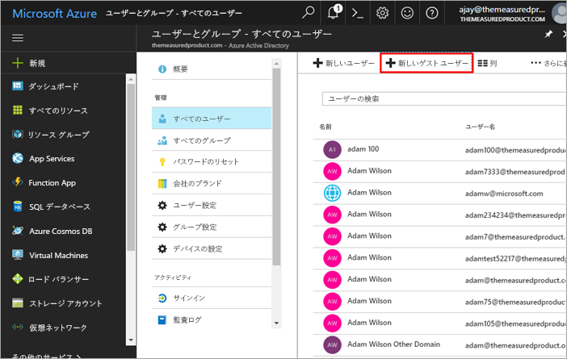
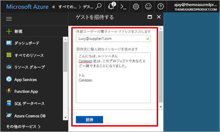
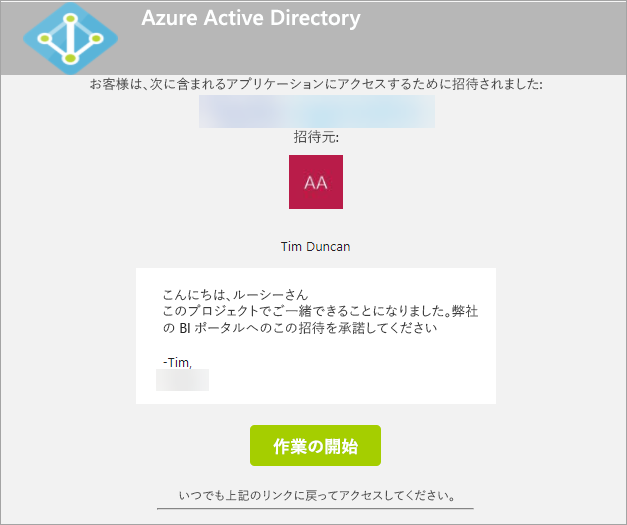
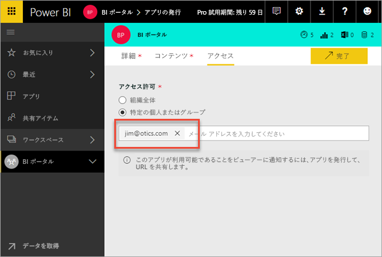
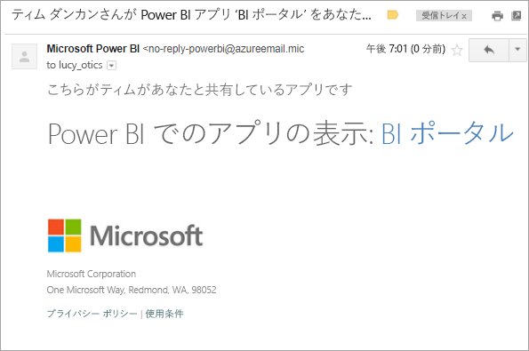
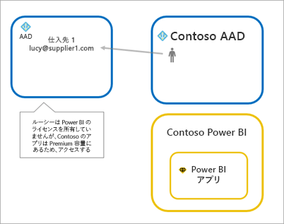
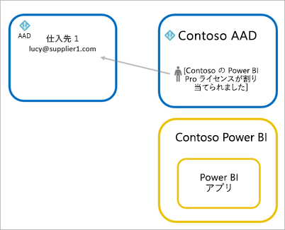
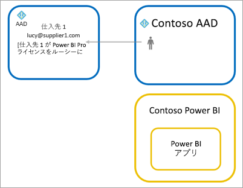

# Azure AD B2B で外部ゲスト ユーザーに Power BI コンテンツを配布する

Power BI と Azure Active Directory Business-to-Business(Azure AD B2B) との統合により、内部データに対する制御を引き続き維持しながら、組織外のゲスト ユーザーに Power BI コンテンツを安全に配布できるようになりました。

## アクセスを有効にする

ゲスト ユーザーを招待する前に、Power BI 管理ポータルで、[エクスポートと共有の設定](service-admin-portal.md#export-and-sharing-settings)の機能が有効になっていることを確認します。

## 招待できるユーザー

gmail.com、outlook.com、hotmail.com などの個人アカウントも含めて、任意のメール アドレスを使用するゲスト ユーザーを招待できます。 Azure AD B2B では、これらのアドレスは "*ソーシャル ID*" と呼ばれます。

## ゲスト ユーザーを招待する

招待状は、組織に初めて外部ゲスト ユーザーを招待する場合にのみ必要です。 ユーザーを招待する方法には、計画的な招待とアドホック招待の 2 種類があります。

### 計画的な招待

招待するユーザーがわかっている場合は、計画的な招待を使用します。 Azure portal または PowerShell を使用して、招待を送信することができます。 ユーザーを招待するには、テナント管理者である必要があります。

Azure portal で招待を送信するには、次の手順のようにします。

1. [Azure Portal](https://portal.azure.com) で、**[Azure Active Directory]** を選択します。

1. **[管理]** で、**[ユーザー]** > **[すべてのユーザー]** > **[新しいゲスト ユーザー]** に移動します。

    

1. **メール アドレス**と**個人的なメッセージ**を入力します。

    

1. **[招待]** を選びます。

複数のゲスト ユーザーを招待するには、PowerShell を使用します。 詳しくは、「[Azure Active Directory B2B コラボレーション コードと PowerShell サンプル](/azure/active-directory/b2b/code-samples/)」をご覧ください。

ゲスト ユーザーは、受信した招待メール内で **[開始]** を選択する必要があります。 その操作により、ゲスト ユーザーはテナントに追加されます。

### アドホック招待

いつでも招待を実行できるようにするには、共有 UI を使ってダッシュボードやレポートに、またはアクセス ページを使ってアプリに、外部ユーザーを追加します。 アプリを使うよう外部ユーザーを招待するときに行うことの例を次に示します。

ゲスト ユーザーには、アプリがそのゲスト ユーザーと共有されたことを示す電子メールが届きます。

ゲスト ユーザーは、自分の所属する組織の電子メール アドレスでサインインする必要があります。 サインイン後、ゲスト ユーザーは招待を受け入れるよう求められます。 サインイン後、ゲスト ユーザーはアプリのコンテンツにリダイレクトされます。 アプリに戻るには、リンクをブックマークするか、メールを保存します。

## ライセンス

ゲスト ユーザーは、共有されているアプリを表示するために、適切なライセンスが必要になります。 これを実現するには、Power BI Premium の使用、Power BI Pro ライセンスの割り当て、ゲストの Power BI Pro ライセンスの使用の、3 つのオプションがあります。

### Power BI Premium を使用する

[Power BI Premium 容量](service-premium.md)にアプリ ワークスペースを割り当てると、ゲスト ユーザーは Power BI Pro ライセンスなしでアプリを使用できるようになります。 Power BI Premium では、高いリフレッシュ レート、専用の容量、大規模なモデル サイズなど他の機能をアプリで活用することもできます。

### ゲスト ユーザーに Power BI Pro ライセンスを割り当てる

テナント内で Power BI Pro ライセンスをゲスト ユーザーに割り当てると、そのターゲット ユーザーはテナント内のコンテンツを表示できるようになります。

### ゲスト ユーザーが独自の Power BI Pro ライセンスを使用する

ゲスト ユーザーは、そのテナント内で Power BI Pro ライセンスに既に割り当てられています。

## 考慮事項と制限事項

* 外部の B2B ゲストは、コンテンツのみの消費量に制限されます。 外部の B2B ゲストは、アプリ、ダッシュボード、レポートの表示、データのエクスポート、ダッシュボードとレポートの電子メール サブスクリプションの作成ができます。 ワークスペースにアクセスしたり、独自のコンテンツを公開することはできません。

* 現在、この機能は Power BI モバイル アプリでは使用できません。 モバイル デバイスでは、ブラウザーで Azure AD B2B を使用して共有されている Power BI コンテンツを表示できます。

* 現在、この機能は Power BI SharePoint Online レポート Web パーツでは使用できません。

## 次の手順

行レベル セキュリティのしくみなど、詳細については、ホワイトペーパー「[Distribute Power BI content to external guest users using Azure AD B2B](https://aka.ms/powerbi-b2b-whitepaper)」(Azure AD B2B を使用して外部ゲスト ユーザーに Power BI のコンテンツを配布する) をご覧ください。

Azure AD B2B について詳しくは、「[Azure Active Directory B2B コラボレーションとは](/azure/active-directory/active-directory-b2b-what-is-azure-ad-b2b/)」をご覧ください。
