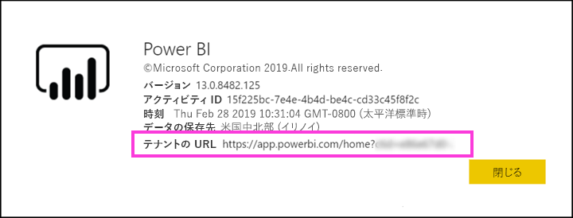

# Azure AD B2B で外部ゲスト ユーザーに Power BI コンテンツを配布する

Power BI と Azure Active Directory Business-to-Business(Azure AD B2B) との統合により、内部データに対する制御を引き続き維持しながら、組織外のゲスト ユーザーに Power BI コンテンツを安全に配布できるようになりました。  

さらに、組織内のコンテンツの編集と管理を組織外のゲスト ユーザーに許可できます。

## アクセスを有効にする

有効にすることを確認、[外部ユーザーとコンテンツの共有](service-admin-portal.md#export-and-sharing-settings)ゲスト ユーザーを招待する前に、Power BI 管理ポータルで機能します。

使用することも、[編集および管理する外部ゲスト ユーザーの組織のコンテンツを許可する](service-admin-portal.md#allow-external-guest-users-to-edit-and-manage-content-in-the-organization)機能します。 できます、ゲスト ユーザーを参照してくださいし、組織の Power BI の参照を含むワークスペースのコンテンツの作成を選びます。

## 招待できるユーザー

Gmail.com、outlook.com、hotmail.com などの個人のアカウントを含む、任意の電子メール アドレスを持つゲスト ユーザーを招待することができます。 Azure AD B2B は、これらのアドレスを呼び出す*ソーシャル id*します。

## ゲスト ユーザーを招待する

ゲスト ユーザーは、最初に、組織に招待する招待のみ必要です。 ユーザーを招待する 2 つの方法はあります。 計画的な招待とアドホック招待します。

### 計画的な招待

招待するユーザーがわかっている場合は、計画的な招待を使用します。 Azure portal または PowerShell を使用して、招待を送信することができます。 ユーザーを招待するには、テナント管理者である必要があります。

Azure portal で招待を送信するには、次の手順のようにします。

1. [Azure portal](https://portal.azure.com) で、 **[Azure Active Directory]** を選択します。

1. **管理**、**ユーザー** > **すべてのユーザー** > **新しいゲスト ユーザー**します。

    

1. **メール アドレス**と**個人的なメッセージ**を入力します。

    

1. **[招待]** を選びます。

複数のゲスト ユーザーを招待するには、PowerShell を使用します。 詳しくは、「[Azure Active Directory B2B コラボレーション コードと PowerShell サンプル](/azure/active-directory/b2b/code-samples/)」をご覧ください。

ゲスト ユーザーは、受信した招待メール内で **[開始]** を選択する必要があります。 その操作により、ゲスト ユーザーはテナントに追加されます。

### アドホック招待

いつでも、外部ユーザーを招待するには、ダッシュ ボードまたはレポート、共有 UI を使用すること、またはアクセス ページを使ってアプリを追加します。 アプリを使うよう外部ユーザーを招待するときに行うことの例を次に示します。

ゲスト ユーザーは、アプリを共有することを示す電子メールを受け取ります。

ゲスト ユーザーは、自分の所属する組織の電子メール アドレスでサインインする必要があります。 サインインした後に招待を承諾を求めるメッセージが表示されます。 サインイン後、アプリは、ゲスト ユーザーが開きます。 アプリに戻るには、リンクをブックマークするか、メールを保存します。

## ライセンス

ゲスト ユーザーは、共有するコンテンツを表示するための適切なライセンスが必要です。 ユーザーが適切なライセンスを持つかどうかを確認する次の 3 つの方法があります。 Power BI Premium を使用して、Power BI Pro のライセンスを割り当てる、またはゲストの Power BI Pro ライセンスを使用します。

[[外部のゲスト ユーザーによる組織内のコンテンツの編集および管理を許可する]](service-admin-portal.md#allow-external-guest-users-to-edit-and-manage-content-in-the-organization) 機能を使用する場合、ワークスペースにコンテンツを投稿したり他のユーザーとコンテンツを共有したりするゲスト ユーザーには、Power BI Pro ライセンスが必要になります。

### Power BI Premium を使用する

アプリ ワークスペースを割り当てる[Power BI Premium 容量](service-premium-what-is.md)ゲスト ユーザーが Power BI Pro ライセンスを必要とせず、アプリを使用できます。 Power BI Premium では、高いリフレッシュ レート、専用の容量、大規模なモデル サイズなどの他の機能を活用するアプリこともできます。

### ゲスト ユーザーに Power BI Pro ライセンスを割り当てる

テナント内で、ゲスト ユーザーに Power BI Pro ライセンスを割り当てるには、テナントにゲスト ユーザー ビュー コンテンツことができます。

### ゲスト ユーザーが独自の Power BI Pro ライセンスを使用する

ゲスト ユーザーは、そのテナント内で Power BI Pro ライセンスに既に割り当てられています。

## コンテンツを編集および管理できるゲスト ユーザー 

使用する場合、[編集および管理する外部ゲスト ユーザーの組織のコンテンツを許可する](service-admin-portal.md#allow-external-guest-users-to-edit-and-manage-content-in-the-organization)機能では、指定したゲスト ユーザーが、組織の Power BI へのアクセスを取得します。 アクセス許可がある任意のコンテンツを表示できます。 ホームにアクセス、ワークスペースの [参照]、アプリをインストール、アクセス リストのいる場所を参照してくださいし、できますワークスペースにコンテンツを投稿します。 新しいワークスペース エクスペリエンスを使用するワークスペースを作成したり、その管理者になったりすることができます。 いくつかの制限が適用されます。 考慮事項と制約のセクションでは、これらの制限事項が一覧表示します。
 
これらのユーザーが Power BI にサインインするには、テナント URL を使用してそれらを提供します。 テナントの URL を見つけるには、次の手順に従います。

1. Power BI サービスの上部のメニューで、ヘルプ **[?]** を選択して、 **[Power BI について]** を選択します。

2. **[テナントの URL]** の横にある値を見つけます。 値は、テナントの URL をゲスト ユーザーと共有することができます。

    

## 考慮事項と制限事項

* 既定では、外部の Azure AD B2B は、コンテンツのみの消費量にゲストを制限します。 アプリ、ダッシュ ボード、レポート、外部の Azure AD の B2B ゲストを表示できるデータをエクスポートし、ダッシュ ボードとレポートの電子メール サブスクリプションを作成します。 ワークスペースにアクセスしたり、独自のコンテンツを公開することはできません。 ただし、これらの制限が経由でアクセスするユーザーをゲストに適用しない、[編集および管理する外部ゲスト ユーザーの組織のコンテンツを許可する](service-admin-portal.md#allow-external-guest-users-to-edit-and-manage-content-in-the-organization)機能します。

* を通じて、ゲスト ユーザーに対して、[編集および管理する外部ゲスト ユーザーの組織のコンテンツを許可する](service-admin-portal.md#allow-external-guest-users-to-edit-and-manage-content-in-the-organization)機能をいくつかのエクスペリエンスはそれらを使用できません。 これらのユーザーがレポートを更新または発行するには、[データの取得] などの Power BI サービスの Web UI を使用して、Power BI Desktop ファイルをアップロードする必要があります。  以下のエクスペリエンスはサポートされていません。
    * Power BI Desktop から Power BI サービスに直接発行することはできません。
    * ゲスト ユーザーは Power BI サービスのサービス データセットへの接続に Power BI desktop を使用することはできません。
    * Office 365 グループに関連付けられた従来のワークスペース:
        * ゲスト ユーザーを作成またはこれらのワークスペースの管理者にすることはできません。
        * ゲスト ユーザーはメンバーであることができます。
    * ワークスペース アクセス リストのアドホック招待を送信することはサポートされていません
    * ゲスト ユーザーの power BI Publisher for Excel はサポートされていません
    * ゲスト ユーザーが Power BI Gateway のインストールし、組織に接続することはできません。
    * ゲスト ユーザーはインストールできないアプリを組織全体に発行
    * ゲスト ユーザーできませんを使用して、作成、更新、または組織のコンテンツ パックのインストール
    * ゲスト ユーザーは Excel で分析を使用することはできません。
    * ゲスト ユーザーがすることはできません@mentionedでコメント
    * ゲスト ユーザーがサブスクリプションを使用できません。
    * この機能を使用するゲスト ユーザーには、職場または学校のアカウントが必要です。 ゲスト ユーザーが個人のアカウントを使用するには、制限にサインインするための複数の制限事項が発生します。

* この機能は現在、Power BI SharePoint Online のレポート web パーツを使用します。

* 外部ゲスト ユーザーの全体的な組織内で実行できる操作です。 制限できる Active Directory の設定があります。 Power BI 環境も適用されます。 これらの設定については、次のドキュメントで説明されています。
    * [外部コラボレーションの設定を管理する](https://docs.microsoft.com/azure/active-directory/b2b/delegate-invitations#control-who-can-invite)
    * [特定の組織からの B2B ユーザーへの招待を許可またはブロックする](https://docs.microsoft.com/azure/active-directory/b2b/allow-deny-list)  

## 次の手順

詳細については、行レベル セキュリティの機能を含む、ホワイト ペーパーをご覧ください。「[Distribute Power BI content to external guest users using Azure AD B2B (Azure AD B2B を使用して外部ゲスト ユーザーに Power BI のコンテンツを配布する)](https://aka.ms/powerbi-b2b-whitepaper)」をご覧ください。

Azure AD B2B の詳細については、次を参照してください。 [Azure AD B2B コラボレーションとは何ですか?](/azure/active-directory/active-directory-b2b-what-is-azure-ad-b2b/)します。
