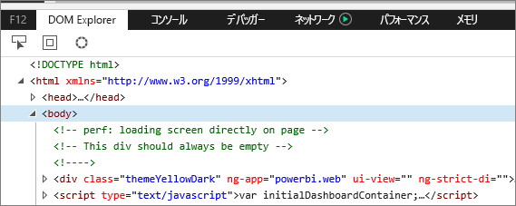
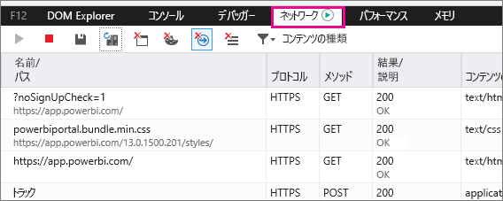
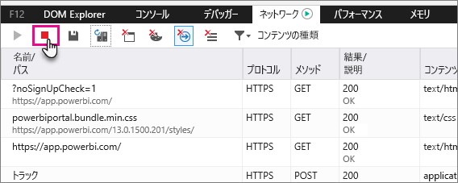
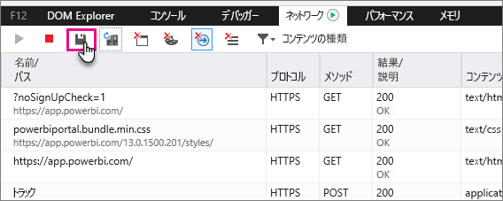

# 追加の診断情報のキャプチャ
## Power BI 用に追加の診断情報をキャプチャする
次の手順では、Power BI Web クライアントから追加の診断情報を手動で収集するために可能性のある 2 つのオプションを提供します。  いずれかのオプションを実行すれば十分です。

## ネットワーク キャプチャ - Microsoft Edge および Internet Explorer
1. Microsoft Edge または Internet Explorer で [Power BI](https://app.powerbi.com) を参照します。
2. F12 キーを押して Edge 開発者ツールを開きます。
3. 開発者ツール ウィンドウが表示されます。 
   
   
4. [ネットワーク] タブに切り替えます。既ににキャプチャされたトラフィックが一覧表示されます。 
   
   
5. ウィンドウを参照して、発生している可能性がある問題を再現できます。 セッション中にいつでも F12 キーを押して、開発者ツール ウィンドウの表示/非表示を切り替えることができます。
6. キャプチャを停止するには、開発者ツール領域の [ネットワーク] タブの赤い四角形を選択します。
   
   
7. **HAR としてエクスポート**するにはフロッピー ディスクのアイコンを選択します。
   
   
8. ファイル名を指定し、HAR ファイルを保存します。
   
    HAR ファイルには、ブラウザー ウィンドウと Power BI の間のネットワーク要求に関するすべての情報が含まれます。  それには、各要求のアクティビティ ID、各要求の正確なタイムスタンプ、クライアントに返されるエラー情報が含まれます。  このトレースには、画面に表示されるビジュアルを設定するのに使われるデータも含まれます。
9. サポートのレビュー用にも HAR ファイルを提供できます。

他にわからないことがある場合は、 [Power BI コミュニティで質問してみてください](http://community.powerbi.com/)。

