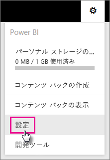
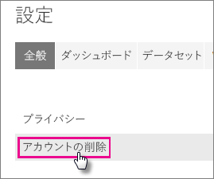
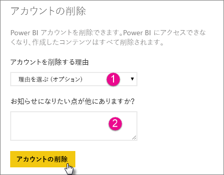
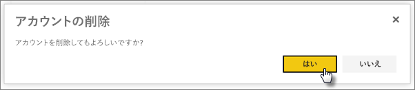
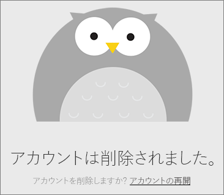
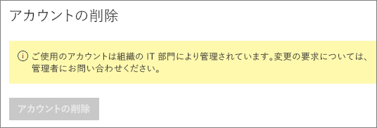

# Power BI アカウントを削除する
Power BI を使用しなくなった場合は、Power BI アカウントの削除を依頼することができます。  アカウントを削除すると、Power BI にサインインできなくなります。  また、Power BI にアップロード または Power BI で作成したすべての顧客データは、Power BI サービス利用規約のデータ保持ポリシーに従って削除されます。

## 個々の Power BI ユーザー
アカウントは設定画面で終了することができます。

1. 右上の歯車  アイコンを選択します。
2. **[設定]** を選択します。
   
    
3. **[全般]** > **[アカウントの使用の停止]** の順に選択します。
   
    
4. **[アカウントの使用を停止する理由]** から理由を選択します。 (1) ドロップダウンから理由を選択します。  必要に応じて詳細情報を提供できます (2)。 それから、 **[アカウントの使用の停止]** を選択します。
   
    
5. アカウントの使用を停止することを確認します。
   
    
6. アカウント使用停止の確認メッセージが表示されます。 アカウントの使用を再開するためのリンクも提供されます。
   
    

## 管理対象テナント ユーザー
テナント管理者に連絡して、アカウントからのライセンスの割り当て解除を依頼する必要があります。

他にわからないことがある場合は、 [Power BI コミュニティで質問してみてください](http://community.powerbi.com/)。

