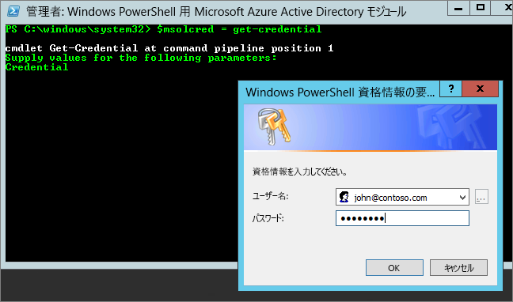

# <a name="administering-power-bi---frequently-asked-questions-faq"></a>Power BI の管理 - よく寄せられる質問 (FAQ)

この記事では、Power BI の管理に関するよく寄せられる質問 (FAQ) を取り上げます。 Power BI の管理の概要については、[Power BI の管理](service-admin-administering-power-bi-in-your-organization.md)に関するページを参照してください。

## <a name="whats-in-this-article"></a>この記事の内容

### <a name="sign-up-for-power-bi-section"></a>Power BI のサインアップ セクション

* [PowerShell の使用](#using-powershell)
* [ユーザーは Power BI にどのような方法でサインアップできますか。](#how-do-users-sign-up-for-power-bi)
* [組織内の個々のユーザーは、どのような方法でサインアップできますか。](#how-do-individual-users-in-my-organization-sign-up)
* [既存の Office 365 テナントにユーザーが参加できないようにするにはどうすればよいですか。](#how-can-i-prevent-users-from-joining-my-existing-office-365-tenant)
* [既存の Office 365 テナントへの参加をユーザーに許可するにはどうすればよいですか。](#how-can-i-allow-users-to-join-my-existing-office-365-tenant)
* [テナントをブロックしたかどうかを確認するにはどうすればよいですか。](#how-do-i-verify-if-i-have-the-block-on-in-the-tenant)
* [既存のユーザーが Power BI の使用を開始できないようにするにはどうすればよいですか。](#how-can-i-prevent-my-existing-users-from-starting-to-use-power-bi)
* [既存のユーザーに Power BI へのサインアップを許可するにはどうすればよいですか。](#how-can-i-allow-my-existing-users-to-sign-up-for-power-bi)

### <a name="administration-of-power-bi-section"></a>Power BI の管理セクション

* [組織内のユーザーの ID を管理する方法はどのように変わりますか。](#how-will-this-change-the-way-i-manage-identities-for-users-in-my-organization-today)
* [Power BI を管理するにはどうすればよいですか。](#how-do-we-manage-power-bi)
* [Microsoft によってユーザーに対して作成されたテナントを管理するにはどうすればよいですか。](#what-is-the-process-to-manage-a-tenant-created-by-microsoft-for-my-users)
* [複数のドメインがある場合、ユーザーが追加される Office 365 テナントを制御できますか。](#if-i-have-multiple-domains-can-i-control-the-office-365-tenant-that-users-are-added-to)
* [Power BI に既にサインアップしているユーザーを削除するにはどうすればよいですか。](#how-do-i-remove-power-bi-for-users-that-already-signed-up)
* [新しいユーザーがいつテナントに参加したかを確認するにはどうすればよいですか。](#how-do-i-know-when-new-users-have-joined-my-tenant)
* [他に何か準備する必要があることはありますか。](#are-there-any-additional-things-i-should-be-prepared-for)
* [Power BI テナントの場所](#where-is-my-power-bi-tenant-located)
* [Power BI SLA (サービス レベル アグリーメント) とは何ですか。](#what-is-the-power-bi-sla)
* [Power BI では高可用性とフェールオーバーはどのように処理されますか。](#how-does-power-bi-handle-high-availability-and-failover)

### <a name="security-in-power-bi-section"></a>Power BI のセキュリティ セクション

* [Power BI は、国、地域、および業界固有のコンプライアンス要件を満たしていますか。](#does-power-bi-meet-national-regional-and-industry-specific-compliance-requirements)
* [Power BI のセキュリティはどのように機能していますか。](#how-does-security-work-in-power-bi)

## <a name="sign-up-for-power-bi"></a>Power BI にサインアップする

### <a name="using-powershell"></a>PowerShell の使用

このセクションの一部の手順では、Windows PowerShell スクリプトが必要です。 PowerShell に慣れていない場合は、「[Windows PowerShell ファースト ステップ ガイド](http://go.microsoft.com/fwlink/p/?LinkID=286814)」を読むことをお勧めします。 スクリプトを実行するには、最初に [Azure Active Directory PowerShell for Graph](/powershell/azure/active-directory/) の最新の 64 ビット バージョンをインストールします。

### <a name="how-do-users-sign-up-for-power-bi"></a>ユーザーは Power BI にどのような方法でサインアップできますか。

管理者は、[Power BI Web サイト](https://powerbi.microsoft.com)または Microsoft 365 管理センターの[サービス購入](https://admin.microsoft.com/AdminPortal/Home#/catalog)ページから、Power BI にサインアップすることができます。 管理者が Power BI にサインアップした場合は、アクセスする必要があるユーザーにユーザー ライセンスを割り当てることができます。

さらに、組織内の個々のユーザーは、[Power BI Web サイト](https://powerbi.microsoft.com)から Power BI にサインアップすることができます。 組織内のユーザーが Power BI にサインアップすると、そのユーザーに Power BI ライセンスが自動的に割り当てられます。 詳しくは、「[個人として Power BI にサインアップする](service-self-service-signup-for-power-bi.md)」および「[組織での Power BI のライセンス](service-admin-licensing-organization.md)」をご覧ください。

### <a name="how-do-individual-users-in-my-organization-sign-up"></a>組織内の個々のユーザーは、どのような方法でサインアップできますか。

組織内のユーザーに適用される可能性がある 3 つのシナリオがあります。

* **シナリオ 1**:組織に既存の Office 365 環境が既に存在し、Power BI にサインアップするユーザーが Office 365 アカウントを既に持っている。
    このシナリオでは、ユーザーがテナント (contoso.com など) に既に職場または学校のアカウントを持っているが、まだ Power BI にサインアップしていない場合は、Microsoft がそのアカウントに対してプランをアクティブ化するだけで、Power BI サービスの使用方法に関する通知が自動的にユーザーに送信されます。

* **シナリオ 2**:組織に既存の Office 365 環境が既に存在するが、Power BI にサインアップするユーザーがまだ Office 365 アカウントを持っていない場合。
    このシナリオでは、ユーザーは、組織のドメイン (contoso.com など) の電子メール アドレスを持っていますが、まだ Office 365 アカウントを持っていません。 この場合、ユーザーは Power BI にサインアップすることができ、アカウントが自動的に与えられます。 これにより、ユーザーは、Power BI サービスにアクセスすることができます。 たとえば、Nancy という名前の従業員が職場の電子メール アドレス (nancy@contoso.com など) を使用してサインアップした場合、Contoso の Office 365 環境に Nancy がユーザーとして自動的に追加され、そのアカウントに対して Power BI が有効になります。

* **シナリオ 3**:組織に電子メール ドメインに接続されている Office 365 環境がない。
    Power BI を利用するために組織が行う必要がある管理操作はありません。 ユーザーは新しいクラウド専用のユーザー ディレクトリに追加され、管理者はテナント管理者としてユーザーの管理を引き継ぐことを選択できます。

> [!IMPORTANT]
> 組織に複数の電子メール ドメインがあり、すべての電子メール アドレスの拡張を同じテナントにまとめる場合は、ユーザーがサインアップする前に、すべての電子メール アドレス ドメインを Azure Active Directory テナントに追加する必要があります。 ユーザーを作成した後でテナント間でユーザーを自動的に移動するメカニズムはありません。 このプロセスについて詳しくは、この記事の「[複数のドメインがある場合、ユーザーが追加される Office 365 テナントを制御できますか](#if-i-have-multiple-domains-can-i-control-the-office-365-tenant-that-users-are-added-to)」と、「[Office 365 にドメインを追加する](/office365/admin/setup/add-domain/)」をご覧ください。

### <a name="how-can-i-prevent-users-from-joining-my-existing-office-365-tenant"></a>既存の Office 365 テナントにユーザーが参加できないようにするにはどうすればよいですか。

既存の Office 365 テナントにユーザーが参加できないようにするために、管理者として実行できる手順があります。 アクセスをブロックした場合、ユーザーのサインアップは失敗し、ユーザーは組織の管理者に連絡するように指示されます。ライセンスの自動配布 (学生、教職員、およびスタッフ向けの Office 365 for Education など) を既に無効にしている場合は、このプロセスを繰り返す必要はありません。

新しいユーザーがマネージド テナントに参加できないようにするには、次の PowerShell スクリプトを使用します。 ([PowerShell の詳細を確認する][1]。)

```powershell
$msolcred = get-credential
connect-msolservice -credential $msolcred

Set-MsolCompanySettings -AllowEmailVerifiedUsers $false
```

> [!NOTE]
> アクセスをブロックすると、組織内の新しいユーザーは Power BI にサインアップできなくなります。 組織の新しいサインアップを無効にする前に Power BI にサインアップしているユーザーは、引き続きライセンスを保持します。 ユーザーを削除する方法については、後の「[Power BI に既にサインアップしているユーザーを削除するにはどうすればよいですか](#how-do-i-remove-power-bi-for-users-that-already-signed-up)」をご覧ください。

### <a name="how-can-i-allow-users-to-join-my-existing-office-365-tenant"></a>既存の Office 365 テナントへの参加をユーザーに許可するにはどうすればよいですか。

新しいユーザーがマネージド テナントに参加できるようにするには、次の PowerShell スクリプトを使用します。 ([PowerShell の詳細を確認する][1]。)

```powershell
$msolcred = get-credential
connect-msolservice -credential $msolcred

Set-MsolCompanySettings -AllowEmailVerifiedUsers $true
```

### <a name="how-do-i-verify-if-i-have-the-block-on-in-the-tenant"></a>テナントをブロックしたかどうかを確認するにはどうすればよいですか。

設定を確認するには、次の PowerShell スクリプトを使用します。 *AllowEmailVerifiedUsers* が false になっている必要があります。 ([PowerShell の詳細を確認する][1]。)

```powershell
$msolcred = get-credential
connect-msolservice -credential $msolcred

Get-MsolCompanyInformation | fl allow*
```

### <a name="how-can-i-prevent-my-existing-users-from-starting-to-use-power-bi"></a>既存のユーザーが Power BI の使用を開始できないようにするにはどうすればよいですか。

これを制御する Azure AD の設定は、**AllowAdHocSubscriptions** です。 ほとんどのテナントでは、この設定は有効を意味する true に設定されます。 パートナーを通じて Power BI を入手した場合、無効を意味する false がこれに設定されている可能性があります。

アドホック サブスクリプションを無効にするには、次の PowerShell スクリプトを使用します。 ([PowerShell の詳細を確認する][1]。)

1. Office 365 の資格情報を使用して Azure Active Directory にサインインします。 次の PowerShell のスクリプトの 1 行目では、ユーザーに資格証明が要求されます。 2 行目で、Azure Active Directory に接続します。

    ```powershell
     $msolcred = get-credential
     connect-msolservice -credential $msolcred
    ```

   

1. サインインの後、次のコマンドを発行してテナントの現在の構成内容を確認することができます。

    ```powershell
     Get-MsolCompanyInformation | fl AllowAdHocSubscriptions
    ```
1. 次のコマンドを使用して、**AllowAdHocSubscriptions** を有効 ($True) または無効 ($false) にします。

    ```powershell
     Set-MsolCompanySettings -AllowAdHocSubscriptions $false
    ```

> [!NOTE]
> AllowAdHocSubscriptions フラグは、組織内のさまざまなユーザーの能力を制御するために使用されます。この中には、ユーザーが Azure Rights Management サービスにサインアップする能力も含まれます。 このフラグの変更は、これらすべての能力に影響します。

### <a name="how-can-i-allow-my-existing-users-to-sign-up-for-power-bi"></a>既存のユーザーに Power BI へのサインアップを許可するにはどうすればよいですか。

既存のユーザーに Power BI へのサインアップを許可するには、前の質問で説明されているコマンドを実行しますが、最後のステップで false の代わりに true を渡します。

## <a name="administration-of-power-bi"></a>Power BI の管理

### <a name="how-will-this-change-the-way-i-manage-identities-for-users-in-my-organization-today"></a>組織内のユーザーの ID を管理する方法はどのように変わりますか。

組織内のユーザーに適用される可能性がある 3 つのシナリオがあります。

* **シナリオ 1**:組織に既存の Office 365 環境があり、組織内のすべてのユーザーが Office 365 アカウントを持っている場合、ID の管理方法に変更はありません。

* **シナリオ 2**:組織に既存の Office 365 環境は既に存在するが、組織内の一部のユーザーのみが Office 365 アカウントを持っている場合は、テナント内にユーザーが作成され、ユーザーの職場または学校の電子メール アドレスに基づいてライセンスが割り当てられます。

    つまり、組織内のユーザーがサービスにサインアップすると、その時点で管理しているユーザーの数が増加します。

* **シナリオ 3**:組織にメール ドメインに接続された Office 365 環境がない場合は、ID の管理方法に変更はありません。

    ユーザーは新しいクラウド専用のユーザー ディレクトリに追加され、管理者はテナント管理者としてユーザーの管理を引き継ぐことを選択できます。

### <a name="how-do-we-manage-power-bi"></a>Power BI を管理するにはどうすればよいですか。

Power BI には、使用状況の統計を表示できる管理ポータル、ユーザーとグループを管理するための Microsoft 365 管理センターへのリンク、テナント全体の設定を制御するための機能が用意されています。

Power BI 管理ポータルにアクセスするには、アカウントが Office 365 または Azure Active Directory 内で**全体管理者**とマークされているか、Power BI サービス管理者ロールを割り当てられている必要があります。 詳しくは、「[Power BI 管理者の役割について](service-admin-role.md)」および「[Power BI 管理ポータル](service-admin-portal.md)」をご覧ください。

### <a name="what-is-the-process-to-manage-a-tenant-created-by-microsoft-for-my-users"></a>Microsoft によってユーザーに対して作成されたテナントを管理するにはどうすればよいですか。

セルフサービスのユーザーは、Azure AD を使用しているクラウド サービスにサインアップするときに、各自の電子メール ドメインに基づいて Azure AD のアンマネージド ディレクトリに追加されます。 "*管理者引き継ぎ*" と呼ばれるプロセスを使って作成されたテナントを、管理できるようになります。 実行する引き継ぎの種類は、ご自身のドメインに関連付けられている既存のマネージド テナントが存在するかどうかによって異なります。

* ドメインに対して新しいマネージド テナントを作成するには、"*内部の引き継ぎ*" を使用します。

* 既存のマネージド テナントにドメインを移動するには、"*外部の引き継ぎ*" を使用します。

詳細については、「[Azure Active Directory の非管理対象ディレクトリを管理者として引き継ぐ](/azure/active-directory/users-groups-roles/domains-admin-takeover)」をご覧ください。

外部の引き継ぎを実行すると、引き継ぎの前に作成した Power BI コンテンツは [Power BI アーカイブ済みワークスペース](service-admin-power-bi-archived-workspace.md)内に配置されます。 新しいテナントで使いたいコンテンツは、すべて手動で移行する必要があります。

### <a name="if-i-have-multiple-domains-can-i-control-the-office-365-tenant-that-users-are-added-to"></a>複数のドメインがある場合、ユーザーが追加される Office 365 テナントを制御できますか。

何もしなければ、ユーザーのメール ドメインとサブドメインごとにテナントが作成されます。 電子メール アドレスの拡張に関係なく、すべてのユーザーを同じテナントにまとめる場合:対象テナントを事前に作成するか既存のテナントを使用して、そのテナントに統合するすべての既存のドメインとサブドメインを追加します。 以後、メール アドレスの末尾がこれらのドメインとサブドメインに該当するすべてのユーザーは、サインアップ時に自動的に対象テナントに追加されます。

> [!IMPORTANT]
> ユーザーを作成した後でテナント間でユーザーを自動的に移動するメカニズムはサポートされていません。 1 つの Office 365 テナントにドメインを追加する方法については、[Office 365 へのユーザーとドメインの追加に関するページ](/office365/admin/setup/add-domain/)を参照してください。

### <a name="how-do-i-remove-power-bi-for-users-that-already-signed-up"></a>Power BI に既にサインアップしているユーザーを削除するにはどうすればよいですか。

Power BI にサインアップする必要がなくなったユーザーが Power BI にアクセスできないようにする場合は、そのユーザーの Power BI ライセンスを削除できます。

1. [Microsoft 365 管理センター](https://admin.microsoft.com/AdminPortal/Home#/homepage)に移動します。

1. 左側のナビゲーション バーで、**[ユーザー]** > **[アクティブ ユーザー]** の順に選択します。

1. ライセンスを削除するユーザーを見つけ、その名前を選択します。

    ユーザーのライセンスは、一括管理することもできます。 これを実行するには、複数のユーザーを選択し、**[製品ライセンスを編集]** を選択します。

1. ユーザーの詳細ウィンドウで、**[製品ライセンス]** の隣にある **[編集]** を選択します。

1. アカウントに適用されているライセンスに応じて、**[Power BI (無料)]** または **[Power BI Pro]** を **[オフ]** に設定します。

1. **[保存]** を選択します。

### <a name="how-do-i-know-when-new-users-have-joined-my-tenant"></a>新しいユーザーがいつテナントに参加したかを確認するにはどうすればよいですか。

このプログラムの一部であるテナントに参加したユーザーには、管理ダッシュボードの [アクティブ ユーザー] ウィンドウでフィルター処理することができる一意のライセンスが割り当てられます。 この新しいビューを作成するには、次の手順のようにします。

1. [Microsoft 365 管理センター](https://admin.microsoft.com/AdminPortal/Home#/homepage)に移動します。

1. 左側のナビゲーション バーで、**[ユーザー]** > **[アクティブ ユーザー]** の順に選択します。

1. **[ビュー]** メニューの **[カスタム ビューの追加]** を選択します。

1. 新しいビューに名前を付け、**[割り当て済みの製品ライセンス]** で、**[Power BI (無料)]** または **[Power BI Pro]** を選択します。

    ビューごとにライセンスを 1 つだけ選択できます。 組織内に **Power BI (無料)** のライセンスと **Power BI Pro** のライセンスがある場合は、2 つのビューを作成できます。

1. 他の必要な条件を入力した後、**[追加]** を選択します。

1. 新しく作成したビューは、**[ビュー]** メニューから使用できます。

### <a name="are-there-any-additional-things-i-should-be-prepared-for"></a>他に何か準備する必要があることはありますか。

パスワードのリセット要求が増える可能性があります。 このプロセスの詳細については、「[Office 365 でユーザーのパスワードを再設定する](/office365/admin/add-users/reset-passwords)」を参照してください。

テナントからのユーザーの削除は、Microsoft 365 管理センターの標準的なプロセスを使用して実行できます。 ただし、ユーザーが組織のアクティブなメール アドレスを引き続き使用する場合、すべてのユーザーがブロックされない限り、そのユーザーはテナントに再び参加できます。

### <a name="where-is-my-power-bi-tenant-located"></a>Power BI テナントの場所

Power BI テナントが存在するデータ リージョンについて詳しくは、「[Power BI テナントの場所](service-admin-where-is-my-tenant-located.md)」をご覧ください。

### <a name="what-is-the-power-bi-sla"></a>Power BI SLA とは何ですか。

Power BI SLA (サービス レベル アグリーメント) については、Microsoft ライセンス Web サイトの「**Licensing**」(ライセンス) セクションにある「[Licensing Terms and Documentation](http://www.microsoftvolumelicensing.com/DocumentSearch.aspx?Mode=3&DocumentTypeId=37)」(ライセンス条項とドキュメント) という記事をご覧ください。

### <a name="how-does-power-bi-handle-high-availability-and-failover"></a>Power BI では高可用性とフェールオーバーはどのように処理されますか。

高可用性とフェールオーバーの詳細については、「[Power BI high availability, failover, and disaster recovery FAQ](service-admin-failover.md)」 (Power BI の高可用性、フェールオーバー、およびディザスター リカバリーに関する FAQ) を参照してください。

## <a name="security-in-power-bi"></a>Power BI のセキュリティ

### <a name="does-power-bi-meet-national-regional-and-industry-specific-compliance-requirements"></a>Power BI は、国、地域、および業界固有のコンプライアンス要件を満たしていますか。

Power BI のコンプライアンスの詳細については、[Microsoft セキュリティ センター](https://www.microsoft.com/TrustCenter/CloudServices/business-application-platform/default.aspx)を参照してください。

### <a name="how-does-security-work-in-power-bi"></a>Power BI のセキュリティはどのように機能していますか。

Power BI は Office 365 上に構築されており、Azure Active Directory などの Azure サービス上に構築されます。 Power BI のアーキテクチャの概要については、「[Power BI のセキュリティ](service-admin-power-bi-security.md)」をご覧ください。

## <a name="next-steps"></a>次の手順

[Power BI 管理ポータル](service-admin-portal.md)  
[Power BI 管理者の役割について](service-admin-role.md)  
[Power BI のセルフサービス サインアップ](service-self-service-signup-for-power-bi.md)  
[Power BI Pro を購入する](service-admin-purchasing-power-bi-pro.md)  
[Power BI Premium とは何ですか?](service-premium.md)  
[Power BI Premium の購入方法](service-admin-premium-purchase.md)  
[Power BI Premium ホワイト ペーパー](https://aka.ms/pbipremiumwhitepaper)  
[Power BI および Office 365 でのグループ管理](service-manage-app-workspace-in-power-bi-and-office-365.md)  
[Office 365 のユーザー アカウント管理](/office365/servicedescriptions/office-365-platform-service-description/user-account-management/)  
[Office 365 グループ管理](/office365/admin/email/create-edit-or-delete-a-security-group/)  

他にわからないことがある場合は、 [Power BI コミュニティで質問してみてください](http://community.powerbi.com/)。

[1]: https://docs.microsoft.com/powershell/scripting/overview