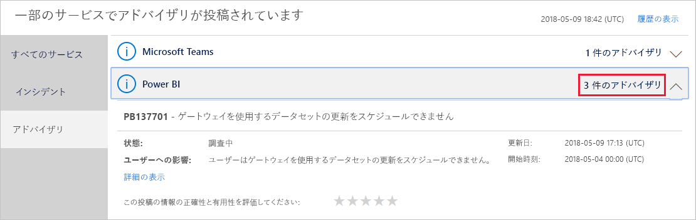
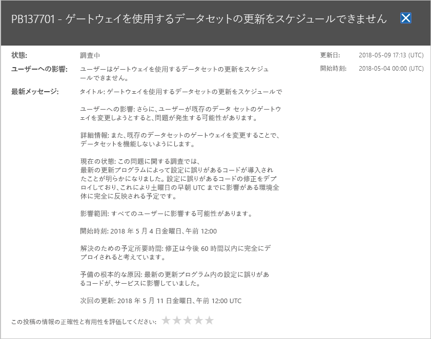

# Office 365 で Power BI サービスの正常性を追跡する

Microsoft 365 管理センターでは、Power BI 管理者の重要なツールを提供します。 ツールには、サービスの正常性に関する現在および過去の情報が含まれます。 サービス正常性の情報にアクセスするには、次のロールのいずれかにする必要があります。

* Power BI サービス管理者

* Office 365 全体管理者

ロールの詳細については、次を参照してください。[管理者ロールに関連する Power BI](service-admin-administering-power-bi-in-your-organization.md#administrator-roles-related-to-power-bi)します。

1. [Microsoft 365 管理センター](https://portal.office.com/adminportal)にサインインします。

1. 左側のナビゲーション バーから選択**すべて表示** > **ヘルス** > **サービスの正常性**。 サービス正常性 ページが表示されます。

    

1. **すべてのサービス**一覧で、**アドバイザリ**または**インシデント**し、結果を確認します。 次のスクリーン ショットは次の 3 つのアクティブなアドバイザリのいずれかを表示します。

    

1. 詳しい情報を見るには、項目の **[詳細の表示]** を選びます。 次のスクリーン ショットでは、最新の状態の更新プログラムを含む、追加の詳細を確認できます。

    

    下にスクロールして他の情報を確認し、完了したらウィンドウを閉じます。

1. 右上隅にあるすべてのサービス全体にわたる履歴情報を表示する、**サービスの正常性**] ページで、[**履歴を表示**します。 次に、 **[過去 7 日間]** または **[過去 30 日間]** を選びます。 

1. 現在のサービス正常性に戻るには、 **[現在の状態の表示]** を選びます。