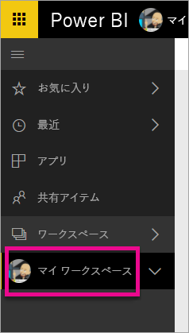
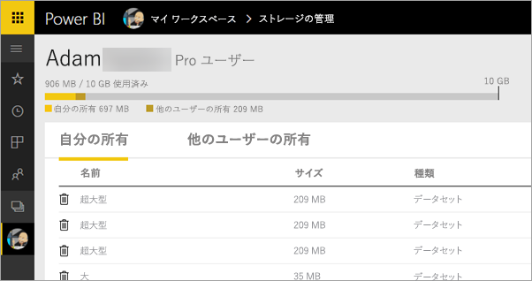
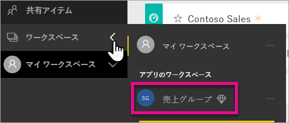
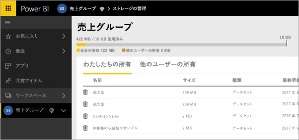
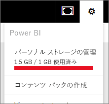
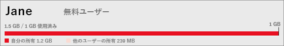

# Power BI ワークスペースでデータ ストレージを管理する

レポートおよびデータセットを引き続き確実に発行できるように、個々のユーザーまたはアプリ ワークスペース内のデータ記憶域を管理する方法について説明します。

ユーザーとアプリ ワークスペースには固有のデータ容量が割り当てられています。

* すべてのユーザーに最大 10 GB のデータ記憶域が与えられます。
* Power BI Pro ライセンスを所有するユーザーはアプリ ワークスペースを作成することができ、それぞれのデータ記憶域の上限は 10 GB です。
* Premium 容量のアプリ ワークスペースは、Power BI Pro ユーザーの記憶域に加算されません。

テナント レベルでは、テナント内のすべての Pro ユーザーとアプリ ワークスペースにおいて、総使用量が Pro ユーザー 1 人あたり 10 GB を超えることはできません。

「[Power BI 料金モデル](https://powerbi.microsoft.com/pricing)」のその他の特徴もご覧ください。

データ記憶域には、ユーザー個人のデータセットと Excel レポートに加えて、他のユーザーと共有したデータセットと Excel レポートも含まれます。 データセットとは、アップロードまたは接続しているデータ ソースのことです。 使用中の Power BI Desktop ファイルや Excel ブックも含まれます。 データ容量には以下も含まれます。

* ダッシュボードにピン留めされたExcel の範囲。
* Power BI ダッシュボードにピン留めされた Reporting Services オンプレミス ビジュアル効果。
* アップロードされたイメージ。

共有ダッシュボードのサイズは、ピン留めされている項目に応じて異なります。 たとえば、2 つの異なるデータセットの一部である 2 つのレポートから項目をピン留めした場合は、2 つのデータセットがサイズに含まれます。

<a name="manage"/>

## 自分が所有する項目を管理する

Power BI アカウントで使用しているデータ記憶域を確認して、アカウントを管理します。

1. 自分の記憶域を管理するには、左側のナビゲーション ウィンドウの **[マイ ワークスペース]** に移動します。
   
    
2. 右上隅にある \> **[個人の記憶域の管理]** の順にクリックします。
   
    上部のバーに、記憶域の上限のうちの使用量が表示されます。
   
    
   
    データセットとレポートは、2 つのタブに分かれています。
   
    **[自分の所有]:** 自分の Power BI アカウントに、Salesforce や Dynamics CRM などのサービス データセットを含む、これらのレポートやデータセットをアップロードしています。  
    **[他のユーザーの所有]:** 他のユーザーから共有を受けたレポートやデータセットです。
1. データセットやレポートを削除するには、ごみ箱のアイコン .

データセットが、自分や他のユーザーが作成したレポートやダッシュボードの基になっている可能性があることにご注意ください。 そのデータセットを削除してしまうと、これらのレポートやダッシュボードは機能しなくなります。

## アプリ ワークスペースの管理
1. **[ワークスペース]** \> の横にある矢印をクリックし、アプリ ワークスペースの名前を選択します。
   
    
2. 右上隅にある\> **[グループ ストレージの管理]** の順にクリックします。
   
    上部のバーに、グループの記憶域の上限のうちの使用量が表示されます。
   
    
   
    データセットとレポートは、2 つのタブに分かれています。
   
    **[わたしたちの所有]:** 自分か他の誰かがグループの Power BI アカウントに、Salesforce や Dynamics CRM などのサービス データセットを含む、これらのレポートやデータセットをアップロードしています。
    **[他のユーザーの所有]:** 他のユーザーから自分のグループが共有を受けたレポートやデータセットです。
3. データセットやレポートを削除するには、ごみ箱のアイコン .
   
   > [!NOTE]
   > アプリ ワークスペースのメンバー (編集アクセス許可を持つ) はいずれも、アプリ ワークスペースからデータセットやレポートを削除するアクセス許可を持っています。
   > 
   > 

データセットが、自分かグループ内の他のユーザーが作成したレポートやダッシュボードの基になっている可能性があることにご注意ください。 そのデータセットを削除してしまうと、これらのレポートやダッシュボードは機能しなくなります。

## データセットの制限
Power BI にインポートされるデータセットごとに 1 GB の制限があります。 データをインポートするのではなく、Excel でのエクスペリエンスを維持することを選択した場合、データセットは 250 MB に制限されます。

## 上限に達したときの動作
利用できるデータ容量の上限に達すると、サービス内にメッセージが表示されます。 

歯車アイコン を選択すると、データ容量の上限を超えていることを示す赤いバーが表示されます。

この上限は、 **[パーソナル ストレージの管理]** 内でも表示されます。

 

 データ容量の上限を超えるアクションを実行しようとすると、上限を超えることを示すメッセージが表示されます。 記憶域を[管理](#manage)し、記憶域の量を減らしたり、上限を超えたりできます。

 

 他にわからないことがある場合は、 [Power BI コミュニティで質問してみてください](http://community.powerbi.com/)。

