# Microsoft Intune でモバイル アプリを構成する
Microsoft Intune を使うと、組織でデバイスとアプリケーションを管理できます。 iOS 用と Android 用の Power BI モバイル アプリケーションを Intune と統合すれば、デバイス上のアプリケーションを管理し、セキュリティを制御できるようになります。 構成ポリシーを利用すると、アクセスに暗証番号 (PIN) を必要とする項目を管理したり、アプリケーションでデータを処理する方法を制御したり、さらには、アプリが使用されていないときにアプリのデータを暗号化したりできます。

<iframe width="560" height="315" src="https://www.youtube.com/embed/9HF-qsdQvHw?list=PLv2BtOtLblH1nPVPU2etFzTNmpz49dwXm" frameborder="0" allowfullscreen></iframe>

## 全般的なモバイル デバイス管理の構成
この記事は、Microsoft Intune の構成に関する完全なガイドではありません。 Intune との統合を今進めている場合は、必要なセットアップを行ったかどうか確認することをお勧めします。 [詳細情報](https://technet.microsoft.com/library/jj676587.aspx)

Microsoft Intune は、Office 365 内でモバイル デバイス管理 (MDM) と共存できます。 [詳細情報](https://blogs.technet.microsoft.com/configmgrdogs/2016/01/04/microsoft-intune-co-existence-with-mdm-for-office-365/)

この記事では、Intune が適切に構成されていることと、Intune に登録したデバイスがあることを想定しています。 MDM と共存する場合、デバイスは MDM に登録されているように表示されますが、Intune でも管理できます。

> [!NOTE]
> 組織で Microsoft Intune MAM が構成された後は、ユーザーが iOS デバイスまたは Android デバイスで Power BI モバイル アプリを使った場合、バックグラウンド データ更新がオフになります。 次にアプリを起動したときは、Web 上の Power BI サービスからデータが更新されます。
> 
> 

## 手順 1: アプリケーションの URL を取得する
Intune 内でアプリケーションを作成する前に、アプリの URL を取得する必要があります。 iOS の場合は、iTunes から取得します。 Android の場合は、Power BI モバイル ページから取得します。

アプリケーションを作成するときに必要になりますので、URL を保存しておいてください。

### iOS
iOS 用のアプリ URL は、iTunes から取得する必要があります。

1. iTunes を開きます。
2. *Power BI*を検索します。
3. **Microsoft Power BI** は、 **[iPhone App]** の下と、 **[iPad App]** の下に表示されるはずです。 どちらを使っても、同じ URL を取得できます。
4. **[入手]** ドロップダウンを選び、 **[リンクをコピー]** を選びます。
   
    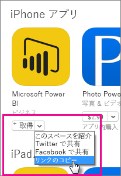

次に表示例を示します。

    https://itunes.apple.com/us/app/microsoft-power-bi/id929738808?mt=8

### Android
Google Play への URL は、[Power BI モバイル ページ](https://powerbi.microsoft.com/mobile/)から取得できます。 **[ダウンロード元 Google Play]** アイコンをクリックすると、アプリのページに移動します。 ブラウザーのアドレス バーから URL をコピーすることができます。 次に表示例を示します。

    https://play.google.com/store/apps/details?id=com.microsoft.powerbim

## 手順 2: モバイル アプリケーション管理ポリシーを作成する
モバイル アプリケーション管理ポリシーを利用すると、アクセスの暗証番号 (PIN) のようなアイテムを施行できます。 これは、Intune ポータル内で作成することができます。 

アプリケーションを先に作成しても、ポリシーを先に作成しても構いません。 この 2 つを追加する順序は任意です。 展開の手順の際に両方が存在していれば十分です。

1. **[ポリシー]** > **[構成ポリシー]** を選びます。
   
    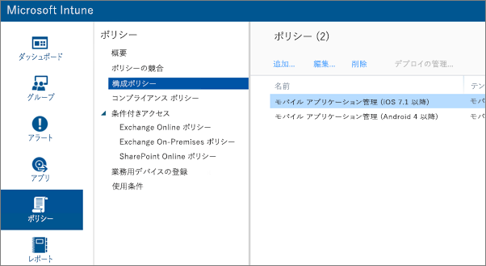
2. **[追加]** を選択します。
3. **[ソフトウェア]** の下で、Android または iOS のいずれかのモバイル アプリケーション管理を選びます。 まず手始めに **[推奨設定を使用してポリシーを作成する]** を選ぶことも、カスタム ポリシーを作成することもできます。
4. ポリシーを編集して、アプリケーションに必要な制限を設定します。

## 手順 3: アプリケーションを作成する
アプリケーションは、展開のために Intune に保存される参照、またはパッケージです。 アプリケーションを作成し、先ほど Google Play または iTunes から入手したアプリの URL を参照する必要があります。

アプリケーションを先に作成しても、ポリシーを先に作成しても構いません。 この 2 つを追加する順序は任意です。 展開の手順の際に両方が存在していれば十分です。

1. Intune ポータルに移動し、左側のメニューから **[アプリ]** を選びます。
2. **[アプリの追加]** を選びます。 **[ソフトウェアの追加]** アプリケーションが起動します。

### iOS
1. ドロップダウンから、 **[アプリ ストアの管理されている iOS アプリ]** を選びます。
2. 先ほど[手順 1](#step-1-get-the-url-for-the-application) で取得したアプリの URL を入力し、**[次へ]** を選びます。
   
    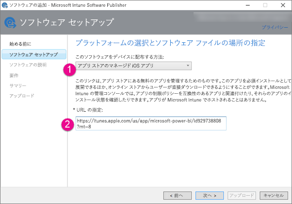
3. **[発行元]**、 **[名前]** 、 **[説明]** を入力します。 必要に応じて **[アイコン]** を提供することもできます。 **[カテゴリ]** は、"ポータル サイト アプリ" にします。 完了したら、 **[次へ]** を選びます。
4. アプリの発行の種類を、 **[任意]** (既定値)、 **[iPad]** 、または **[iPhone]** の中から選びます。 既定では **[任意]** が表示され、どちらの種類のデバイスでも機能するようになります。 Power BI アプリの URL は、iPhone と iPad のどちらでも同じです。 **[次へ]** を選びます。
5. **[アップロード]** を選びます。

> [!NOTE]
> ページを更新するまではアプリの一覧に表示されないことがあります。 **[概要]** をクリックしてから **[アプリ]** に戻れば、ページが再読み込みされます。
> 
> 

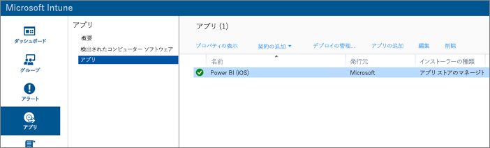

### Android
1. ドロップダウンから **[外部リンク]** を選びます。
2. 先ほど[手順 1](#step-1-get-the-url-for-the-application) で取得したアプリの URL を入力し、**[次へ]** を選びます。
   
    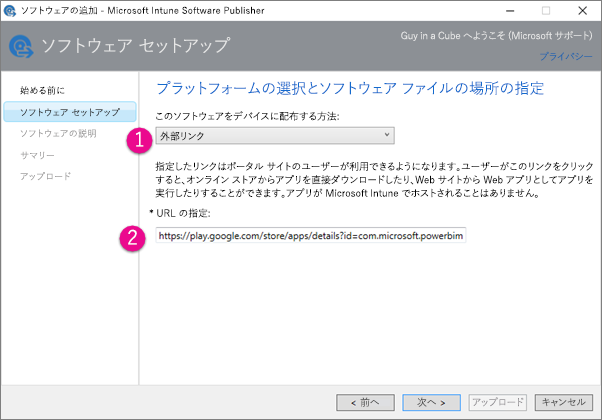
3. **[発行元]**、 **[名前]** 、 **[説明]** を入力します。 必要に応じて **[アイコン]** を提供することもできます。 **[カテゴリ]** は、"ポータル サイト アプリ" にします。 完了したら、 **[次へ]** を選びます。
4. **[アップロード]** を選びます。

> [!NOTE]
> ページを更新するまではアプリの一覧に表示されないことがあります。 **[概要]** をクリックしてから **[アプリ]** に戻れば、ページが再読み込みされます。
> 
> 

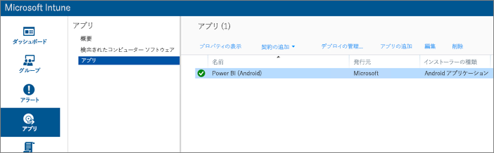

## 手順 4: アプリケーションを展開する
アプリケーションを追加した後は、それを展開して、エンドユーザーが入手できるようにする必要があります。 この手順で、先ほど作成したポリシーをアプリにバインドします。

### iOS
1. [アプリ] 画面で、作成したアプリを選びます。 次に、 **[展開の管理...]** リンクを選びます。
   
    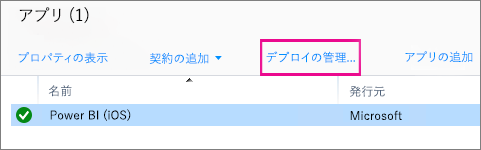
2. **[グループの選択]** 画面で、このアプリの展開先にするグループを選びます。 **[次へ]** を選びます。
3. **[展開アクション]** 画面で、このアプリを展開する方法を選びます。 **[利用可能なインストール]** または **[必須のインストール]** を選ぶと、ポータル サイトからユーザーが必要に応じてアプリをインストールできるようになります。 選び終えたら、 **[次へ]** を選びます。
   
    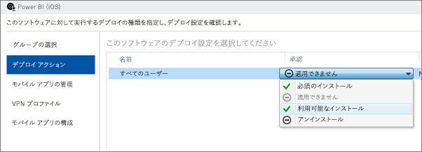
4. **[モバイル アプリの管理]** 画面で、先ほど[手順 2](#step-2-create-a-mobile-application-management-policy) で作成したモバイル アプリの管理ポリシーを選びます。 作成したものが使用可能な唯一の iOS ポリシーの場合は、そのポリシーが既定値になります。 **[次へ]** を選びます。
   
    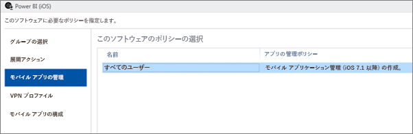
5. **[VPN プロファイル]** 画面で、組織にポリシーがある場合は、1 つ選択できます。 既定値は **[なし]** です。 **[次へ]** を選びます。
6. **[モバイル アプリの構成]** 画面で、 **[アプリの構成ポリシー]** を選びます (作成してある場合)。 既定値は **[なし]** です。 これは必須ではありません。 **[完了]** を選びます。

アプリを展開した後は、アプリのページで展開済みが **[はい]** と表示されるはずです。

### Android
1. [アプリ] 画面で、作成したアプリを選びます。 次に、 **[展開の管理...]** リンクを選びます。
   
    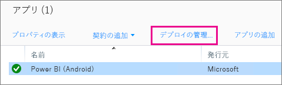
2. **[グループの選択]** 画面で、このアプリの展開先にするグループを選びます。 **[次へ]** を選びます。
3. **[展開アクション]** 画面で、このアプリを展開する方法を選びます。 **[利用可能なインストール]** または **[必須のインストール]** を選ぶと、ポータル サイトからユーザーが必要に応じてアプリをインストールできるようになります。 選び終えたら、 **[次へ]** を選びます。
   
    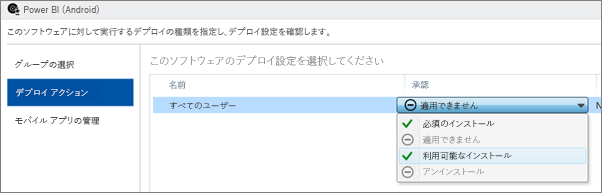
4. **[モバイル アプリの管理]** 画面で、先ほど[手順 2](#step-2-create-a-mobile-application-management-policy) で作成したモバイル アプリの管理ポリシーを選びます。 作成したものが使用可能な唯一の Android ポリシーの場合は、そのポリシーが既定値になります。 **[完了]**を選びます。
   
    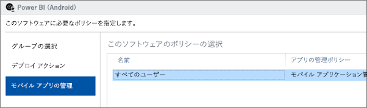

アプリを展開した後は、アプリのページで展開済みが **[はい]** と表示されるはずです。

## 手順 5: アプリケーションをデバイスにインストールする
アプリケーションは、ポータル サイト アプリを使ってインストールします。 ポータル サイト アプリをまだインストールしていない場合は、iOS プラットフォームまたは Android プラットフォームのどちらかでアプリケーション ストアを介して入手できます。 ポータル サイトには、組織のログインを使ってサインインします。

1. ポータル サイト アプリを開きます。
2. おすすめアプリに Power BI アプリが表示されていない場合は、 **[会社のアプリ]** を選びます。
   
    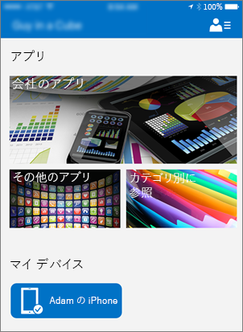
3. 展開した Power BI アプリを選びます。
   
    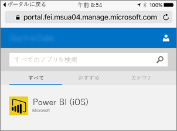
4. **[インストール]** を選びます。
   
    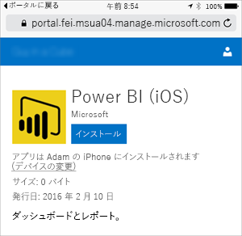
5. iOS の場合は、アプリがプッシュ通知されます。 プッシュ通知ダイアログで **[インストール]** を選びます。
   
    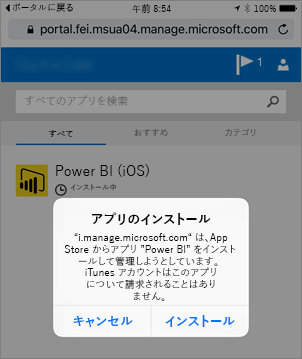

インストールされた後は、 **[会社によって管理されています]** と表示されます。 ポリシーで暗証番号 (PIN) を設定した場合は、次のように表示されます。

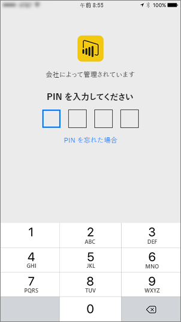

## 次の手順
[Microsoft Intune コンソールでモバイル アプリケーション管理ポリシーを構成して展開する](https://technet.microsoft.com/library/dn878026.aspx)  
[モバイル デバイス用の Power BI アプリ](mobile-apps-for-mobile-devices.md)  

他にわからないことがある場合は、 [Power BI コミュニティで質問してみてください](http://community.powerbi.com/)。

