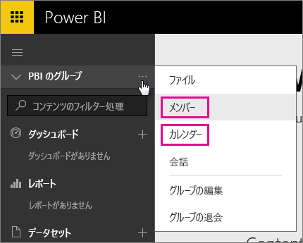
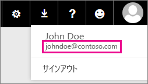

# Office 365 Dedicated カスタマー - 既知の問題
Power BI は Office 365 Dedicated のカスタマーにもサポートされるようになりました。  O365 Dedicated のカスタマーは、そのテナントのアカウントでサインインすれば、Power BI を使用できます。 現在 2 つの既知の問題があります。

## グループ
[グループ] のコンテキスト メニューで **[メンバー]** または **[カレンダー]** を選択すると、メール アプリにリダイレクトされます。  **[ファイル]** と **[会話]** は正常に動作します。

## iPhone アプリ - バニティ ドメインを使用してサインインするとエラーが発生する
iPhone アプリでサインインするときに、バニティ ドメインでログインすると、エラーが発生する場合があります。

*サインイン エラー*  
"*予期しない内部エラーが発生しました。もう一度お試しください。*

この問題を回避するには、カスタム ドメインではなく、Power BI サービス内のユーザー アイコンをクリックすると一覧表示されるメール アドレスを使ってサインインしてください。

他にわからないことがある場合は、 [Power BI コミュニティを利用してください](http://community.powerbi.com/)。

