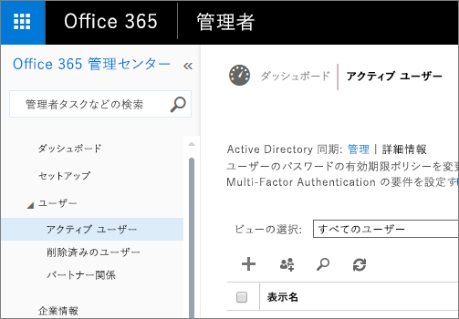
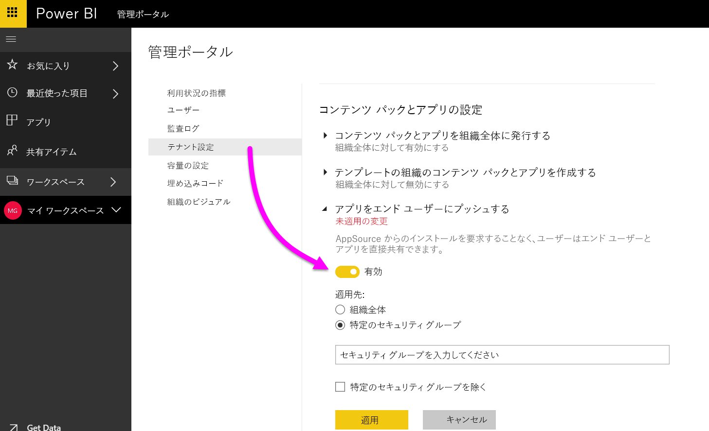

# Power BI 管理ポータル

管理ポータルを使用して、組織内の Power BI のテナントを管理できます。 利用状況の指標、Office 365 管理センターへのアクセス、設定などの項目があります。

会社の Power BI のテナント管理は、Power BI 管理ポータルで行われます。 管理ポータルには、Office 365 のグローバル管理者であるか、Power BI サービス管理者の役割が割り当てられているすべてのユーザーがアクセスできます。 Power BI サービス管理者の役割の詳細については、「[Power BI 管理者の役割について](service-admin-role.md)」を参照してください。

すべてのユーザーの歯車アイコンの下に**管理ポータル**が表示されます。 管理者以外のユーザーには、**[Premium の設定]** セクションと、自身が管理権限を持つ容量のみが表示されます。

## 管理ポータルにアクセスする方法

Power BI の管理ポータルにアクセスするには、アカウントが Office 365 または Azure Active Directory 内で **[グローバル管理者]** とマークされているか、Power BI サービス管理者の役割が割り当てられている必要があります。 Power BI サービス管理者の役割の詳細については、「[Power BI 管理者の役割について](service-admin-role.md)」を参照してください。 Power BI 管理ポータルにアクセスするには、次のように操作します。

1. Power BI サービスの右上にある設定アイコン (歯車) を選択します。
2. **[管理ポータル]** を選択します。

ポータルには 6 つのタブがあります。 この後、それらについて説明します。

* [利用状況の指標](#usage-metrics)
* [ユーザー](#users)
* [監査ログ](#audit-logs)
* [テナント設定](#tenant-settings)
* [Premium の設定](#premium-settings)
* [埋め込みコード](#embed-codes)
* [組織のビジュアル](#Organization-visuals)

## 利用状況の指標
管理ポータルの最初のタブは、**[利用状況の指標ク]** です。 利用状況の指標レポートを使用して、組織の Power BI の利用状況を監視できます。 また、組織のどのユーザーやグループが Power BI を最もアクティブに使用しているかを確認することもできます。

> [!NOTE]
> ダッシュボードに初めてアクセスした場合、またはダッシュボードを長期間表示しなかった後でもう一度アクセスした場合は、ダッシュボードを読み込んでいる間、読み込み中画面が表示される可能性があります。

ダッシュボードが読み込まれると、2 つのタイル セクションが表示されます。 最初のセクションには組織の個々のユーザーの利用状況データが、2 番目のセクションにはグループについての同様の情報が含まれます。

各タイルに表示される内容の詳細は次のとおりです。

* ユーザー ワークスペース内のすべてのダッシュ ボード、レポート、およびデータセットの重複しない数。
  
    

* アクセス可能ユーザー数別の最も使用されたダッシュボード。 たとえば、3 人のユーザーと共有しているダッシュ ボードがあるときに、別の 2 人のユーザーに接続されているコンテンツ パックにそのダッシュボードを追加した場合、数値は 6 になります (1 + 3 + 2)。
  
    

* ユーザーが最も接続しているコンテンツ。 これは、データ取得処理によってユーザーがアクセスできるコンテンツであり、SaaS コンテンツ パック、組織のコンテンツ パック、ファイル、またはデータベースになります。
  
    

* 所有しているダッシュボードの数 (自分で作成したダッシュボードと共有しているダッシュ ボードの両方) に基づく上位ユーザー ビュー。
  
    

* 所有しているレポートの数に基づく上位ユーザー ビュー。
  
    

2 番目のセクションでは、同じ種類の情報が表示されますが、そのデータは (ユーザーではなく) グループに基づいています。 これにより、組織のどのグループが最もアクティブであり、どのような情報を使用しているかを確認できます。

これらの情報によって、組織のユーザーとグループが Power BI をどのように使用しているかについて本物の洞察を得ることができ、組織内の非常にアクティブなユーザーとグループを認識できます。

## Users

管理ポータルの 2 番目のタブは、**[ユーザーの管理]** です。 Power BI のユーザー管理は Office 365 管理センターで行われるため、このセクションから Office 365 内のユーザー、管理者、およびグループを管理する領域に簡単に移動できます。

**[O365 管理センターに移動]** をクリックすると、Office 365 管理センター内のテナントのユーザーを管理するためのページに直接移動します。

## 監査ログ

管理ポータルの 3 番目のタブは、**[監査ログ]** です。 ログは、Office 365 セキュリティ/コンプライアンス センター内に存在します。 このセクションでは、Office 365 内のその領域にすばやくアクセスすることができます。 

監査ログの詳細については、「[組織内の Power BI を監査する](service-admin-auditing.md)」を参照してください。

## テナント設定

管理ポータルの 3 番目のタブは、**[テナント設定]** です。 テナント設定を使用して、組織で利用できる機能を細かく制御できます。 機密データに関して懸念がある場合は、一部の機能はお客様の組織に適していない可能性があり、指定した機能を特定のグループのみが使用できるようにする必要がある場合があります。 そのような場合は、テナントの該当する機能をオフに切り替えることができます。

> [!NOTE]
> テナントのすべてのユーザーに対して設定が有効になるには、最大で 10 分かかることがあります。

指定した設定に基づいて、3 つの状態を設定することができます。

### 組織全体に対して無効にする

機能を無効にし、ユーザーがその機能を使用できないようにすることができます。

### 組織全体に対して有効にする

組織全体に対して機能を有効にできます。有効にすると、すべてのユーザーがその機能にアクセスできるようになります。

### 組織のサブセットに対して有効にする

また、一部の組織に対して機能を有効にすることもできます。 これは、いくつかの異なる方法で設定することができます。 特定のユーザーのグループを除いて、組織全体に対して機能を有効にすることができます。

特定のユーザーのグループのみに対して機能を有効にすることもでき、また、ユーザーのグループに対して機能を無効にすることもできます。 これで、特定のユーザーが許可されているグループに属している場合でも、その機能へのアクセス権を持たないようにすることができます。

## エクスポートと共有の設定

### 外部ユーザーとコンテンツを共有する

組織内のユーザーは、組織外のユーザーとダッシュボードを共有することができます。

### Web に公開

組織内のユーザーは、Web にレポートを公開することができます。 [詳細情報](service-publish-to-web.md)

Web に公開の設定に基づき、UI にさまざまなオプションが表示されます。

|おすすめ |組織全体に対して有効にする |組織全体に対して無効にする |特定のセキュリティ グループ   |
|---------|---------|---------|---------|
|**[ファイル]** メニューの下の **[Web に公開]**。|すべてのユーザーに対して有効|すべてのユーザーに対して非表示|承認されたユーザーまたはグループに対してのみ表示されます。|
|**[設定]** の下の **[埋め込みコードの管理]**|すべてのユーザーに対して有効|すべてのユーザーに対して有効|すべてのユーザーに対して有効  * **[削除]** オプションは、承認されたユーザーまたはグループの場合にのみ使用可能です。 * **[コードを取得]** は、すべてのユーザーに対して有効になります。|
|管理ポータル内の **[埋め込みコード]**|状態には次のいずれかが反映されます。 * アクティブ * サポートされていません * ブロック|状態は **[無効]** と表示|状態には次のいずれかが反映されます。 * アクティブ * サポートされていません * ブロック  ユーザーがテナント設定に基づいて承認されていない場合、状態は **[侵害]** となります。|
|既存の公開済みレポート|すべて有効|すべて無効|すべてのユーザーに対して、レポートの表示が続行されます。|

### データをエクスポートする

組織内のユーザーは、タイルや視覚エフェクトからデータをエクスポートできます。 [詳細情報](power-bi-visualization-export-data.md)

> [!NOTE]
> また、**[データのエクスポート]** を無効にして、ユーザーが **[Excel で分析]** 機能と、Power BI サービスのライブ接続を使用できないように設定することもできます。

### PowerPoint プレゼンテーションとしてレポートをエクスポート

組織内のユーザーは、Power BI レポートを PowerPoint ファイルとしてエクスポートできます。 [詳細情報](service-publish-to-powerpoint.md)

### ダッシュボードとレポートの印刷

組織内のユーザーは、ダッシュボードとレポートを印刷できます。 [詳細情報](service-print.md)

## コンテンツ パックの設定

### コンテンツ パックを組織全体に公開する

組織内のユーザーは、コンテンツ パックを組織全体に公開することができます。

### テンプレートの組織のコンテンツ パックを作成する

組織内のユーザーは、Power BI Desktop 内の 1 つのデータ ソース上に構築されたデータセットを使用する、テンプレート コンテンツ パックを作成できます。

### アプリをエンド ユーザーにプッシュする

テナント管理者が **[テナント設定]** でアプリをプッシュする機能を有効にします。

   

設定を **[有効]** に切り替えた後、この機能を利用できるユーザーを指定できます (組織全体または特定のセキュリティ グループ)。

> [!NOTE]
> テナント設定の変更が有効になるまで時間がかかることに注意してください。

アプリのプッシュの詳細については、[こちら](service-create-distribute-apps.md#how-to-install-an-app-automatically-for-end-users)をご覧ください。

## 統合の設定

### Cortana を使ってデータに関する質問をする
組織内のユーザーは、データについて Cortana を使って質問することができます。

> [!NOTE]
> この設定は、組織全体に適用され、特定のグループに限定することはできません。

### オンプレミスのデータセットで [Excel で分析] を使用する
組織内のユーザーは、Excel を使用して、オンプレミスの Power BI データセットの表示および操作を行うことができます。 [詳細情報](service-analyze-in-excel.md)

> [!NOTE]
> また、**[データのエクスポート]** を無効にして、ユーザーが **[Excel で分析]** 機能を使用することを防ぐこともできます。

### Power BI の ArcGIS マップ (プレビュー) を使用する

組織内のユーザーは、Esri によって提供される Power BI の ArcGIS マップ (プレビュー) の視覚エフェクトを使用できます。 [詳細情報](power-bi-visualization-arcgis.md)

## カスタム ビジュアルの設定
### 組織全体のカスタム ビジュアルを有効にする
組織内のユーザーは、カスタム ビジュアルを操作して共有することができます。 [詳細情報](power-bi-custom-visuals.md)

> [!NOTE]
> この設定は、組織全体に適用され、特定のグループに限定することはできません。

## R ビジュアルの設定

### R ビジュアルとの対話と共有

組織内のユーザーは、R スクリプトで作成したビジュアルと対話して共有することができます。 [詳細情報](service-r-visuals.md)

> [!NOTE]
> この設定は、組織全体に適用され、特定のグループに限定することはできません。

## 監査の設定

### 内部アクティビティの監査とコンプライアンスのための監査ログの作成

組織内のユーザーは監査を使用して、組織内の他のユーザーによって実行された Power BI のアクションを監視することができます。 [詳細情報](service-admin-auditing.md)

監査ログのエントリを記録するには、この設定を有効にする必要があります。

> [!NOTE]
> この設定は、組織全体に適用され、特定のグループに限定することはできません。

## ダッシュボードの設定

### ダッシュボードのデータ分類

組織内のユーザーは、ダッシュボードのセキュリティ レベルを示す分類を使って、ダッシュボードにタグを付けることができます。 [詳細情報](service-data-classification.md)

> [!NOTE]
> この設定は、組織全体に適用され、特定のグループに限定することはできません。

## 開発者の設定

### アプリにコンテンツを埋め込む

組織内のユーザーが、Power BI のダッシュボードとレポートを、サービスとしてのソフトウェア (SaaS) アプリケーションに埋め込むことができます。 この設定を無効にすると、ユーザーが REST API を使用して、Power BI コンテンツをアプリケーションに埋め込むことができなくなります。

## Premium の設定

[Premium の設定] タブでは、組織用に購入されたすべての Power BI Premium 容量を管理できます。 組織内のすべてのユーザーに [Premium の設定] タブが表示されますが、そのタブにコンテンツが表示されるのは、ユーザーが、**容量管理者**、または割り当てのアクセス許可を持つユーザーとして割り当てられている場合のみです。 アクセス許可が何も割り当てられていないユーザーには、次のメッセージが表示されます。

Premium の設定の管理について詳しくは、「[Manage Power BI Premium](service-admin-premium-manage.md)」 (Power BI Premium の管理) をご覧ください。

## 埋め込みコード

管理者は、テナントに対して生成されている埋め込みコードを表示することができます。 レポートを表示したり、埋め込みコードを削除して取り消したりすることができます。

## 組織のビジュアル

[組織のビジュアル] タブでは、組織内にカスタム ビジュアルを展開し、管理できます。つまり、独自のビジュアルを組織に簡単に展開できます。レポートを作成するとき、カスタム ビジュアルを簡単に見つけ、Power BI Desktop からレポートに直接インポートできます。
 
このページには、組織のリポジトリに現在展開されているすべてのカスタム ビジュアルが表示されます。
 

### 新しいカスタム ビジュアルの追加

新しいカスタム ビジュアルを一覧に追加するには、**[カスタム ビジュアルの追加]** を選択します。

> [!WARNING]
> カスタム ビジュアルには、セキュリティやプライバシー上のリスクを伴うコードが含まれている可能性があります。組織のリポジトリに展開する前に、カスタム ビジュアルの作成者とソースが信頼できることを確認してください。
> 

次のフィールドに入力します。
 
* .pbiviz ファイルを選択する (必須): アップロードするカスタム ビジュアル ファイルを選択します。 バージョン管理されている API カスタム ビジュアルのみをサポートしています (詳細はここをお読みください)。
カスタム ビジュアルをアップロードする前に、そのビジュアルのセキュリティとプライバシーを調べ、組織の基準に適合することを確認してください。 カスタム ビジュアル セキュリティの詳細情報
 
* カスタム ビジュアルに名前を付ける (必須): Power BI Desktop ユーザーにとってわかりやすくなるように、ビジュアルに短いタイトルを付けます。
 
* アイコン (必須): Power BI Desktop UI に表示されるアイコン ファイルです。
 
* 説明: ユーザーにとってわかりやすくなるようにビジュアルに簡単な説明を与えます。
 
"適用" を選択し、アップロード要求を開始します。 成功すると、一覧に新しい項目が表示されます。 失敗すると、エラー メッセージが表示されます。
 
### 一覧からカスタム ビジュアルを削除する

リポジトリからビジュアルを完全削除するごみ箱アイコンを選択します。
重要: 削除は元に戻すことができません。 削除の直後から、既存のレポートでそのビジュアルのレンダリングが停止します。 同じビジュアルを再度アップロードしても、削除された以前のビジュアルに代わることにはなりません。新しいビジュアルを再度インポートし、レポートにあるインスタンスを置換する必要があります。
 
### ビジュアルを更新する方法

新しいバージョンのビジュアルがあるため (バグの修正や新しい機能など)、リポジトリのビジュアルを更新する場合、一覧の新しいエントリとして新しいファイルをアップロードします (Visual ID が変更されないようにします)。タイトルと説明は正しく入力してください ("My Visual v2.0" など)。 次回ユーザーが Power BI Desktop から組織のリポジトリに入ると、新しいバージョンをインポートできます。レポートに入っている現在のバージョンを置換するように求められます。
 
## 次の手順

[Power BI 管理者の役割について](service-admin-role.md)  
[組織内の Power BI を監査する](service-admin-auditing.md)  
[Manage Power BI Premium](service-admin-premium-manage.md) (Power BI Premium の管理)  
[組織内の Power BI を管理する](service-admin-administering-power-bi-in-your-organization.md)  

他にわからないことがある場合は、 [Power BI コミュニティで質問してみてください](http://community.powerbi.com/)。