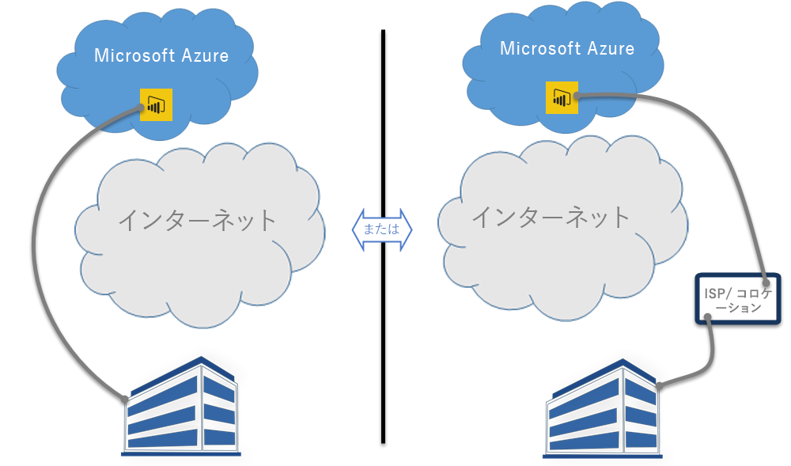

# Power BI と ExpressRoute
**Power BI** と **ExpressRoute** を使用すると、組織から Power BI へのプライベート ネットワーク接続を作成して (または ISP の共用施設を使用して) インターネットを迂回することにより、機密性の高い Power BI データおよび接続のセキュリティを高めることができます。

**ExpressRoute** は、(Power BI が存在する) Azure データセンターとオンプレミスのインフラストラクチャとの間または Azure データセンターとコロケーション環境との間にプライベート接続を作成することを可能にする Azure サービスです。

ExpressRoute について詳しくは[こちら](https://azure.microsoft.com/services/expressroute/)を、サインアップ方法については[こちら](https://azure.microsoft.com/pricing/details/expressroute/)をご覧ください。

> [!NOTE]
> [この FAQ](https://docs.microsoft.com/azure/expressroute/expressroute-faqs) で説明されているように、Power BI はパブリック ピアリング モードでサポートされています。
> 
> 

## Power BI ExpressRoute の例外
Power BI は ExpressRoute に準拠していますが、例外的に Power BI との間で送受信されるデータがパブリック インターネットを経由することがあります。 このような例外的な状況では多くの場合、最も近い**コンテンツ配信ネットワーク (CDN)** ノードからダウンロードされるブラウザー構成ファイルのような静的データが含まれます。 Power BI のすべてに適用される広範な例外もあれば、サービスまたは機能に固有の例外もあります。以降のセクションでは、これらの例外について説明していきます。

### Power BI と ExpressRoute の全体的な例外
**Power BI** と **ExpressRoute** の例外とは、Power BI との間で送受信されるデータが、プライベート ExpressRoute リンクではなく、パブリック インターネットを経由することを意味します。

ExpressRoute を使用する Power BI に適用される 2 つの全体的な例外は次のとおりです。

* **コンテンツ配信ネットワーク (CDN)** および Web サイトからダウンロードされる静的ファイル
* パブリック インターネット経由で送信される**利用統計情報**データ

Power BI は、複数の**コンテンツ配信ネットワーク (CDN)** または Web サイトを使用して、必要な静的コンテンツとファイルを、パブリック インターネット経由で地理的なロケールに基づいてユーザーに効率的に配布します。 これらの静的ファイルには、製品ダウンロード (**Power BI Desktop**、**オンプレミス データ ゲートウェイ**、さまざまな独立系サービス プロバイダーから提供される **Power BI コンテンツ パック**など)、その後に Power BI との接続を開始および確立するためのブラウザー構成ファイル、および初期のセキュリティで保護された Power BI ログイン ページが含まれます。実際の資格情報は ExpressRoute 経由でのみ送信されます。   

特定の**利用統計情報データ**も、パブリック インターネットと ExpressRoute を経由して転送されます。 利用統計情報データは利用統計情報や類似のデータを含み、利用状況とアクティビティを監視するために使用するサービスに転送されます。

### Power BI の SaaS アプリケーションと ExpressRoute
ユーザーが Power BI サービス (powerbi.com または Cortana 経由) への接続を開始すると、Power BI のランディング ページ、ログイン ページ、および Power BI に接続して対話するようにブラウザーを準備する静的ファイルが、パブリック インターネットを介して接続される CDN または Web サイトから取得されます。

ログインが確立された後の Power BI データのやり取りは ExpressRoute で行われます。ただし、次のようなパブリック インターネットのデータに依存する特定の機能およびサービスは例外です。

* **マップ ビジュアル**は、Bing Virtual Earth サービスまたは Bing ジオコーディング サービスへの接続とデータ転送を必要とします。どちらの接続も、パブリック インターネット経由で確立されます。
* Power BI と **Cortana** とを統合するには、パブリック インターネット経由で Bing にアクセスする必要があります。
* 画像ウィジェット、ビデオなどの**カスタム リンク**がユーザーによって追加されたとき、Power BI は、ユーザーによって指定されたリンクに基づいてデータを要求します。そのため、ExpressRoute が使用される場合もあれば使用されない場合もあります。
* ユーザーは、User Voice フィードバック メカニズムを使用してテキスト (およびオプションで画像) 形式の**フィードバックを Power BI** に送信できます。このとき、転送にはパブリック インターネットが使用されます。
* **Bing ニュース コンテンツ プロバイダー**は、パブリック インターネットを使用して Bing からコンテンツをダウンロードします。
* **アプリ** (たとえば、コンテンツ パック) に接続するとき、多くの場合、ユーザーは、SaaS プロバイダーから提供されるページを使用して資格情報と設定を入力する必要があります。 このようなページでは、ExpressRoute が使用される場合もあれば使用されない場合もあります。

| ユーザー アクティビティ | アクセス先 |
| --- | --- |
| ランディング ページ (ログイン前) |`maxcdn.bootstrapcdn.com ; ajax.aspnetcdn.com ; netdna.bootstrapcdn.com ; cdn.optimizely.com; google-analytics.com ` |
| ログイン |`*.mktoresp.com ; *.aadcdn.microsoftonline-p.com ; *.msecnd.com ; *.localytics.com ; ajax.aspnetcdn.com` |
| ダッシュボード、レポート、データセットの管理 (マップおよびジオコーディングを含む) |`*.localytics.com ; *.virtualearth.net ; platform.bing.com; powerbi.microsoft.com; c.microsoft.com; app.powerbi.com; *.powerbi.com; dc.services.visualstudio.com ` |
| サポート |`support.powerbi.com ; powerbi.uservoice.com ; go.microsoft.com ` |

### Power BI Desktop と ExpressRoute
Power BI Desktop も同様に ExpressRoute に準拠していますが、次に示すいくつかの例外があります。

* ユーザーが使用している Power BI Desktop が最新バージョンであるかどうかを検出するための**更新通知**は、パブリック インターネット経由で送信されます。
* 特定の**利用統計情報**データは、パブリック インターネット経由で送信されます。
* **マップ ビジュアル**は、**Bing Virtual Earth** サービスまたは **Bing ジオコーディング** サービスへの接続とデータ転送を必要とします。どちらの接続も、パブリック インターネット経由で確立されます。
* **Web** やサード パーティの SaaS プロバイダーなど、いくつかのデータ ソースから**データを取得**する場合は、パブリック インターネット経由で送信されます。

### Power BI PaaS と ExpressRoute
Power BI には、カスタマイズされた Power BI ソリューションやアプリを開発者が作成することを可能にする、API とその他のプラットフォーム ベースの機能が用意されています。 Power BI の PaaS データをパブリック インターネット経由で転送するときは、このトピックの前半で説明した利用統計情報と CDN データに加え、次のサービスが使用されます。

| PaaS アクティビティ | 使用される追加のアクセス先 |
| --- | --- |
| パブリック埋め込み (利用統計情報) |`c1.microsoft.com` |
| カスタム ビジュアル (CDN) |`*.azureedge.net` |

**カスタム ビジュアル**は、サード パーティ製のものもあれば、Microsoft 製のものもあります。 このようなカスタム ビジュアルでは、ExpressRoute が使用される場合もあれば使用されない場合もあります。

### Power BI モバイルと ExpressRoute
このドキュメントでは、Power BI モバイル アプリの使用については説明しません。  

### オンプレミス データ ゲートウェイと ExpressRoute
**オンプレミス データ ゲートウェイ**を Power BI で使用する場合の転送は ExpressRoute に準拠します。ただし、このトピックよりも前の「**Power BI の SaaS アプリケーションと ExpressRoute**」セクションで説明したユーザー アクティビティについては例外です。  

