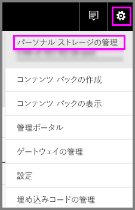
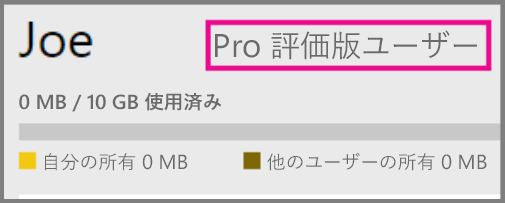
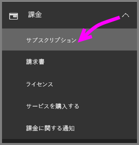
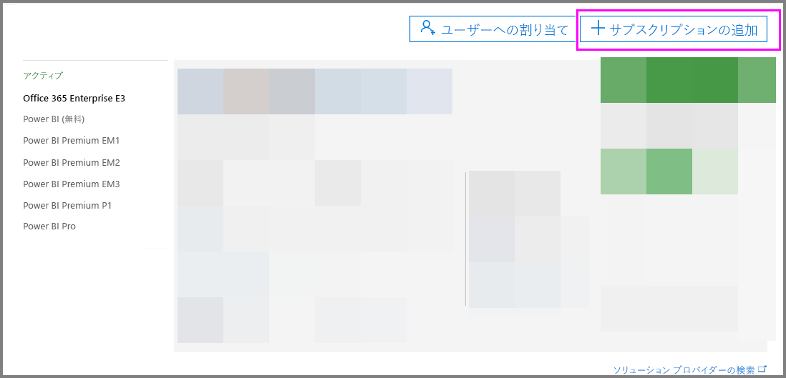
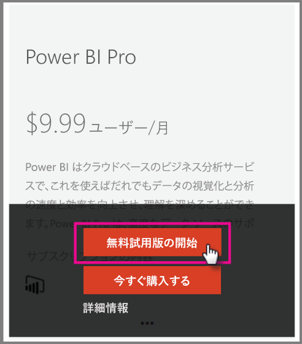

# 組織内の Power BI Pro

Power BI Pro は有料ライセンスであり、より多くの機能が有効になります。 Power BI Pro ライセンスは、他のユーザーと共有し、共同作業してデータに基づく意思決定を行うチーム向けです。  共有されている Power BI のコンテンツを作成または表示する各チーム メンバーは、そのコンテンツが Power BI Premium を使用する専用容量に関連付けられている場合を除き、Pro のライセンスが必要です。

以下の機能には Power BI Pro ライセンスが必要です。

* **Excel または Power BI Desktop でのデータ分析** - Excel または Power BI Desktop を使用して、Power BI で公開されているデータセットを表示して対話します。 詳細については、「[Excel で分析](service-analyze-in-excel.md)」を参照してください。

* **ダッシュボードを共有し、ワークスペースで共同作業を行う** - Power BI ワークスペースは、ダッシュボード、レポート、データセットでの同僚とのコラボレーションを容易にします。 詳細については、「[Power BI アプリ ワークスペースでの共同作業](service-collaborate-power-bi-workspace.md)」を参照してください。

* **共有コンテンツの表示** - Pro ユーザーは、共有されているダッシュボードとレポートを表示し、対話し、再共有 (許可されている場合) できます。 ただし、Pro ユーザーはこれらのダッシュ ボードやレポートを編集することはできません。 詳細については、「[同僚や他のユーザーと自分の Power BI ダッシュボードやレポートを共有する](service-share-dashboards.md)」を参照してください。

* **Microsoft Teams とのコンテンツの統合** - Microsoft (MS) Teams チャネルで Power BI のタブを追加することができます。 MS Teams は、ワークスペースですべてのレポートを自動的に検出します。 詳細については、「[Power BI teams up with Microsoft Teams](https://powerbi.microsoft.com/en-us/blog/power-bi-teams-up-with-microsoft-teams/)」 (Power BI と Microsoft Teams との連携) を参照してください。 

## 個人向け Power BI Pro の 60 日間の無料試用版

無料アカウントにサインアップした後、Pro 版を 60 日間無料で試用することができます。 試用期間中は Pro 版のすべての機能にアクセスできます。 Power BI Pro は、無料版 Power BI のすべての機能を備えているだけでなく、新たな共有機能やコラボレーション機能も備えています。 詳しくは、[Power BI の料金](https://powerbi.microsoft.com/en-us/pricing/)に関するページをご覧ください。 60 日間の無料試用版の Power BI Pro を試用する場合は、Power BI にサインインし、次の Power BI Pro 機能のいずれかを試してみてください。

* [ワークスペースの作成](service-create-distribute-apps.md)
* [ダッシュボードの共有](service-share-dashboards.md)

これらの機能を試そうとすると、無料試用版を開始するように求められます。 また、歯車アイコンをクリックして [パーソナル ストレージの管理] を選択することによっても使用できます。 その後、右側にある [Pro を無料でお試しいただけます] を選択します。

   
    
   

その後、[無料体験する] を選択します。

   

> [!NOTE]
> この製品内 Power BI Pro 試用版を利用するユーザーは、Office 365 の管理ポータルでは Power BI Pro 試用版ユーザーとして表示されません (Power BI 無料版ユーザーとして表示されます)。 ただし、Power BI の記憶域の管理ページでは Power BI Pro 試用版ユーザーとして表示されます。
>

> [!NOTE]
> 組織内の各ユーザーに試用期間を個別に設定するのではなく、複数のユーザー向けに Power BI 試用版ライセンスを取得して導入することをお考えの IT 管理者の皆さまは、Power BI Pro サブスクリプション試用版にサインアップしてください。 管理者向け試用版にサインアップするためには、Office 365 グローバル管理者または課金管理者であるか、あるいは新しいテナントを作成する必要があります。 詳しくは、「[Power BI Pro を購入する](service-admin-purchasing-power-bi-pro.md)」をご覧ください。
>

サービス内で Pro 試用版アカウントがあることを確認するには、歯車アイコンをクリックして [パーソナル ストレージの管理] を選択します。

   

## Office 365 でのサブスクリプション試用版

Power BI Pro を組織用の試用版として取得できます。 サブスクリプションを取得した後、Power BI Pro のライセンスをユーザーに割り当てることができます。 ライセンスを割り当てる方法の詳細については、「[一般法人向け Office 365 ライセンスをユーザーに割り当てる](https://support.office.com/en-us/article/assign-licenses-to-users-in-office-365-for-business-997596b5-4173-4627-b915-36abac6786dc?ui=en-US&rs=en-US&ad=US)」を参照してください。

> [!NOTE]
> 組織用の試用版は、テナントあたり 1 つしか使用できません。 これは、Power BI Pro の試用版を誰かがすでにテナントに適用している場合、もう一度適用することはできないことを意味します。 この制限についてサポートが必要な場合は、[Office 365 の課金サポート](https://support.office.microsoft.com/en-us/article/contact-support-for-business-products-admin-help-32a17ca7-6fa0-4870-8a8d-e25ba4ccfd4b?CorrelationId=552bbf37-214f-4202-80cb-b94240dcd671&ui=en-US&rs=en-US&ad=US)にお問い合わせください。
>

Office 365 で試用版サブスクリプションを取得するには、次の手順に従います。

1. [Office 365 管理センター](https://portal.office.com/adminportal/home#/homepage)に移動します。
2. 左側のナビゲーション ウィンドウで、[課金] を選択してから [サブスクリプション] をクリックします。

   

3. 右側にある [サブスクリプションの追加] を選択します。

   

4. [その他のプラン] で、[Power BI (無料)] の欄にある省略記号 (...) にマウスを合わせ、[無料試用を開始] を選択します。

    

5. 注文確認画面で [今すぐ試す] を選択します。
6. 注文完了画面で [続行] を選択します。

## Power BI Pro を購入する

Microsoft Office 365 または Microsoft 認定パートナーから Power BI Pro を購入することができます。 Power BI Pro を購入する方法の詳細については、「[Power BI Pro を購入する](service-admin-purchasing-power-bi-pro.md)」を参照してください。

## 次の手順
[Power BI のセルフサービス サインアップ](service-admin-signing-up-for-power-bi-with-a-new-office-365-trial.md)
 
[組織内の Power BI (無料)](service-admin-service-free-in-your-organization.md)
 
[Power BI Pro を購入する](service-admin-purchasing-power-bi-pro.md)
 
[Extended Pro Trial のアクティブ化](service-extended-pro-trial.md)
 
[Power BI Pro ライセンスの割り当て](service-admin-assigning-power-bi-pro-licenses.md)
 
[Power BI Premium とは](service-admin-premium-manage.md)
 
[Power BI Premium の購入方法](service-admin-premium-purchase.md)
 
[Power BI Premium ホワイト ペーパー](https://aka.ms/pbipremiumwhitepaper)

他にわからないことがある場合は、 [Power BI コミュニティで質問してみてください](https://community.powerbi.com/)。