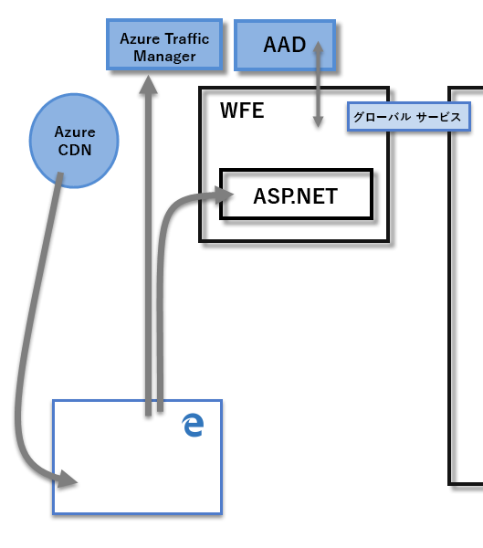
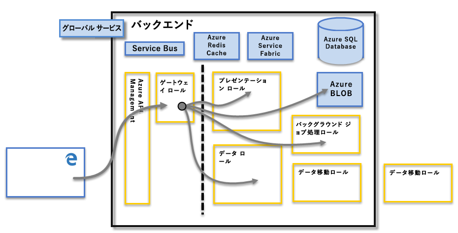

# Power BI のセキュリティ

Power BI のセキュリティについて詳しくは、[Power BI のセキュリティに関するホワイト ペーパーをご覧ください](whitepaper-powerbi-security.md)。

Power BI サービスは、**Azure** 上に構築されています。これは、Microsoft のクラウド コンピューティングのインフラストラクチャとプラットフォームです。 Power BI サービスのアーキテクチャは、Web フロントエンド (**WFE**) クラスターと**バックエンド** クラスターという 2 つのクラスターに基づいています。 WFE クラスターでは、Power BI サービスへの最初の接続と認証を管理し、認証が完了した後、以降のユーザーとの対話はすべてバックエンドで処理されます。 Power BI では、Azure Active Directory (AAD) を使用してユーザー ID を格納および管理し、データとメタデータの格納については、それぞれ Azure BLOB と Azure SQL Database を使用して管理します。

## Power BI のアーキテクチャ

Power BI のそれぞれのデプロイは、Web フロントエンド (**WFE**) クラスターと **バックエンド** クラスターという 2 つのクラスターで構成されています。

**WFE** クラスターは、Power BI への最初の接続と認証のプロセスを管理します。AAD を使用してクライアントを認証し、Power BI サービスへのそれ以降のクライアント接続に対してトークンを提供します。 また、Power BI は、認証プロセスと静的コンテンツやファイルのダウンロードのために最も近いデータセンターにユーザー トラフィックを送信するために **Azure Traffic Manager** (ATM) も使用します。この送信先は、接続しようとしているクライアントの DNS レコードに基づいて決定されます。 Power BI は、**Azure Content Delivery Network** (CDN) を使用して、必要な静的コンテンツとファイルを地理的なロケールに基づいてユーザーに効率的に配布します。

**バックエンド** クラスターは、認証されたクライアントが Power BI サービスと対話する方法を決定します。 **バックエンド** クラスターでは、視覚エフェクト、ユーザー ダッシュボード、データセット、レポート、データ ストレージ、データ接続、データの更新をはじめ、Power BI サービスと対話するためのさまざまな側面を管理します。 **ゲートウェイ ロール** は、ユーザーの要求と Power BI サービス間のゲートウェイとして機能します。 ユーザーは、 **ゲートウェイ ロール**以外のすべてのロールと直接対話することはありません。 **ゲートウェイ ロール** を最終的に処理するのは、 **Azure API Management**です。

> [!IMPORTANT]
> **Azure API Management** (APIM) ロールと**ゲートウェイ** (GW) ロールのみが、パブリック インターネットを使用してアクセスされることに注意してください。 これらのロールは、認証、承認、DDoS に対する保護、スロットル、負荷分散、ルーティングなどの機能を提供します。

## データ ストレージのセキュリティ

Power BI では、データの格納と管理に 2 つの主要なリポジトリが使用されます。ユーザーからアップロードされるデータは通常、**Azure BLOB** ストレージに送信され、システムそのものに関するすべてのメタデータとアーティファクトは **Azure SQL Database** に格納されます。

上記の**バックエンド** クラスターの図で、点線は、ユーザーからアクセス可能なコンポーネント (点線の左側) と、システムからのみアクセスできるロールという 2 つのコンポーネントの境界線を明確に示しています。 認証されたユーザーが Power BI サービスに接続したとき、クライアントからの接続とすべての要求は**ゲートウェイ ロール**に受け入れられ、そのロールで管理されます (最終的には **Azure API Management** で処理されます)。次に、このロールがユーザーに代わって Power BI サービスの残りの部分と対話します。 たとえば、クライアントがダッシュボードを表示しようとすると、**ゲートウェイ ロール**がその要求を受け入れ、それとは別に**プレゼンテーション ロール**に要求を送り、ブラウザーでダッシュボードを表示するために必要なデータを取得します。

## ユーザーの認証

Power BI では、Power BI サービスにサインインするユーザーを Azure Active Directory ([AAD](http://azure.microsoft.com/services/active-directory/)) を使用して認証します。その後、認証が必要なリソースにユーザーがアクセスしようとするたびに、Power BI ログイン資格情報が使用されます。 ユーザーは、Power BI アカウントを確立するために使用されたメール アドレスを使って、Power BI サービスにサインインします。Power BI ではそのログイン メールを*有効なユーザー名*として使用します。このユーザー名は、ユーザーがデータに接続しようとするたびにリソースに渡されます。 その後、*有効なユーザー名*は*ユーザー プリンシパル名* ([UPN](https://msdn.microsoft.com/library/windows/desktop/aa380525\(v=vs.85\).aspx)) にマップされ、認証の適用対象となる、関連付けられた Windows ドメイン アカウントに解決されます。

Power BI のログインに職場の電子メール (<em>david@contoso.com</em> など) を使用する組織では、"*有効なユーザー名*" から UPN へのマッピングは簡単です。 Power BI のログインに職場の電子メール (<em>david@contoso.onmicrosoft.com</em> など) を使用しない組織では、AAD とオンプレミスの資格情報との間のマッピングが適切に機能するために、[ディレクトリ同期](https://technet.microsoft.com/library/jj573653.aspx)が必要になります。

また、Power BI のプラットフォーム セキュリティには、マルチテナント環境のセキュリティ、ネットワーク セキュリティ、その他の AAD ベースのセキュリティ対策を追加する機能も含まれています。

## データとサービスのセキュリティ

詳細については、[Microsoft セキュリティ センター](https://www.microsoft.com/trustcenter)を参照してください。

この記事で前述したとおり、ユーザーの Power BI ログインは、資格情報の UPN にマッピングするためにオンプレミスの Active Directory サーバーで使用されます。 ただし、**重要な点として**、ユーザーは共有するデータに関して責任があることに注意してください。ユーザーが自分の資格情報を使用してデータ ソースに接続した場合に、そのデータに基づいてレポート (またはダッシュボードやデータセット) を共有すると、そのレポートを共有するユーザーは元のデータ ソースに対して認証されることがないため、レポートへのアクセスが許可されます。

**オンプレミス データ ゲートウェイ**を使用した **SQL Server Analysis Services** への接続は例外です。ダッシュボードは Power BI にキャッシュされますが、基になるレポートまたはデータセットへのアクセスがあると、レポート (またはデータセット) にアクセスしようとしているユーザーの認証が開始されます。そのため、データにアクセスするための十分な資格情報を持つユーザーにのみデータへのアクセス許可が与えられます。 詳細については、「[オンプレミス データ ゲートウェイの詳細](service-gateway-onprem-indepth.md)」をご覧ください。

## TLS バージョンの使用の強制

ネットワークおよび IT 管理者は、ネットワーク上のセキュリティで保護された通信に対する現在の TLS (Transport Layer Security) の使用を強制できます。 Windows では、Microsoft Schannel プロバイダーを介して TLS バージョンがサポートされます ([TLS Schannel SSP に関する記事](https://docs.microsoft.com/windows/desktop/SecAuthN/protocols-in-tls-ssl--schannel-ssp-)を参照)。

管理上の理由でレジストリ キーを設定することで、このように強制できます。 強制については、[AD FS での SSL プロトコルの管理に関する記事](https://docs.microsoft.com/windows-server/identity/ad-fs/operations/manage-ssl-protocols-in-ad-fs)を参照してください。 

**Power BI Desktop** では、これらの記事で説明されているレジストリ キー設定が優先され、また、存在する場合はこれらのレジストリ キー設定に基づいて許可される TLS のバージョンを使用して作成された接続のみが優先されます。

これらのレジストリ キーの設定については詳しくは、[TLS レジストリ設定](https://docs.microsoft.com/windows-server/security/tls/tls-registry-settings)に関する記事を参照してください。
