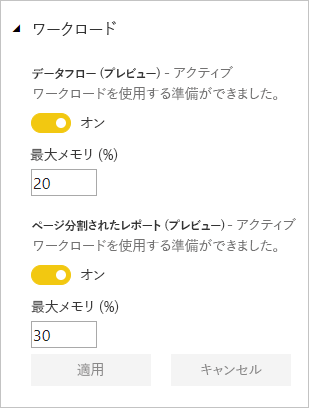
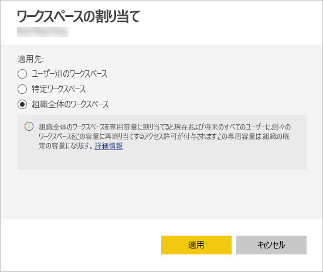

# Power BI Premium および Power BI Embedded の容量を管理する

Power BI Premium および Power BI Embedded の容量を管理する方法について説明します。これにより、ご利用のコンテンツに専用のリソースが提供されます。

## 容量とは

*容量*は Power BI Premium および Power BI Embedded サービスの中核となるものです。 容量は、組織専用に予約されたリソースのセットです。 専用の容量を持つことで、組織全体のユーザー用にユーザーごとのライセンスを購入しなくても、これらのユーザーに対してダッシュボード、レポート、データセットを公開できます。 また、それによって、容量内でホストされているコンテンツに対して信頼性の高い、一貫性のあるパフォーマンスも提供されます。 詳しくは、「[Power BI Premium - what is it?](service-premium.md)」 (Power BI Premium とは) を参照してください。

### 容量管理者

*容量の容量管理者*として容量に割り当てられたユーザーは、容量とその管理機能を完全に制御できます。 Power BI 管理ポータルでは、さらに容量管理者を追加したり、ユーザーに容量割り当てのアクセス許可を付与したりできます。 容量にワークスペースを一括して割り当て、容量の使用状況の指標を表示できます。

> [!NOTE]
> Power BI Embedded の場合、容量管理者は Microsoft Azure portal 内で定義されます。

容量にはそれぞれ独自の管理者がいます。 1 つの容量に容量管理者を割り当てても、組織内のすべての容量へのアクセス権をその管理者に与えることにはなりません。 既定では、容量管理者がアクセスできない Power BI 管理領域があります (利用状況の指標、監査ログ、テナント設定など)。 また、容量管理者には、新しい容量の設定または既存容量の SKU の変更を行うアクセス許可はありません。 これらの項目にアクセスできるのは、Office 365 全体管理者または Power BI サービス管理者だけです。

すべての Office 365 全体管理者と Power BI サービス管理者は、自動的に、Power BI Premium 容量と Power BI Embedded 容量の両方の容量管理者になります。

## 容量を購入する

専用の容量を利用するには、Office 365 管理センター内で Power BI Premium を購入するか、Microsoft Azure portal 内で Power BI Embedded リソースを作成する必要があります。 詳しくは、次の各記事をご覧ください。

* **Power BI Premium:** [Power BI Premium の購入方法](service-admin-premium-purchase.md)

* **Power BI Embedded:** [Azure Portal での Power BI Embedded 容量の作成](https://docs.microsoft.com/azure/power-bi-embedded/create-capacity)

Power BI Premium または Embedded SKU を購入すると、実行している容量で使うための、対応する数の仮想コアがご利用のテナントに届きます。 たとえば、Power BI Premium P3 SKU を購入すると、32 個の仮想コアがテナントに提供されます。 SKU の詳細については、「[Premium 容量ノード](service-premium.md#premium-capacity-nodes)」を参照してください。

## ユーザーに表示される Premium

ほとんどの場合、ユーザーは自分が Premium 容量を使用していることを認識する必要はありません。 ユーザーのダッシュボードとレポートが機能します。 視覚的ヒントとして、Premium 容量内のワークスペースの横にひし形のアイコンが表示されます。

## ワークロードを構成する

既定では、Power BI Premium と Power BI Embedded の容量でサポートされるのは、クラウド内で実行中の Power BI クエリに関連付けられているワークロードのみです。 現在では、2 つの追加ワークロード (**ページ分割されたレポート**および**データフロー**) に対応したプレビュー版サポートが用意されています。 詳細については、「[Premium 容量内のワークロード](service-premium.md#workloads-in-premium-capacity)」を参照してください。

Power BI 管理ポータルでワークロードを有効にするには、次の手順に従います。

1. **[容量の設定]** で容量を選択します。

1. **[その他のオプション]** で **[ワークロード]** を展開します。

1. 1 つ以上のワークロードを有効にして、**[最大メモリ]** の値を設定します。

    

1. **[適用]** を選びます。

## 容量の使用状況の監視

Power BI は、容量の使用状況を監視するアプリを提供します。 詳細については、「[Monitor Power BI Premium capacities in your organization](service-admin-premium-monitor-capacity.md)」(組織で Power BI Premium 容量を監視する) を参照してください。

## 容量の管理

Office 365 で容量ノードを購入したら、Power BI 管理ポータルで容量を設定します。 ポータルの **[容量の設定]** セクションで、Power BI Premium 容量を管理します。

容量を管理するには、容量の名前を選びます。 これにより容量管理の画面に移動します。

容量にワークスペースが割り当てられていない場合は、[容量へのワークスペースの割り当て](#assign-a-workspace-to-a-capacity)に関するメッセージが表示されます。

### 新しい容量の設定 (Power BI Premium)

管理ポータルには、*仮想コア*について、既に使用されている数と、まだ利用可能な数が表示されます。 仮想コアの合計数は、購入した Premium SKU に基づいています。 たとえば、P3 および P2 を購入すると、48 個のコア (P3 から 32 個、P2 から 16 個) を利用できます。

利用可能な仮想コアがある場合は、次の手順に従って使用する新しい容量を設定します。

1. **[新しい容量をセットアップする]** を選択します。

1. 使用する容量に名前を付けます。

1. この容量に管理者を定義します。

1. 容量のサイズを選びます。 指定できるオプションは、利用可能な仮想コアの数によって異なります。 利用可能な数より多いオプションは選ぶことができません。

    

1. **[セットアップ]** を選択します。

    

容量管理者、および Power BI 管理者と Office 365 全体管理者は、管理ポータル内に一覧表示される容量を確認できます。

### 容量の設定

1. Premium 容量管理の画面で、**[アクション]** の下にある**歯車アイコン**を選択して設定を確認および更新します。 

    

1. サービス管理者、容量の SKU/サイズ、容量があるリージョンを表示できます。

    

1. 容量の名前の変更または容量の削除を行うこともできます。

    

> [!NOTE]
> Power BI Embedded の容量の設定は、Microsoft Azure portal で管理します。

### 容量サイズの変更

Power BI 管理者と Office 365 全体管理者は、Power BI Premium の容量を変更できます。 Power BI 管理者または Office 365 全体管理者ではない容量管理者は、これを行うことはできません。

1. **[容量サイズを変更します]** を選択します。

    

1. **[容量サイズを変更します]** 画面で、必要に応じて、ご利用の容量をアップグレードまたはダウングレードします。

    

    管理者は、必要な数の仮想コアがある限り、ノードの作成、サイズ変更、削除を自由に行うことができます。

    P SKU を EM SKU にダウングレードすることはできません。 無効なオプションをポイントすると説明が表示されます。

### ユーザーのアクセス許可を管理する

追加で容量管理者を割り当てることも、*容量の割り当て*のアクセス許可を持つユーザーを割り当てることもできます。 割り当てのアクセス許可を持つユーザーは、アプリ ワークスペースの管理者である場合、容量にそのワークスペースを割り当てることができます。 また、個人の*マイ ワークスペース*を容量に割り当てることもできます。 割り当てのアクセス許可を持つユーザーには、管理ポータルへのアクセス権はありません。

> [!NOTE]
> Power BI Embedded の場合、容量管理者は Microsoft Azure portal 内で定義されます。

**[ユーザーのアクセス許可]** の下にある **[割り当てのアクセス許可を持つユーザー]** を展開してから、必要に応じてユーザーまたはグループを追加します。

## 容量にワークスペースを割り当てる

ワークスペースを容量に割り当てるには、管理者ポータル内で行う方法とアプリ ワークスペースから行う方法の 2 通りがあります。

### 管理ポータルで割り当てる

容量管理者と、Power BI 管理者および Office 365 全体管理者は、管理ポータルの Premium 容量管理セクション内でワークスペースを一括で割り当てることができます。 容量を管理するときに、**[ワークスペース]** セクションが表示され、ここでワークスペースを割り当てることができます。

1. **[ワークスペースの割り当て]** を選択します。 このオプションは、複数の場所で使用できます。

1. **[適用対象]** を選択します。

    

   | 選択 | 説明 |
   | --- | --- |
   | **ユーザー別のワークスペース** | ユーザーまたはグループごとのワークスペースを割り当てると、これらのユーザーが所有するすべてのワークスペース (ユーザーの個人用ワークスペースを含む) が Premium 容量に割り当てられます。 これらのユーザーには、ワークスペースの割り当てアクセス許可が自動的に与えられます。 これには、別の容量に既に割り当てられているワークスペースが含まれます。 |
   | **特定ワークスペース** | 選択されている容量に割り当てる特定のワークスペースの名前を入力します。 |
   | **組織全体のワークスペース** | 組織全体のワークスペースを Premium 容量に割り当てると、組織内のすべてのアプリ ワークスペースとマイ ワークスペースがこの Premium 容量に割り当てられます。 さらに、現在および将来のすべてのユーザーに、この容量に再割り当てされた個々のワークスペースに対するアクセス許可が与えられます。 |
   | | |

1. **[適用]** を選びます。

### アプリ ワークスペースの設定から割り当てる

アプリ ワークスペースをそのワークスペースの設定から Premium 容量に割り当てることもできます。 ワークスペースを容量に移動するには、そのワークスペースに対する管理者権限と、その容量に対する容量の割り当てアクセス許可が必要です。 ワークスペース管理者は、Premium 容量からワークスペースをいつでも削除できることに注意してください。

1. アプリ ワークスペースを編集するには、省略記号 **(. . .)**、**[ワークスペースの編集]** の順に選択します。

    

1. **[ワークスペースの編集]** で、**[詳細]** を展開します。

1. このアプリ ワークスペースを割り当てる容量を選択します。

    

1. **[保存]** を選択します。

保存すると、ワークスペースと、そのすべてのコンテンツとが Premium 容量に移動されます。エンド ユーザーのエクスペリエンスが中断されることはありません。

## Power BI Report Server のプロダクト キー

Power BI 管理者ポータルの **[容量の設定]** タブでは、Power BI Report Server のプロダクト キーにアクセスできます。 これが可能なのは、グローバル管理者、または Power BI サービス管理者ロールが割り当てられているユーザーのみで、Power BI Premium SKU を購入している場合だけです。

![[容量の設定] の Power BI Report Server キー](media/service-admin-premium-manage/pbirs-product-key.png)

**[Power BI Report Server キー]** を選択すると、プロダクト キーを含むダイアログが表示されます。 これをコピーして、インストールで使用することができます。

詳細については、「[Power BI Report Server のインストール](report-server/install-report-server.md)」を参照してください。

## 次の手順

発行されたアプリを、ユーザーと共有します。 詳細については、「[Power BI でのアプリの作成および配布](service-create-distribute-apps.md)」を参照してください。

他にわからないことがある場合は、 [Power BI コミュニティで質問してみてください](http://community.powerbi.com/)。
