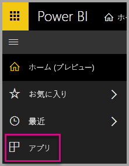
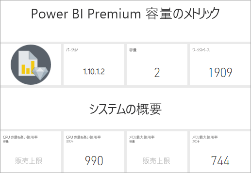
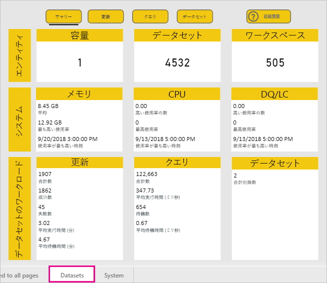
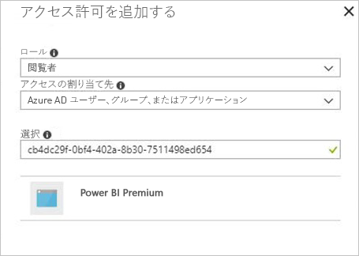
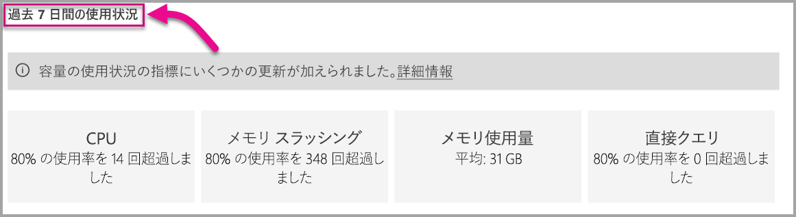

# Power BI Premium および Power BI Embedded の容量を監視する

この記事では、Power BI Premium 容量のメトリックの監視の概要について説明します。 容量の使用状況を監視することで、情報に基づいた方法で容量を監視することができます。

Power BI Premium 容量メトリック アプリまたは管理ポータルで容量を監視できます。 より多くの詳細が表示されるためアプリをお勧めしますが、この記事では両方のオプションについて説明します。

**このアプリの現在のバージョンは 1.9 です (2018 年 11 月 14 日にリリース)。**

.

<iframe width="560" height="315" src="https://www.youtube.com/embed/UgsjMbhi_Bk?rel=0&amp;showinfo=0" frameborder="0" allowfullscreen></iframe>

## Premium 容量メトリック アプリのインストール

[Premium 容量メトリック アプリ](https://app.powerbi.com/groups/me/getapps/services/capacitymetrics)に直接移動するか、Power BI の他のアプリと同じようにインストールします。

1. Power BI で **[アプリ]** をクリックします。

    

1. 右側にある **[アプリの取得]** をクリックします。

1. **[アプリ]** カテゴリで、**[Power BI Premium Capacity Metrics app]\(Power BI Premium 容量メトリック アプリ\)** を検索します。

1. サブスクライブして、アプリをインストールします。

アプリをインストールしたので、組織で容量に関するメトリックを確認できるようになりました。 利用できる主要なメトリックをいくつか見てみましょう。

## メトリックのアプリを使用する

アプリを開くと、管理者権限があるすべての容量の概要を含むダッシュボードが最初に表示されます。

ダッシュボードをクリックして、基になるレポートに移動します。 レポートには 6 つのタブがあり、それぞれ次のセクションで詳しく説明します。

* **[フィルター]**: レポート内の他のページを特定の容量へとフィルター処理できます。

* **[データセット]**: 容量内の Power BI データセットの正常性に関する詳細なメトリック。

* **[ページ分割されたレポート]**: 容量内のページ分割されたレポートの正常性に関する詳細なメトリック。

* **[データフロー]**: 容量内のデータフローの詳細な更新のメトリック。

* **[システム]**: メモリや CPU の高使用率など、全体的な容量メトリック。

* **[Display Names and IDs]\(表示名と ID\)**: 容量の名前、ID、所有者、ワークスペース、およびワークロード。

### [フィルター] タブ

**[フィルター]** タブを使用すると、容量、日付範囲、およびその他のオプションを選択できます。 その後、フィルターはレポート内のすべての関連するページおよびタイルに適用されます。 フィルターを選択しない場合、レポートは既定で、自分が所有するすべての容量の過去 1 週間のメトリックを表示します。

![[フィルター] タブ](media/service-admin-premium-monitor-capacity/filters-tab.png)

* **(A)** **[データセット]**、**[ページ分割されたレポート]**、または **[データフロー]** を選択して、各ワークロードのフィルターを設定します。

* **(B)** 名前および **(C)** 情報が **(A)** で選択した内容に基づいて更新されます。ワークロードを名前でフィルター処理することができます。 たとえば、上の画像では、**データフロー**が選択され、**データフロー名**と**データフロー情報**が表示されています。

* **(D)** 容量情報。容量に対してデータセット、ページ分割されたレポート、またはデータフローが有効かどうかを示します。

### データセット タブ

**[データセット]** タブの上部にあるボタンを使用して、次に示すさまざまな領域に移動します: **[概要]**、**[Refreshes]\(更新\)**、**[Query Durations]\(クエリ実行時間\)**、**[Query Waits]\(クエリ待機時間\)**、および **[データセット]**。

#### [概要] 領域

**[概要]** 領域には、エンティティ、システム リソース、およびデータセット ワークロードに基づく容量のビューが表示されます。 表示されるメトリックは次のとおりです。

| **レポート セクション** | **メトリック** |
| --- | --- |
| **エンティティ** | * 自分が所有する容量の数  * 容量内の個別データセットの数  * 容量内の個別ワークスペースの数 |
| **システム** | * 過去 7 日間の平均メモリ使用量 (GB)  * 過去 7 日間の最高メモリ消費量 (GB) およびそれが発生したローカル時刻  * 過去 7 日間で CPU がしきい値の 80% を超えた回数 (3 分間のバケットに分割)  * 過去 7 日間で CPU が 80% を超えた最大回数 (1 時間のバケットに分割) およびそれが発生したローカル時刻  * 過去 7 日間で直接クエリ/ライブ接続がしきい値の 80% を超えた回数 (3 分間のバケットに分割)  * 過去 7 日間で直接クエリ/ライブ接続が 80% を超えた最大回数 (1 時間のバケットに分割) およびそれが発生したローカル時刻 |
| **データセットのワークロード** | * 過去 7 日間の更新の合計数  * 過去 7 日間の成功した更新の合計数  * 過去 7 日間の失敗した更新の合計数  * メモリ不足によって失敗した更新の合計数  * 平均更新時間は操作完了にかかった時間 (分)  * 更新の平均待機時間はスケジュールされた時間と操作の開始の間の平均ラグ (分)  * 過去 7 日間のクエリ実行の合計数  * 過去 7 日間の成功したクエリの合計数  * 過去 7 日間の失敗したクエリの合計数  * 平均クエリ時間は操作完了にかかった時間 (分)  * メモリ不足により解放されたモデルの合計数  * データセットの平均サイズ   * メモリに読み込まれるデータセットの平均数 |
|  |  |

#### [Refreshes]\(更新\) タブ

**[Refreshes]\(更新\)** 領域には次のメトリックが含まれています。

| **レポート セクション** | **メトリック** |
| --- | --- |
| **Refresh reliability\(更新の信頼性\)** | * Total Count\(合計数\): 各データセットの合計更新数  * 信頼性: 各データセットの完了した更新の割合  * Avg Wait Time\(平均待機時間\): データセットの更新のスケジュールされた時間と開始の間の平均ラグ (分)  * Max Wait Time\(最大待機時間\): データセットの最大待機時間 (分)   * Avg Duration\(平均実行時間\): データセットの更新の平均実行時間 (分)  * Max Duration\(最大実行時間\): データセットの最も時間のかかる更新の実行時間 (分) |
| **Top 5 Datasets by Average Refresh Duration\(上位 5 件のデータセット (平均更新時間別)\)** | * 平均更新時間 (分) が最も長い 5 件のデータセット |
| **Top 5 Datasets by Average Wait Time\(上位 5 件のデータセット (平均待機時間別)\)** | * 更新の平均待機時間 (分) が最も長い 5 件のデータセット |
| **Hourly Average Refresh Wait Times\(1 時間ごとの更新の平均待機時間\)** | * 更新の平均待機時間 (1 時間のバケットに分割、ローカル時刻で報告)。 更新待機時間の増加を伴う複数のスパイクは、容量に波があることを示しています。 |
| **Hourly Refresh Count and Memory Consumption\(1 時間ごとの更新数とメモリ消費量\)** | * 成功数、失敗数、およびメモリ消費量 (1 時間のバケットに分割、ローカル時刻で報告) |
|  |  |

#### [Query Durations]\(クエリ実行期間\) 領域

**[Query Durations]\(クエリ実行時間\)** 領域には次のメトリックが含まれています。

| **レポート セクション** | **メトリック** |
| --- | --- |
| **Query Durations\(クエリ実行時間\)** | * このセクションのデータは、過去 7 日間におけるデータセット、ワークスペース、および時間単位のバケット数によって分割されます  * 合計: データセットに対して実行されたクエリの合計数  * 平均: データセットの平均クエリ時間 (ミリ秒)  * 最大: データセット内の最も時間のかかるクエリの実行時間 (ミリ秒)|
| **Query Duration Distribution\(クエリ実行時間の分布\)** | * クエリ実行時間ヒストグラムは、クエリ実行時間 (ミリ秒) を次のカテゴリに分類して収集したものです: 30 ミリ秒以下、30 ミリ秒から 100 ミリ秒、100 ミリ秒から 300 ミリ秒、300 ミリ秒から 1 秒、1 秒から 3 秒、3 秒から 10 秒、10 秒から 30 秒、および 30 秒より長い間隔。 クエリ実行時間と待機時間が長い場合は、容量に波があることを示しています。 また、1 つのデータセットが問題の原因であり、さらなる調査が必要であることを意味する可能性もあります。 |
| **Top 5 Datasets by Average Wait Time\(上位 5 件のデータセット (平均実行時間別)\)** | * 平均クエリ時間 (ミリ秒) が最も長い 5 件のデータセット |
| **Direct Query / Live Connections (> 80% Utilization)\(直接クエリ/ライブ接続 (80% を超える使用率)\)** | * 直接クエリまたはライブ接続が CPU 使用率 80% を超えた時間 (1 時間のバケットに分割、ローカル時刻で報告) |
| **Hourly Query Duration Distributions\(1 時間ごとのクエリ実行時間の分布\)** | * クエリ数と平均実行時間 (ミリ秒) に対するメモリ消費量 (GB) (1 時間のバケットに分割、ローカル時刻で報告) |
|  |  |

#### [クエリ待機期間] 領域

**[Query Waits]\(クエリ待機時間\)** 領域には次のメトリックが含まれています。

| **レポート セクション** | **メトリック** |
| --- | --- |
| **Query Wait Times\(クエリ待機時間\)** | * このセクションのデータは、過去 7 日間におけるデータセット、ワークスペース、および時間単位のバケット数によって分割されます  * 合計: データセットに対して実行されたクエリの合計数  * Wait count\(待機数\): 実行を開始する前にシステム リソースを待機していたデータセット内のクエリの数   * 平均: データセットのクエリの平均待機時間 (ミリ秒)  * 最大: データセット内のクエリの最も長い待機時間 (ミリ秒)|
| **Wait Time Distribution\(待機時間の分布\)** | * クエリ実行時間ヒストグラムは、クエリ実行時間 (ミリ秒) を次のカテゴリに分類して収集したものです: 50 ミリ秒以下、50 ミリ秒から 100 ミリ秒、100 ミリ秒から 200 ミリ秒、200 ミリ秒から 400 ミリ秒、400 ミリ秒から 1 秒、1 秒から 5 秒、5 秒より長い間隔 |
| **Top 5 Datasets by Average Wait Time\(上位 5 件のデータセット (平均待機時間別)\)** | * クエリの実行を開始するまでの平均待機時間 (ミリ秒) が最も長い 5 件のデータセット |
| **Hourly Query Wait Counts and Times\(1 時間ごとのクエリの待機数と時間\)** | * クエリ待機数と平均待機時間 (ミリ秒) に対するメモリ消費量 (GB) (1 時間のバケットに分割、ローカル時刻で報告) |
|  |  |

#### [データセット] 領域

**[データセット]** 領域には次のメトリックが含まれています。

| **レポート セクション** | **メトリック** |
| --- | --- |
| **Dataset Eviction Counts\(データセットの削除数\)** | * 合計: 容量ごとのデータセットの*削除*の合計数。 容量でメモリ不足が発生した場合は、ノードでメモリから 1 つまたは複数のデータセットが削除されます。 非アクティブなデータセット (現在、実行している操作のクエリ/更新なし) が最初に削除されます。 次に、削除の順序は、'最も長く使われていない' (LRU) のメジャーに基づいています。|
| **Hourly Dataset Evictions and Memory Consumption\(1 時間ごとのデータセットの削除数とメモリ消費量\)** | * データセットの削除数に対するメモリ消費量 (GB) (1 時間のバケットに分割、ローカル時刻で報告) |
| **Hourly Loaded Dataset Counts**\(1 時間ごとに読み込まれたデータセットの数\) | * メモリに読み込まれるデータセット数に対するメモリ消費量 (GB) (1 時間のバケットに分割、ローカル時刻で報告) |
| **Data Sizes**\(データ サイズ\)  | * 最大サイズ: 表示されている期間のデータセットの最大サイズ (MB) |
|  |  |

### [ページ分割されたレポート] タブ

**[ページ分割されたレポート]** タブには、容量内のページ分割されたレポートの正常性に関する詳細なメトリックが表示されます。

![[ページ分割されたレポート] タブ](media/service-admin-premium-monitor-capacity/paginated-reports-tab.png)

**[ページ分割されたレポート]** タブには次のメトリックが含まれています。

| **レポート セクション** | **メトリック** |
| --- | --- |
| **Overall usage\(全体の使用状況\)** | * Total Views\(合計表示回数\): レポートがユーザーによって表示された回数  * 行数: レポート内のデータの行数  * Retrieval (avg)\(取得 (平均)\): レポートのデータの取得にかかる平均時間 (ミリ秒)。 この時間が長い場合は、低速クエリまたはデータ ソースのその他の問題を示している可能性があります。   * Processing (avg)\(処理 (平均)\): レポートのデータの処理にかかる平均時間 (ミリ秒) * Rendering (avg)\(表示 (平均)\): ブラウザーでのレポートの表示にかかる平均時間 (ミリ秒)  * 合計時間: レポートのすべてのフェーズにかかる時間 (ミリ秒)|
| **Top 5 Reports by Average Data Retrieval Time\(上位 5 件のレポート (平均データ取得時間別)\)** | * 平均データ取得時間 (ミリ秒) が最も長い 5 件のレポート |
| **Top 5 Reports by Average Report Processing Time\(上位 5 件のレポート (平均レポート処理時間別)\)** | * 平均レポート処理時間 (ミリ秒) が最も長い 5 件のレポート |
| **Hourly Durations\(1 時間ごとの実行時間\)** | * データ取得時間に対するデータ処理時間とデータ表示時間 (1 時間のバケットに分割、ローカル時刻で報告) |
| **Hourly Results\(1 時間ごとの結果\)** | * 成功数、失敗数、およびメモリ消費量 (1 時間のバケットに分割、ローカル時刻で報告) |
|  |  |

### [データフロー] タブ

**[データフロー]** タブには、容量内のデータフローの詳細な更新のメトリックが表示されます。

![[データフロー] タブ](media/service-admin-premium-monitor-capacity/dataflows-tab.png)

**[データフロー]** タブには次のメトリックが含まれています。

| **レポート セクション** | **メトリック** |
| --- | --- |
| **Refresh\(更新\)** | * 合計: 各データフローの合計更新数  * 信頼性: 各データフローの完了した更新の割合  * Avg Wait Time\(平均待機時間\): データフローの更新のスケジュールされた時間と開始の間の平均ラグ (分)  * Max Wait Time\(最大待機時間\): データフローの最大待機時間 (分)   * Avg Duration\(平均実行時間\): データフローの更新の平均実行時間 (分)  * Max Duration\(最大実行時間\): データフローの最も時間のかかる更新の実行時間 (分) |
| **Top 5 dataflows by Average Refresh Duration\(上位 5 件のデータフロー (平均更新時間別)\)** | * 平均更新時間 (分) が最も長い 5 件のデータフロー |
| **Top 5 dataflows by Average Wait Time\(上位 5 件のデータフロー (平均待機時間別)\)** | * 更新の平均待機時間 (分) が最も長い 5 件のデータフロー |
| **Hourly Average Refresh Wait Times\(1 時間ごとの更新の平均待機時間\)** | * 更新の平均待機時間 (1 時間のバケットに分割、ローカル時刻で報告)。 更新待機時間の増加を伴う複数のスパイクは、容量に波があることを示しています。 |
| **Hourly Refresh Count and Memory Consumption\(1 時間ごとの更新数とメモリ消費量\)** | * 成功数、失敗数、およびメモリ消費量 (1 時間のバケットに分割、ローカル時刻で報告) |
|  |  |

### システム タブ

**[システム]** タブには、すべての容量とワークロードにわたる CPU とメモリの消費量が表示されます。

**[システム]** タブには次のメトリックが含まれています。

| **レポート セクション** | **メトリック** |
| --- | --- |
| **CPU Metrics (> 80% Utilization)\(CPU のメトリック (80% を超える使用率)\)** | * 過去 7 日間で CPU がしきい値の 80% を超えた回数 (3 分間のバケットに分割) |
| **メモリ消費量** | * 過去 7 日間のメモリ消費量 (3 分間のバケットに分割) |
|  |  |

### [Display Names and IDs]\(表示名と ID\) タブ

**[Display Names and IDs]\(表示名と ID\)** タブには、容量の名前、ID、所有者、ワークスペース、およびワークロードが含まれています。

## Power BI Embedded 容量を監視する

Power BI Premium 容量メトリック アプリを使用して、Power BI Embedded の *A SKU* 容量を監視することもできます。 これらの容量は、容量の管理者であればレポートに表示されます。 ただし、A SKU で Power BI に特定のアクセス許可を付与しない限り、レポートの更新は失敗します。

1. Azure Portal で容量を開きます。

1. **[アクセス制御 (IAM)]** をクリックして、リーダー ロールに "Power BI Premium" を追加します。 名前でアプリを検索できない場合は、クライアント ID (cb4dc29f-0bf4-402a-8b30-7511498ed654) で追加することもできます。

    

> [!NOTE]
> アプリまたは Azure Portal でPower BI Embedded 容量使用率を監視することができますが、Power BI 管理ポータルではできません。

## 管理ポータルでの基本的な監視

管理者ポータルの **[容量の設定]** 領域では、容量によって過去 7 日間に置かれた負荷と使用されたリソースを示す、4 つのゲージが表示されます。 これら 4 つのタイルは 1 時間単位の時間枠に基づき、過去 7 日間で対応するメトリックが何時間 80% を超えたかを示します。 このメトリックは、エンドユーザーのエクスペリエンスが低下する可能性を示します。

| **メトリック** | **説明** |
| --- | --- |
| CPU |CPU 使用率が 80% を超えた回数です。 |
| メモリ スラッシング |バックエンド コアのメモリ負荷を表します。 具体的には、これは、複数のデータセットの使用によるメモリ負荷により、データセットがメモリから締め出された回数のメトリックです。 |
| メモリ使用量 |平均メモリ使用量です (ギガバイト (GB) 単位)。 |
| DQ/秒 | 直接クエリとライブ接続の数が上限の 80% を超えた回数です。   * DirectQuery の合計数と 1 秒あたりのライブ接続クエリの数を制限しています。* 制限は、P1 で 30/秒、P2 で 60/秒、 P3 で 120/秒です。 * 直接クエリとライブ接続クエリの数は、上記のスロットルに追加されます。 たとえば、15 の DirectQueries と 1 秒あたり 15 のライブ接続がある場合、スロットルに達しています * これはオンプレミスおよびクラウドの接続にも等しく適用されます。 |
|  |  |

メトリックは、過去 1 週間の使用状況を反映します。  メトリックをさらに詳細に見たい場合は、概要タイルのいずれかをクリックします。  Premium 容量の各メトリックの詳細グラフが表示されます。 CPU のメトリックの詳細を次の図に示します。

これらのグラフは、過去 1 週間について 1 時間ごとに集計され、Premium 容量で特定のパフォーマンス関連イベントが発生した可能性があるときを特定するのに役立ちます。

いずれかのメトリックの基になっているデータを、csv ファイルにエクスポートすることもできます。  エクスポートすると、過去 1 週間の詳細情報を 3 分間隔で見ることができます。

## 次の手順

Power BI Premium 容量を監視する方法について学習したので、容量の最適化について学習します。

> [!div class="nextstepaction"]
> [Power BI Premium 容量のリソースの管理と最適化](service-premium-understand-how-it-works.md)
