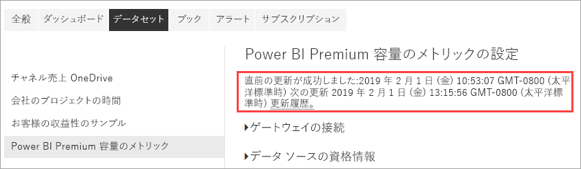

# アプリで Premium 容量を監視する

Premium 容量リソースを最適に利用するにはどうすればよいかを十分な情報に基づいて判断するには、ご利用の容量を監視することが不可欠です。 管理ポータルまたは **Power BI Premium 容量メトリック** アプリで容量を監視できます。 この記事では、Premium 容量メトリック アプリの使い方について説明します。 このアプリを使用すると、自分の容量がどのように活用されているかについて非常に詳細な情報を得ることができます。 過去 7 日間の平均使用量のメトリックに関する大まかな概要は、管理ポータルを使用して確認できます。 このポータルでの監視の詳細については、[管理ポータルでの Premium 容量の管理](service-admin-premium-monitor-portal.md)に関するページを参照してください。

アプリは定期的に新しい機能によって更新されます。 最新のバージョンが実行されていることを確認してください。   
**アプリの最新バージョンは 1.10.1.2 (2019 年 2 月 22 日) です**。   
アプリの以前のバージョンが既にインストールされている場合は、それをご利用のアプリの中から削除し、Ctrl + F5 キーを押して更新することをお勧めします。 

## アプリをインストールする

[Premium 容量メトリック アプリ](https://app.powerbi.com/groups/me/getapps/services/capacitymetrics)に直接移動するか、Power BI の他のアプリと同じようにインストールします。

1. Power BI で **[アプリ]** をクリックします。   
    

2. 右側にある **[アプリの取得]** をクリックします。
3. **[アプリ]** カテゴリで、**[Power BI Premium Capacity Metrics app]\(Power BI Premium 容量メトリック アプリ\)** を検索します。
4. サブスクライブして、アプリをインストールします。

しばらくお待ちください。 インストールおよびメトリックの更新には数分かかります。 アプリに空のメトリックスが表示される場合は、F5 キーを押してブラウザーを更新します。

## アプリの更新履歴を取得する

ご使用の Premium 容量メトリック アプリが最後に更新された時刻を確認するには、**[設定]** > **[データセット]** > **[Power BI Premium Capacity Metrics app]\(Power BI Premium 容量メトリック アプリ\)** > **[更新履歴]** の順にクリックします。 

![[設定] での更新履歴](media/settings-refresh-history.png)

最終更新日時が表示されます。スケジュールされた更新またはオンデマンドの更新を参照するには **[更新履歴]** をクリックしてください。

## アプリで容量を監視する

アプリをインストールしたので、組織で容量に関するメトリックを確認できるようになりました。 アプリでは、メトリックの概要を含む[ダッシュボード](#Dashboard)と、詳細なメトリックの[レポート](#Reports)が提供されます。

### ダッシュボード

自分が管理者となっている容量の主要メトリックをまとめたダッシュボードを表示するには、**[ダッシュボード]** で、**[Power BI Premium Capacity Metrics]\(Power BI Premium 容量のメトリック\)** をクリックします。 ダッシュボードが表示されます。

このダッシュボードには次のメトリックが含まれています。

#### 上

| 指標 | 説明 |
| --- | --- |
| バージョン | アプリのバージョンです。 | 
| 容量 | 自分が管理者となる容量の数です。 | 
| ワークスペース | メトリックを報告する容量内のワークスペースの数です。|
|||

#### システムの概要

| 指標 | 説明 |
| --- | --- |
| CPU の使用率が最も高い容量 | 過去 7 日間で CPU がしきい値の 80% を超えた回数が最大だった容量です。 |
| CPU の最も高い使用率の数 | 過去 7 日間で CPU の名前付き容量がしきい値の 80% を超えた回数です。 | 
| メモリ使用率が最大の容量 | 過去 7 日間で最大メモリ制限に達した回数が最大だった容量です (3 分間のバケットに分割)。  |
| メモリ最大使用率の数| 過去 7 日間で名前付き容量が最大メモリ制限に達した回数です (3 分間のバケットに分割)。 |
|||

#### データセットの概要

| 指標 | 説明 |
| --- | --- |
| データセット | ご自分の容量内のすべてのワークスペース全体のデータセットの総数です。|
| データセットの平均サイズ (MB) | ご自分の容量内のすべてのワークスペース全体のデータセットの平均サイズです。|  
| データセットの平均読み込み回数 | データセットがメモリに読み込まれた平均回数です。 |  
| データセット - アクティブなデータセットの平均 (%)| 過去 7 日間でアクティブだったデータセットの平均です。 過去 3 分間にユーザーがビジュアル上で操作したデータセットがアクティブとして定義されます。 |
| CPU - データセットの最大 (%)| 過去 7 日間のデータセットのワークロードによる最大 CPU 消費量です。 |
| CPU - データセットの平均 (%)| 過去 7 日間のデータセットのワークロードによる平均 CPU 消費量です。 |
| メモリ - データセットの平均 (GB) | 過去 7 日間のデータセットのワークロードによる平均メモリ消費量です。 |
| メモリ - データセットの最大 (GB) | 過去 7 日間のデータセットのワークロードによる最大メモリ消費量です。|
| データセットの削除数 | メモリ不足により削除されたデータセットの合計数です。 |
| DirectQuery/ライブの高い使用率の数| 過去 7 日間で DirectQuery/ライブ接続がしきい値の 80% を超えた回数です (3 分間のバケットに分割)。 |
| DirectQuery/ライブの最大使用率の数| 過去 7 日間で DirectQuery/ライブ接続が 80% を超えた最大回数です (1 時間のバケットに分割)。 |
| DirectQuery/ライブの最高使用率 | 過去 7 日間で DirectQuery/ライブ接続がしきい値の 80% を超えた最大回数です (3 分間のバケットに分割)。|
| DirectQuery/ライブの最大発生時刻 | DirectQuery/ライブ接続が 80% を超えた回数が 1 時間で最も多かったローカル時間です。 |
| 更新の合計 | 過去 7 日間の更新の合計数です。 |
| 更新の信頼性 (%) | 過去 7 日間で成功した更新を更新の合計数で割った数です。 |
| 更新の平均実行時間 (分) | 更新を完了するのにかかった平均時間です。 |
| 更新の平均待機時間 (分)| 更新が開始されるまでの平均時間です。 |
| クエリの合計 |  過去 7 日間のクエリ実行の合計数です。 |
| クエリの合計待機数 | 実行の前に待機したクエリの合計数です。 |
| クエリの平均実行時間 (ミリ秒) | クエリを完了するのにかかった平均時間です。 |
| クエリの平均待機時間 (ミリ秒) | クエリが実行前にシステム リソースを待機した平均時間です。 |
|||

#### データフローの概要

| 指標 | 説明 |
| --- | --- |
| データフロー |  ご自分の容量内のすべてのワークスペース全体のデータフローの総数です。|
| 更新の合計 | 過去 7 日間の更新の合計数です。|  
| 更新の平均実行時間 (分) | 更新を完了するのにかかった時間です。 |
| 更新の平均待機時間 (分) | スケジュールされた時間と更新の実際の開始の間のラグです。|
| CPU - データフローの最大 (%) | 過去 7 日間のデータフローのワークロードによる最大 CPU 消費量です。 |
| CPU - データフローの平均 (%) | 過去 7 日間のデータフローのワークロードによる平均 CPU 消費量です。 |
| メモリ - データフローの最大 (GB) | 過去 7 日間のデータフローのワークロードによる最大メモリ消費量です。 |
| メモリ - データフローの平均 (GB) | 過去 7 日間のデータフローのワークロードによる平均メモリ消費量です。 |
|||

#### ページ分割されたレポートの概要

| 指標 | 説明 |
| --- | --- |
| ページ分割されたレポート |  ご自分の容量内のすべてのワークスペース全体のページ分割されたレポートの総数です。 |
| 合計閲覧数 | すべてのレポートがユーザーに閲覧された合計回数です。 | 
| 行の合計 | すべてのレポート内のデータ行の合計数です。|
| 合計時間 | 全レポートのすべてのフェーズ (データ取得、処理、レンダリング) にかかる合計時間です (ミリ秒)。 |
| CPU - ページ分割されたレポートの最大 (%) | 過去 7 日間のページ分割されたレポートのワークロードによる最大 CPU 消費量です。 |
| CPU - ページ分割されたレポートの平均 (%) | 過去 7 日間のページ分割されたレポートのワークロードによる平均 CPU 消費量です。 |
| メモリ - ページ分割されたレポートの最大 (GB) | 過去 7 日間のページ分割されたレポートのワークロードによる最大メモリ消費量です。 |
| メモリ - ページ分割されたレポートの平均 (GB) | 過去 7 日間のページ分割されたレポートのワークロードによる平均メモリ消費量です。 |
|||

### レポート

レポートではより詳細なメトリックが提供されます。 自分が管理者である容量のレポートを表示するには、**[レポート]** で、**[Power BI Premium Capacity Metrics]\(Power BI Premium 容量のメトリック\)** をクリックします。 または、ダッシュボードから、メトリックのセルをクリックして基になっているレポートに移動します。 

レポートの下部には、次の 5 つの "*タブ*" があります。

[**[データセット]**](#datasets) - ご自分の容量内の Power BI データセットの正常性に関する詳細なメトリックを表示します。   
[**[ページ分割されたレポート]**](#paginated-reports) - ご自分の容量内のページ分割されたレポートの正常性に関する詳細なメトリックを表示します。   
[**[データフロー]**](#dataflows) - ご自分の容量内のデータフローの詳細な更新のメトリックを表示します。   
[**[リソース消費]**](#resource-consumption) - メモリや CPU の高使用率など、全体的な容量メトリックを表示します。    
[**[ID と情報]**](#ids-and-info) - 容量、ワークスペース、およびワークロードの名前、ID、および所有者。

各タブでページが開き、容量や日付の範囲でメトリックをフィルター処理できます。 フィルターが選択されていない場合、メトリックを報告しているすべての容量に対して、過去 1 週間のメトリックが既定でレポートに表示されます。 

### データセット

データセットのページにはさまざまな "*領域*" があります。**[Refreshes]\(更新\)**、**[クエリ期間]**、**[クエリ待機]**、**[データセット]** などです。 ページの上部にあるボタンを使って、異なる領域に移動します。

#### [Refreshes]\(更新\) タブ

| レポート セクション | メトリック |
| --- | --- |
| 更新 |  合計数: 各データセットの合計更新数です。   信頼性: 各データセットの完了した更新の割合です。   Avg Wait Time\(平均待機時間\): データセットの更新のスケジュールされた時間と開始の間の平均ラグです (分)。   Max Wait Time\(最大待機時間\): データセットの最大待機時間です (分)。   Avg Duration\(平均実行時間\): データセットの更新の平均実行時間です (分)。   Max Duration\(最大実行時間\): 最も時間のかかったデータセットの更新の実行時間です (分)。 |
| 平均実行時間 (分) 別上位 5 件のデータセット |  更新の平均実行時間 (分) が最も長かった 5 件のデータセットです。 |
| 平均待機時間 (分) 別上位 5 件のデータセット |  更新の平均待機時間 (分) が最も長かった 5 件のデータセットです。 |
| 1 時間ごとの更新数とメモリ消費量 (GB) |  成功数、失敗数、およびメモリ消費量です (1 時間のバケットに分割、ローカル時間で報告)。 |
| 1 時間ごとの更新の平均待機時間 (分) |  更新の平均待機時間です (1 時間のバケットに分割、ローカル時間で報告)。 更新待機時間の増加を伴う複数のスパイクは、容量に波があることを示しています。 |
|  |  |

#### [Query Durations]\(クエリ実行期間\) 領域

| レポート セクション | メトリック |
| --- | --- |
| クエリ期間 |  このセクションのデータは、過去 7 日間におけるデータセット、ワークスペース、および時間単位のバケットによって分割されます。   合計:データセットに対して実行されたクエリの合計数です。   平均: データセットの平均クエリ時間 (ミリ秒)   最大: データセット内で最も時間のかかったクエリの実行時間です (ミリ秒)。|
| クエリ実行時間の分布 |  クエリ実行時間ヒストグラムは、クエリ実行時間 (ミリ秒) を次のカテゴリに分類して収集したものです: 30 ミリ秒以下、30 ミリ秒から 100 ミリ秒、100 ミリ秒から 300 ミリ秒、300 ミリ秒から 1 秒、1 秒から 3 秒、3 秒から 10 秒、10 秒から 30 秒、および 30 秒より長い間隔。 クエリ実行時間と待機時間が長い場合は、容量に波があることを示しています。 また、1 つのデータセットが問題の原因であり、さらなる調査が必要であることを意味する可能性もあります。 |
| 上位 5 件のデータセット (平均期間別) |  平均クエリ実行時間 (ミリ秒) が最も長かった 5 件のデータセットです。 |
| 1 時間ごとのクエリ実行時間の分布 |  クエリ数と平均実行時間 (ミリ秒) に対するメモリ消費量 (GB) です (1 時間のバケットに分割、ローカル時間で報告)。 |
| DirectQuery / ライブ接続 (80% を超える使用率) |  DirectQuery またはライブ接続が CPU 使用率 80% を超えた時間です (1 時間のバケットに分割、ローカル時間で報告)。 |
|  |  |

#### [クエリ待機期間] 領域

| レポート セクション | メトリック |
| --- | --- |
| クエリ待機時間 |  このセクションのデータは、過去 7 日間におけるデータセット、ワークスペース、および時間単位のバケットによって分割されます。   合計:データセットに対して実行されたクエリの合計数です。   Wait count\(待機数\): 実行を開始する前にシステム リソースを待機していたデータセット内のクエリの数です。   平均: データセットのクエリの平均待機時間です (ミリ秒)。   最大: データセット内のクエリの最も長い待機時間です (ミリ秒)。|
| 上位 5 件のデータセット (平均待機時間別) |  クエリの実行を開始するまでの平均待機時間 (ミリ秒) が最も長かった 5 件のデータセットです。 |
| 待機時間の分布 |  クエリ実行時間ヒストグラムは、クエリ実行時間 (ミリ秒) によって次のカテゴリにバケット分割されます: 50 ミリ秒以下、50 から 100 ミリ秒、100 から 200 ミリ秒、200 から 400 ミリ秒、400 ミリ秒から 1 秒、1 秒から 5 秒、5 秒より長い間隔です。 |
| 1 時間ごとのクエリの待機時間の分布 |  クエリ待機数と平均待機時間 (ミリ秒) に対するメモリ消費量 (GB) です (1 時間のバケットに分割、ローカル時間で報告)。 |
|  |  |

#### [データセット] 領域

| **レポート セクション** | **メトリック** |
| --- | --- |
| データセットのサイズ  |  最大サイズ: 表示されている期間のデータセットの最大サイズです (MB)。 |
| データセットの削除数 |  合計:容量ごとのデータセットの*削除*の合計数。 容量でメモリ不足が発生した場合は、ノードでメモリから 1 つまたは複数のデータセットが削除されます。 非アクティブなデータセット (現在、実行している操作のクエリ/更新なし) が最初に削除されます。 次に、削除の順序は、'最も長く使われていない' (LRU) のメジャーに基づいています。|
| 1 時間ごとに読み込まれたデータセットの数 |  メモリに読み込まれたデータセット数に対するメモリ消費量 (GB) です (1 時間のバケットに分割、ローカル時間で報告)。 |
| 1 時間ごとのデータセットの削除数とメモリ消費量 |  データセットの削除数に対するメモリ消費量 (GB) です (1 時間のバケットに分割、ローカル時間で報告)。 |
| 消費されたメモリの割合 |  メモリ内でアクティブなデータセットの合計 (合計メモリに対する割合で示される)。 アクティブなデータセットと、解放可能なすべての define データセットとの差分。 過去 7 日間の値が時間単位で表示されます。 |
|  |  |

### ページ分割されたレポート

| **レポート セクション** | **メトリック** |
| --- | --- |
| 全体の使用状況 |  合計表示回数: レポートがユーザーによって閲覧された回数です。   行数: レポート内のデータ行の数です。   Retrieval (avg)\(取得 (平均)\): レポートのデータの取得にかかる平均時間 (ミリ秒)。 この時間が長い場合は、低速クエリまたはデータ ソースのその他の問題を示している可能性があります。    Processing (avg)\(処理 (平均)\): レポートのデータの処理にかかった平均時間 (ミリ秒) です。  Rendering (avg)\(表示 (平均)\): ブラウザーでのレポートのレンダリングにかかった平均時間 (ミリ秒) です。   合計時間: レポートのすべてのフェーズにかかった時間です (ミリ秒)。 |
| 平均データ取得時間上位 5 件のレポート |  平均データ取得時間 (ミリ秒) が最も長かった 5 件のレポートです。 |
| 平均レポート処理時間上位 5 件のレポート |  平均レポート処理時間 (ミリ秒) が最も長かった 5 件のレポートです。 |
| 1 時間ごとの結果 |  成功数、失敗数、およびメモリ消費量です (1 時間のバケットに分割、ローカル時間で報告)。 |
| 1 時間ごとの実行時間 |  データ取得に対する処理とレンダリングの時間です (1 時間のバケットに分割、ローカル時間で報告)。 |
|  |  |

### データフロー

| **レポート セクション** | **メトリック** |
| --- | --- |
| 更新 |  合計:各データフローの合計更新数です。   信頼性: 各データフローの完了した更新の割合です。   Avg Wait Time\(平均待機時間\): データフローの更新のスケジュールされた時間と開始の間の平均ラグです (分)。   Max Wait Time\(最大待機時間\): データフローの最大待機時間です (分)。   Avg Duration\(平均実行時間\): データフローの更新の平均実行時間です (分)。   Max Duration\(最大実行時間\): データフローの最も時間のかかった更新の実行時間です (分)。 |
| 上位 5 件のデータフロー (平均更新時間別) |  平均更新時間 (分) が最も長かった 5 件のデータフローです。 |
| 上位 5 件のデータフロー (平均待機時間別) |  更新の平均待機時間 (分) が最も長かった 5 件のデータフローです。 |
| 1 時間ごとの更新の平均待機時間 |  更新の平均待機時間です (1 時間のバケットに分割、ローカル時間で報告)。 更新待機時間の増加を伴う複数のスパイクは、容量に波があることを示しています。 |
| 1 時間ごとの更新数とメモリ消費量 |  成功数、失敗数、およびメモリ消費量です (1 時間のバケットに分割、ローカル時間で報告)。 |
|  |  |

### リソース消費量

| **レポート セクション** | **メトリック** |
| --- | --- |
| CPU 消費量 |  ワークロードによる消費量 (CPU の合計容量に対する割合)。 過去 7 日間の値が時間単位で表示されます。 |
| メモリ消費量 |  ワークロードによるメモリ消費量 (GB) (実線) にワークロードの上限 (点線) が重ねて表示されます。 過去 7 日間の値が時間単位で表示されます。 |
|  |  |

### ID と情報

**[ID と情報]** タブには、**[容量]**、**[ワークスペース]**、**[データセット]**、**[ページ分割されたレポート]**、**[データフロー]** の領域が含まれます。

#### [容量] 領域

| レポート セクション | メトリック |
| --- | --- |
| SKU とワークロードの情報 | 容量に対する SKU とワークロードの設定です。 |
| 管理者 | 容量の管理者の名前です。 |
|||

#### [ワークスペース] 領域

| レポート セクション | メトリック |
| --- | --- |
| ワークスペース | すべてのワークスペースの名前と ID です。 |
|||

#### [データセット] 領域

| レポート セクション | メトリック |
| --- | --- |
| データセット | すべてのデータセットのワークスペース名と ID です。 |
|||

#### [ページ分割されたレポート] 領域

| レポート セクション | メトリック |
| --- | --- |
| ページ分割されたレポート | すべてのページ分割されたレポートの名前、ワークスペース名、ID です。 |
|||

#### [データフロー] 領域

| レポート セクション | メトリック |
| --- | --- |
| データフロー | すべてのデータフローのデータフロー名、ワークスペース名、ID です。 |
|||

## Power BI Embedded 容量を監視する

Power BI Premium 容量メトリック アプリを使用して、Power BI Embedded の *A SKU* 容量を監視することができます。 これらの容量は、容量の管理者であればレポートに表示されます。 ただし、A SKU で Power BI に特定のアクセス許可を付与しない限り、レポートの更新は失敗します。

1. Azure Portal で容量を開きます。

1. **[アクセス制御 (IAM)]** をクリックしてから、閲覧者ロールに **Power BI Premium** アプリを追加します。 アプリを名前で検索できない場合は、クライアント ID で追加することもできます (`cb4dc29f-0bf4-402a-8b30-7511498ed654`)。

    

> [!NOTE]
> アプリまたは Azure Portal でPower BI Embedded 容量使用率を監視することができますが、Power BI 管理ポータルではできません。

## 次の手順

> [!div class="nextstepaction"]
> [Power BI Premium 容量のリソースの管理と最適化](service-premium-understand-how-it-works.md)
