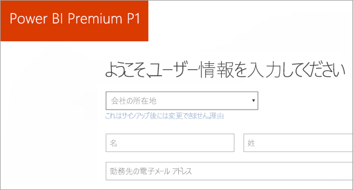
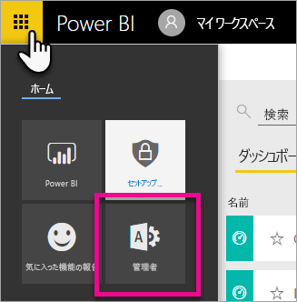
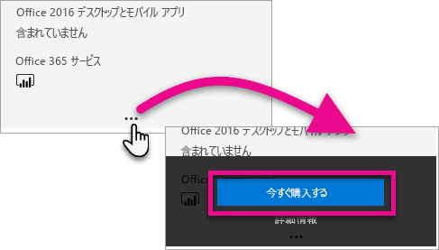
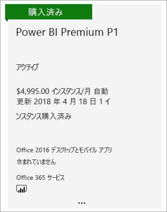
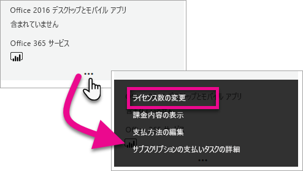
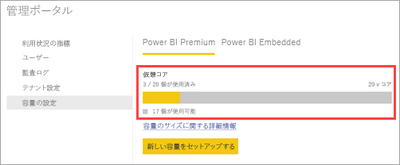
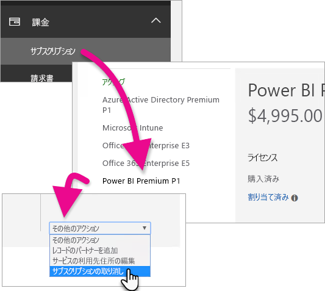
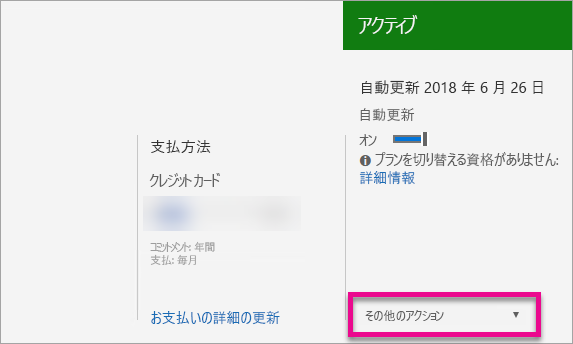

# Power BI Pro の購入方法
組織に Power BI Premium の容量を購入する方法を説明します。

<iframe width="640" height="360" src="https://www.youtube.com/embed/NkvYs5Qp4iA?rel=0&amp;showinfo=0" frameborder="0" allowfullscreen></iframe>

Office 365 管理センターを通じて、Power BI Premium の容量ノードを購入できます。 組織内で Premium 容量 SKU の任意の組み合わせ (P1 から P3) を持つこともできます。 これらは異なるリソース機能を提供します。

Power BI Premium の詳細については、「[Power BI Premium - what is it?](service-premium.md)」 (Power BI Premium とは) を参照してください。 Power BI の現在の価格を確認するには、[Power BI の料金ページ](https://powerbi.microsoft.com/pricing/)を参照してください。 [Power BI Premium 計算ツール](https://powerbi.microsoft.com/calculator/)を使用して、Power BI Premium のコストを計画することもできます。

> [!IMPORTANT]
> Power BI Premium を購入しても、コンテンツの作成者には Power BI Pro のライセンスが引き続き必要です。
> 
> 

## Power BI Premium P1 で新しいテナントを作成する
既存のテナントをお持ちでない場合は、テナントの作成と同時に Power BI Premium も購入することができます。 次のリンクをクリックすると、Office 365 で使用する新しいテナントを作成するプロセスが案内され、Power BI Premium を購入することもできます。 テナントを作成したら、Power BI Pro ライセンスを購入する必要があります。 テナントを作成すると、自動的にテナントのグローバル管理者になります。

ライセンスを購入する場合は、[「Power BI の Premium P1」](https://signup.microsoft.com/Signup?OfferId=b3ec5615-cc11-48de-967d-8d79f7cb0af1) を参照してください。

## 既存の組織用の Power BI Premium 容量を購入する
既存の組織をお持ちの場合、サブスクリプションおよびライセンスを購入するには、グローバル管理者または課金管理者のいずれかになる必要があります。 詳細については、「[Office 365 の管理者ロールについて](https://support.office.com/article/About-Office-365-admin-roles-da585eea-f576-4f55-a1e0-87090b6aaa9d)」を参照してください。

Premium 容量を購入するには、以下を行う必要があります。

1. Power BI サービス内で、**[Office 365 アプリ ピッカー]** > **[管理者]** を選択します。または、Office 365 管理センターを参照することができます。 管理センターにアクセスするには、 https://portal.office.com に移動して **[管理者]** を選択します。
   
    
2. **[請求]** > **[サービスを購入する]** を選択します。
3. **[その他のプラン]** で、Power BI Premium のオファーを探します。 これは P1 ～ P3、EM3、および P1 (月極め) として一覧表示されます。
4. **省略記号 (...)** にポインターを合わせ、**[今すぐ購入する]** を選択します。
   
    
5. 以下の手順に従って、購入を完了します。

次のリンクを選択することで、アイテムの購入ページに直接移動することもできます。 これらの SKU の詳細については、「[Power BI Premium とは](service-premium.md#premiumskus)」を参照してください。

Power BI Premium SKU を購入するには、テナント内の "***グローバル管理者または課金管理者***" である必要があります。 管理者以外が以下のリンクを選択すると、エラーが発生します。

| 直接発注リンク |
| --- |
| [EM3 (月極め) SKU](https://portal.office.com/commerce/completeorder.aspx?OfferId=4004702D-749C-4F74-BF47-3048F1833780&adminportal=1) |
| [P1 SKU](https://portal.office.com/commerce/completeorder.aspx?OfferId=b3ec5615-cc11-48de-967d-8d79f7cb0af1&adminportal=1) |
| [P1 (月極め) SKU](https://portal.office.com/commerce/completeorder.aspx?OfferId=E4C8EDD3-74A1-4D42-A738-C647972FBE81&adminportal=1) |
| [P2 SKU](https://portal.office.com/commerce/completeorder.aspx?OfferId=062F2AA7-B4BC-4B0E-980F-2072102D8605&adminportal=1) |
| [P3 SKU](https://portal.office.com/commerce/completeorder.aspx?OfferId=40c7d673-375c-42a1-84ca-f993a524fed0&adminportal=1) |

購入を完了すると、[サービスを購入する] 画面に購入したアクティブな項目が表示されます。

これで Power BI 管理センター内でこの容量を管理することができます。 詳しくは、「[Power BI Premium の管理](service-admin-premium-manage.md)」を参照してください。

## 追加の容量を購入する
あなたが管理者で、Power BI 管理者ポータルの **[Premium 設定]** セクションを表示している場合、**[購入]** ボタンが表示されます。 このボタンを使用すると、Office 365 ポータルに移動します。 Office 365 管理センターが表示されたら、次の操作を行うことができます。

1. **[請求]** > **[サービスを購入する]** を選択します。
2. **[その他のプラン]** で、追加購入する Power BI Premium の項目を探します。
3. **省略記号 (...)** にポインターを合わせ、**[ライセンス数の変更]** を選択します。
   
    
4. この項目に必要なインスタンス数を変更します。 完了したら **[送信]** を選択します。
   
   > [!IMPORTANT]
   > **[送信]** を選択すると、登録されているクレジット カードに料金が請求されます。
   > 
   > 

**[サービスを購入する]** ページに、所有しているインスタンス数が表示されます。 Power BI 管理ポータルの **[容量の設定]** で、購入した新しい容量が利用可能な仮想コア数に反映されます。

これで Power BI 管理センター内でこの容量を管理することができます。 詳しくは、「[Power BI Premium の管理](service-admin-premium-manage.md)」を参照してください。

## サブスクリプションをキャンセルする
Office 365 管理センターから、サブスクリプションのキャンセルを行うことができます。 Premium サブスクリプションをキャンセルするには、次の操作を行います。

1. Office 365 管理センターを参照します。
2. **[請求]** > **[サブスクリプション]** の順に選択します。
3. 一覧から Power BI Premium サブスクリプションを選択します。
4. **[More actions]\(その他の操作)** ドロップダウンで、**[サブスクリプションのキャンセル]** を選択します。
   
    
5. **[サブスクリプションのキャンセル]** ページに [中途解約料](https://support.office.com/article/early-termination-fees-6487d4de-401a-466f-8bc3-c0beb5cc40d3) を支払う必要があるかどうかが表示されます。 このページでは、サブスクリプションのデータが削除されるタイミングを確認することもできます。
6. 情報に目を通し、続行する場合は、**[サブスクリプションのキャンセル]** を選択します。

## 次の手順
[Power BI の料金ページ](https://powerbi.microsoft.com/pricing/)  
[Power BI Premium 計算ツール](https://powerbi.microsoft.com/calculator/)  
[Power BI Premium とは](service-premium.md)  
[Power BI Premium の管理](service-admin-premium-manage.md)  
[Power BI Premium のよく寄せられる質問](service-premium-faq.md)  
[Power BI Premium リリース ノート](service-premium-release-notes.md)  
[Microsoft Power BI Premium ホワイト ペーパー](https://aka.ms/pbipremiumwhitepaper)  
[Power BI のエンタープライズ展開の計画に関するホワイト ペーパー](https://aka.ms/pbienterprisedeploy)  
[Power BI 管理ポータル](service-admin-portal.md)  
[組織内の Power BI を管理する](service-admin-administering-power-bi-in-your-organization.md)  

他にわからないことがある場合は、 [Power BI コミュニティで質問してみてください](http://community.powerbi.com/)。

