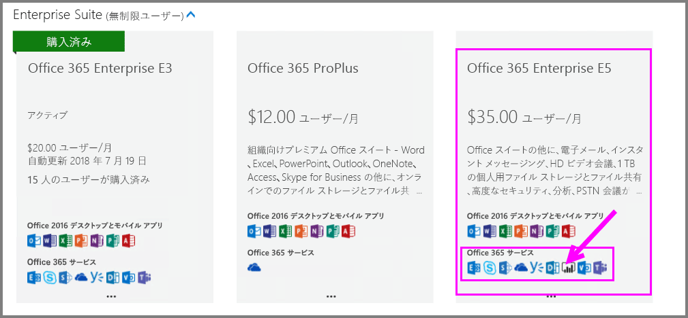
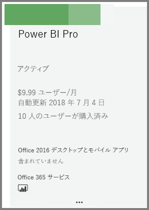
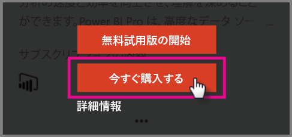
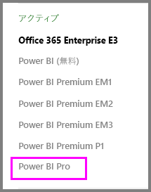

# Power BI Pro を購入する

Power BI Pro では、レポートの発行、ダッシュボードの共有、ワークスペースでの同僚とのコラボレーション、他の関連するアクティビティの実行が可能です。 組織が Power BI Pro から得られる利点の詳細については、「[組織内の Power BI Pro](service-admin-power-bi-pro-in-your-organization.md)」を参照してください。

## Office 365 管理センターからの Power BI Pro の購入

Office IT 管理者は、Office 365 Enterprise E5 サブスクリプションの一部として、または個別の Power BI Pro サブスクリプションとして、Power BI Pro を購入できます。 その後、Power BI Pro ライセンスを適切なユーザーに割り当てることができます。 ライセンスを割り当てる方法の詳細については、「[一般法人向け Office 365 ライセンスをユーザーに割り当てる](https://support.office.com/en-us/article/assign-licenses-to-users-in-office-365-for-business-997596b5-4173-4627-b915-36abac6786dc?ui=en-US&rs=en-US&ad=US)」を参照してください。

Office IT 管理者である場合は、以下の手順に従って Power BI Pro を購入します。

1. [Office 365 管理センター](https://portal.office.com/adminportal/home#/homepage)に移動します。
2. 左側のナビゲーション ウィンドウで、[課金] を選択してから [サブスクリプション] をクリックします。

    

3. [サブスクリプション] ページの右上隅にある [サブスクリプションの追加] をクリックします。

    

4. 次のようにして、目的のサブスクリプション サービスを見つけます。

    [Enterprise Suite] で、Office 365 Enterprise E5 を選択します。

    

    [その他のプラン] で、Power BI Pro を選択します。

    

5. 目的のサブスクリプションの省略記号 (...) をポイントし、[今すぐ購入] を選択します。

    

6. ご自分の状況に応じて、毎月支払うか、1 年分支払うかを選択できます。
7. [ユーザーはいくつ必要ですか?] で、必要なライセンスの数を入力してから、[今すぐ支払う] または [カートに追加] をクリックしてトランザクションを完了します。
8. [サブスクリプション] ページで取得したサブスクリプションがリストされていることを確認します。

   

> [!NOTE]
> ライセンスは、最初の購入後に追加することができます。 [サブスクリプション] ページから Power BI Pro のサブスクリプションを選択し、[ライセンスの追加/削除] をクリックします。
>

## 料金

最新の料金については、[Power BI の料金](https://powerbi.microsoft.com/en-us/pricing/)に関するページを参照してください。

## 次の手順
[Power BI のセルフサービス サインアップ](service-admin-signing-up-for-power-bi-with-a-new-office-365-trial.md)
 
[組織内の Power BI (無料)](service-admin-service-free-in-your-organization.md)
 
[組織内の Power BI Pro](service-admin-power-bi-pro-in-your-organization.md)
 
[Extended Pro Trial のアクティブ化](service-extended-pro-trial.md)
 
[Power BI Pro ライセンスの割り当て](service-admin-assigning-power-bi-pro-licenses.md)
 
[Power BI Premium とは](service-admin-premium-manage.md)
 
[Power BI Premium の購入方法](service-admin-premium-purchase.md)
 
[Power BI Premium ホワイト ペーパー](https://aka.ms/pbipremiumwhitepaper)

他にわからないことがある場合は、 [Power BI コミュニティで質問してみてください](https://community.powerbi.com/)。