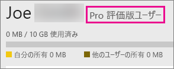

# Power BI Pro を購入する
Power BI Pro は、レポートの公開や、ダッシュボードの共有のほか、ワークスペースで仕事仲間と共同作業したり、その他の関連アクティビティを行ったりするユーザーを対象としています。たとえば、次の作業を行うことができます。

* Excel または Power BI Desktop でのデータ分析
* Excel Web App サポートの共有
* ダッシュボードの共有と、アプリ ワークスペースとの共同作業
* 共有コンテンツの表示
* Microsoft Teams とのコンテンツの統合

IT 管理者には、組織内で Power BI Pro を使用するためのオプションがいくつか用意されています。 Power BI Pro は、Office 365 管理センター、または Microsoft の担当者かパートナーを通して購入できます。 この記事では、Power BI Pro で使用可能な 2 種類の試用オプションと、組織として購入する方法を紹介します。

Power BI Premium の詳細、および Power BI Pro が Premium プランにどのように適合しているかについては、「[Power BI Premium とは](service-premium.md)」をご覧ください。

## 料金
Power BI Pro の最新の料金および含まれる機能の一覧表については、[Power BI の料金](https://powerbi.microsoft.com/pricing/)のページを参照してください。

## 現在の個人用 Power BI Pro 60 日間試用版
無料アカウントにサインアップした後、Pro 版を 60 日間無料で試用することができます。 試用期間中は Pro 版のすべての機能にアクセスできます。 Power BI Pro は、無料版 Power BI のすべての機能を備えているだけでなく、新たな共有機能やコラボレーション機能も備えています。 詳しくは、[Power BI の料金](https://powerbi.microsoft.com/pricing)に関するページをご覧ください。 60 日間無料試用版の Power BI Pro を試用するには、Power BI にサインインし、Power BI Pro 機能の 1 つを試してみてください。

* [アプリ ワークスペースの作成](service-create-distribute-apps.md)
* [ダッシュボードの共有](service-share-dashboards.md)

これらの機能を試そうとすると、無料試用版を開始するように求められます。 また、歯車アイコンをクリックして **[パーソナル ストレージの管理]** を選択することによっても使用できます。 その後、右側にある **[Pro を無料でお試しいただけます]** を選択します。

その後、**[無料体験する]** を選択します。

> [!NOTE]
> この製品内 Power BI Pro 試用版を利用するユーザーは、Office 365 の管理ポータルでは Power BI Pro 試用版ユーザーとして表示されません (Power BI 無料版ユーザーとして表示されます)。 ただし、Power BI の **記憶域の管理** ページでは Power BI Pro 試用版ユーザーとして表示されます。

> [!NOTE]
> 組織内の各ユーザーに試用期間を個別に設定するのではなく、複数のユーザー向けに Power BI 試用版ライセンスを取得し導入することをお考えの IT 管理者の皆さまは、[Power BI Pro サブスクリプション試用版](https://portal.office.com/Signup/MainSignup15.aspx?OfferId=d59682f3-3e3b-4686-9c00-7c7c1c736085&dl=POWER_BI_PRO)にサインアップしてください。 管理者向け試用版にサインアップするためには、Office 365 グローバル管理者または課金管理者であるか、あるいは新しいテナントを作成する必要があります。 詳しくは、「[Power BI Pro を購入する](service-admin-purchasing-power-bi-pro.md)」をご覧ください。

> [!NOTE]
> Power BI Premium が利用可能になり、2017 年 6 月 1 日に Power BI 無料プランが変更されたことで、Extended Pro Trial の対象となる可能性があります。 詳しくは、「[Extended Pro Trial activation](service-extended-pro-trial.md)」 (Extended Pro Trial のアクティブ化) をご覧ください。

### サービス内での表示例
サービス内で Pro 版の試用アカウントがあることを確認するには、**歯車*アイコンをクリックして **[パーソナル ストレージの管理]** を選択します。

## Office 365 でのサブスクリプション試用版
Power BI Pro を組織用の試用版として取得できます。 サブスクリプションを取得した後、Power BI Pro のライセンスをユーザーに割り当てることができます。 ライセンスの割り当てについて詳しくは、[Office 365 でのユーザーへのライセンスの割り当て](https://support.office.com/article/Assign-or-unassign-licenses-for-Office-365-for-business-997596b5-4173-4627-b915-36abac6786dc)に関するページをご覧ください。

> [!NOTE]
> 組織用の試用版は、テナントあたり 1 つしか使用できません。 これは、Power BI Pro の試用版を誰かがすでにテナントに適用している場合、もう一度適用することはできないことを意味します。 この制限についてサポートが必要な場合は、[Office 365 の課金サポート](https://support.office.microsoft.com/article/Contact-Office-365-for-business-support-Admin-Help-32a17ca7-6fa0-4870-8a8d-e25ba4ccfd4b?CorrelationId=552bbf37-214f-4202-80cb-b94240dcd671&ui=en-US&rs=en-US&ad=US#BKMK_call_support)にお問い合わせください。
> 

1. [Office 365 管理センター](https://portal.office.com/admin/default.aspx)に移動します。
2. 左側のナビゲーション ウィンドウで、[課金] > [サブスクリプション] を選択します。
3. 右側にある [サブスクリプションの追加] を選択します。
4. [その他のプラン] で、[Power BI (無料)] の欄にある省略記号 (...) にマウスを合わせ、[無料試用を開始] を選択します。
   
    
5. 注文確認画面で [今すぐ試す] を選択します。
6. 注文完了画面で [続行] を選択します。

**[課金]** > **[サブスクリプション]** に、**[Power BI Pro 試用版]** が使用可能な 25 ライセンスと共に表示されます。 これは、1 か月の試用版です。

### サービス内での表示例
サービス内で Pro 版のアカウントがあることを確認するには、**歯車**アイコンをクリックして **[パーソナル ストレージの管理]** を選択します。 試用版のユーザーであることは示されません。

## Office 365 でサブスクリプションを購入する
Office 365 管理センターを通じて、組織用に Power BI Pro を購入することができます。 サブスクリプションを取得した後、Power BI Pro のライセンスをユーザーに割り当てることができます。 ライセンスの割り当てについて詳しくは、[Office 365 でのユーザーへのライセンスの割り当て](https://support.office.com/article/Assign-or-unassign-licenses-for-Office-365-for-business-997596b5-4173-4627-b915-36abac6786dc)に関するページをご覧ください。

1. [Office 365 管理センター](https://portal.office.com/admin/default.aspx)に移動します。
2. 左側のナビゲーション ウィンドウで、[課金] > [サブスクリプション] を選択します。
3. 右側にある [サブスクリプションの追加] を選択します。
4. [その他のプラン] で、[Power BI Pro] の欄にある省略記号 (...) にマウスを合わせ、[今すぐ購入] を選択します。
   
    
5. 追加するライセンスの数を入力し、[今すぐチェックアウト] または [カートに追加] を選択します。
   
   > [!NOTE]
   > 必要に応じて後日さらに追加できます。
   > 
   > 
6. チェックアウト フローに必要な情報を入力します。

> [!NOTE]
> Power BI Pro の試用版が既に存在する場合は、必要なライセンスの数を入力するよう求めるチェックアウト画面に直接移動します。
> 
> 

**[課金]** > **[サブスクリプション]** に、**[Power BI Pro]** が表示されます。 後でライセンスの追加を決定した場合、**[サブスクリプションの追加]** に戻り、**[Change license quantity]** (ライセンス数の変更) を選択できます。

### サービス内での表示例
サービス内で Pro 版のアカウントがあることを確認するには、**歯車**アイコンをクリックして **[パーソナル ストレージの管理]** を選択します。

## 猶予期間
Power BI Pro ライセンスの有効期限が切れてから、30 日の猶予期間があります。 

Power BI Pro のサブスクリプション ライフサイクルは Office 365 と同じです。 詳しくは、「[一般法人向け Office 365 のサブスクリプションが終了したとき、データとアクセスはどうなりますか?](https://support.office.com/en-us/article/What-happens-to-my-data-and-access-when-my-Office-365-for-business-subscription-ends-4436582f-211a-45ec-b72e-33647f97d8a3)」をご覧ください。

## 次の手順
[Power BI のセルフサービス サインアップ](service-self-service-signup-for-power-bi.md)  
[組織内の Power BI (無料)](service-admin-service-free-in-your-organization.md)  
[Extended Pro Trial のアクティブ化](service-extended-pro-trial.md)  
[Power BI Premium とは](service-premium.md)  
[Power BI Premium の購入方法](service-admin-premium-purchase.md)  
[Power BI Premium ホワイト ペーパー](https://aka.ms/pbipremiumwhitepaper)  

他にわからないことがある場合は、 [Power BI コミュニティで質問してみてください](http://community.powerbi.com/)。

