# Power BI Pro のライセンスを購入して割り当てる

Power BI Pro は、Power BI サービスのすべてのコンテンツと機能へのアクセスを許可する個別のライセンスであり、他の Pro ユーザーとコンテンツを共有して共同で作業するための機能が含まれています。 Pro ユーザーだけが、アプリ ワークスペースに対するコンテンツの発行と使用、ダッシュボードの共有、ダッシュボードとレポートのサブスクライブを行うことができます。 詳細については、「[Power BI features by license type](service-features-license-type.md)」 (Power BI のライセンスの種類別機能) を参照してください。
この記事では、まず Office 365 で Power BI Pro ライセンスを購入する方法について説明します。 その後、それらのライセンスを Office 365 と Azure の個々のユーザーに割り当てる 2 種類のオプション (いずれかを選択します) について説明します。

## 前提条件

Office 365 で[**全体管理者**ロールまたは**課金管理者**](https://support.office.com/article/about-office-365-admin-roles-da585eea-f576-4f55-a1e0-87090b6aaa9d?ui=en-US&rs=en-US&ad=US) ロールのメンバーである必要があります。

Azure でライセンスの割り当てを行うユーザーは、Power BI が Active Directory 参照で使用する Azure サブスクリプションの所有者である必要があります。

## Office 365 でのライセンスの購入

Power BI Pro ライセンスを購入するには、次の手順に従います。

1. [Office 365 管理センター](https://portal.office.com/adminportal/home#/homepage)を開きます。

2. 左側のナビゲーション ウィンドウで、**[課金]** > **[サブスクリプション]** を選択します。

    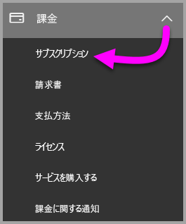

3. **[サブスクリプション]** ページの右上隅にある **[サブスクリプションの追加]** を選択します。

    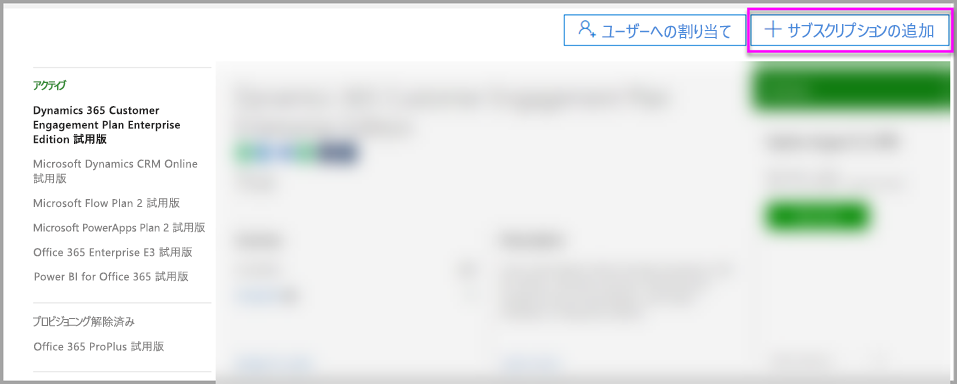

4. 次のようにして、目的のサブスクリプション オファーを見つけます。

    **[Enterprise Suite]** で、**[Office 365 Enterprise E5]** を選択します。

    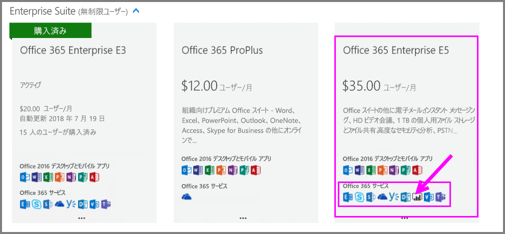

    **[その他のプラン]** で、**[Power BI Pro]** を選択します。

    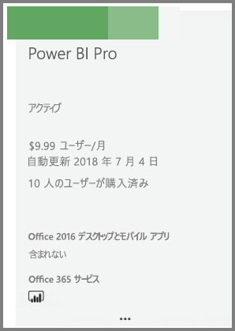

5. 目的のサブスクリプションの省略記号 (**. . .**) をポイントし、**[今すぐ購入]** を選択します。

    

6. ご自分の状況に応じて、**毎月支払う**か、**1 年分支払う**かを選択します。

7. **[ユーザーはいくつ必要ですか?]** に必要なライセンスの数を入力してから、**[今すぐ支払う]** を選択してトランザクションを完了します。

8. **[サブスクリプション]** ページに取得したサブスクリプションがリストされていることを確認します。

   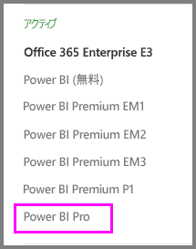

9. 最初の購入後に、さらにライセンスを追加するには、**[サブスクリプション]** ページで **[Power BI Pro]** を選択した後、**[ライセンスの追加/削除]** を選択します。

## Office 365 でのライセンスの割り当て

次の手順に従って、個々のユーザー アカウントに Power BI Pro ライセンスを割り当てます。

1. [Office 365 管理センター](https://portal.office.com/adminportal/home#/homepage)を開きます。

2. 左側のナビゲーション ウィンドウで、**[ユーザー]** を展開し、**[アクティブ ユーザー]** を選択します。

    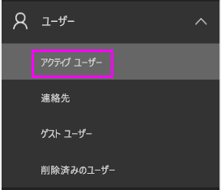

3. ユーザーを選択し、**[製品ライセンス]** で **[編集]** を選択します。

    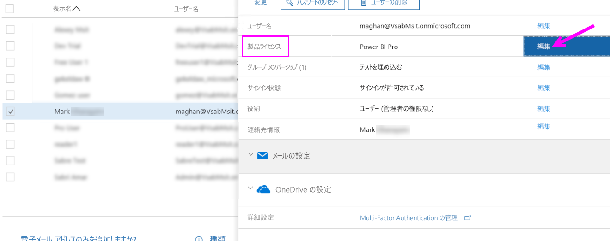

4. **[Power BI Pro]** で、設定を **[オン]** に切り替え、**[保存]** を選択します。

    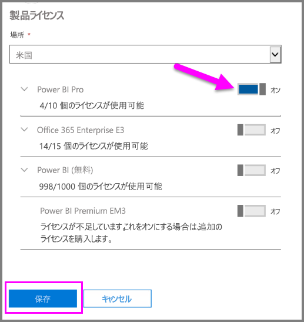

5. 選択したアカウントの **[状態]** で、Power BI Pro ライセンスが正常に割り当てられていることを確認します。

    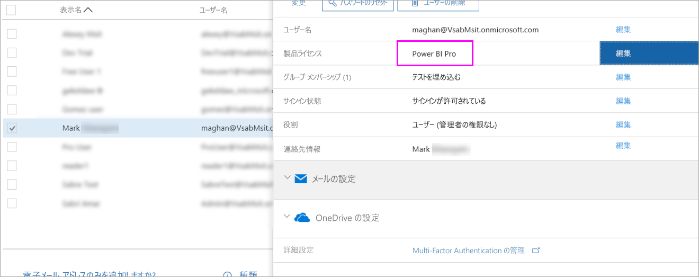

## Azure でのライセンスの割り当て

次の手順に従って、個々のユーザー アカウントに Power BI Pro ライセンスを割り当てます。

1. [Azure Portal](https://ms.portal.azure.com/#@microsoft.onmicrosoft.com/dashboard/private/39bc3cf7-31a4-43f6-954c-f2d69ca2f0) を開きます。

2. 左側のナビゲーション バーで、**[Azure Active Directory]** を選択します。

    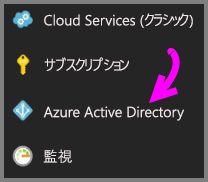

3. **[Azure Active Directory]** で、**[ライセンス]** を選択します。

    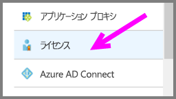

4. **[ライセンス]** で、**[すべての製品]** を選択します。次に **[Power BI Pro]** を選択して、ライセンス ユーザーの一覧を表示します。

    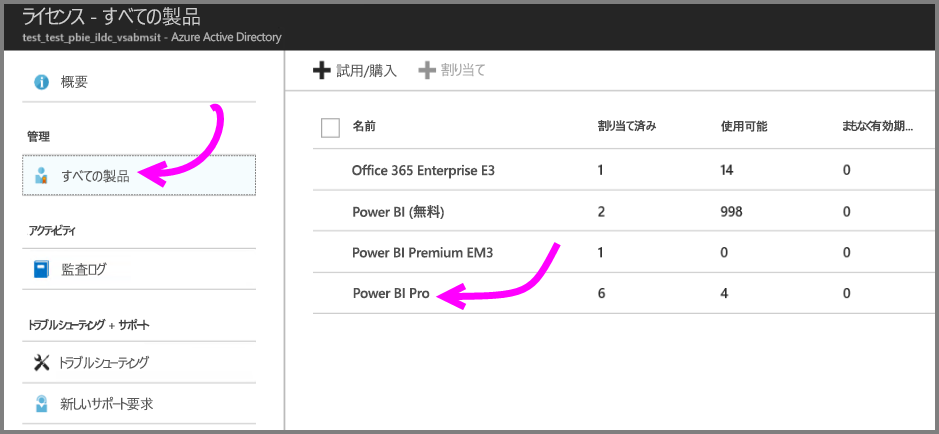

5. **[割り当て]** を選択して、Power BI Pro ライセンスをユーザー アカウントに追加します。

    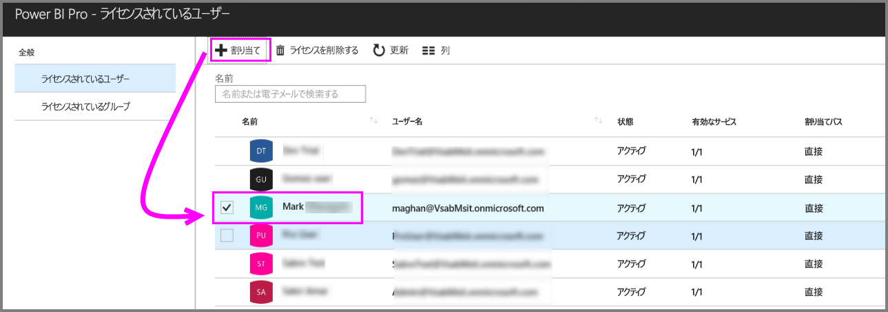

## 次の手順

ライセンスの割り当てが終わりました。Power BI Pro の詳細を確認してください。

[組織での Power BI のライセンス](service-admin-licensing-organization.md)

[サインインした Power BI ユーザーを見つける](service-admin-access-usage.md)

他にわからないことがある場合は、 [Power BI コミュニティで質問してみてください](https://community.powerbi.com/)。
