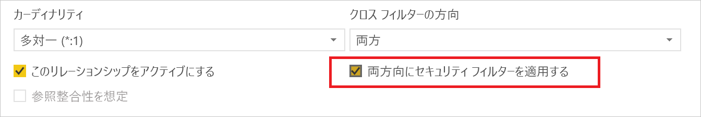
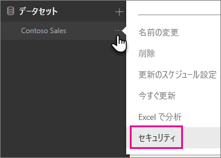
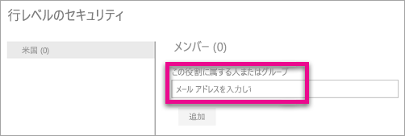
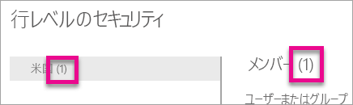
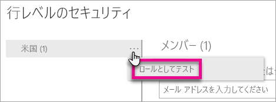
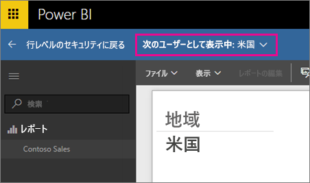
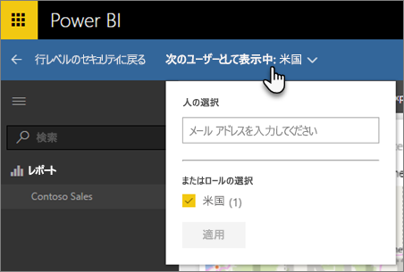
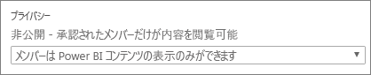

# Power BI での行レベルのセキュリティ (RLS)
Power BI で行レベル セキュリティ (RLS) を使用すると、特定のユーザーのデータ アクセスを制限できます。 フィルターは、行レベルでデータを制限します。 役割内でフィルターを定義できます。

Power BI Desktop で Power BI にインポートされたデータ モデルの RLS を構成できます。 SQL Server などの DirectQuery を使用しているデータセットに RLS を構成することもできます。 これまで、RLS を実装できるのは、Power BI の外部にあるオンプレミスの Analysis Services モデル内だけでした。 Analysis Services のライブ接続では、オンプレミスのモデルに行レベルのセキュリティを構成します。 このセキュリティ オプションは、ライブ接続データセットには表示されません。

[!INCLUDE [include-short-name](./includes/rls-desktop-define-roles.md)]

既定では、リレーションシップが一方向と双方向のいずれに設定されているかに関係なく、行レベルのセキュリティ フィルターで一方向のフィルターが使用されます。 行レベルのセキュリティで双方向のクロス フィルターを手動で有効にすることができます。その場合は、リレーションシップを選択して、**[両方向にセキュリティ フィルターを適用する]** チェック ボックスをオンにします。 [動的な行レベルのセキュリティ](https://docs.microsoft.com/sql/analysis-services/supplemental-lesson-implement-dynamic-security-by-using-row-filters)を実装する場合は、このボックスをオンにする必要があります。そこで、ユーザー名またはログイン ID に基づいて行レベルのセキュリティを指定します。 

詳細については、「[Power BI Desktop での DirectQuery を使用する双方向のクロス フィルタリング](desktop-bidirectional-filtering.md)」と「[表形式の BI セマンティック モデルの保護](http://download.microsoft.com/download/D/2/0/D20E1C5F-72EA-4505-9F26-FEF9550EFD44/Securing%20the%20Tabular%20BI%20Semantic%20Model.docx)」の技術記事を参照してください。

[!INCLUDE [include-short-name](./includes/rls-desktop-view-as-roles.md)]

## モデルのセキュリティの管理
データ モデルのセキュリティを管理するには、次の操作を行います。

1. データセットの**省略記号 [...]** を選択します。
2. **[セキュリティ]** を選択します。
   
   

移動先の RLS ページで、Power BI Desktop で作成した役割にメンバーを追加できます。 [セキュリティ] は、データセットの所有者のみに表示されます。 データセットがグループ内にある場合、セキュリティ オプションは、グループの管理者だけに表示されます。 

Power BI Desktop 内でのみ、役割を作成または変更できます。

## メンバーの操作
### メンバーの追加
役割にメンバーを追加するには、追加するユーザー、セキュリティ グループ、または配布リストのメール アドレスまたは名前を入力します。 このメンバーは、組織内に存在する必要があります。 Power BI 内に作成したグループは追加できません。

役割名または [メンバー] の横のかっこ内の数字は、その役割に属しているメンバーの数を示します。

### メンバーの削除
メンバーを削除するには、メンバー名の横の [X] を選択します。 

## Power BI サービス内でのロールの検証
役割をテストすることで、定義した役割が正しく動作することを検証することができます。 

1. 役割の横にある**省略記号 (...)** を選択します。
2. **[ロールとしてデータをテスト]** を選択します。

この役割で使用できるレポートが表示されます。 このビューにはダッシュ ボードは表示されません。 上部の青色のバーの中に、適用される内容が表示されます。

**[Now viewing as (次の表示)]** を選択することで、その他の役割、または役割の組み合わせをテストすることができます。

特定のユーザーとしてデータを表示できます。または、役割の組み合わせを選択してそれらの動作を検証できます。 

通常の表示に戻るには、**[行レベルのセキュリティに戻る]** を選択します。

[!INCLUDE [include-short-name](./includes/rls-usernames.md)]

## Power BI での RLS とアプリ ワークスペースの使用
Power BI サービス内のアプリ ワークスペースに Power BI Desktop レポートを発行した場合、役割は読み取り専用のメンバーに適用されます。 メンバーはアプリ ワークスペース設定内の Power BI コンテンツだけを表示できることを示す必要があります。

> [!WARNING]
> メンバーが編集アクセス許可を持つようにアプリ ワークスペースを構成している場合、RLS の役割は適用されません。 ユーザーはすべてのデータを確認できます。
> 
> 

[!INCLUDE [include-short-name](./includes/rls-limitations.md)]

[!INCLUDE [include-short-name](./includes/rls-faq.md)]

## 次の手順
[Power BI Desktop での行レベルのセキュリティ (RLS)](desktop-rls.md)  

他にわからないことがある場合は、 [Power BI コミュニティで質問してみてください](http://community.powerbi.com/)。

