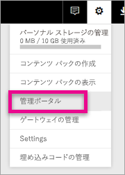
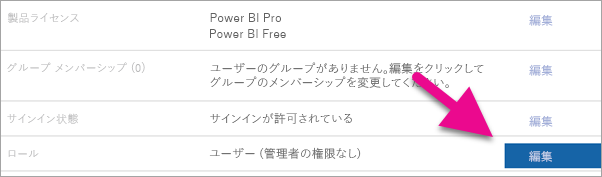
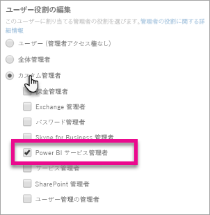
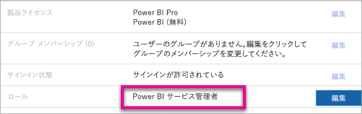

# <a name="understanding-the-power-bi-admin-role"></a>Power BI 管理者の役割について
組織内で Power BI 管理者の役割を使用する方法について説明します。

<iframe width="640" height="360" src="https://www.youtube.com/embed/PQRbdJgEm3k?showinfo=0" frameborder="0" allowfullscreen></iframe>

Power BI 管理ポータルへのアクセスを与えるが、その他の Office 365 管理アクセスは与えないユーザーには、Power BI サービス監理者の役割を割り当てることができます。 たとえば、グローバル管理者の役割などです。 この役割が割り当てられた場合、組織の Power BI を管理する必要があります。

Office 365 ユーザー管理者は、Office 365 管理センター内で、または PowerShell スクリプトを使用して、ユーザーを Power BI 管理者として割り当てることができます。 割り当てられたユーザーは、[Power BI 管理ポータル](service-admin-portal.md)にアクセスできます。 そこで、テナント全体の利用状況の指標にアクセスでき、Power BI 機能のテナント全体の利用状況を制御できます。



## <a name="using-the-office-365-admin-center-to-assign-a-role"></a>Office 365 管理センターを使用して役割を割り当てる
Office 365 管理センター内で Power BI 管理者の役割をユーザーに割り当てるには、次の操作を行います。

1. Office 365 管理センターを参照し、**[ユーザー]** > **[アクティブなユーザー]** の順に選択します。
   
    
2. 役割を割り当てるユーザーを選択します。
3. 役割に対応する **[編集]** を選択します。
   
    
4. **[Customized administrator]\(カスタム管理者)** > **[Power BI service administrator]\(Power BI サービス管理者)** の順に選択します。
   
    
5. **[保存]** を選択します。

そのユーザー名の役割に対する **[Power BI service administrator]**\(Power BI サービス管理者) がリストされます。 これで、このユーザーは、[Power BI 管理ポータル](service-admin-portal.md)にアクセスできます。



## <a name="using-powershell-to-assign-a-role"></a>PowerShell を使用して役割を割り当てる
PowerShell コマンドを実行するには、Azure Active Directory PowerShell モジュールをインストールする必要があります。

### <a name="download-azure-ad-powershell-module"></a>Azure AD PowerShell モジュールのダウンロード
[Azure Active Directory PowerShell バージョン 2 のダウンロード](https://github.com/Azure/azure-docs-powershell-azuread/blob/master/Azure%20AD%20Cmdlets/AzureAD/index.md)

[Azure Active Directory PowerShell バージョン 1.1.166.0 GA のダウンロード](http://connect.microsoft.com/site1164/Downloads/DownloadDetails.aspx?DownloadID=59185)

### <a name="command-to-add-role-to-member"></a>メンバーに役割を追加するためのコマンド
**Azure AD PowerShell v2 のコマンド**

**Power BI サービス管理者**の役割に対する **ObjectId** を取得する必要があります。 [Get-AzureADDirectoryRole](https://docs.microsoft.com/powershell/azuread/v2/get-azureaddirectoryrole) を実行することで、**ObjectId** を取得できます。

```
PS C:\Windows\system32> Get-AzureADDirectoryRole

ObjectId                             DisplayName                        Description
--------                             -----------                        -----------
00f79122-c45d-436d-8d4a-2c0c6ca246bf Power BI Service Administrator     Full access in the Power BI Service.
250d1222-4bc0-4b4b-8466-5d5765d14af9 Helpdesk Administrator             Helpdesk Administrator has access to perform..
3ddec257-efdc-423d-9d24-b7cf29e0c86b Directory Synchronization Accounts Directory Synchronization Accounts
50daa576-896c-4bf3-a84e-1d9d1875c7a7 Company Administrator              Company Administrator role has full access t..
6a452384-6eb9-4793-8782-f4e7313b4dfd Device Administrators              Device Administrators
9900b7db-35d9-4e56-a8e3-c5026cac3a11 AdHoc License Administrator        Allows access manage AdHoc license.
a3631cce-16ce-47a3-bbe1-79b9774a0570 Directory Readers                  Allows access to various read only tasks in ..
f727e2f3-0829-41a7-8c5c-5af83c37f57b Email Verified User Creator        Allows creation of new email verified users.
```

この例では、役割の ObjectId は 00f79122-c45d-436d-8d4a-2c0c6ca246bf となります。

ユーザーの **ObjectID** も把握しておく必要があります。 [Get-AzureADUser](https://docs.microsoft.com/powershell/azuread/v2/get-azureaduser) を実行して見つけることができます。

```
PS C:\Windows\system32> Get-AzureADUser -SearchString 'tim@contoso.com'

ObjectId                             DisplayName UserPrincipalName      UserType
--------                             ----------- -----------------      --------
6a2bfca2-98ba-413a-be61-6e4bbb8b8a4c Tim         tim@contoso.com        Member
```

役割にメンバーを追加するには、[Add-AzureADDirectoryRoleMember](https://docs.microsoft.com/powershell/azuread/v2/add-azureaddirectoryrolemember) を実行します。

| パラメーター | 説明 |
| --- | --- |
| ObjectId |ロールの ObjectId。 |
| RefObjectId |メンバーの ObjectId。 |

```
Add-AzureADDirectoryRoleMember -ObjectId 00f79122-c45d-436d-8d4a-2c0c6ca246bf -RefObjectId 6a2bfca2-98ba-413a-be61-6e4bbb8b8a4c
```

**Azure AD PowerShell v1 のコマンド**

Azure AD v1 コマンドレットを使用して役割にメンバーを追加するには、[Add-MsolRoleMember](https://docs.microsoft.com/powershell/msonline/v1/add-msolrolemember) コマンドを実行します。

```
Add-MsolRoleMember -RoleMemberEmailAddress "tim@contoso.com" -RoleName "Power BI Service Administrator"
```

## <a name="limitations-and-considerations"></a>制限事項と考慮事項
Power BI サービス管理者の役割では、次の機能を使用できません。

* Office 365 管理センター内のユーザーとライセンスを変更する機能
* 監査ログへのアクセス 詳しくは、「[組織内での監査の使用](service-admin-auditing.md)」をご覧ください。

## <a name="next-steps"></a>次の手順
[Power BI 管理ポータル](service-admin-portal.md)  
[Add-AzureADDirectoryRoleMember](https://docs.microsoft.com/powershell/azuread/v2/add-azureaddirectoryrolemember)  
[Add-MsolRoleMember](https://docs.microsoft.com/powershell/msonline/v1/add-msolrolemember)  
[組織内の Power BI を監査する](service-admin-auditing.md)  
[組織内の Power BI を管理する](service-admin-administering-power-bi-in-your-organization.md)  

他にわからないことがある場合は、 [Power BI コミュニティで質問してみてください](http://community.powerbi.com/)。

