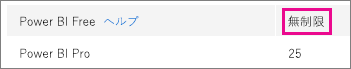
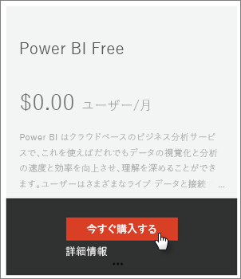
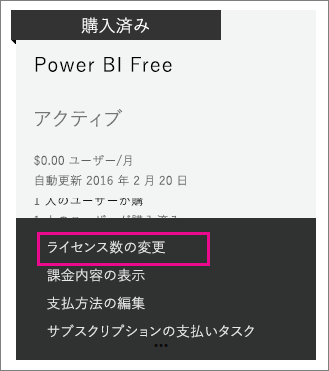

# 組織内の Power BI (無料)
ここでは、Power BI (無料) サービスを組織内で使用する方法を紹介します。 組織ということは、テナントがあり、ユーザーとサービスをそのテナント内で管理できることを意味します。 管理者は、ライセンスの割り当てを制御するか、ユーザーが個人としてサインアップできるようにすることができます。 Power BI (無料) ライセンスと、個人のサインアップを制御する方法を紹介します。

## 個人のサインアップとライセンスの割り当ての比較
組織内のユーザーは、2 種類の方法で Power BI へのアクセスを取得できます。 ユーザーが個人として Power BI にサインアップする方法と、管理者が Office 365 管理ポータルでユーザーに Power BI ライセンスを割り当てる方法です。

個人のサインアップを許可する方法では、Power BI に関心のあるユーザーが無料でサインアップできるようにすることにより、組織の管理者の負担を減少できます。

制御を強化するには、個人のサインアップをブロックし、Office 365 管理センターで Power BI ライセンスを割り当てることができます。 これにより、組織内のだれがどのサービスにアクセスできるかを指定できるようになります。 監査に対処し、だれが何を使用できるかを正確に知る必要がある場合も、これは優れたオプションになります。

## 無制限ライセンス ブロックを取得する方法
Office 365 管理センターの **[課金]** > **[ライセンス]** で、Power BI (無料) の無制限ライセンスの有無が示される場合があります。

このライセンス ブロックは、だれかが最初に Power BI に個人としてサインアップした後で表示されます。 その処理中に、このライセンス ブロックは組織に関連付けられ、サインアップ中のユーザーにライセンスが割り当てられます。

個人のユーザーのサインアップをブロックしており、だれもサインアップしていない場合、このライセンス ブロックは表示されません。 個人のユーザーのサインアップを許可して 1 人のユーザーがサインアップするようにするか、次に説明する Office 365 のサブスクリプション追加フローを通じて無料ライセンスを取得することができます。

Power BI (無料) ライセンス ブロックが使用可能になった後、これらのライセンスをユーザーに割り当てることができます。 ライセンスの割り当てについて詳しくは、[Office 365 でのユーザーへのライセンスの割り当て](https://support.office.com/article/Assign-or-unassign-licenses-for-Office-365-for-business-997596b5-4173-4627-b915-36abac6786dc)に関するページをご覧ください。

## Office 365 でサブスクリプションを追加することによって無料ライセンスを取得する
1. [Office 365 管理センター](https://portal.office.com/admin/default.aspx)に移動します。
2. 左側のナビゲーション ウィンドウで、**[課金]** > **[サブスクリプション]** を選択します。
3. 右側にある **[サブスクリプションの追加]** を選択します。
4. [その他のプラン] で、[Power BI (無料)] の欄にある**省略記号 (...)** にマウスを合わせ、**[今すぐ購入]** を選択します。
   
    
5. 追加するライセンスの数を入力し、**[今すぐチェックアウト]** または **[カートに追加]** を選択します。
   
   > [!NOTE]
   > 必要に応じて後日さらに追加できます。
   > 
   > 
6. チェックアウト フローに必要な情報を入力します。

このアプローチを使用する場合、課金用のクレジット カード情報を入力するか請求書の送付を選択する必要がありますが、購入は行われません。

後でライセンスの追加を決定した場合、**[サブスクリプションの追加]** に戻り、[Power BI (無料)] の欄で **[ライセンス数の変更]** を選択できます。

これで、ライセンスをユーザーに割り当てることができます。 ライセンスの割り当てについて詳しくは、[Office 365 でのユーザーへのライセンスの割り当て](https://support.office.com/article/Assign-or-unassign-licenses-for-Office-365-for-business-997596b5-4173-4627-b915-36abac6786dc)に関するページをご覧ください。

## Azure Active Directory で個人ユーザーのサインアップを有効化または無効化する
管理者は、Azure Active Directory (AAD) の一部として個人ユーザーのサインアップを有効化または無効化することを選択できます。 AAD PowerShell コマンドを利用する方法がわかっている場合は、自分でアドホック サブスクリプションを有効化または無効化することができます。 [詳細情報](https://technet.microsoft.com/library/jj151815.aspx)

これを制御する AAD 設定は、**AllowAdHocSubscriptions** です。 ほとんどのテナントでは、この設定は有効を意味する true に設定されます。 パートナーを通じて Power BI を入手した場合、これは既定では無効を意味する false に設定されている可能性があります。

1. まず、Office 365 の資格情報を使用して Azure Active Directory にサインインする必要があります。 最初の行で、資格情報が求められます。 2 行目で、Azure Active Directory に接続します。
   
     $msolcred = get-credential   connect-msolservice -credential $msolcred
   
   
2. サインインの後、次のコマンドを発行してテナントの構成内容を見ることができます。
   
     Get-MsolCompanyInformation | fl AllowAdHocSubscriptions
3. このコマンドを使用して、AllowAdHocSubscriptions を有効 ($True) または無効 ($false) にすることができます。
   
     Set-MsolCompanySettings -AllowAdHocSubscriptions $true

> [!NOTE]
> このブロックは、組織内の新しいユーザーが Power BI にサインアップできないようにします。 組織の新しいサインアップを無効にする前に Power BI にサインアップしているユーザーは、引き続きライセンスを保持します。
> 
> 

## 次の手順
[Power BI のセルフサービス サインアップ](service-self-service-signup-for-power-bi.md)  
[Power BI Pro を購入する](service-admin-purchasing-power-bi-pro.md)  
[カスタムの Azure Active Directory テナントを使用して Power BI (無料) にサインアップする](developer/create-an-azure-active-directory-tenant.md)  
[Power BI Premium とは](service-premium.md)  
[Power BI Premium ホワイト ペーパー](https://aka.ms/pbipremiumwhitepaper)  

他にわからないことがある場合は、 [Power BI コミュニティで質問してみてください](http://community.powerbi.com/)。

