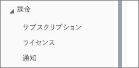
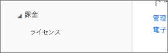
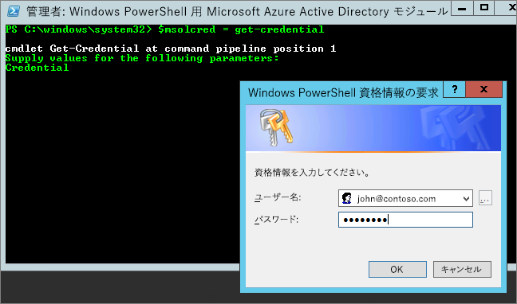

# Power BI を Office 365 パートナー サブスクリプションに追加できない
Office 365 では、企業が独自のソリューションとバンドルおよび統合した Office 365 を再販することが可能です。購入、請求、サポートを一本化したサービスをエンド カスタマーに提供できます。

Office 365 サブスクリプションに加えて Power BI のご利用に関心をお持ちの場合は、お客様のパートナーにお問い合わせください。 お客様のパートナーが Power BI を提供していない場合は、他のオプションをご利用いただけます。

1. 別のチャネルで (Microsoft から直接、または別のパートナーから) サービスを購入できます。 このオプションは、パートナーとの関係によっては、利用できない場合もあります。 **[Office 365 管理ポータル]** > **[課金]** > **[サブスクリプション]** に移動して確認できます。 **[サブスクリプション]** が表示される場合、Microsoft からサービスを直接取得することや、Power BI を提供するパートナーに問い合わせることができます。
   
    
2. **[課金]** の下に **[サブスクリプション]** が表示されない場合は、Microsoft から直接購入することも、別のパートナーから購入することもできません。 
   
   

Power BI を直接購入できない場合、またご関心のある Power BI サブスクリプションの種類によっては、他にもいくつかオプションがあります。

[Power BI (無料)](#power-bi-free)

[Power BI Pro および Premium](#power-bi-pro)

## Power BI (無料)
Power BI の無料版で十分な場合は、無料サービスにサインアップできます。 既定では、個別のサインアップ (アドホック サブスクリプションとも呼ばれます) は無効になっています。 Power BI にサインアップしようとすると、Microsoft Power BI へのサインアップが IT 部門により無効化されていることを示すメッセージが表示されます。

    Your IT department has turned off signup for Microsoft Power BI.

アドホック サブスクリプションを有効にするには、パートナーに連絡して、有効にするよう依頼することができます。 テナントの管理者である場合、Azure Active Directory PowerShell コマンドを利用する方法をご存知であれば、ご自身でアドホック サブスクリプションを有効にすることができます。 [詳細情報](https://technet.microsoft.com/library/jj151815.aspx)

1. まず、Office 365 の資格情報を使用して Azure Active Directory にサインインする必要があります。 最初の行で、資格情報が求められます。 2 行目で、Azure Active Directory に接続します。
   
        $msolcred = get-credential
        connect-msolservice -credential $msolcred
   
    
2. サインインすると、無料のサインアップを有効にする次のコマンドを発行できます。
   
        Set-MsolCompanySettings -AllowAdHocSubscriptions $true

## Power BI Pro および Premium
Power BI Pro または Power BI Premium へのサブスクリプションを購入する場合、パートナーに問い合わせて、選択できるオプションについて検討する必要があります。

* Power BI をポートフォリオに追加することをパートナーが承諾したなら、パートナーから購入できるようになります。
* パートナーは、Power BI を Microsoft から直接、または Power BI を提供している別のパートナーから購入できるモデルにお客様を移行することができます。

## 次の手順
[Windows PowerShell を使用して Azure AD を管理する](https://technet.microsoft.com/library/jj151815.aspx)  
[Power BI Premium とは](service-premium.md)

他にわからないことがある場合は、 [Power BI コミュニティで質問してみてください](http://community.powerbi.com/)。

